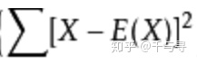
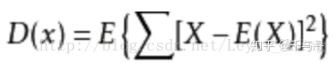
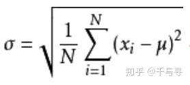
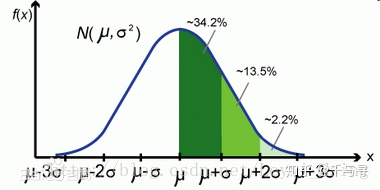
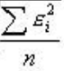
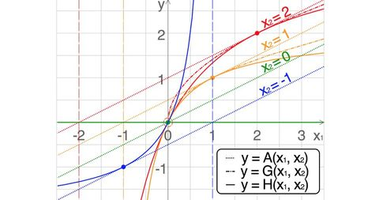

一、**方差**

在概率论和统计**方差**是衡量随机变量或一组数据时离散程度的度量。**概率论中方差**用来度量随机变量和其数学期望（即均值）之间的偏离程度。**统计中的方差（**样本方差）是各个样本数据和平均数之差的 平方和 的平均数。在许多实际问题中，研究方差即偏离程度有着重要意义。  
  
对于一组随机变量或者统计数据，其**期望值**（平均数）用E(X)表示，即随机变量或统计数据的**均值**， 然后对各个数据与均值的差的 平方和，如下所示：

最后对**平方和**再求期望就得到了方差公式，方差的公式如下：

  
这个公式描述了随机变量（统计数据）与均值的偏离程度。

**二、标准差**

标准差是**方差**的平方根，标准差的公式如下：u表示期望

根号里的内容就是我们刚提到的方差

  

那么问题来了，既然有了**方差**来描述变量与均值的偏离程度，那又搞出来个**标准差**干什么呢？

原因是**方差**与我们要处理的**数据的量纲**是不一致的，虽然能很好的描述**数据与均值的偏离程度**，但是处理结果是不符合我们的直观思维的。

  
举个例子：一个班级里有60个学生，平均成绩是70分，标准差是9，方差是81，假设成绩服从正态分布，那么我们通过**方差**不能直观的确定**班级学生**与均值到底偏离了多少分，通过标准差我们就很直观的得到学生成绩分布在\[61,79\]范围的概率为68%，即约等于下图中的34.2%\*2

额外说明：一个标准差约为 68%（平均值-标准差，平均值+标准差）， 两个标准差约为95%（平均值-2倍标准差，平均值+2倍标准差）, 三个标准差约为99%。它反映组内个体间的离散程度。

  
三、均方差、均方误差（MSE）  
**标准差（Standard Deviation），又称均方差**，但不同于均方误差（mean squared error），**均方误差**是各数据偏离**真实值**差值的平方和 的平均数，也就是误差平方和的平均数。均方误差的开方叫**均方根误差**，**均方根误差**才和标准差形式上接近。

举个例子：我们要测量房间里的温度，很遗憾我们的温度计精度不高，所以就需要测量5次，得到一组数据\[x1,x2,x3,x4,x5\], 假设温度的真实值是x，数据与真实值的误差为e=x-xi 那么均方误差MSE=

四、总结  
从上面定义我们可以得到以下几点：  
1、均方差就是标准差，标准差就是均方差

**2、方差** 是各数据偏离**平均值** 差值的平方和 的平均数

3、**均方误差（MSE）**是各数据偏离**真实值** 差值的平方和 的平均数

4、方差是平均值，均方误差是真实值。

  
总的来说，**方差**是数据序列与均值的关系，而**均方误差**是数据序列与真实值之间的关系，所以我们只需注意区分 **真实值和均值** 之间的关系就行了。

  

ps：平均数有如下几个类别：

算数平均数：

几何平均数：数据之间多为等比关系时使用，不用考虑量纲。会遮蔽可能具有较大影响的大数值。

调和平均数：它有助于处理包含长度或周期不同的比率的数据集

以下不等关系成立：

调和平均数 ≤ 几何平均数 ≤ 算术平均数

[几何平均数和调和平均数是什么？有什么作用？详细资料讨论-电子发烧友网​m.elecfans.com/article/712572.html](https://link.zhihu.com/?target=http%3A//m.elecfans.com/article/712572.html)

平均数、中位数、众数

  

**“无意中发现了一个巨牛的人工智能教程，忍不住分享一下给大家。教程不仅是零基础，通俗易懂，而且非常风趣幽默，像看小说一样！觉得太牛了，所以分享给大家。[点这里可以跳转到教程](https://link.zhihu.com/?target=https%3A//www.cbedai.net/u011630575)。**