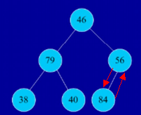

# 最容易理解的排序算法
排序不难，但是有时候我们容易出错，容易混淆等等，我们慢慢来分析，从最简单的开始慢慢深入理解。

## 插入排序

### 直接插入排序
> 每一步将一个待排的记录根据关键字的大小插入已经排好序的那部分里边去，直到所有的都插完为止。

我们来看例子来分析：

初始大小：57 68 59 52

1、第一个数是57，就一个数，所以就默认排好了，然后就把68插进来，发现68>57，就直接插在57后面，不需要任何的处理；得到： 57 68。

2、第三个数是59，我们发现了57<59<68，所以59就插在57之后，得到： 57 59 68。

3、最后一个数是52，我们对比发现52<57，插在57之前，就完成了插入的排序。

也许有同学发现了，这么简单的排序，我一眼就能看的出结果，确实，很简单，但是我们是为了强调这个排序算法。

### 希尔排序
> 是在直接插入排序的基础上进行改进的一个排序算法，所以也叫插入排序。基本思想就是每次都是按照确定的间隔将元素分组，在每一组中进行直接插入排序，使得小的元素可以跳跃式的前进，然后逐步的将步长缩小，直到步长为1，然后等到这个序列基本有序之后，那么我们就可以进行直接插入排序了。

其实不难，我们来看个例题就一目了然了：

1、我们看一下就明白，首先我们要折半，然后是每隔5个一组，进行组合，然后两两对比，我们只需要调整两个数即可；

2、然后再折半后取奇数得3，我们就从28开始，每隔三个一组进行分类，这样我们只需要对比三组数。

3、我们最后在原来的基础上折半取奇数得1，然后我们就开始最后一次的排序，得到我们的结果。

  

## 选择排序

### 简单选择排序
> 这个也不难理解，我们先来看一个例子，就轻而易举了：

既然是选择排序，那么还是需要一点点的选择和对比的，我们来分析一下这个步骤：

1、首先我们要对比找到最小的元素，与第一个交换。

2、继续找继第一个之后最小的，与第二个交换。于此类推，我们就能完成简单选择排序。

我们接下来讲一下堆排序，比较有意思的选择排序；

### 堆排序：

一句话很通俗的一句话来概括：a.孩子结点都要大于父结点（小顶堆）；b.孩子结点都小于父结点（大顶堆）。

然后我们再来理解堆排序就容易了：

K<=K2i且K1<=K2i+1或者K1>=K2i且K1>=k2i+1

接下来我们看一个图，用图来分析比较形象具体：

我们可以看的出来，这是个小顶堆，因为孩子结点都要比父结点要大。很简单吧。

要是让我们对一个数列进行以下排序，建立一个大顶堆，我们应该怎么做呢？我们来看看：

对数列{46,79,56,38,40,84}建立大顶堆，步骤应该是：

1. 按照这个顺序来建立一个完全二叉树，

按照顺序来一一对应来填补，然后我们就得到了：

我们发现7号叶子结点咱们没有，所以就省了。

2. 我们首先看n/2个结点是3号结点，就是56，它比其子节点84小，所以应该84和56位置对调，得：

得到：

3. 我们看n/2-1个结点，就是2号结点，值为79，我们马上能观察的出来，他比两个子节点都要大，所以不用调。

4. 我们继续看n/2-2个结点，就是1号结点，他比两个子节点都小，所以把它和较大的子节点84对调：

得：

5. 我们一眼就看的出来，经过调整的结点46<56所以我们先把他们对调了，得：

这样就基本符合咱们的题目要求了。

但是我们需要的是有序的序列，所以我们还得继续：

a.我们首先要处理顶，因为他的值最大，我们把他和编号最大的，6号结点值为46的对调，对调完成之后，我们还得把指针断开，如：

我们就有了最大的元素了84了，然后我们发现对调完的顶是46，还有一个比他大得多的79，所以我们得把他们两换了，得：

接下来我们还是同样的方法，把79和编号最大的40对调，得到：

然后我们又把40和56对调，然后再把剩下的对调，结果就出来了：

排序没有想象中的那么复杂，动手来分析一下就好多了。