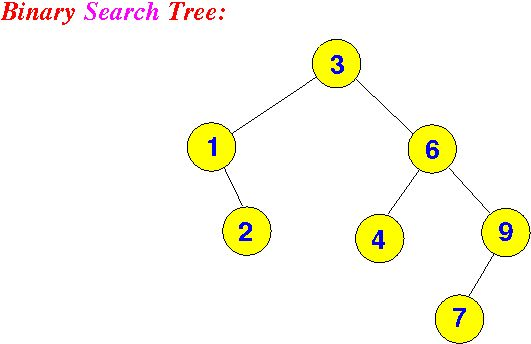
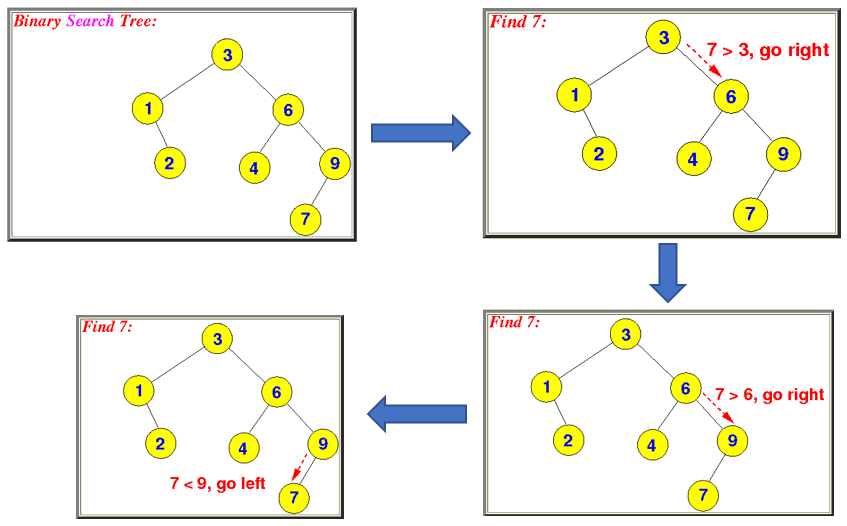
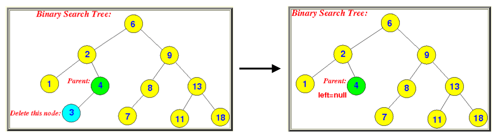
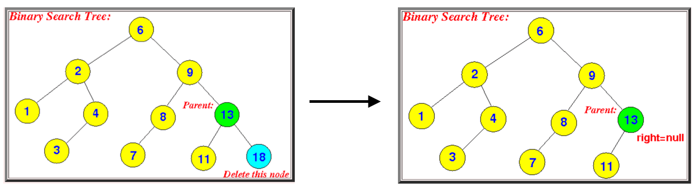
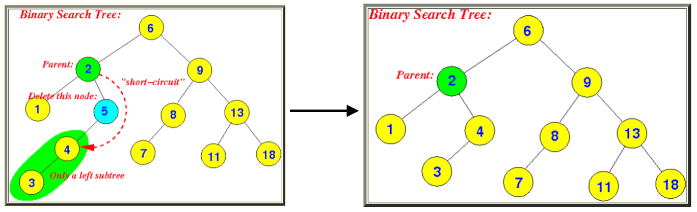
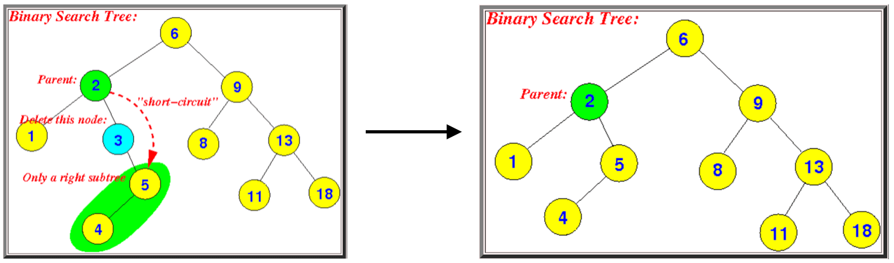
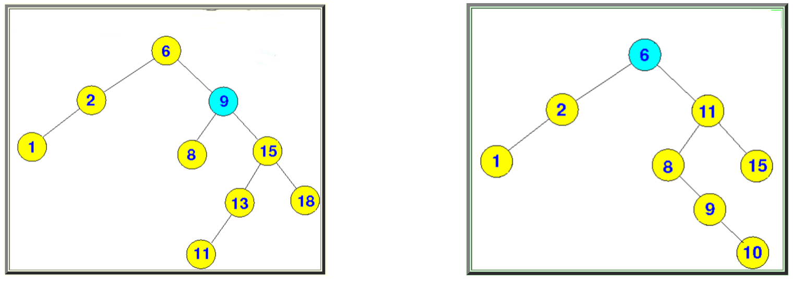
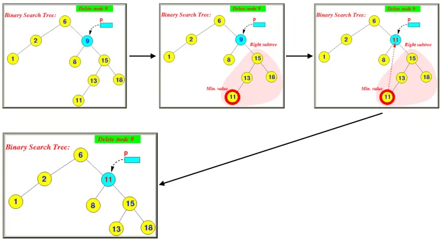
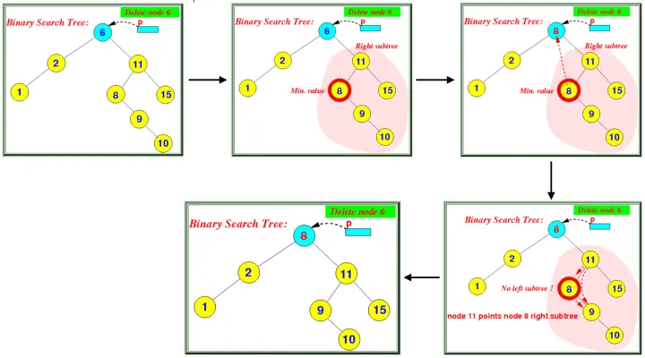

# 最通俗易懂的二叉查找树(BST)详解
二叉查找树（Binary Search Tree），简写BST，是满足某些条件的特殊二叉树。任何一个节点的左子树上的点，都必须小于当前节点。任何一个节点的右子树上的点，都必须大于当前节点。任何一棵子树，也都满足上面两个条件。另外二叉查找树中，是不存在重复节点的。



上图中的二叉查找树，我们从Root节点3开始看，它的左子树（1，2） 和右子树（6，4，9，7）分别满足条件，左子树上的点，都小于当前节点，右子树上的点，都大于当前节点。

继续，我们以6作为起点，来看一下这棵子树，6的左子树（4），右子树（9，7）也满足上面两条规则。

整棵树中，任何一个点下面的子树，都满足上面提到的两条规则。你现在是不是对Binary Search Tree已经有一个大概的形象概念了。

## **为什么叫做二叉查找树呢**

因为在BST中搜索一个值是非常简单和高效的。



看上面的树，假设要搜索7这个节点。首先从Root节点出发，我们知道7大于3，所以会走到右子树6，然后因为7也大于6，所以会继续往右子树走，到了9，因为7小于9，所以会向左子树走，走到7，发现7等于7，所以找到要搜索的节点。

## **二叉树的一些性质**

- 将任何一个点看作Root节点，则这个点的左子树也是 Binary Search Tree
- 将任何一个点看作Root节点，则这个点的右子树也是 Binary Search Tree
- Binary Search Tree中的最小节点，一定是整棵树中最左下的叶子节点(从Root开始一直顺着左子树往下走，直到某一个点没有左子节点，则这个点就是最小的)
- Binary Search Tree中的最大节点，一定是整棵树中最右下的叶子节点(从Root开始一直顺着右子树往下走，直到某一个点没有右子节点，则这个点就是最大的)

## **怎样构建和插入节点**

向BST中插入一个节点，也是一个构建的过程，和上面的搜索思路基本一样。首先从Root开始，如果Root点为空，则直接构建Root点。如果Root点不为空，则要判断要插入的值，比Root点的值大还是小，如果小，则往左子树走，如果大，则往右子树走。直到走到某一个点，我们称为点X，发现要插入的值，小于那个点X的值，并且点X没有左子树，则要插入的点作为X的左子节点。或者，要插入的点大于X，并且X没有右子树，则要插入的点作为X的右子节点。

下面是代码实现（为了方便后面的删除逻辑，我们每一个点，包含了指向左子树，右子树，以及父节点的引用）

```text
// 这里先定义出节点的结构
class Node
{
    public int data;
    public Node parent;
    public Node left;
    public Node right;

    public Node(int _data)
    {
        this.data = _data;
    }
}

// 定义二叉搜索树结构
class BST
{
    private Node root;

    // 这个函数是 private 的，递归调用，插入节点
    private Node RecursionInsert(Node node, int data)
    {
        if (node == null)
        {
            return new Node(data);
        }

        if (data < node.data)
        {
            node.left = RecursionInsert(node.left, data);
            node.left.parent = node;
        }
        else if (data > node.data)
        {
            node.right = RecursionInsert(node.right, data);
            node.right.parent = node;
        }

        return node;
    }

    // 对外开放的 插入 接口
    public void Insert(int data)
    {
        if (root == null)
        {
            root = RecursionInsert(root, data);
        }
        else
        {
            RecursionInsert(root, data);
        }
    }

    // 按层序打印二叉树
    public void LevelOrderTraversal()
    {
        Queue<Node> q = new Queue<Node>();
        q.Enqueue(root);

        while (q.Count > 0)
        {
            Node currNode = q.Dequeue();

            if (currNode.left != null)
            {
                q.Enqueue(currNode.left);
            }

            if (currNode.right != null)
            {
                q.Enqueue(currNode.right);
            }
            // 括号里面是父节点的值
            string msg = string.Format("{0}({1})", currNode.data, currNode.parent != null ? currNode.parent.data.ToString() : "null");
            Debug.Log(msg);
        }
    }
}

// 创建一个二叉搜索树
class Program
{
    /* Let us create following BST
          50
       /     \
      30      70
     /  \    /  \
   20   40  60   80 */

    static void Main(string[] args)
    {
        BST bst = new BST();
        bst.Insert(50);
        bst.Insert(30);
        bst.Insert(20);
        bst.Insert(40);
        bst.Insert(70);
        bst.Insert(60);
        bst.Insert(80);

        bst.LevelOrderTraversal();
    }
}

```

上面的代码，首先定义了每一个 Node 节点的数据结构，然后定义了二叉查找树的结构类，最后是C#调用BST的插入和打印方法。插入节点这里使用了递归的机结构，还可以使用非递归，循环的形式去插入。

## **从最简单的开始，删除一个节点**

从 BST 中删除节点，是相比来说比较复杂的，复杂，也只是相对于插入来说。只要理清几种不同的情况，也就不复杂了。看过很多教程，一上来就是罗列各个情况，然后上代码展示，如果是第一次学习 BST，可能会有一点抽象。我们先不考虑代码怎么实现，先从语言上把这个事情讲明白，最后再看代码。

从 BST 中删除节点其实很容易，只要改变一下指针就可以了，重点是，删除了一个节点后，还要让整棵 BST 依然保持一个正确的结构，这就是我们要做的。一切从最简单开始。



上面的图中，我们要删除一个叶子节点，就是左边的数据为3的那个节点。这个节点的父节点是4，我们只需要将4这个节点中指向左子树的指针设置为空，就可以了。这是很容易理解的。而删除右边的叶子节点，也是一样的。就像下面的图。



我们删除18这个节点，只需要将13这个节点中指向右子树的指针设置为空，即可。

上面说的，就是删除操作中最简单的一种情况，删除叶子节点。还有一个很重要的点要注意，在删除的时候，要判断要删除的节点是不是 Root 节点，也就是说，整棵树只有一个节点的情况，这样的话还需要将 Root 节点设为空。Root节点的父节点，是永远为空的。

> **注意: 记住，现在不要考虑代码实现的问题，一定要先理解思路，文章的最后，会上代码的。**

## **关于节点删除，加大一点点难度**

接下来我们加大一点点难度。看下面的图 (可以忽略图中的红色字，只看树的节点结构)



我们要删除左边图中5这个节点，而5这个节点只拥有一个子树，就是左子树。而5的父节点是2，它是2的右子树。我们要删除5，只需要将2的`右子树`，指向5的子树就可以 (这里其实不太关心5的子树是左子树还是右子树)。简单来说，就是将2原本指向5的指针，改为指向5的子树，即可。就是右边图的样子。

我们刚才删除的5节点，只有左子树，再看一个要删除的节点只有右子树的情况。



上面的图中， 我们要删除3这个节点，而这个节点只有右子树。3的父亲节点是2，所以，我们只需要将2原本指向3节点的指针，改为指向3的子树即可。就像右边的图那样。

不要着急，慢慢体会一下。在上面两种情况没有彻底理解思路之前，先不要往下看，否则可能会更困惑。

> **注意: 因为我们的 Node 结构中加入了一个指向父节点的指针，所以在删除节点的时候，还要注意更新某些节点的 parent 指针指向。**

## **更复杂的情况，先聊一下后继节点**

如果上面只是小打小闹，那接下来，就是直面恐惧，噢不，直面复杂时刻啦，哈哈哈~

最复杂的一种情况，就是要删除的节点，即有左子树，又有右子树。在说这种情况怎么操作之前，我们先来说一个前提概念，叫做后继节点。一个节点的后继节点，严肃点说就是在中序遍历的时候，遍历完当前节点后，下一个要访问的节点，就是当前的节点的后继节点。好吧，通俗点来讲，就是假设在遍历一棵树时，访问完 1 号节点，如果接下来访问的是3号节点，那3号节点就是1的后继节点。

那一个点的后继节点怎么找呢？这个就很简单了。假设我们要找节点 A 的后继节点，那就是从 A 这个点的右子树开始，一路向左走，走到某一个节点没有左子树可以往下走了，那这个节点，就是 A 的后继节点 (注意，这个后继节点有可能是叶子节点，也有可能不是)。看下面的图。



我们先看左边部分的图，我们要找节点 9 的后继节点。按上面的规则，从节点 9 的右子树 15 开始，依次往左走，先到达 15 判断一下是否可以走，可以，我们走到 13，再判断一下是否可以继续往左走，可以，走到 11，然后再看是否可以继续往左走，发现不可以了，那 11 就是节点 9 的后继节点。

再看右边部分的图，我们要找节点 6 的后继节点。按上面的规则从右子树 11 开始，判断是否可以往左走，可以，走到 8，再判断是一下是否可以继续往左走，发现 8 已经没有左子树可以往下走了，所以 8 就是节点 6 的后继节点。

## **最后一种删除节点的情况**

理解了后继节点，就可以来说最后一种，也是最复杂的一种删除节点的情况了。就是要删除的节点，即有左子树，又有右子树。操作的流程是这样的。假设我们要删除的节点是 A，第一步，我们要找到 A 的后继节点。第二步，用 A 的后继节点数据，替换要删除的节点 A 的数据。第三步，删除后继节点。（因为后继节点要么是叶子节点，要么只有右子树，所以删除比较简单，就按之前聊过的删除方法即可）。下面用示例解释



上图中，从第一个图开始看，我们要删除数据为 9 的节点。第一步，将要删除的节点使用一个指针指向。第二步，看第二个图，找到 9 节点的后继节点，也就是 11。第三步，看第三张图，用后继节点的数据，替换要删除的节点的数据，也就是用 11 替换 9。第四步，也就是最后一个图，删除后继节点 11。到此，删除操作完成。

接下来再看一个示例



上图中，我们要删除节点 6，还是先找到 6 的后继节点 8，然后用节点 8 的数据，替换我们要删除的节点 6 的数据(第三个小图)。接下来就是删除后继节点 8，这里要注意，我们跟着箭头的方向，看第四个小图。在删除后继节点 8 时，我们发现节点 8 不是叶子节点，而是有右子树，所以我们需要将节点 8 的父节点，原本指向 8 的指针，改为指向 8 的右子树。也就是上图中将节点 11 的左指针，改为指向节点 9，然后就是最后一个小图的情况。（因为我们的 Node 结构中拥有 parent 指针，所以要记得把节点 9 的parent 指针从原来指向 8 改为现在指向 9）。到此，删除节点结束。

接下来，我们展示完整的代码

```text
using System;
using System.Collections.Generic;

static class Debug
{
    public static void Log(string msg)
    {
        Console.WriteLine(msg);
    }
}

class Node
{
    public int data;
    public Node parent;
    public Node left;
    public Node right;

    public Node(int _data)
    {
        this.data = _data;
        Console.WriteLine("Insert: " + this.data);
    }
}

class BST
{
    private Node root;


    private Node RecursionInsert(Node node, int data)
    {
        if (node == null)
        {
            return new Node(data);
        }

        if (data < node.data)
        {
            node.left = RecursionInsert(node.left, data);
            node.left.parent = node;
        }
        else if (data > node.data)
        {
            node.right = RecursionInsert(node.right, data);
            node.right.parent = node;
        }

        return node;
    }

    // 插入一个数据
    public void Insert(int data)
    {
        if (root == null)
        {
            root = RecursionInsert(root, data);
        }
        else
        {
            RecursionInsert(root, data);
        }
    }

    // 删除节点
    public void DeleteNode(int data)
    {
        Node delNode = root;

        // 首先要找到待删除的节点
        while (delNode != null)
        {
            if (delNode.data == data)
            {
                break;
            }

            if (data < delNode.data)
            {
                delNode = delNode.left;
            }
            else if (data > delNode.data)
            {
                delNode = delNode.right;
            }
        }

        if (delNode == null)
        {
            Debug.Log("Not found " + data);
            return;
        }

        // 要删除的节点即没有左子树，也没有右子树，是叶子节点，或者是 Root 节点
        if (delNode.left == null && delNode.right == null)
        {
            Node parent = delNode.parent;
            if (parent == null)
            {
                root = null;
            }
            else
            {
                if (parent.left == delNode)
                {
                    parent.left = null;
                }
                else
                {
                    parent.right = null;
                }
            }
        }
        else if (delNode.left != null && delNode.right == null)
        {
            // 要删除的节点只有左子树的情况
            Node parent = delNode.parent;
            Node child = delNode.left;
            if (parent == null)
            {
                root = child;
                root.parent = null;
            }
            else
            {
                if (parent.left == delNode)
                {
                    parent.left = child;
                }
                else
                {
                    parent.right = child;
                }
                child.parent = parent;
            }
        }
        else if (delNode.right != null && delNode.left == null)
        {
            // 要删除的节点只有右子树的情况
            Node parent = delNode.parent;
            Node child = delNode.right;

            if (parent == null)
            {
                root = child;
                root.parent = null;
            }
            else
            {
                if (parent.left == delNode)
                {
                    parent.left = child;
                }
                else
                {
                    parent.right = child;
                }
                child.parent = parent;
            }
        }
        else if (delNode.left != null && delNode.right != null)
        {
            // 要删除的节点即有左子树，也有右子树的情况

            // 首先找到后继节点
            Node successorNode = FindMinimumLeftValue(delNode.right);
            delNode.data = successorNode.data;

            // 如果后继节点是叶子节点，则直接删除即可
            if (successorNode.left == null && successorNode.right == null)
            {
                if (successorNode.parent.left == successorNode)
                {
                    successorNode.parent.left = null;
                }
                else
                {
                    successorNode.parent.right = null;
                }
            }
            else
            {
                // 如果后继节点不是叶子节点，要将后继节点的父节点指向后继节点的子树，
                // 同时，修改子树父节点的指针
                Node successorChild = successorNode.left != null ? successorNode.left : successorNode.right;
                Node parent = successorNode.parent;
                if (parent.left == successorNode)
                {
                    parent.left = successorChild;
                }
                else
                {
                    parent.right = successorChild;
                }
                successorChild.parent = parent;
            }
        }

    }

    // 找到一颗子树的最小左节点
    public Node FindMinimumLeftValue(Node fromNode)
    {
        Node opt = fromNode;
        while (opt.left != null)
        {
            opt = opt.left;
        }

        return opt;
    }

    public void LevelOrderTraversal()
    {
        Queue<Node> q = new Queue<Node>();
        q.Enqueue(root);

        while (q.Count > 0)
        {
            Node currNode = q.Dequeue();

            if (currNode.left != null)
            {
                q.Enqueue(currNode.left);
            }

            if (currNode.right != null)
            {
                q.Enqueue(currNode.right);
            }
            string msg = string.Format("{0}({1})", currNode.data, currNode.parent != null ? currNode.parent.data.ToString() : "null");
            Debug.Log(msg);
        }
    }
}


class Program
{

    /* Let us create following BST
          50
       /     \
      30      70
     /  \    /  \
   20   40  60   80 */

    static void Main(string[] args)
    {
        BST bst = new BST();
        bst.Insert(50);
        bst.Insert(50);
        bst.Insert(30);
        bst.Insert(20);
        bst.Insert(40);
        bst.Insert(70);
        bst.Insert(60);
        bst.Insert(80);

        bst.LevelOrderTraversal();

        bst.DeleteNode(70);

        bst.LevelOrderTraversal();

    }
}


```

好了，终于讲完了二叉查找树最基本的知识。这篇博客内容很长，如果第一遍没读懂，也没关系，先休息一下，过段时间再读一遍，可能就会更容易理解。