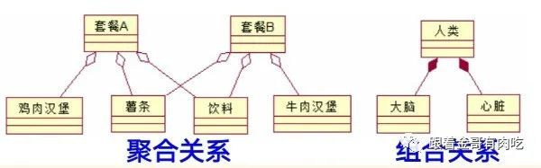

# 类图中的四种关系
四种关系

1. 依赖关系

①定义：依赖描述了两个模型元素之间的关系，如果被依赖的模型元素发生变化就会影响到另一个模型元素

②举例：动物有生命和水进行繁殖，动物和水，动物和氧气都是依赖关系；人需要用船过河，人和船就是依赖关系

...

中间省略了降低依赖的方法，依赖倒置，依赖注入和控制反转

详情可参考JavaEE

...

2. 关联关系

①定义：是一种结构关系，用于指明一个事物的对象和另一个事物的对象间的联系

②关联可以是单向的(带箭头)，也可以是双向的(不带箭头)

③依赖与关联的区别

a. 依赖是一种弱关联

b. 依赖是一种偶然的关系，而不是必然的关系

c. 关联是类的对象之间的一种关系

d. 通俗的理解，就是一个是使用，一个是必须需要。依赖就是可以使用，例如人可以使用船过河，但人也可以用其他工具过河；关联就是必须需要，例如老师教学生，水壶装水

④特殊的关联：聚合和组合

a. 聚合关系

表示类之间整体与部分的关系，较大的事物由较小的事物组成

例如：教室和课桌，教室和椅子，键盘和计算机，鼠标和计算机

每个部分不一定属于一个整体

b. 组合关系

组合是更强形式的聚合关系

整体与部分的生命周期完全一致，每个部分只能属于一个整体

例如：人类和大脑，人类和心脏

聚合关系和组合关系示例

3. 泛化关系

①泛化即继承

②定义：表示一般事物(父类)和该事物的特殊种类(子类)之间的关系

③例如：学生和本科生，学生和研究生，动物和狗子

4\. 实现关系

①定义：说明规格的接口和实现其功能的类的关系

②和java中的接口与类的关系相同

③不继承结构，只继承行为

④常见的两种表现形式