# 详解UML类图（口诀记忆箭头方向）
# UML介绍：

> ## 什么是UML：
> 
> *   UML——**Unified modeling language**UML(统一建模语言)，是一种用于软件系统分析和设计的语言工具，它用于**帮助软件开发人员进行思考和记录思路**的结果
> *   UML本身是一套符号的规定，就像数学符号和化学符号一样，这些符号用于描述软件模型中的各个元素和他们之间的关系，比如类、接口、实现、泛化、依赖、组合、聚合等
> *   使用UML来建模，常用的工具有RationalRose ,也可以使用一些插件来建模  
>     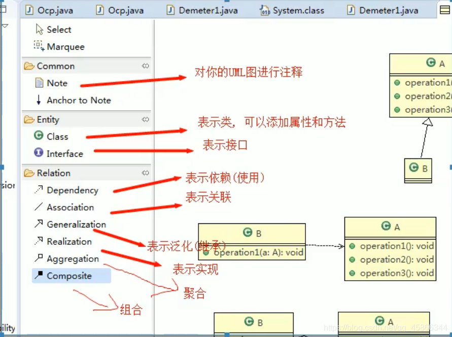

*   ## UML图有哪些？
    

通常UML图分为三类：

> *   用例图(use case)
> *   静态结构图:类图、对象图、包图、组件图、部署图
> *   动态行为图:交互图(时序图与协作图)、状态图、活动图

**类图是描述类与类之间的关系的,是UML图中最核心的**  
所以下面我们来谈谈UML类图

*   # UML类图：
    

## 简述：

> *   用于描述系统中的类(对象)本身的组成和类(对象)之间的各种静态关系。
> *   类之间的关系:**依赖、泛化（继承)、实现、关联、聚合与组合**

## 依赖关系：

> 只要是在**类中用到了对方**，那么他们之间就存在依赖关系。如果没有对方，连编绎都通过不了。

***

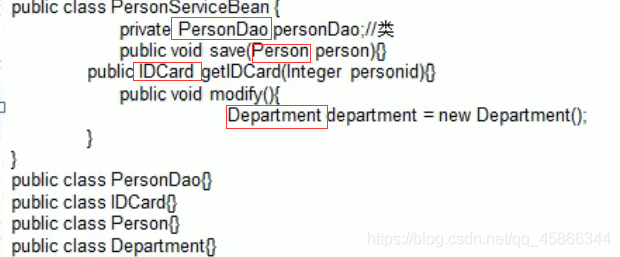

***

可以看到PersonServiceBean这个类依赖下面4个类，如果，缺少下面4个类的任何一种，编译就会报错。

### 上述代码的UML类图：

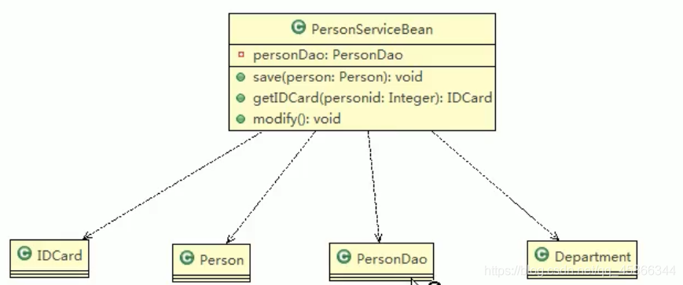

> **注意箭头的方向，可以这样理解（这个类——>（使用到了）另外一个类）**

### 成立的情况：

> *   类中用到了对方
> *   如果是类的成员属性
> *   如果是方法的返回类型
> *   是方法接收的参数类型
> *   方法中使用到了另外一个类

***

## 泛化关系：

> *   其实就是继承关系，是依赖关系的一种特例

***

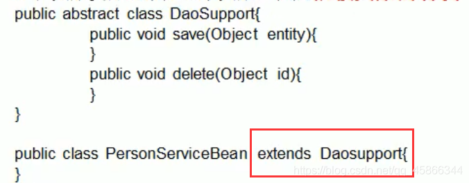

***

### 上述代码的UML类图：

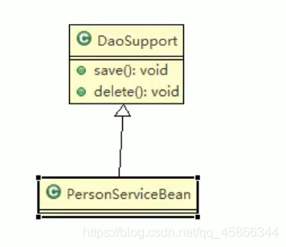

***

## 实现关系：

> 一个类实现了另外一个类，那么他们之间存在实现关系。是依赖关系的一种特例。

***

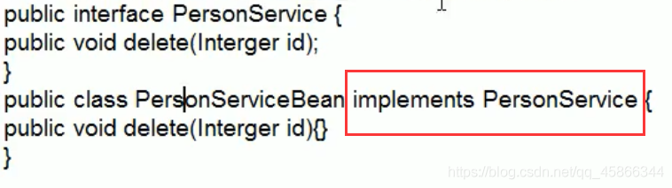

***

### 上述代码的UML类图：

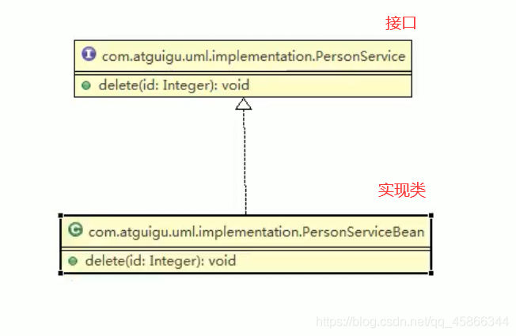  
**注意箭头的方向（孩子指向父亲，实现类指向接口，孩子——>（继承了）父亲；实现类——>（实现了）接口）。这样可能更好理解一点**

***

## 关联关系：

> 类与类之间的关系，是依赖关系的特例；有**双向关系**或者**单向关系**

## 聚合关系：

> 聚合关系(Aggregation）表示的是整体和部分的关系，整体与部分可以分开。  
> 聚合关系是关联关系的特例，所以他具有关联的导航性与多重性。

***

## 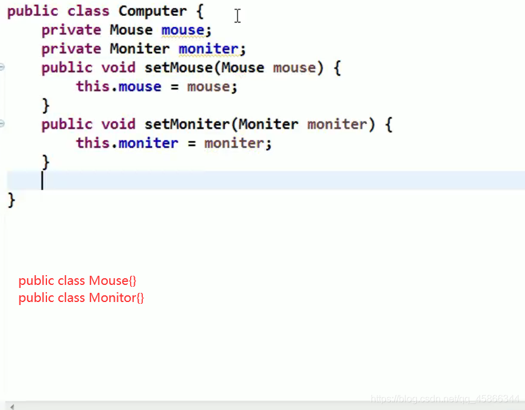  
聚合关系

> 根绝前面的知识，我们知道**computer**和**mouse**及**monitor**之间存在**依赖关系**，此时我们进一步分析mouse对象和monitor对象在computer中是否可以去掉（这里是可以的），我们称这种**可以分离的这种关系成为聚合关系**，**而反之不能分离的这种关系我们成为组合关系**

***

### 上述代码的UML类图：

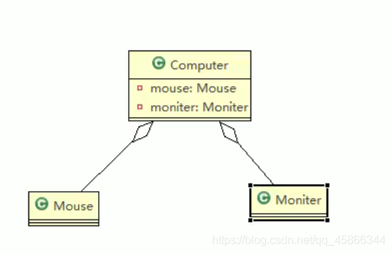

***

## 组合关系：

```
与聚合关系相近，整体与部分的关系，但是类中成员不能与类分离。
```

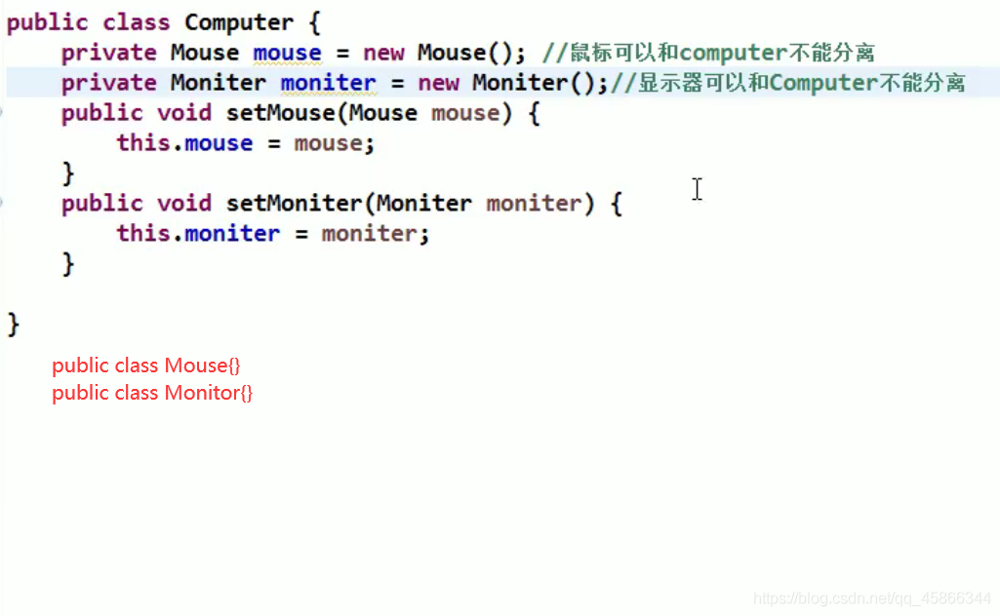

***

> 可以看到这里直接new了成员的，该类生成的时候就自动创建了，说明是不能分离的，所以这里的关系是组合关系

***

### 上述代码的UML类图：

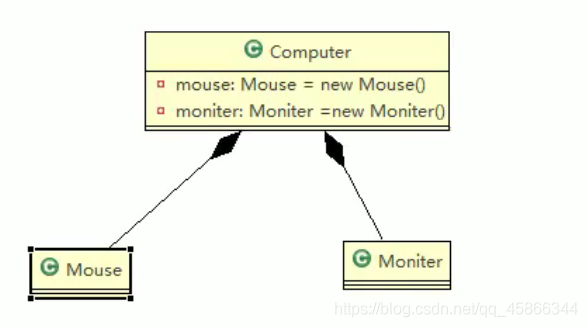

***

> *   **如果在程序中Person实体中定义了对IDCard进行级联删除，即删除Person时连同IDCard一起删除，那么IDCard和Person就是组合了.**