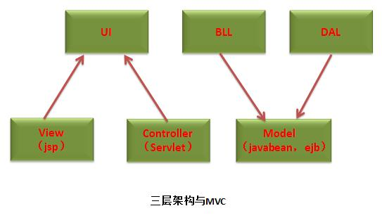

# 三层架构与MVC的区别

我们平时总是将二者混为一谈，殊不知它俩并不是一个概念。下面我来为大家揭晓我所知道的一些真相。

## 概念不同。
1. 三层架构是一个分层式的软件体系架构设计，它可适用于任何一个项目。
2. MVC是一个设计模式，它是根据项目的具体需求来决定是否适用于该项目。
3. 那么架构跟设计模式有什么区别呢？
> 我们从接手一个项目开始
> 首先，我们需要进行架构设计，一般我们采用的就是分层式的架构设计，即我们的三层架构。
> 然后，在确定了架构以后，我们再根据项目的具体需求去考虑是否需要应用一些设计模式，比如是否应用我们的MVC模式，抽象工厂模式等等。（在这里我们看出，MVC与三层架构不是一个等级的，而与抽象工厂等设计模式才是一路的）
> 最后，确定了模式以后，就是我们的一些具体的实现了。（当然一个项目不仅仅考虑这些问题，我只是为了说明两者的区别，将其他问题已省略）

## 它们划分的层次不同。

　　三层架构将整个项目划分为：表现层（UI）、业务逻辑层（BLL）、数据访问层（DAL）。

　　MVC 即Model（模型），View（视图），Controller（控制）。

　　下面看一下他俩的区别与联系：

　　通过这个图我们可以知道，我们平常所说的V是UI，C是BLL，M是DAL的观点是错误的。

　　而我们通常所见到的MVC一般也都是在应用三层架构的基础上，即将Model层再进行分层。而如果Model不再进行划分的话，那么使用MVC的意义也就不大了。

然后，它俩的目的着重点不同。

　　三层架构的目的着重点是“高内聚，低耦合”，即解耦。

　　MVC的目的则是实现Web系统的职能分工，即职责划分。

　　其实职责划分也是解耦，但是三层侧重的是整体的一个解耦，而MVC侧重的是web系统的解耦，即侧重jsp和Servlet的一个解耦。

最后，为何我们会将其混为一谈？

　　既然两者有这么多的不同，我们为什么还总是将其混淆呢，下面我列举了几个我们常常将其混为一谈的几个原因：

　　1.二者都是“三层”。

　　这个原因是最容易迷惑我们初学者的，一个是UI,BLL,DAL，一个是View，Controller，Model，不都是三层吗？

　　虽然都是“三层”（不一定是真的三层，还可以是多层），但是它们的划分的不一样。大家可从上面的图中看出不同。

　　2.MVC总是伴随着三层架构。

　　这个就是我在前面一再强调的，我们一般是在考虑使用（也可以不使用）了三层架构的基础上再根据具体需求决定是否需要使用MVC，于是我们常说的MVC中总是伴随着三层架构，所以大家总是会认为MVC就是三层架构，三层架构就是MVC，殊不知，它们二者是一起出现的。

　　3.都是在分层，即都是在解耦。

　　前面说它们目的的时候也说了，虽然它们的侧重点不同，但是它们的总体目的是一样的，都是为了解耦，对于初学者而言，是不知道这两个侧重点有何不同的。

　　大家往往对它们的联系知道很多，不然也不会混为一谈，但是对它们的区别却知道较少，希望我上面讲解的它们两者之间的区别可以让大家对它们有些了解，如有写的不妥的地方，请指教。

　　　三层架构（3-tier application） 通常意义上的三层架构就是将整个业务应用划分为：表现层（UI）、业务逻辑层（BLL）、数据访问层（DAL）。区分层次的目的即为了“高内聚，低耦合”的思想。

　　　1、表现层（UI）：通俗讲就是展现给用户的界面，即用户在使用一个系统的时候他的所见所得。

　　　2、业务逻辑层（BLL）：针对具体问题的操作，也可以说是对数据层的操作，对数据业务逻辑处理。

　　　3、数据访问层（DAL）：该层所做事务直接操作数据库，针对数据的增添、删除、修改、更新、查找等。

　　　　MVC是 Model-View-Controller，严格说这三个加起来以后才是三层架构中的UI层，也就是说，MVC把三层架构中的UI层再度进行了分化，分成了控制器、视图、实体三个部分，控制器完成页面逻辑，通过实体来与界面层完成通话；而C层直接与三层中的BLL进行对话。

　　　mvc可以是三层中的一个表现层框架，属于表现层。三层和mvc可以共存。

　　　　三层是基于业务逻辑来分的，而mvc是基于页面来分的。

　　　　MVC主要用于表现层，3层主要用于体系架构，3层一般是表现层、中间层、数据层，其中表现层又可以分成M、V、C，（Model View Controller）模型－视图－控制器

　　　　曾把MVC模式和Web开发中的三层结构的概念混为一谈，直到今天才发现一直是我的理解错误。MVC模式是GUI界面开发的指导模式，基于表现层分离的思想把程序分为三大部分：Model-View-Controller，呈三角形结构。Model是指数据以及应用程序逻辑，View是指 Model的视图，也就是用户界面。这两者都很好理解，关键点在于Controller的角色以及三者之间的关系。在MVC模式中，Controller和View同属于表现层，通常成对出现。Controller被设计为处理用户交互的逻辑。一个通常的误解是认为Controller负责处理View和Model的交互，而实际上View和Model之间是可以直接通信的。由于用户的交互通常会涉及到Model的改变和View的更新，所以这些可以认为是Controller的副作用。

　　　　MVC是表现层的架构，MVC的Model实际上是ViewModel，即供View进行展示的数据。 ViewModel不包含业务逻辑，也不包含数据读取。

　　　　而在N层架构中，一般还会有一个Model层，用来与数据库的表相对应，也就是所谓ORM中的O.这个Model可能是POCO，也可能是包含一些验证逻辑的实体类，一般也不包含数据读取。进行数据读取的是数据访问层。而作为UI层的MVC一般不直接操作数据访问层，中间会有一个业务逻辑层封装业务逻辑、调用数据访问层。UI层（Controller）通过业务逻辑层来得到数据（Model），并进行封装（ViewModel），然后选择相应的View.

　　　　MVC本来是存在于Desktop程序中的，M是指数据模型，V是指用户界面，C则是控制器。使用MVC的目的是将M和V的实现代码分离，从而使同一个程序可以使用不同的表现形式。比如一批统计数据你可以分别用柱状图、饼图来表示。C存在的目的则是确保M和V的同步，一旦M改变，V应该同步更新。

　　　　MVC如何工作MVC是一个设计模式，它强制性的使应用程序的输入、处理和输出分开。使用MVC应用程序被分成三个核心部件：模型、视图、控制器。它们各自处理自己的任务。

　　　　视图V视图是用户看到并与之交互的界面。对老式的Web应用程序来说，视图就是由HTML元素组成的界面，在新式的Web应用程序中，HTML依旧在视图中扮演着重要的角色，但一些新的技术已层出不穷，它们包括Macromedia Flash和象XHTML，XML/XSL，WML等一些标识语言和Web services.如何处理应用程序的界面变得越来越有挑战性。MVC一个大的好处是它能为你的应用程序处理很多不同的视图。在视图中其实没有真正的处理发生，不管这些数据是联机存储的还是一个雇员列表，作为视图来讲，它只是作为一种输出数据并允许用户操纵的方式。

　　　　模型M模型表示企业数据和业务规则。在MVC的三个部件中，模型拥有最多的处理任务。被模型返回的数据是中立的，就是说模型与数据格式无关，这样一个模型能为多个视图提供数据。由于应用于模型的代码只需写一次就可以被多个视图重用，所以减少了代码的重复性。

　　　　控制器C控制器接受用户的输入并调用模型和视图去完成用户的需求。所以当单击Web页面中的超链接和发送HTML表单时，控制器本身不输出任何东西和做任何处理。它只是接收请求并决定调用哪个模型构件去处理请求，然后再确定用哪个视图来显示返回的数据。

　　　　模型Model 模型是应用程序的主体部分。模型表示业务数据，或者业务逻辑。 实现具体的业务逻辑、状态管理的功能。

　　　　视图View 视图是应用程序中用户界面相关的部分，是用户看到并与之交互的界面。 就是与用户实现交互的页面，通常实现数据的输入和输出功能。

　　　　控制器controller 控制器工作就是根据用户的输入，控制用户界面数据显示和更新model对象状态。起到控制整个业务流程的作用，实现View层跟Model层的协同工作。

　　　　3层架构指：表现层（显示层） 业务逻辑层 数据访问层（持久化）如果大家非要“生搬硬套”把它和MVC扯上关系话那我就只能在这里”强扭这个瓜”了即：V 3层架构中”表现层”aspx页面对应MVC中View（继承的类不一样）

　　　　C 三层架构中”表现层”的aspx.cs页面（类）对应MVC中的Controller，理解这一点并不难，大家想一想我们以前写过的 Redirect，当然它本身就是跳转了一些链接页面，而MVC中的Controller要做的更爽，它控制并显示输出了一个视图。即然所起到的作用都是对业务流程和显示信息的控制，只不过是实现手段不同而已。

　　　　M 3层架构中业务逻辑层和数据访问层对应MVC中Model（必定View和Controller已找到“婆家”剩下Model只能是业务逻辑层和数据访问层了）

　　　　为什么要使用 MVC大部分Web应用程序都是用像ASP，PHP，或者CFML这样的过程化（自PHP5.0版本后已全面支持面向对象模型）语言来创建的。它们将像数据库查询语句这样的数据层代码和像HTML这样的表示层代码混在一起。经验比较丰富的开发者会将数据从表示层分离开来，但这通常不是很容易做到的，它需要精心的计划和不断的尝试。MVC从根本上强制性的将它们分开。尽管构造MVC应用程序需要一些额外的工作，但是它给我们带来的好处是无庸质疑的。

　　　　首先，最重要的一点是多个视图能共享一个模型，现在需要用越来越多的方式来访问你的应用程序。对此，其中一个解决之道是使用MVC，无论你的用户想要Flash界面或是 WAP 界面；用一个模型就能处理它们。由于你已经将数据和业务规则从表示层分开，所以你可以最大化的重用你的代码了。

　　　　由于模型返回的数据没有进行格式化，所以同样的构件能被不同界面使用。例如，很多数据可能用HTML来表示，但是它们也有可能要用Adobe Flash和WAP来表示。模型也有状态管理和数据持久性处理的功能，例如，基于会话的购物车和电子商务过程也能被Flash网站或者无线联网的应用程序所重用。

　　　　因为模型是自包含的，并且与控制器和视图相分离，所以很容易改变你的应用程序的数据层和业务规则。如果你想把你的数据库从MySQL移植到Oracle，或者改变你的基于RDBMS数据源到LDAP，只需改变你的模型即可。一旦你正确的实现了模型，不管你的数据来自数据库或是LDAP服务器，视图将会正确的显示它们。由于运用MVC的应用程序的三个部件是相互独立，改变其中一个不会影响其它两个，所以依据这种设计思想你能构造良好的松耦合的构件。

　　　　对我来说，控制器也提供了一个好处，就是可以使用控制器来联接不同的模型和视图去完成用户的需求，这样控制器可以为构造应用程序提供强有力的手段。给定一些可重用的模型和视图，控制器可以根据用户的需求选择模型进行处理，然后选择视图将处理结果显示给用户。

　　　　拿一个简单的登陆模块说，需求是你输入一个用户名、密码，如果输入的跟预先定义好的一样，那么就进入到正确页面，如果不一样，就提示个错误信息。

　　　　V 这个小小的模块中，起始的输入用户名密码的页面跟经过校验后显示的页面就相当于View C 而这里还需要一个controller页面，就是用于接收输入进来的用户名密码，还有经过校验后返回的一个flg（此flg就是用于判断你输入的是否正确，而跳转到相应的页面的）

　　　　M 最后还缺一个Model，那么就是你那个用于校验的类了，他就是处理你输入的是否跟预先订好的一样不一样的，之后返回一个flg.这样就完全实现了逻辑跟页面的分离，我页面不管你咋整，反正我就一个显示，而controller呢也不管你Model咋判断对不对，反正我给你了用户名跟密码，你就得给我整回来一个flg来，而Medol呢，则是反正你敢给我个用户名跟密码，我就给你整过去个flg

　　　　m 提供数据，数据之间的关系，转化等。并可以通知视图和控制器自己哪些地方发生了变化。

　　　　v 提供显示，能根据m的改变来更新自己c 比如视图做了点击一个按钮，会先发给这个视图的控制器，然后这个控制器来决定做什么操作（让模型更新数据，控制视图改变）

　　　　mvc是一个复合模式mv，mc都是观察者模式m内部的组件组合模式vc之间是策略模式（可以随时更换不同的控制器）

　　————————————-

　　　　MVC模式是上世纪70年代提出，最初用于Smalltalk平台上的。

　　　　MVC是表现模式，是用来向用户展现的许多组建的一个模式（UI/Presentation Patten）

　　　　MVC有三种角色：Model：用来储存数据的组件（与领域模型概念不同，两者会相互交叉）

　　　　View：从Model中获取数据进行内容展示的组件。同样的Model在不同的View下可展示不同的效果。获取Model的状态，而不对其进行操作。

　　　　Controller：接受并处理用户指令（操作Model（业务）），选择一个View进行操作。

　　　　MVC概述：协作存在单向引用，例如Model不知道View和Controller的存在。View不知道Controller的存在。这就隔离了表现和数据。View和controller是单向引用。而实际中View和Controller也是有数据交互的。

　　　　MVC的重要特点是分离。两种分离：View和数据（Model）的分离使用不同的View对相同的数据进行展示；分离可视和不可视的组件，能够对Model进行独立测试。因为分离了可视组件减少了外部依赖利于测试。（数据库也是一种外部组件）

　　　　View和表现逻辑（Controller）的分离Controller是一个表现逻辑的组件，并非一个业务逻辑组件。MVC可以作为表现模式也可以作为建构模式，意味这Controller也可以是业务逻辑。分离逻辑和具体展示，能够对逻辑进行独立测试。

　　　　MVC和三层架构MVC与三层架构类似么？

　　　　View-UI Layer | Controller-Bussiness Layer | Model-Data Access Layer其实这样是错误的MVC是表现模式（Presentation Pattern）

　　　　三层架构是典型的架构模式（Architecture Pattern）

　　　　三层架构的分层模式是典型的上下关系，上层依赖于下层。但MVC作为表现模式是不存在上下关系的，而是相互协作关系。即使将MVC当作架构模式，也不是分层模式。MVC和三层架构基本没有可比性，是应用于不同领域的技术。