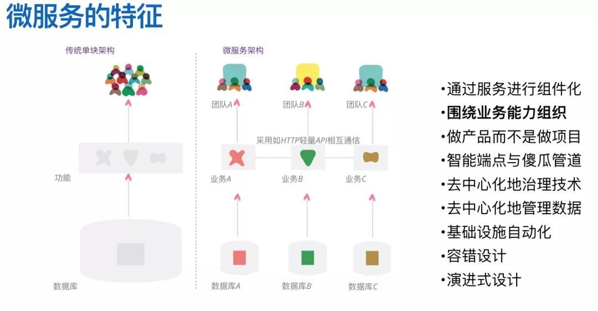
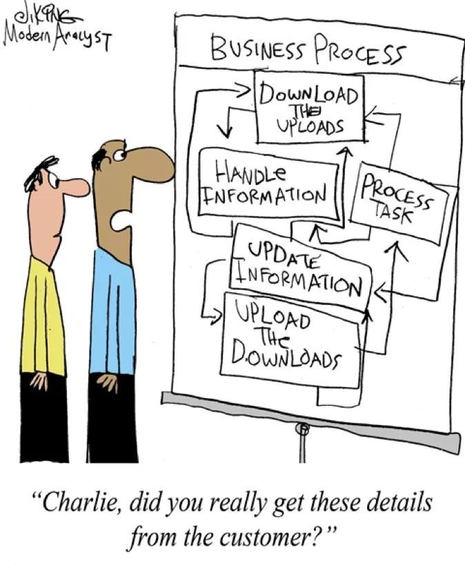
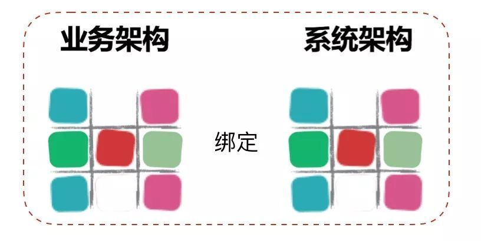
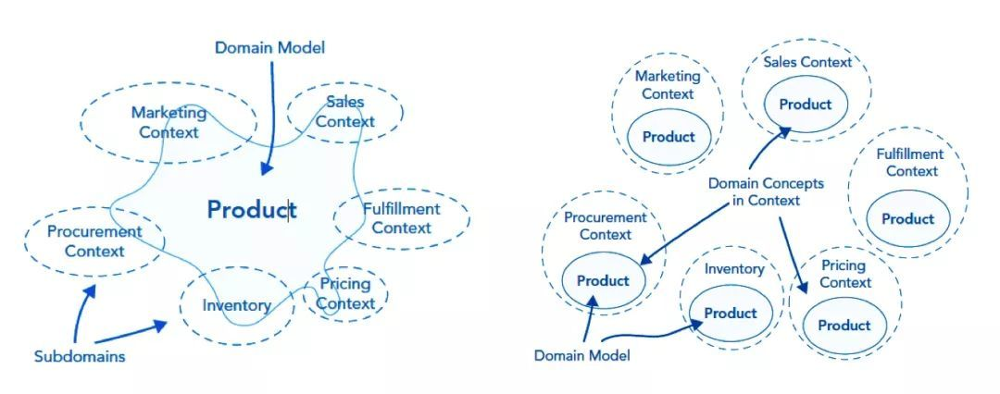

在本人的前一篇文章《不要把微服务做成小单体》中，现在很多的微服务开发团队在设计和实现微服务的时候觉得只要把原来的单体拆小，就是微服务了。但是这不一定是正确的微服务，可能只是一个拆小的小单体。这篇文章让我们从这个话题继续，先看看为什么拆出来的是小单体。

## **设计微服务的路径依赖困境**

在微服务架构诞生之前，几乎所有的软件系统都是采用单体架构来构建的，因此大部分软件开发者喜欢的开发路径就是单体架构模式。在这样的背景下，根据经济学和心理学的路径依赖法则，当这些开发者基于新的技术想要把原来的大单体拆分成多个部分时，就必然会习惯性地采用自己最擅长的单体架构来设计每个部分。

> 路径依赖法则：是指人类社会中的技术演进或制度变迁均有类似于物理学中的惯性，即一旦进入某一路径（无论是“好”还是“坏”）就可能对这种路径产生依赖。一旦人们做了某种选择，就好比走上了一条不归之路，惯性的力量会使这一选择不断自我强化，并让你轻易走不出去。第一个使“路径依赖”理论声名远播的是道格拉斯·诺斯，由于用“路径依赖”理论成功地阐释了经济制度的演进，道格拉斯·诺斯于1993年获得诺贝尔经济学奖。“路径依赖”理论被总结出来之后，人们把它广泛应用在选择和习惯的各个方面。在一定程度上，人们的一切选择都会受到路径依赖的可怕影响，人们过去做出的选择决定了他们现在可能的选择，人们关于习惯的一切理论都可以用“路径依赖”来解释。

在现实中我们经常看到这个法则随处都会发生，微信刚出来的时候很多人说这不就是手机上的QQ吗，朋友圈刚出来的时候他们又会说这不就是抄袭微博吗。很多时候当你兴致冲冲给朋友介绍一个新的东东时，朋友一句话就能让你万念俱灰：这不就是XXX吗？之所以这样，是因为人类在接触到新知识新概念的时候，都会下意识的使用以前知道的概念进行套用，这样的思维方式是人类从小到大学习新事物的时候使用的模式，它已经固化成我们大脑操作系统的一部分了。

理解了这个法则，我们就可以很容易的明白，已经在单体架构下开发了多年的软件工程师，当被要求要使用微服务架构来进行设计和开发的时候，本能的反应方式肯定是：这不就是把原来的单体做小了吗？但是这样做出来的“微服务”真的能够给我们带来微服务架构的那些好处吗？真的能提高一个企业的数字化响应力吗？

不断变化的软件需求和经常被视为效率低下的软件开发一直都是这个行业里最难解决的顽疾，从瀑布到敏捷，都是在尝试找到一个解决这个顽疾的方法，领域驱动设计（Domain Driven Design）也是其中一个药方，而且随着十多年的不断实践，我们发现这个药方有它自己的独特之处，下面我们先来介绍一下这个药方。

## **DDD简史**

领域驱动设计这个概念出现在2003年，那个时候的软件还处在从CS到BS转换的时期，敏捷宣言也才发表2年。但是Eric Evans做为在企业级应用工作多年的技术顾问，敏锐的发现了在软件开发业界内（尤其是企业级应用）开始涌现的一股思潮，他把这股思潮成为领域驱动设计，同时还出版了一本书，在书中分享了自己在设计软件项目时采用的建模方法，并为设计决策者提供了一个框架。

但是从那以后DDD并没有和敏捷一样变得更加流行，如果要问原因，我觉得一方面是这套方法里面有很多的新名词新概念，比如说聚合，限界上下文，值对象等等，要理解这些抽象概念本身就比较困难，所以学习和应用DDD的曲线是非常陡峭的。另一方面，做为当时唯一的“官方教材”《领域驱动设计》，阅读这本书是一个非常痛苦的过程，在内容组织上经常会出现跳跃，所以很多人都是刚读了几页就放下了。

虽然入门门槛有些高，但是对于喜欢智力挑战的软件工程师们来说，这就是一个难度稍为有一点高的玩具，所以在小范围群体内，逐渐有一批人开始能够掌控这个玩具，并且可以用它来指导设计能够控制业务复杂性的软件应用出来了。虽然那时候大部分的软件应用都是单体的，但是使用DDD依然可以设计出来容易维护而且快速响应需求变化的单体应用出来。

到了2013年，随着各种分布式的基础设施逐渐成熟，而SOA架构应用在实践中又不是那么顺利，Martin Fowler和James Lewis把当时出现的一种新型分布式架构风潮总结成微服务架构。然后微服务这股风就呼呼的吹了起来，这时候软件工程师们发现一个问题，就是虽然指导微服务架构的应用具有什么特征，但是如何把原来的大单体拆分成微服务是完全不知道怎么做了。然后熟悉DDD方法的工程师发现，由于DDD可以有效的从业务视角对软件系统进行拆解，并且DDD特别契合微服务的一个特征：围绕业务能力构建。所以用DDD拆分出来的微服务是比较合理的而且能够实现高内聚低耦合，这样接着微服务DDD迎来了它的第二春。

下面让我们站在软件工程这个大视角看看DDD究竟是在做什么。

## **DDD思辨**

从计算机发明以来，人类用过表达世界变化的词有：电子化，信息化，数字化。这些词里面都有一个“化”字，代表着转变，而这些转变就是人类在逐渐的把原来在物理世界中的一个个概念一个个工作，迁移到虚拟的计算机世界。但是在转变的过程中，由于两个世界的底层逻辑以及底层语言不一致，就必须要有一个翻译和设计的过程。这个翻译过程从软件诞生的第一天起就天然存在，而由于有了这个翻译过程，业务和开发之间才总是想两个对立的阶级一样，觉得对方是难以沟通的。

于是乎有些软件工程界的大牛就开始思考，能不能有一种方式来减轻这个翻译过程呢。然后就发明了面向对象语言，开始尝试让计算机世界有物理世界的对象概念。面向对象还不够，这就有了DDD，DDD定义了一些基本概念，然后尝试让业务和开发都能够理解这些概念名词，然后让领域专家使用这些概念名词来描述业务，而由于使用了规定的概念名词，开发就可以很好的理解领域业务，并能够按照领域业务设计的方式进行软件实现。这就是DDD的初衷：让业务架构绑定系统架构。

后来发现这个方法不仅仅可以做好翻译，还可以帮助业务划分领域边界，可以明确哪个领域是自己的核心价值所在，以后应该重点发展哪个领域。甚至可以作为组织进行战略规划的参考。而能够做到这点，其实背后的原因是物理世界和虚拟世界的融合。

> 举个例子，比如说在物理世界中要买一个商品，在没有商品的时候我需要一个账本来记录有进了哪些商品，每一个订单买了多少商品，买一个商品赚了多少钱。这些工作在计算机世界里面也应该要有商品，账本，订单，订单明细这些概念，而且当我说卖出商品需要能够从账本中扣除库存的时候。在计算机世界里面，就应该是订单对象在完成以后会调用账本对象来扣减库存。通过这种方式，每一个业务逻辑都可以很容易地找到软件中对应的对象来进行实现。

## **用DDD走出设计微服务拆分困境**

上面介绍了使用DDD可以做到绑定业务架构和系统架构，这种绑定对于微服务来说有什么关系呢。所谓的微服务拆分困难，其实根本原因是不知道边界在什么地方。而使用DDD对业务分析的时候，首先会使用聚合这个概念把关联性强的业务概念划分在一个边界下，并限定聚合和聚合之间只能通过聚合根来访问，这是第一层边界。然后在聚合基础之上根据业务相关性，业务变化频率，组织结构等等约束条件来定义限界上下文，这是第二层边界。有了这两层边界作为约束和限制，微服务的边界也就清晰了，拆分微服务也就不再困难了。

而且基于DDD设计的模型中具有边界的最小原子是聚合，聚合和聚合之间由于只通过聚合根进行关联，所以当需要把一个聚合根从一个限界上下文移动到另外一个限界上下文的时候，非常低的移动成本可以很容易地对微服务进行重构，这样我们就不需要再纠结应不应该这样拆分微服务？拆出的微服务太少了以后要再拆分这样的问题了。

所以，经过理论的严密推理和大量实践项目的验证，ThoughtWorks认为DDD是当前软件工程业界设计微服务的最佳实践。虽然学习和使用DDD的成本有点高，但是如果中国的企业想再软件开发这个能力上从冷兵器时代进入热兵器时代，就应该尝试一下DDD了解一下先进的软件工程方法。