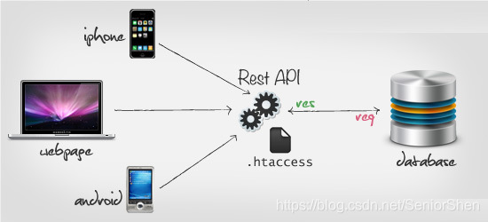
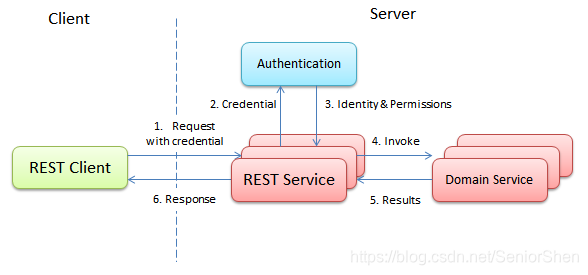
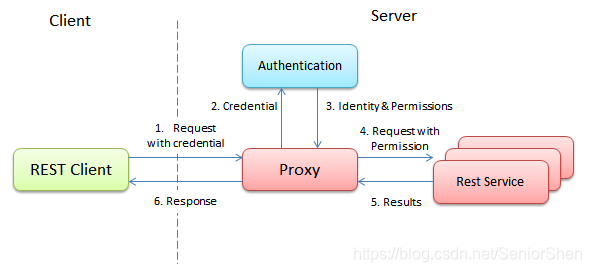

# 什么是REST风格_什么是RESTFUL
## 一、什么是REST ？（一种软件架构风格）


缩写：REST （不是"rest"这个单词）
外文名：Representational State Transfer，简称REST。
中文名：表现层状态转移。

提出时间：2000年。
属性：一种软件架构风格。（以Web为平台的。web服务的架构风格，前后端接口时候用到。）

REST之所以晦涩难懂，是因为前面主语（Resource ）被去掉了。
全称是： Resource Representational State Transfer。
通俗来讲就是：资源在网络中以某种表现形式进行状态转移。

分解开来讲解:
Resource：资源，即数据（这是网络的核心）；
Representational：某种表现形式，比如用JSON，XML，JPEG等；
State Transfer：状态变化。通过HTTP的动词（get查询、post新增、put修改、delete删除）实现。


一句话描述REST实质：  
<mark>URL中只使用名词来定位资源，用HTTP协议里的动词（GET、POST、PUT、DELETE）来实现资源的增删改查操作。</mark>


什么意思呢？


比如，我们有一个friends接口，对于“朋友”我们有增删改查四种操作，怎么定义REST接口？

增加一个朋友，uri: generalcode.cn/v1/friends 接口类型：POST  
删除一个朋友，uri: generalcode.cn/va/friends 接口类型：DELETE（在http的parameter指定好友id）  
修改一个朋友，uri: generalcode.cn/va/friends 接口类型：PUT（在http的parameter指定好友id）  
查找一个朋友，uri: generalcode.cn/va/friends 接口类型：GET

上面我们定义的四个接口就是符合REST协议的，请注意，这几个接口都没有动词，只有名词friends，都是通过Http请求的接口类型来判断是什么业务操作。

```bash
举个反例：
generalcode.cn/va/deleteFriends 该接口用来表示删除朋友，这就是不符合REST协议的接口。
不能用deleteFriends ，而应该就用friends + http请求的delete方式。
```

一般接口的返回值绝大部分是JSON类型的。

> <mark>总结</mark>：  
> 看Url就知道要什么  
> 看http method就知道干什么  
> 看http status code就知道结果如何

## 二、什么是RESTFUL ？

从上面的定义中，我们可以发现REST其实是一种组织Web服务的架构，  
并不是实现Web服务的一种技术（**注意：不是一种技术！！！也不是一种标准！！！**），  
其目标是为了创建具有良好扩展性的分布式系统。

反过来，作为一种架构，其提出了一系列架构级约束。这些约束有：

1.  **使用客户/服务器(b/s、 c/s)模型**。客户和服务器之间通过一个统一的接口来互相通讯。
2.  **层次化的系统**。在一个REST系统中，客户端并不会固定地与一个服务器打交道。
3.  **无状态**。在一个REST系统中，服务端并不会保存有关客户的任何状态。也就是说，客户端自身负责用户状态的维持，并在每次发送请求时都需要提供足够的信息。
4.  **可缓存**。REST系统需要能够恰当地缓存请求，以尽量减少服务端和客户端之间的信息传输，以提高性能。
5.  **统一的接口**。一个REST系统需要使用一个统一的接口来完成子系统之间以及服务与用户之间的交互。这使得REST系统中的各个子系统可以独自完成演化。

<mark>如果一个系统满足了上面所列出的五条约束，那么该系统就被称为是RESTful的。</mark>

## 三、REST风格好处 ？

rest风格的接口有什么好处呢:  
**前后端分离。**

前端拿到数据只负责展示和渲染，不对数据做任何处理。  
后端处理数据并以JSON格式传输出去，定义这样一套统一的接口，在web，ios，android三端都可以用相同的接口，是不是很爽？！（因为不需要写三次代码，一次代码可以公用给三端；另外，修改代码只要修改一次，三端都同步访问新代码，不需要修改三次代码。）  


## 四、REST风格缺点 ？

```bash
无状态约束。是他的一个缺点。
```

**Authentication**

无状态约束给REST实现带来的麻烦：用户的状态是需要全部保存在客户端的。当用户需要执行某个操作的时候，其需要将所有的执行该请求所需要的信息添加到请求中。该请求将可能被REST服务集群中的任意服务器处理，而不需要担心该服务器中是否存有用户相关的状态。

但是在现有的各种基于HTTP的Web服务中，我们常常使用会话来管理用户状态，至少是用户的登陆状态。因此，REST系统的无状态约束实际上并不是一个对传统用户登录功能友好的约束：在传统登陆过程中，其本身就是通过用户所提供的用户名和密码等在服务端创建一个用户的登陆状态，而REST的无状态约束为了横向扩展性却不想要这种状态。而这也就是为基于HTTP的REST服务添加身份验证功能的困难之处。

为了解决该问题，最为经典也最符合REST规范的实现是在每次发送请求的时候都将用户的用户名和密码都发送给服务器。而服务器将根据请求中的用户名和密码调用登陆服务，以从该服务中得到用户所对应的Identity和其所具有的权限。接下来，在REST服务中根据用户的权限来访问资源。  
　　  
　这里有一个问题就是登陆的性能。随着系统当前的加密算法越来越复杂，登陆已经不再是一个轻量级的操作。因此用户所发送的每次请求都要求一次登陆对于整个系统而言就是一个巨大的瓶颈。

在当前，解决该问题的方法主要是一个独立的缓存系统，如整个集群唯一的登陆服务器。但是缓存系统本身所存储的仍然是用户的登陆状态。因此该解决方案将仍然轻微地违反了REST的无状态约束。

还有一个类似的方法是通过添加一个代理来完成的。该代理会完成用户的登陆并获得该用户所拥有的权限。接下来，该代理会将与状态有关的信息从请求中删除，并添加用户的权限信息。在经过了这种处理之后，这些请求就可以转发到其后的各个服务器上了。转发目的地所在的服务器则会假设所有传入的请求都是合法的并直接对这些请求进行处理。  
  
可以看到，无论是一个独立的登陆服务器还是为整个集群添加一个代理，系统中都将有一个地方保留了用户的登陆状态。这实际上和在集群中对会话集中进行管理并没有什么不同。也就是说，我们所尝试的通过禁止使用会话来达成完全的无状态并不现实。因此在一个基于HTTP的REST服务中，为登陆功能使用集中管理的会话是合理的。

既然我们放松了对REST系统的无状态约束，那么一个REST系统所可以使用的登陆机制将主要分为以下两种：

1.  基于HTTPS的Basic Access Authentication

其好处是其易于实现，而且主流的浏览器都提供了对该功能的支持。但是由于登陆窗口都是由浏览器所提供的，因此其与产品外观有很大不同。除此之外，浏览器都没有提供登出的功能，也没有提供找回密码等功能。

2.  基于Cookie及Session的管理

在使用Cookie来管理用户的注册状态的时候，其实际上就是将服务端所返回的Cookie在每次发送请求的时候添加到请求中。虽然说这个Cookie并非存储了用户应用的状态，但是其实际存储了用户的登陆状态。因此客户端的角度来讲，由服务端管理的Session并不符合REST所倡导的无状态的要求。

可以说，上面的两种方法各有优劣。可能第二种方法从客户端的角度看来并不是RESTful的，但是其优势则在于很多类库都直接提供了对该功能的支持，从而简化了会话管理服务器的实现。

在这里顺便提一句，如果项目足够大，将一些SSO产品集成到服务中也是不错的选择。

## 四、学习链接

链接1：[https://blog.csdn.net/intelrain/article/details/80449371](https://blog.csdn.net/intelrain/article/details/80449371)  
链接2：[https://www.cnblogs.com/loveis715/p/4669091.html](https://www.cnblogs.com/loveis715/p/4669091.html)  
链接3：[https://www.zhihu.com/question/28557115](https://www.zhihu.com/question/28557115)  
链接4：[https://developer.paypal.com/docs/api/overview/](https://developer.paypal.com/docs/api/overview/)