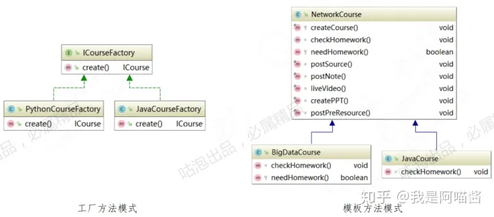

# 各设计模式总结与对比
## **1.各设计模式总结与对比**

### **1.1.课程目标**

1、 简要分析GoF 23种设计模式和设计原则,做整体认知。

2、 剖析Spirng的编程思想，启发思维,为之后深入学习Spring做铺垫。

3、 了解**各设计模式之间的关联**，解决设计模式混淆的问题。

### **1.2.内容定位**

1、 掌握设计模式的"道" ，而不只是"术"

2、 道可道非常道，滴水石穿非一日之功，做好长期修炼的准备。

3、 不要为了用设计模式去生搬硬套，而是在业务上到遇到问题时，很自然地想到设计模式作为一种解 决方案。

### **1.3.一句话归纳设计原则**

**设计原则一句话归纳目的**
开闭原则(OCP)(Open-Close)：对扩展开放，对修改关闭。减少维护带来新的风险
依赖倒置原则(DIP)(Dependence Inversion)：高层不应该依赖低层。更利于代码结构的升级扩展
单一职责原则(SRP)(Simple Responsibility)：一个类只干一件事。便于理解，提高代码可读性
接口隔离原则(ISP)(Interface Segregation)：一个接口只干一件事功能解耦，高聚合、低耦合
迪米特法则(LoD)(Law of Demeter)：不该知道的不要知道。只和朋友交流，不和陌生人说话，减少代码臃肿
里氏替换原则(LSP) (Liskov Substitution)：子类重写方法。功能发生改变， 不应该影响父类方法的含义防止继承泛滥
合成复用原则(CARP)(Composite/Aggregate Reuse)：尽量使用组合实现代码复用，而不使用继承降低代码耦合

### **1.4.G0F 23种设计模式简介**

《Design Patterns: Elements of Reusable Object-Oriented Software》 （即 后 述 《设计模式》 — 书 ） ，由 Erich Gamma、 Richard Helm、 Ralph Johnson 和 John Vlissides 合著 （Addison-Wesley , 1995 ）。这几位作者常被称为"四人组（Gang of Four）" ,而这本书也就被称为 "四人组（或 GoF ）"书。

在 《设计模式》这本书的最大部分是一个目录，该目录列举并描述了 23种设计模式。另外，近来 这一清单又增加了一些类别，最重要的是使涵盖范围扩展到更具体的问题类型。例如，Mark Grand在 Patterns in Java: A Catalog of Reusable Design Patterns Illustrated with UML （即后述《模式 Java 版》一书）中增加了解决涉及诸如并发等问题的模式，而 由 DeepakAlur. JohnCrupi和 Dan Malks 合著的 Core J2EE Patterns: Best Practices and Design Strategies —书中主要关注使用 Java 2 企 业技术的多层应用程序上的模式。

很多人并没有注意到这点，学完Java基础语言就直接去学J2EE,有的甚至鸭子赶架，直接使用起 Weblogic等具体J2EE软件，一段时间下来，发现不过如此，挺简单好用，但是你真正理解J2EE 了吗？ 你在具体案例中的应用是否也是在延伸J2EE的思想？对软件设计模式的研究造就了一本可能是面向对 象设计方面最有影响的书籍：《设计模式》。

由此可见，设计模式和J2EE在思想和动机上是一脉相承的，我总结了以下几个原因：

1.  设计模式更抽象，J2EE是具体的产品代码，我们可以接触到，而设计模式在对每个应用时才会产 生具体代码。
2.  设计模式是比J2EE等框架软件更小的体系结构，J2EE中许多具体程序都是应用设计模式来完成的 ，当你深入到J2EE的内部代码研究时，这点尤其明显，因此，如果你不具备设计模式的基础知识(GoF 的设计模式),你很淮i夬速的理解J2EE。不能理解J2EE如何能灵活应用?
3.  J2EE只是适合企业计算应用的框架软件，但是GoF的设计模式几乎可以用于任何应用！因此GoF 的设计模式应该是J2EE的重要理论基础之一

所以说,GoF的设计模式是Java基础知识和J2EE框架知识之间一座隐性的”桥“。

设计模式其实也是一门艺术。设计模式来源于生活，不要为了套用设计模式而去使用设计模式。设 计模式是在我们迷茫时提供的一种解决问题的方案，或者说用好设计模式可以防范于未然。自古以来, 在我们人生迷茫时,我们往往都会寻求帮助,或上门咨询，或查经问典。就在几千年前,孔夫子就教给 了我们怎样做人。对于中国人来说都知道:从出生元婴、二十加冕、三十而立、四十不惑、五十知天命、 六十花甲、七十古稀不逾矩、八、九十耄耋......我们这就是在用模板模式，当然，有些人不会选择这套 模板。

设计模式总结的是经验之谈，总结的是前人的经验。提供给后人去借鉴使用，前人栽树，后人乘凉。 设计模式可以帮助我们提升代码的可读性、可扩展性；降低维护成本；解决复杂的业务问题，但是，千 万千万不要死记硬背，生搬硬套。下面我们还是先来总体预览一下GOF23种设计模式的归纳和总结。

**分类设计模式**创建型工厂方法模式(Factory Method )、抽象工厂模式(Abstract Factory ) 、单例模式(Singleton)、原型模式(Prototype、 建造者模式(Builder)结构型代理模式(Proxy ) 、门面模式( Facade ) 、装饰器模式(Decorator) 、孚兀模式( Flyweight) 、组合模式(Composite)、适配器模式(Adapter)、桥接模式(Bridge )行为型模板方法模式(Template Method ) 、策略模式(Strategy ) 、 责任链模式(Chain of Responsibility ) 、迭代器模式(Iterator) 、命令模式(Command ) 、 状态模式(State ) 、备忘录模式(Memento ) 、中介者模式(Mediator) 、 解释器模式(Interpreter)、观察者模式(Observer) 、访问者模式(Visitor)

  

  

### **1.5.设计模式使用频次总结**

创建型模式(Creational)

高频： 工厂方法模式(Factory Method ) 、抽象工厂模式(Abstract Factory ) 、单例模式(Singleton)、建 造者模式(Builder)

低频 ： 原型模式( Prototype )

  

结构型模式(Structural)

高频： 代理模式(Proxy ) 、门面模式(Facade ) 、装饰器模式(Decorator) 、享元模式(Flyweight) 、适配器模式(Adapter)、组合模式(Composite )

低频 ： 桥接模式( Bridge )

  

行为型模式(Behavioral)

高频： 模板方法模式(Template Method ) 、策略模式(Strategy ) 、 责任链模式(Chain of Responsibility ) 、状态模式(State )

低频： 备忘录模式(Memento ) 、 观察者模式(Observer) s 迭代器模式(Iterator) s 中介者模式(Mediator)、命令模式(Command ) 、解释器模式( Interpreter) 、访问者模式(Visitor)

### **1.6.—句话归纳设计模式**

各设计模式对比及编程思想总结

**设计模式一句话归纳目的生活案例框架源码举例**
工厂模式(Factory )产品标准化,生产更局效封装创建细节实体工厂LoggerFactory、 Calender
单例模式(Singleton )世上只有一个Tom保证独一无二CEOBeanFactory、 Runtime
原型模式(Prototype )拔一根猴毛,吹出干万个高效创建对象克隆ArrayList、PrototypeBean
建造者模式(Builder)高配中配与低配, 想选哪配就哪配开放个性配置步骤选配StringBuilder、BeanDefinitionBuilder
代理模式(Proxy )没有资源没时间， 得找媒婆来帮忙增强职责媒婆ProxyFactoryBean、JdkDynamicAopProxy、CglibAopProxy
门面模式(Facade)打开一扇门，走向全世界统一访问入口前台JdbcUtils、RequestFacade
装饰器模式(Decorator)他大舅他二舅,都是他舅灵活扩展、同宗同源煎饼BufferedReader、Inputstream
享元模式(Flyweight)优化资源配置，减少重复浪费共享资源池全国社保联网String、Integer、ObjectPool
组合模式(Composite)人在一起叫团伙， 心在一起叫团队统一整体和个体组织架构树HashMap、SqINode
适配器模式(Adapter)适合自己的，才是最好的兼容转换电源造配AdvisorAdapten、HandlerAdapter
桥接模式(Bridge)约定优于配置不允许用继承桥DriverManager
委派模式(Delegate )这个需求很简单, 怎么实现我不管只对结果负责授权委托书ClassLoader、 BeanDefinitionParserDelegate
模板模式(Template )流程全部标准化， 需要微调请覆盖逻辑复用把大象装进冰箱JdbcTemplate、HttpServlet
策略模式(Strategy)条条大道通北京， 具体哪条你来定把选择权交给用户选择支付方式Comparator、 Instantiationstrategy
责任链模式(Chain of Responsibility)各人自扫门前雪，莫管他人瓦上霜解耦处理逻辑踢皮球FilterChain、Pipeline
迭代器模式(Iterator)流水线上坐一天,每个包裹扫统一对集合的访问逐个检票进站Iterator
命令模式(Command)运筹帷幄之中, 决胜干里之外解耦请求和处理遥控器Runnable、TestCase
状态模式(State)状态驱动行为， 行为决定状态绑定状态和行为订单状态跟踪Lifecycle
备忘录(Memento)给我一剂"后悔药“备份草槁箱StateManageableMessageContext
中介者(Mediator)联系方式我给你， 怎么搞定我不管统一管理网状资源朋友圈Timer
解释器模式(Interpreter)我 想 说 "方 言 ", 一切解释权归我所有实现特定语法解析摩斯密码Pattern、ExpressionParser
观察者模式(Observer)到点就通知我解耦观察者与被观察者闹钟ContextLoaderListener
访问者模式(Visitor)横看成岭侧成峰, 远近高低各不同解耦数据结构和数据操作KPI考核FileVisitor、BeanDefinitionVisitor

### **1.7.设计模式之间的关联关系和对比**

**单例模式和工厂模式**

实际业务代码中，通常会把工厂类设计为单例。

  

**策略模式和工厂模式**

1、工厂模式包含工厂方法模式和抽象工厂模式是创建型模式，策略模式属于行为型模式。

2、工厂模式主要目的是封装好创建逻辑，策略模式接收工厂创建好的对象，从而实现不同的行为。

  

**策略模式和委派模式**

1、策略模式是委派模式内部的一种实现形式，策略模式关注的结果是否能相互替代。

2、委派模式更关注分发和调度的过程。

  

**模板方法模式和工厂方法模式**

工厂方法是模板方法的一种特殊实现。

  

  

对于工厂方法模式的create。方法而言，相当于只有一个步骤的模板方法模式。这一个步骤交给子类去 实现。而 模 板 方 法 呢 ，将 needHomework方 法 和 checkHomework方法交给子类实现， needHomework方法和checkHomework方法又属于父类的某一个步骤且不可变更。

  

**模板方法模式和策略模式**

1、 模板方法和策略模式都有封装算法。

2、 策略模式是使不同算法可以相互替换，且不影响客户端应用层的使用。

3、 模板方法是针对定义一个算法的流程，将一些有细微差异的部分交给子类实现。

4、模板方法模式不能改变算法流程，策略模式可以改变算法流程且可替换。策略模式通常用来代替 if...else...等条件分支语句。

  

  

1、WechatPay、JDPay、AliPay是交给用户选择且相互替代解决方案。而 JdbcTemplate下面的子类是不能相互代替的。

2、策略模式中的queryBalanceOTJ法虽然在pay。方法中也有调用,但是这个逻辑只是出于程序健壮 性考虑。用户完全可以自主调用que「yBalance()方法。而模板方法模式中的mapRow()方法一定要在 获 得 ResultSet之后方可调用,否则没有意义。

  

**装饰者模式和静态代理模式**

1、 装饰者模式关注点在于给对象动态添加方法，而代理更加注重控制对对象的访问。

2、 代理模式通常会在代理类中创建被代理对象的实例，而装饰者模式通常把被装饰者作为构造参数。

  

  

装饰者和代理者虽然都持有对方引用，但逻辑处理重心是不一样的。

  

**装饰者模式和适配史器模式**

1、 装饰者模式和适配器模式都是属于包装器模式(Wrapper Pattern ) 。

2、 装饰者模式可以实现被装饰者与相同的接口或者继承被装饰者作为它的子类，而适配器和被适配者 可以实现不同的接口。

  

  

装饰者和适配器都是对SiginService的包装和扩展，属于装饰器模式的实现形式。但是装饰者需要满足 OOP的 is-a关系，我们也讲过煎饼的例子,不管如何包装都有共同的父类。而适配器主要解决兼容问 题 ,不一定要统一父类,上图中LoginAdapter和 RegistAdapter就是兼容不同功能的两个类’但 RegistForQQAdapter需要注册后自动登录,因此既继承了 RegistAdpter又继承了 LoginAdapter。

  

**适配器模式和静态代理模式**

适配器可以结合静态代理来实现,保存被适配对象的引用，但不是唯一的实现方式。

  

**适配器模式和策略模式**

在适配业务复杂的情况下，利用策略模式优化动态适配逻辑。