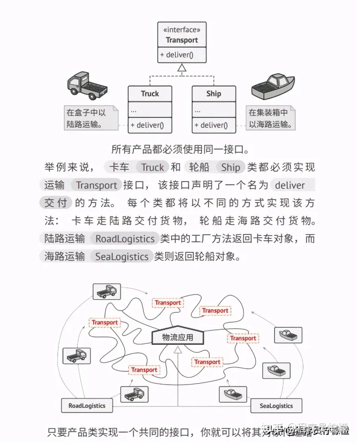

# 图解 23 种设计模式
自从上次回答了关于代码质量的问题，我就在思考如何写出高质量代码，我们可以从两方面下手：

1.  遵循优秀代码规范
2.  借鉴成熟设计模式

关于代码规范可以看我这个回答，我分享了 **烂代码 VS 好代码** 该有的样子：

[你见过最烂的代码长什么样子？99 赞同 · 1 评论回答


(https://www.zhihu.com/question/265453795/answer/1717172939)

**今天我们来聊聊设计模式，并且分享一份开源的设计模式电子书。**

## 什么是设计模式

**设计**模式能帮助你解决软件设计中经常出现的问题。 但是， 你不能像使用现成的函数或程序库那样， 拿来某个模式就将其套用到自己的程序中。 模式并不是一段特定的代码， 而是用于解决特定问题的一般性概念。

## 为什么需要了解设计模式

**了解模式能帮助你轻松应对面试和考核。** 几乎所有关于编程的工作面试和考核中都会有关于模式的问题。 了解这些知识能够帮助你发现更广泛的工作机会， 或者实现升职加薪的工作目标。

**了解模式可扩展你的编程工具箱。** 模式能让你对已有的解决方案进行自定义， 而不用完全自行开发。 代码中的错误将更少， 因为你使用的是经过证明的标准解决方案， 它考虑了所有隐藏的问题。

**了解模式让你能够更好地与同事沟通。** 你只需将模式的名称告诉给程序员， 而不需要长篇累牍地解释自己那绝妙的设计思想以及其中各个类的作用。 不费吹灰之力就能搞定同事之间的沟通。

这么说吧，**设计模式玩得炉火纯青，写出的代码就更优雅，阅读起来也会更加舒服，可维护性、可扩展性就更强**。

说到这，我确信大家已经了解设计模式的重要性了！那该怎么学好呢？

你可以看书学习，比如《大话设计模式》就比较通俗易懂的讲解了设计模式，适合初学者。

另外，线上学习资源的话， 

[@程序员柠檬](https://www.zhihu.com/people/5d04cc04c7454c02e398bdeba909143b)

 推荐一个学习网站：Refactoring Guru。

> 网址：[https://refactoring.guru](https://link.zhihu.com/?target=https%3A//refactoring.guru)


  

我们先从网站上提供的设计模式目录来看下，这本电子书最难能可贵的地方是把设计模式用清晰直观的图片展示出来，读起来就和连环画一样，轻轻松松学会设计模式！

  


  

具体到每个设计模式部分的讲解，也是非常用心，首先会用示意图展示设计模式的框架，比如下面的这个「工厂模式」这图片的质量就非常的高，接着会从问题的角度引入设计模式的应用，然后用介绍的设计模式解决遇到的问题，这种学以致用的方式，学期起来非常有意思！

  


  

  



  

整本书有非常完善的配套的代码示例，且都是清晰明了的代码结构，比如下面这个Java版本的代码示例：

```text
public class WindowsButton implements Button {
    JPanel panel = new JPanel();
    JFrame frame = new JFrame();
    JButton button;

    public void render() {
        frame.setDefaultCloseOperation(JFrame.EXIT_ON_CLOSE);
        JLabel label = new JLabel("Hello World!");
        label.setOpaque(true);
        label.setBackground(new Color(235, 233, 126));
        label.setFont(new Font("Dialog", Font.BOLD, 44));
        label.setHorizontalAlignment(SwingConstants.CENTER);
        panel.setLayout(new FlowLayout(FlowLayout.CENTER));
        frame.getContentPane().add(panel);
        panel.add(label);
        onClick();
        panel.add(button);

        frame.setSize(320, 200);
        frame.setVisible(true);
        onClick();
    }

    public void onClick() {
        button = new JButton("Exit");
        button.addActionListener(new ActionListener() {
            public void actionPerformed(ActionEvent e) {
                frame.setVisible(false);
                System.exit(0);
            }
        });
    }
}
```

不用担心看不懂Java代码，因为示例代码支持的语言包括： `Java、 C#、 C++、 Go、 PHP、 Python、 Ruby、 Swift 和 TypeScript` 这些语言都有支持。

  


  

  
这种**图文并茂 + 代码示例**的学习方式非常适合学习吸收，不过，这个平台上的 PDF 是需要收费的，我是非常建议大家为知识付费，学到的知识远超这个价格。

如果你是学生党，不想花钱买这份资料，我也给大家收集了一套开源免费的《重学设计模式》，这份学习资料是京东架构师「小傅哥」编写的开源电子书，截取一部分内容供大家预览下。

  


  

  


  

  
里面有不少图文都参照了 Refactoring Guru 这个网站，但也加入了作者自己的思考和理解，读起来也更接地气一点。按照作者说的：

> 很高兴你能拿到这本书，如果你能坚持看完并按照书中的例⼦进行实践，那么在编程开发的世界里，就⼜多了⼀个可以写出良好代码的⼈，同时也为架构师培养储备了⼀个⼈才。

**如果大家对这份免费开源 PDF 感兴趣的话，可以在下面自取：**

2022.06.24更新

**有同学反馈说失效了，我重新更新了链接**

链接: [https://pan.baidu.com/s/1TP7z5uUVrdGf6LMZDk7nHA](https://link.zhihu.com/?target=https%3A//pan.baidu.com/s/1TP7z5uUVrdGf6LMZDk7nHA) 提取码: ht5u