# 图解23种设计模式，不信你学不会
### **一、单一职责原则**

就一个类而言，应该仅有一个引起它变化的原因。

如果一个类承担的职责过多，就等于把这些职责耦合在一起，一个职责的变化可能会削弱或者抑制这个类完成其他职责的能力。这种耦合会导致脆弱他的设计，当变化发生时，设计会遭受到意想不到的破坏；软件设计真正要做的许多内容就是发现职责并把那些职责相互分离。

### **二、开放-封闭原则**

软件实体应该可以扩展，但不可修改。该原则是面向对象设计的核心所在，遵循这个原则可以带来面向对象技术所声称的可维护、可扩展、可复用、灵活性好。

设计人员必须对于他设计的模块应该对哪种变化封闭做出选择，必须先猜测出最有可能发生的变化种类，然后构造抽象来隔离那些变化。最初编写程序时假设变化不会发生，当变化发生时，就创建抽象来隔离以后发生的同类变化，拒绝不成熟的抽象。

### **三、里氏代换原则**

子类型必须能够替换掉它们的父类型。由于子类型的可替换性才使得使用父类类型的模块在无需修改的情况下就可以扩展。

### **四、依赖倒转原则**

高层模块不应该依赖低层模块，两个都应该依赖抽象；抽象不应该依赖细节，细节应该依赖抽象。

要针对接口编程，不要针对实现编程。该原则可以说是面向对象设计的标志，编写时考虑的是如何对抽象编程而不是针对细节编程，即程序中所有的依赖关系都是终止于抽象类或者接口。

### **五、迪迷特原则（最少知识原则）**

如果两个类不必彼此直接通信，那么这两个类就不应当发生直接的相互作用；如果其中一个类需要调用另一个类的某一个方法的话，可以通过第三者转发这个调用。

该原则其根本思想，是强调了类之间的松耦合；类之间的耦合越弱，越利于复用，一个处在弱耦合的类被修改，不会对有关系的类造成波及。在类的结构设计上，每一个类都应当尽量降低成员的访问权限。

### **六、合成/聚合复用原则**

尽量使用合成/聚合，尽量不要使用类继承。

聚合表示一种弱的“拥有”关系，体现的是A对象可以包含B对象，但B对象不是A对象的一部分；合成则是一种强的“拥有”关系，体现了严格的部分和整体的关系，部分和整体的生命周期一样。

优先使用对象的合成/聚合将有助于你保持每个类被封装，并被击中在单个任务上，这样类和类继承层次会保持较小规模，并且不太可能增长为不可控制的庞然大物。

### **七、UML例图**

‘+’表示public，‘-’表示private，‘#’表示protected；

接口顶端有《interface》显示，只有两行；同时另一个表示方法为棒棒糖表示法；

聚合表示一种弱的’拥有’关系，体现的是A对象可以包含B对象，但B对象不是A对象的一部分；

合成是一种强的’拥有’关系，体现了严格的部分和整体的关系，部分和整体的生命周期一样；

在UML类图中，常见的有以下几种关系: 泛化（Generalization）, 实现（Realization），关联（Association)，聚合（Aggregation），组合(Composition)，依赖(Dependency)

### **1\. 泛化（Generalization）**

【泛化关系】：是一种继承关系，表示一般与特殊的关系，它指定了子类如何特化父类的所有特征和行为。例如：老虎是动物的一种，即有老虎的特性也有动物的共性。

【箭头指向】：带三角箭头的实线，箭头指向父类

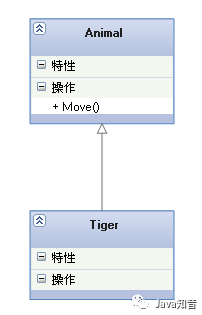

### **2\. 实现（Realization）**

【实现关系】：是一种类与接口的关系，表示类是接口所有特征和行为的实现.

【箭头指向】：带三角箭头的虚线，箭头指向接口

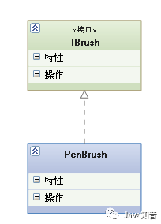

### **3\. 关联（Association)**

【关联关系】：是一种拥有的关系，它使一个类知道另一个类的属性和方法；如：老师与学生，丈夫与妻子关联可以是双向的，也可以是单向的。双向的关联可以有两个箭头或者没有箭头，单向的关联有一个箭头。

【代码体现】：成员变量

【箭头及指向】：带普通箭头的实心线，指向被拥有者

上图中，老师与学生是双向关联，老师有多名学生，学生也可能有多名老师。但学生与某课程间的关系为单向关联，一名学生可能要上多门课程，课程是个抽象的东西他不拥有学生。

下图为自身关联：

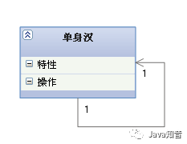

### **4\. 聚合（Aggregation）**

【聚合关系】：是整体与部分的关系，且部分可以离开整体而单独存在。如车和轮胎是整体和部分的关系，轮胎离开车仍然可以存在。

聚合关系是关联关系的一种，是强的关联关系；关联和聚合在语法上无法区分，必须考察具体的逻辑关系。

【代码体现】：成员变量

【箭头及指向】：带空心菱形的实心线，菱形指向整体

### **5\. 组合(Composition)**

【组合关系】：是整体与部分的关系，但部分不能离开整体而单独存在。如公司和部门是整体和部分的关系，没有公司就不存在部门。

组合关系是关联关系的一种，是比聚合关系还要强的关系，它要求普通的聚合关系中代表整体的对象负责代表部分的对象的生命周期。

【代码体现】：成员变量

【箭头及指向】：带实心菱形的实线，菱形指向整体

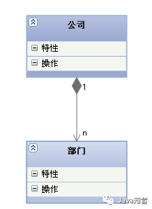

### **6\. 依赖(Dependency)**

【依赖关系】：是一种使用的关系，即一个类的实现需要另一个类的协助，所以要尽量不使用双向的互相依赖.

【代码表现】：局部变量、方法的参数或者对静态方法的调用

【箭头及指向】：带箭头的虚线，指向被使用者

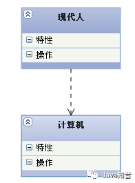

各种关系的强弱顺序：

> 泛化 = 实现 > 组合 > 聚合 > 关联 > 依赖

下面这张UML图，比较形象地展示了各种类图关系：

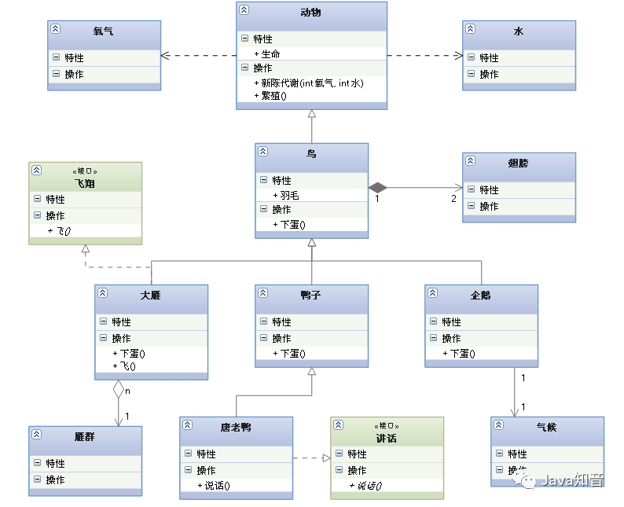

## 创建型

### **1\. Factory Method（工厂方法）**

**意图：**

定义一个用于创建对象的接口，让子类决定实例化哪一个类。Factory Method 使一个类的实例化延迟到其子类。

**适用性：**

当一个类不知道它所必须创建的对象的类的时候。

当一个类希望由它的子类来指定它所创建的对象的时候。

当类将创建对象的职责委托给多个帮助子类中的某一个，并且你希望将哪一个帮助子类是代理者这一信息局部化的时候。

详解：[设计模式是什么鬼（工厂方法）](https://link.zhihu.com/?target=http%3A//mp.weixin.qq.com/s%3F__biz%3DMzI4Njc5NjM1NQ%3D%3D%26mid%3D2247487170%26idx%3D2%26sn%3D34b135090c064c1ca202d629a4beab52%26chksm%3Debd631eedca1b8f85e444f7544c2cbe696b253fe3916f17dbcfbab49b6b74653126c230fdc39%26scene%3D21%23wechat_redirect)

### **2\. Abstract Factory（抽象工厂）**

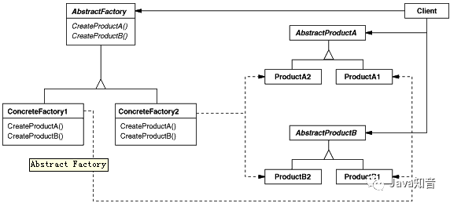

**意图：**

提供一个创建一系列相关或相互依赖对象的接口，而无需指定它们具体的类。

**适用性：**

一个系统要独立于它的产品的创建、组合和表示时。

一个系统要由多个产品系列中的一个来配置时。

当你要强调一系列相关的产品对象的设计以便进行联合使用时。

当你提供一个产品类库，而只想显示它们的接口而不是实现时。

详解：[设计模式是什么鬼（抽象工厂）](https://link.zhihu.com/?target=http%3A//mp.weixin.qq.com/s%3F__biz%3DMzI4Njc5NjM1NQ%3D%3D%26mid%3D2247487234%26idx%3D2%26sn%3D1dca994fb989ca55ec311cae187805f2%26chksm%3Debd6302edca1b938f0b8107d129652d9bc2e1e72d37ce1d6dfd188294a93a62cdbec5ddd91bb%26scene%3D21%23wechat_redirect)

### **3\. Builder（建造者）**

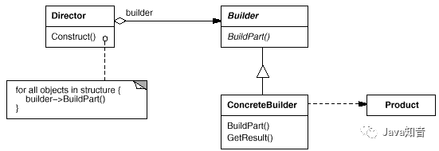

**意图：**

将一个复杂对象的构建与它的表示分离，使得同样的构建过程可以创建不同的表示。

**适用性：**

当创建复杂对象的算法应该独立于该对象的组成部分以及它们的装配方式时。

当构造过程必须允许被构造的对象有不同的表示时。

详解：[设计模式是什么鬼（建造者）](https://link.zhihu.com/?target=http%3A//mp.weixin.qq.com/s%3F__biz%3DMzI4Njc5NjM1NQ%3D%3D%26mid%3D2247487258%26idx%3D2%26sn%3Dcee8a48b247ec1fb2fb1a45396c0a04e%26chksm%3Debd63036dca1b920246061b0287c6f29040a338c46094c8b8eeff03ea068de03180fa48aa2b2%26scene%3D21%23wechat_redirect)

### **4\. Prototype（原型）**

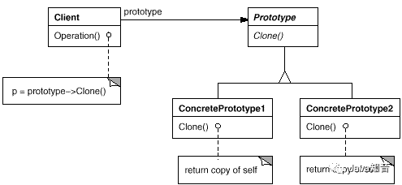

**意图：**

用原型实例指定创建对象的种类，并且通过拷贝这些原型创建新的对象。

**适用性：**

当要实例化的类是在运行时刻指定时，例如，通过动态装载；或者

为了避免创建一个与产品类层次平行的工厂类层次时；或者

当一个类的实例只能有几个不同状态组合中的一种时。建立相应数目的原型并克隆它们可能比每次用合适的状态手工实例化该类更方便一些。

详解：[设计模式是什么鬼（原型）](https://link.zhihu.com/?target=http%3A//mp.weixin.qq.com/s%3F__biz%3DMzI4Njc5NjM1NQ%3D%3D%26mid%3D2247485830%26idx%3D1%26sn%3Da3164e131d4ed08cc6cfcdaec4425ff4%26chksm%3Debd636aadca1bfbcd1df059f9795350157c600f37238ba2f334e03064e25e8359b0acfc177b4%26scene%3D21%23wechat_redirect)

### **5\. Singleton（单例）**

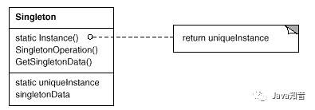

**意图：**

保证一个类仅有一个实例，并提供一个访问它的全局访问点。

**适用性：**

当类只能有一个实例而且客户可以从一个众所周知的访问点访问它时。

当这个唯一实例应该是通过子类化可扩展的，并且客户应该无需更改代码就能使用一个扩展的实例时。

详解：[设计模式是什么鬼（单例）](https://link.zhihu.com/?target=http%3A//mp.weixin.qq.com/s%3F__biz%3DMzI4Njc5NjM1NQ%3D%3D%26mid%3D2247485826%26idx%3D2%26sn%3De21d6188ea07a992f1eb9a6671ae7485%26chksm%3Debd636aedca1bfb8ff0ad69343ab40e87cd65ec41e2dfc54d761e97e9058effe6bd2eac28486%26scene%3D21%23wechat_redirect)

## 结构型

### **6\. Adapter Class/Object（适配器）**

**意图：**

将一个类的接口转换成客户希望的另外一个接口。Adapter 模式使得原本由于接口不兼容而不能一起工作的那些类可以一起工作。

**适用性：**

你想使用一个已经存在的类，而它的接口不符合你的需求。

你想创建一个可以复用的类，该类可以与其他不相关的类或不可预见的类（即那些接口可能不一定兼容的类）协同工作。

（仅适用于对象Adapter ）你想使用一些已经存在的子类，但是不可能对每一个都进行子类化以匹配它们的接口。对象适配器可以适配它的父类接口。

详解：[设计模式是什么鬼（适配器）](https://link.zhihu.com/?target=http%3A//mp.weixin.qq.com/s%3F__biz%3DMzI4Njc5NjM1NQ%3D%3D%26mid%3D2247485849%26idx%3D2%26sn%3D79922e3fe8278d01e3fab1870ed824bc%26chksm%3Debd636b5dca1bfa3c83c3d2d740e25553bc1ba686b2ea6de46acc14d9ea547eb636e24ac7db0%26scene%3D21%23wechat_redirect)

### **7\. Bridge（桥接）**

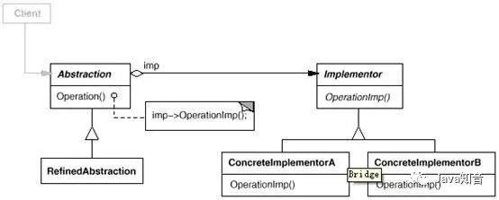

**意图：**

将抽象部分与它的实现部分分离，使它们都可以独立地变化。

**适用性：**

你不希望在抽象和它的实现部分之间有一个固定的绑定关系。例如这种情况可能是因为，在程序运行时刻实现部分应可以被选择或者切换。

类的抽象以及它的实现都应该可以通过生成子类的方法加以扩充。这时Bridge 模式使你可以对不同的抽象接口和实现部分进行组合，并分别对它们进行扩充。

对一个抽象的实现部分的修改应对客户不产生影响，即客户的代码不必重新编译。

（C++）你想对客户完全隐藏抽象的实现部分。在C++中，类的表示在类接口中是可见的。

有许多类要生成。这样一种类层次结构说明你必须将一个对象分解成两个部分。Rumbaugh 称这种类层次结构为“嵌套的普化”（nested generalizations ）。

你想在多个对象间共享实现（可能使用引用计数），但同时要求客户并不知道这一点。一个简单的例子便是Coplien 的String 类\[ Cop92 \]，在这个类中多个对象可以共享同一个字符串表示（StringRep ）。

详解：[设计模式是什么鬼（桥接）](https://link.zhihu.com/?target=http%3A//mp.weixin.qq.com/s%3F__biz%3DMzI4Njc5NjM1NQ%3D%3D%26mid%3D2247487099%26idx%3D2%26sn%3D457440878204cf39ade08d1643aa6375%26chksm%3Debd63157dca1b841e4a09c32e7ed7bd28988cc54d08d4e03eb7bbc25dc50c1acd8938fae155c%26scene%3D21%23wechat_redirect)

### **8\. Composite（组合）**

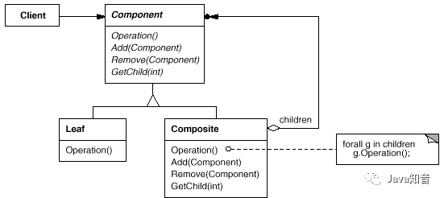

**意图：**

将对象组合成树形结构以表示“部分-整体”的层次结构。C o m p o s i t e 使得用户对单个对象和组合对象的使用具有一致性。

**适用性：**

你想表示对象的部分-整体层次结构。

你希望用户忽略组合对象与单个对象的不同，用户将统一地使用组合结构中的所有对象。

详解：[设计模式是什么鬼（组合）](https://link.zhihu.com/?target=http%3A//mp.weixin.qq.com/s%3F__biz%3DMzI4Njc5NjM1NQ%3D%3D%26mid%3D2247486525%26idx%3D2%26sn%3Da2059bcf272a82f5a98cbd9f22349a96%26chksm%3Debd63311dca1ba071022d396a12eca74d58be8164713fe90f42aa1a7376db77bd6d97755bde8%26scene%3D21%23wechat_redirect)

### **9\. Decorator（装饰）**

**意图：**

动态地给一个对象添加一些额外的职责。就增加功能来说，Decorator 模式相比生成子类更为灵活。

**适用性：**

在不影响其他对象的情况下，以动态、透明的方式给单个对象添加职责。

处理那些可以撤消的职责。

当不能采用生成子类的方法进行扩充时。一种情况是，可能有大量独立的扩展，为支持每一种组合将产生大量的子类，使得子类数目呈爆炸性增长。另一种情况可能是因为类定义被隐藏，或类定义不能用于生成子类。

详解：[设计模式是什么鬼（装饰）](https://link.zhihu.com/?target=http%3A//mp.weixin.qq.com/s%3F__biz%3DMzI4Njc5NjM1NQ%3D%3D%26mid%3D2247486377%26idx%3D2%26sn%3De88370d32c36b19ac89189341cbaf03b%26chksm%3Debd63485dca1bd93fd46ce901b8ed5adaa0f1f5db15b8a19902bef66a05bd38ed420e26f7f5e%26scene%3D21%23wechat_redirect)

### **10\. Facade（外观）**

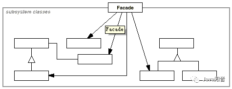

**意图：**

为子系统中的一组接口提供一个一致的界面，Facade模式定义了一个高层接口，这个接口使得这一子系统更加容易使用。

**适用性：**

当你要为一个复杂子系统提供一个简单接口时。子系统往往因为不断演化而变得越来越复杂。大多数模式使用时都会产生更多更小的类。这使得子系统更具可重用性，也更容易对子系统进行定制，但这也给那些不需要定制子系统的用户带来一些使用上的困难。Facade 可以提供一个简单的缺省视图，这一视图对大多数用户来说已经足够，而那些需要更多的可定制性的用户可以越过facade层。

客户程序与抽象类的实现部分之间存在着很大的依赖性。引入facade 将这个子系统与客户以及其他的子系统分离，可以提高子系统的独立性和可移植性。

当你需要构建一个层次结构的子系统时，使用facade模式定义子系统中每层的入口点。如果子系统之间是相互依赖的，你可以让它们仅通过facade进行通讯，从而简化了它们之间的依赖关系。

详解：[设计模式是什么鬼（门面）](https://link.zhihu.com/?target=http%3A//mp.weixin.qq.com/s%3F__biz%3DMzI4Njc5NjM1NQ%3D%3D%26mid%3D2247486253%26idx%3D2%26sn%3D60b15886f8230ee17067d48d8a273329%26chksm%3Debd63401dca1bd17a26acf0f139f01feebde6071646bfad60c2ca2773fd1f593955aa2efe992%26scene%3D21%23wechat_redirect)

### **11\. Flyweight（享元）**

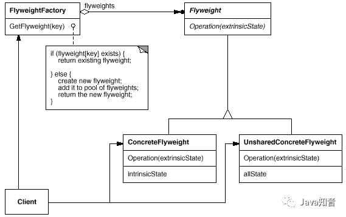

**意图：**

运用共享技术有效地支持大量细粒度的对象。

**适用性：**

一个应用程序使用了大量的对象。

完全由于使用大量的对象，造成很大的存储开销。

对象的大多数状态都可变为外部状态。

如果删除对象的外部状态，那么可以用相对较少的共享对象取代很多组对象。

应用程序不依赖于对象标识。由于Flyweight 对象可以被共享，对于概念上明显有别的对象，标识测试将返回真值。

详解：[设计模式是什么鬼（享元）](https://link.zhihu.com/?target=http%3A//mp.weixin.qq.com/s%3F__biz%3DMzI4Njc5NjM1NQ%3D%3D%26mid%3D2247486986%26idx%3D2%26sn%3D0956b282423ac82a64bad9d4b75bd63d%26chksm%3Debd63126dca1b830bdb1464ec0d2957a63e19956e657673af192d514088a7bef569741656d42%26scene%3D21%23wechat_redirect)

### **12\. Proxy（代理）**

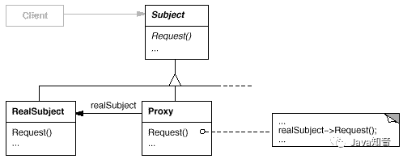

**意图：**

为其他对象提供一种代理以控制对这个对象的访问。

**适用性：**

在需要用比较通用和复杂的对象指针代替简单的指针的时候，使用Proxy模式。下面是一 些可以使用Proxy 模式常见情况：

*   远程代理（Remote Proxy ）为一个对象在不同的地址空间提供局部代表。NEXTSTEP\[Add94\] 使用NXProxy 类实现了这一目的。Coplien\[Cop92\] 称这种代理为“大使” （Ambassador ）。
*   虚代理（Virtual Proxy ）根据需要创建开销很大的对象。在动机一节描述的ImageProxy 就是这样一种代理的例子。
*   保护代理（Protection Proxy ）控制对原始对象的访问。保护代理用于对象应该有不同 的访问权限的时候。例如，在Choices 操作系统\[ CIRM93\]中KemelProxies为操作系统对象提供 了访问保护。
*   智能指引（Smart Reference ）取代了简单的指针，它在访问对象时执行一些附加操作。它的典型用途包括：

对指向实际对象的引用计数，这样当该对象没有引用时，可以自动释放它(也称为SmartPointers\[Ede92 \] )。

当第一次引用一个持久对象时，将它装入内存。

在访问一个实际对象前，检查是否已经锁定了它，以确保其他对象不能改变它。

详解：[设计模式是什么鬼（代理）](https://link.zhihu.com/?target=http%3A//mp.weixin.qq.com/s%3F__biz%3DMzI4Njc5NjM1NQ%3D%3D%26mid%3D2247487054%26idx%3D2%26sn%3D489695986c038525e25c017c217b72fb%26chksm%3Debd63162dca1b874edcaa30680e1da4d3a02c9b0011cb5c60c22d2b9ebea9169022813810bd5%26scene%3D21%23wechat_redirect)

## 行为型

### **13\. Interpreter（解释器）**

**意图：**

给定一个语言，定义它的文法的一种表示，并定义一个解释器，这个解释器使用该表示来解释语言中的句子。

**适用性：**

当有一个语言需要解释执行, 并且你可将该语言中的句子表示为一个抽象语法树时，可使用解释器模式。而当存在以下情况时该模式效果最好：

该文法简单对于复杂的文法, 文法的类层次变得庞大而无法管理。此时语法分析程序生成器这样的工具是更好的选择。它们无需构建抽象语法树即可解释表达式, 这样可以节省空间而且还可能节省时间。

效率不是一个关键问题最高效的解释器通常不是通过直接解释语法分析树实现的, 而是首先将它们转换成另一种形式。例如，正则表达式通常被转换成状态机。但即使在这种情况下, 转换器仍可用解释器模式实现, 该模式仍是有用的。

详解：[设计模式是什么鬼（解释器）](https://link.zhihu.com/?target=http%3A//mp.weixin.qq.com/s%3F__biz%3DMzI4Njc5NjM1NQ%3D%3D%26mid%3D2247487345%26idx%3D2%26sn%3D1ee3aa645b265c55de74a1d2567c7e89%26chksm%3Debd6305ddca1b94b7ac2b713c5d439c031765e24315653ae2f728a3de3f10d03ba554c1ab872%26scene%3D21%23wechat_redirect)

### **14\. Template Method（模板方法）**

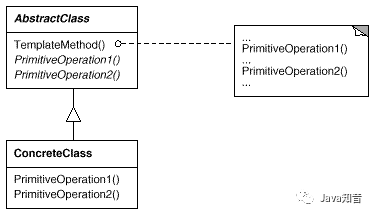

**意图：**

定义一个操作中的算法的骨架，而将一些步骤延迟到子类中。TemplateMethod 使得子类可以不改变一个算法的结构即可重定义该算法的某些特定步骤。

**适用性：**

一次性实现一个算法的不变的部分，并将可变的行为留给子类来实现。

各子类中公共的行为应被提取出来并集中到一个公共父类中以避免代码重复。这是Opdyke 和Johnson 所描述过的“重分解以一般化”的一个很好的例子\[ OJ93 \]。首先识别现有代码中的不同之处，并且将不同之处分离为新的操作。最后，用一个调用这些新的操作的模板方法来替换这些不同的代码。

控制子类扩展。模板方法只在特定点调用“hook ”操作（参见效果一节），这样就只允许在这些点进行扩展。

详解：[设计模式是什么鬼（模板方法）](https://link.zhihu.com/?target=http%3A//mp.weixin.qq.com/s%3F__biz%3DMzI4Njc5NjM1NQ%3D%3D%26mid%3D2247486148%26idx%3D1%26sn%3D601fa38aee0aa27137341ce9a2624fec%26chksm%3Debd635e8dca1bcfe8da575478244414d13620010cd0d9823f423af8d2457ad1bb65a17d6a940%26scene%3D21%23wechat_redirect)

### **15\. Chain of Responsibility（责任链）**

**意图：**

使多个对象都有机会处理请求，从而避免请求的发送者和接收者之间的耦合关系。将这些对象连成一条链，并沿着这条链传递该请求，直到有一个对象处理它为止。

**适用性：**

有多个的对象可以处理一个请求，哪个对象处理该请求运行时刻自动确定。

你想在不明确指定接收者的情况下，向多个对象中的一个提交一个请求。

可处理一个请求的对象集合应被动态指定。

详解：[设计模式是什么鬼（责任链）](https://link.zhihu.com/?target=http%3A//mp.weixin.qq.com/s%3F__biz%3DMzI4Njc5NjM1NQ%3D%3D%26mid%3D2247486851%26idx%3D2%26sn%3De5eb6b74336f0148e8c3e3043e613e87%26chksm%3Debd632afdca1bbb9d8a54555ed67e248fed58ebc1991cae9961c4d22e226b04369295cc49877%26scene%3D21%23wechat_redirect)

### **16\. Command（命令）**

**意图：**

将一个请求封装为一个对象，从而使你可用不同的请求对客户进行参数化；对请求排队或记录请求日志，以及支持可撤消的操作。

**适用性：**

抽象出待执行的动作以参数化某对象，你可用过程语言中的回调（call back）函数表达这种参数化机制。所谓回调函数是指函数先在某处注册，而它将在稍后某个需要的时候被调用。Command 模式是回调机制的一个面向对象的替代品。

在不同的时刻指定、排列和执行请求。一个Command对象可以有一个与初始请求无关的生存期。如果一个请求的接收者可用一种与地址空间无关的方式表达，那么就可将负责该请求的命令对象传送给另一个不同的进程并在那儿实现该请求。

支持取消操作。Command的Excute 操作可在实施操作前将状态存储起来，在取消操作时这个状态用来消除该操作的影响。Command 接口必须添加一个Unexecute操作，该操作取消上一次Execute调用的效果。执行的命令被存储在一个历史列表中。可通过向后和向前遍历这一列表并分别调用Unexecute和Execute来实现重数不限的“取消”和“重做”。

支持修改日志，这样当系统崩溃时，这些修改可以被重做一遍。在Command接口中添加装载操作和存储操作，可以用来保持变动的一个一致的修改日志。从崩溃中恢复的过程包括从磁盘中重新读入记录下来的命令并用Execute操作重新执行它们。

用构建在原语操作上的高层操作构造一个系统。这样一种结构在支持事务( transaction)的信息系统中很常见。一个事务封装了对数据的一组变动。Command模式提供了对事务进行建模的方法。Command有一个公共的接口，使得你可以用同一种方式调用所有的事务。同时使用该模式也易于添加新事务以扩展系统。

详解：[设计模式是什么鬼（命令模式）](https://link.zhihu.com/?target=http%3A//mp.weixin.qq.com/s%3F__biz%3DMzI4Njc5NjM1NQ%3D%3D%26mid%3D2247487282%26idx%3D2%26sn%3D875f2c0a1ea711dca843c80c7bb6f34a%26chksm%3Debd6301edca1b908026c18897d07dbe426cb80bf7788f2d1f8b28e6d0ade726d68d99cfc7739%26scene%3D21%23wechat_redirect)

### **17\. Iterator（迭代器）**

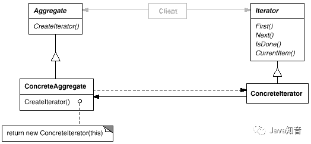

**意图：**

提供一种方法顺序访问一个聚合对象中各个元素, 而又不需暴露该对象的内部表示。

**适用性：**

访问一个聚合对象的内容而无需暴露它的内部表示。

支持对聚合对象的多种遍历。

为遍历不同的聚合结构提供一个统一的接口(即, 支持多态迭代)。

详解：[设计模式是什么鬼（迭代器）](https://link.zhihu.com/?target=http%3A//mp.weixin.qq.com/s%3F__biz%3DMzI4Njc5NjM1NQ%3D%3D%26mid%3D2247486776%26idx%3D2%26sn%3D0f4773ca76d325e51bb358325d312642%26chksm%3Debd63214dca1bb02dc73c0c58f334076226d13e00499c42cad5ff79422c29af44b28e827e77c%26scene%3D21%23wechat_redirect)

### **18\. Mediator（中介者）**

**意图：**

用一个中介对象来封装一系列的对象交互。中介者使各对象不需要显式地相互引用，从而使其耦合松散，而且可以独立地改变它们之间的交互。

**适用性：**

一组对象以定义良好但是复杂的方式进行通信。产生的相互依赖关系结构混乱且难以理解。

一个对象引用其他很多对象并且直接与这些对象通信,导致难以复用该对象。

想定制一个分布在多个类中的行为，而又不想生成太多的子类。

详解：[设计模式是什么鬼（中介）](https://link.zhihu.com/?target=http%3A//mp.weixin.qq.com/s%3F__biz%3DMzI4Njc5NjM1NQ%3D%3D%26mid%3D2247486616%26idx%3D1%26sn%3De18c5f52fc01187b56a7f579f51878a0%26chksm%3Debd633b4dca1baa21a87516923460a0a598bf35114fcbd4c73e1f42ff5a7693adab540c401a9%26scene%3D21%23wechat_redirect)

### **19\. Memento（备忘录）**

**意图：**

在不破坏封装性的前提下，捕获一个对象的内部状态，并在该对象之外保存这个状态。这样以后就可将该对象恢复到原先保存的状态。

**适用性：**

必须保存一个对象在某一个时刻的(部分)状态, 这样以后需要时它才能恢复到先前的状态。

如果一个用接口来让其它对象直接得到这些状态，将会暴露对象的实现细节并破坏对象的封装性。

详解：[设计模式是什么鬼（备忘录）](https://link.zhihu.com/?target=http%3A//mp.weixin.qq.com/s%3F__biz%3DMzI4Njc5NjM1NQ%3D%3D%26mid%3D2247486709%26idx%3D2%26sn%3Da3cd99b7c0e7f7953bd5bf44cbbccf87%26chksm%3Debd633d9dca1bacf94451863de6982593ac15a11f15611de1d3aba9ada3244b5fda6a1bc093e%26scene%3D21%23wechat_redirect)

### **20\. Observer（观察者）**

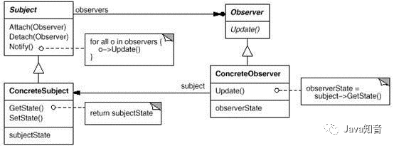

**意图：**

定义对象间的一种一对多的依赖关系,当一个对象的状态发生改变时, 所有依赖于它的对象都得到通知并被自动更新。

**适用性：**

当一个抽象模型有两个方面, 其中一个方面依赖于另一方面。将这二者封装在独立的对象中以使它们可以各自独立地改变和复用。

当对一个对象的改变需要同时改变其它对象, 而不知道具体有多少对象有待改变。

当一个对象必须通知其它对象，而它又不能假定其它对象是谁。换言之, 你不希望这些对象是紧密耦合的。

详解：[设计模式是什么鬼（观察者）](https://link.zhihu.com/?target=https%3A//mp.weixin.qq.com/s%3F__biz%3DMzI4Njc5NjM1NQ%3D%3D%26mid%3D2247486897%26idx%3D2%26sn%3D927e4dd95695163fa250447ea88e12e8%26scene%3D21%23wechat_redirect)

### **21\. State（状态）**

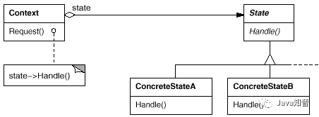

**意图：**

允许一个对象在其内部状态改变时改变它的行为。对象看起来似乎修改了它的类。

**适用性：**

一个对象的行为取决于它的状态, 并且它必须在运行时刻根据状态改变它的行为。

一个操作中含有庞大的多分支的条件语句，且这些分支依赖于该对象的状态。这个状态通常用一个或多个枚举常量表示。通常, 有多个操作包含这一相同的条件结构。State模式将每一个条件分支放入一个独立的类中。这使得你可以根据对象自身的情况将对象的状态作为一个对象，这一对象可以不依赖于其他对象而独立变化。

详解：[设计模式是什么鬼（状态）](https://link.zhihu.com/?target=http%3A//mp.weixin.qq.com/s%3F__biz%3DMzI4Njc5NjM1NQ%3D%3D%26mid%3D2247485989%26idx%3D1%26sn%3D7d6967a19531190fb55085e1db559ec1%26chksm%3Debd63509dca1bc1f710b9df5607a999f68493460e7b610668276009bcd546213500968891f64%26scene%3D21%23wechat_redirect)

### **22\. Strategy（策略）**

**意图：**

定义一系列的算法,把它们一个个封装起来, 并且使它们可相互替换。本模式使得算法可独立于使用它的客户而变化。

**适用性：**

许多相关的类仅仅是行为有异。“策略”提供了一种用多个行为中的一个行为来配置一个类的方法。

需要使用一个算法的不同变体。例如，你可能会定义一些反映不同的空间/时间权衡的算法。当这些变体实现为一个算法的类层次时\[H087\] ,可以使用策略模式。

算法使用客户不应该知道的数据。可使用策略模式以避免暴露复杂的、与算法相关的数据结构。

一个类定义了多种行为, 并且这些行为在这个类的操作中以多个条件语句的形式出现。将相关的条件分支移入它们各自的Strategy类中以代替这些条件语句。

详解：[设计模式是什么鬼（策略）](https://link.zhihu.com/?target=http%3A//mp.weixin.qq.com/s%3F__biz%3DMzI4Njc5NjM1NQ%3D%3D%26mid%3D2247485903%26idx%3D1%26sn%3D172401bccf663455fd90c55aa957db18%26chksm%3Debd636e3dca1bff544c671c9f8de3a6e8d40049ab7cea3d750d03ed00ef6e6c4fae376333de1%26scene%3D21%23wechat_redirect)

### **23\. Visitor（访问者）**

**意图：**

定义一个操作中的算法的骨架，而将一些步骤延迟到子类中。TemplateMethod 使得子类可以不改变一个算法的结构即可重定义该算法的某些特定步骤。

**适用性：**

一次性实现一个算法的不变的部分，并将可变的行为留给子类来实现。

各子类中公共的行为应被提取出来并集中到一个公共父类中以避免代码重复。这是Opdyke和Johnson所描述过的“重分解以一般化”的一个很好的例子\[OJ93\]。首先识别现有代码中的不同之处，并且将不同之处分离为新的操作。最后，用一个调用这些新的操作的模板方法来替换这些不同的代码。

控制子类扩展。模板方法只在特定点调用“hook ”操作（参见效果一节），这样就只允许在这些点进行扩展。

详解：[设计模式是什么鬼（访问者）](https://link.zhihu.com/?target=http%3A//mp.weixin.qq.com/s%3F__biz%3DMzI4Njc5NjM1NQ%3D%3D%26mid%3D2247487316%26idx%3D2%26sn%3D068c3ef1e11722a0220dea7fc2c28dd6%26chksm%3Debd63078dca1b96ed3048bc390c97700cbcfff3c0f18425a862de768ee3489b76b15598b56db%26scene%3D21%23wechat_redirect)