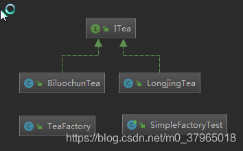
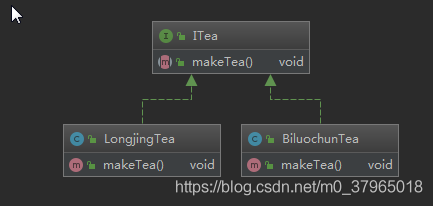
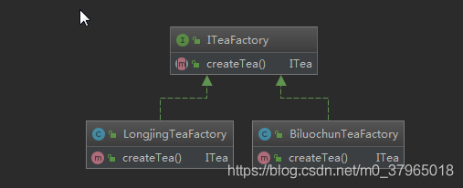
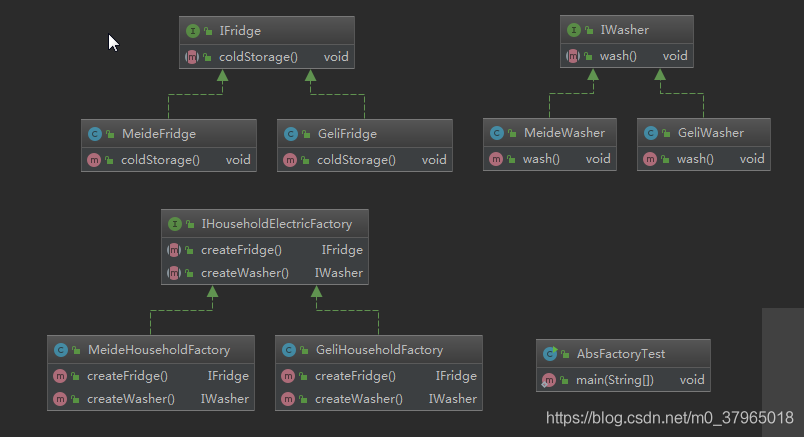

# 工厂模式超详解
### 工厂模式概述

工厂模式的主要解决的问题是，将原来分布在各个地方的对象创建过程单独抽离出来，交给工厂类负责创建。其他地方想要使用对象直接找工厂（即调用工厂的方法）获取对象。

### 工厂模式的三种类型

工厂模式主要有三种类型  
1、简单工厂  
2、工厂方法  
3、抽象工厂

**简单工厂**

拿泡茶为例，茶叶有好多种类，比如龙井、碧螺春、毛尖等。  
首先一个ITea接口：

```java
public interface ITea {

    // 沏茶
    public void makeTea();
}
```

再定义两种类型的茶，西湖龙井和碧螺春：

```java
public class LongjingTea implements ITea {
    @Override
    public void makeTea() {
        System.out.println("西湖龙井");
    }
}

public class BiluochunTea implements ITea{
    @Override
    public void makeTea() {
        System.out.println("碧螺春");
    }
}
```

假如其它有一处代码要使用“茶”这个对象沏一壶茶，有如下代码：

```java
    /**
     *  准备沏一杯茶，根据传入的参数决定不同的茶叶类型
     */
    public ITea prepareTea(String type){
        ITea tea = null;
        if(type.equals("longjing")){
            tea = new LongjingTea();
        }else if(type.equals("biluochun")){
            tea = new BiluochunTea();
        }
        if(tea != null){
            tea.makeTea();
        }
        return tea;
    }
```

接下来，我们可以分析下不使用工厂模式的情况：

如果我们的工程中不至一处用了类似这段代码逻辑，那增加一种茶叶的类型（比如毛尖）就需要修改多处代码，不利于维护。

因此，可以考虑，将创建茶叶对象的逻辑抽离出来，单独放到一个类中，这个类便是工厂类（专门生产茶叶的工厂）。这样维护起来便方便很多，客户端代码也无需知道对象创建的具体细节，只需要从工厂类中获取对象即可。

简单工厂类实现如下：

```java
public class TeaFactory {

    public ITea createTea(String type){
        ITea tea = null;
        if(type.equals("longjing")){
            tea = new LongjingTea();
        }else if(type.equals("biluochun")){
            tea = new BiluochunTea();
        }
        if(tea != null){
            tea.makeTea();
        }
        return tea;
    }
}
```

客户端代码要使用茶对象，需要从工厂中获取：

```java
    public static void main(String[] args) {

        TeaFactory teaFactory = new TeaFactory();
        ITea tea = teaFactory.createTea("longjing");
    }
```

看下类图  
  
**工厂方法模式**

在上面的简单工厂中，如果要创建的产品类型较多，且各个产品创建的过程不尽相同，则一个工厂类职责会变得越来越多，不符合单一职责原则。  
另外简单工厂也不符合开闭原则。要新增一种产品需要修改原来的工厂类。

因此，工厂方法模式中，将生产各种类型的产品的工厂也做了抽象分离。比如，上面例子中的，生产龙井的有专门的龙井工厂，生产碧螺春的有专门的碧螺春工厂。

看代码，接着上面的实例进行改造。首先创建统一的工厂接口：

```java
/**
 * 生产茶叶的统一接口
 */
public interface ITeaFactory {

    // 生产茶叶
    public ITea createTea();
}
```

然后创建两个生产不同类型产品的工厂实现类：

```java
public class LongjingTeaFactory implements ITeaFactory{
    @Override
    public ITea createTea() {
        return new LongjingTea();
    }
}

public class BiluochunTeaFactory implements ITeaFactory{
    @Override
    public ITea createTea() {
        return new BiluochunTea();
    }
}
```

客户端代码：

```java
public class FactoryMethodTest {
    public static void main(String[] args) {
        ITeaFactory factory = new LongjingTeaFactory();
        factory.createTea();

        factory = new BiluochunTeaFactory();
        factory.createTea();
    }
}
```

如果要新增一种茶叶，比如毛尖，只需要新建一个生产毛尖的工厂类实现ITeaFactory即可。可以看到符合开闭原则、单一职责原则。

看下类图  
  
  
工厂方法适用于以下场景：  
1、创建对象需要大量重复的代码。  
2、客户端（应用层）不依赖于产品类实例如何被创建、实现等细节。  
3、一个类通过其子类来指定创建哪个对象。

工厂方法也有缺点：  
1、类的个数容易过多，增加复杂度。  
2、增加了系统的抽象性和理解难度。

**抽象工厂**

举例说明下，有两个工厂，美的、格力。这两个工厂都生产两种产品：冰箱和洗衣机。下面使用抽象工厂模式来描述每个工厂的两种产品的创建过程。

1、首先创建两个产品的接口类：

```java
/**
 * 冰箱
 */
public interface IFridge {

    // 冷藏
    void coldStorage();
}

/**
 * 洗衣机
 */
public interface IWasher {
    void wash();
}
```

2、创建每个工厂的两种产品（总共四种产品）：

美的的冰箱和洗衣机

```java
public class MeideFridge implements IFridge{
    @Override
    public void coldStorage() {
        System.out.println("美的冰箱");
    }
}

public class MeideWasher implements IWasher {
    @Override
    public void wash() {
        System.out.println("美的洗衣机");
    }
}
```

格力的冰箱和洗衣机

```java
public class GeliFridge implements IFridge {
    @Override
    public void coldStorage() {
        System.out.println("格力冰箱");
    }
}

public class GeliWasher implements IWasher{
    @Override
    public void wash() {
        System.out.println("格力洗衣机");
    }
}
```

3、创建抽象工厂接口

家用电器工厂，生产一组产品。

```java
/**
 * 抽象工厂接口，家用电器工厂，生产冰箱和洗衣机
 */
public interface IHouseholdElectricFactory {

    IFridge createFridge();

    IWasher createWasher();
}
```

4、创建具体产品等级的工厂

这里是创建美的和格力的工厂实现类。

```java
public class MeideHouseholdFactory implements IHouseholdElectricFactory{
    @Override
    public IFridge createFridge() {
        return new MeideFridge();
    }

    @Override
    public IWasher createWasher() {
        return new MeideWasher();
    }
}

public class GeliHouseholdFactory implements IHouseholdElectricFactory{
    @Override
    public IFridge createFridge() {
        return new GeliFridge();
    }

    @Override
    public IWasher createWasher() {
        return new GeliWasher();
    }
}
```

5、客户端代码使用

```java
public class AbsFactoryTest {
    public static void main(String[] args) {

        IHouseholdElectricFactory factory = new MeideHouseholdFactory();
        factory.createFridge().coldStorage();
        factory.createWasher().wash();
    }
}
```

最后看下抽象工厂模式的类图：  
