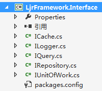

# [项目架构开发：数据访问层之Cache](https://www.cnblogs.com/lanxiaoke/p/6502210.html)

## 数据访问层简单介绍

数据访问层，提供整个项目的数据访问与持久化功能。在分层系统中所有有关数据访问、检索、持久化的任务，最终都将在这一层完成。

来看一个比较经典的数据访问层结构图

大概可以看出如下信息

1、有缓存、日志、异常处理、数据CRUD、查询及数据事务等功能

2、无缝对接如EF、ADO.NET、NH、Dapper等数据访问技术

3、对外只开放接口层，隐藏具体实现，这样就可以解耦业务层与数据访问层

今天斗胆通过一个简单实例来实践一下，如有不妥的地方，欢迎指正

## 创建接口层，定义可以提供的一些服务接口

这里我们一个有5种服务接口，方法的功能就不介绍了，应该都能看懂

缓存接口：ICache.cs
~~~csharp
 public sealed class Cache<T> where T : class
 {
     private readonly static ICache<T> cacheProvider;

     static Cache()
     {
         cacheProvider = ProviderHelper<T>.GetCacheProvider();
     }

     public static IEnumerable<T> Gets(string key)
     {
         return cacheProvider.Gets(key);
     }

     public static T Get(string key)
     {
         return cacheProvider.Get(key);
     }

     public static bool Sets(string key, IEnumerable<T> value, TimeSpan expiresIn)
     {
         return cacheProvider.Sets(key, value, expiresIn);
     }

     public static bool Set(string key, T value, TimeSpan expiresIn)
     {
         return cacheProvider.Set(key, value, expiresIn);
     }

     public static bool Remove(string key)
     {
         return cacheProvider.Remove(key);
     }
 }
~~~
## 缓存服务的实现

因为可能支持多种缓存，所以我实现了Web缓存与Redis缓存，这2中缓存分别在项目初期和后期集群中可能会用到

我们来看HttpRuntimeCache.cs （还有一种Web缓存HttpContext.Cache，不够这种只能在Web应用使用，所以一般不推荐）
~~~csharp
public class HttpRuntimeCache<T> : ICache<T> where T : class
 {
     public HttpRuntimeCache()
     {

     }

     public T Get(string key)
     {
         if (System.Web.HttpRuntime.Cache[key] == null)
         {
             return default(T);
         }

         return System.Web.HttpRuntime.Cache[key] as T;
     }

     public bool Set(string key, T value, TimeSpan expiresIn)
     {
         Set(key, value, expiresIn.Seconds);
         return true;
     }

     public bool Remove(string key)
     {
         System.Web.HttpRuntime.Cache.Remove(key);
         return true;
     }

     private void Set(string key, object value, int absoluteSeconds)
     {
         System.Web.HttpRuntime.Cache.Insert(key, value, null, DateTime.Now.AddSeconds(absoluteSeconds), TimeSpan.FromSeconds(0));
     }
 }
~~~
现在缓存功能已经实现了；大家应该很容易想到怎麼使用了，比如在业务层这样使用

ICache<User>  cache = new HttpRuntimeCache<User>(); 2 var user = cache.Get("key");

其实这样是不对的，因为这样的话接口ICache相当于没什么用处，没有起到应有的作用（隔离具体实现）

如果要换另一种缓存实现（比如redis），那还要在所有使用了 new HttpRuntimeCache<User>() 的地方改正过来

这样的耦合要去掉；有2种方式，通过IOC在实例化的时候依赖注入；另一种就是新建一个基础设施层，业务层依赖于这一层

因为业务层肯定是需要调用一些Utilities、Helper等类型的工具类，这个应该是躲不掉的，再怎么接口隔离也去除不了这点
>这段话意思是说：new HttpRuntimeCache<User>();这句不应该显性调用，应该搞成配置的

## 基础设施层的实现

Cache.cs 
~~~csharp
 public sealed class Cache<T> where T : class
 {
     private readonly static ICache<T> cacheProvider;

     static Cache()
     {
         cacheProvider = ProviderHelper<T>.GetCacheProvider();
     }

     public static IEnumerable<T> Gets(string key)
     {
         return cacheProvider.Gets(key);
     }

     public static T Get(string key)
     {
         return cacheProvider.Get(key);
     }

     public static bool Sets(string key, IEnumerable<T> value, TimeSpan expiresIn)
     {
         return cacheProvider.Sets(key, value, expiresIn);
     }

     public static bool Set(string key, T value, TimeSpan expiresIn)
     {
         return cacheProvider.Set(key, value, expiresIn);
     }

     public static bool Remove(string key)
     {
         return cacheProvider.Remove(key);
     }
 }

~~~
 ProviderHelper.cs 实现如下图

至此，缓存功能实现完毕，我们新建一个测试项目看看结果

~~~csharp
 [TestClass]
 public class CacheTest
 {
     [TestMethod]
     public void Set()
     {
         var user = new LoginUser()
         {
             Id = Guid.NewGuid(), 
             LoginName = "LoginName",
             IsEnabled = 1,
             Password = "mima1987",
             CreateTime = DateTime.Now
         };

         Cache<LoginUser>.Set("UnitTest3.TestMethod1", user, TimeSpan.FromSeconds(10));
         var user2 = Cache<LoginUser>.Get("UnitTest3.TestMethod1");

         Assert.AreEqual(user.Id, user2.Id);
     }
 }
~~~

看来没有什么问题。

## 项目架构开发系列

*   [项目架构开发：数据访问层之Cache](http://www.cnblogs.com/lanxiaoke/p/6502210.html)
*   [项目架构开发：数据访问层之Logger](http://www.cnblogs.com/lanxiaoke/p/6502689.html)
*   [项目架构开发：数据访问层之Repository](http://www.cnblogs.com/lanxiaoke/p/6503022.html)
*   [项目架构开发：数据访问层之Query](http://www.cnblogs.com/lanxiaoke/p/6503333.html)
*   [项目架构开发：数据访问层之UnitOfWork](http://www.cnblogs.com/lanxiaoke/p/6504443.html)