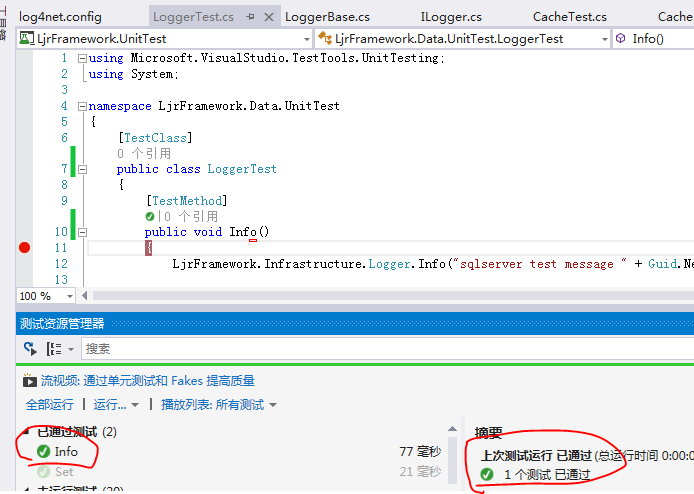

接上文 [项目架构开发：数据访问层之Cache](http://www.cnblogs.com/lanxiaoke/p/6502210.html)

本章我们继续ILogger的开发
ILogger.cs
~~~csharp
 public interface ILogger
 {
     void Info(object message);
     void Info(object message, Exception e);
     void Debug(object message);
     void Debug(object message, Exception e);
     void Warn(object message);
     void Warn(object message, Exception e);
     void Error(object message);
     void Error(object message, Exception e);
     void Fatal(object message);
     void Fatal(object message, Exception e);
 }

~~~
## 日志服务的实现

这里我们引用的是log4net组件，我们来看看具体实现
~~~csharp
LoggerBase.cs

 public class LoggerBase : ILogger
 {
     private ILog logger;

     public LoggerBase()
     {
         logger = LogManager.GetLogger("log4netlogger");
     }

     public void Info(object message)
     {
         logger.Info(message);
     }

     public void Info(object message, Exception e)
     {
         logger.Info(message, e);
     }

     public void Debug(object message)
     {
         logger.Debug(message);
     }

     public void Debug(object message, Exception e)
     {
         logger.Debug(message, e);
     }

     public void Warn(object message)
     {
         logger.Warn(message);
     }

     public void Warn(object message, Exception e)
     {
         logger.Warn(message, e);
     }

     public void Error(object message)
     {
         logger.Error(message);
     }

     public void Error(object message, Exception e)
     {
         logger.Error(message, e);
     }

     public void Fatal(object message)
     {
         logger.Fatal(message);
     }

     public void Fatal(object message, Exception e)
     {
         logger.Fatal(message, e);
     }
 }
~~~
其实log4net可以直接在项目各层调用的，我们这里之所以还要创建一个接口，似乎有过度封装之嫌；

我这么做是有原因的，因为我不想只限于一种日志记录方式，如果以后还有其他组件，或者自己写日志组件

那都可以很方便的扩展了。

再看看log4net.config
~~~xml
<?xml version="1.0" encoding="utf-8" ?>
<configuration>
<configSections>
 <section name="log4net" type="System.Configuration.IgnoreSectionHandler"/>
</configSections>
<appSettings>
</appSettings>
<log4net>

 <!--定义日志的输出媒介，下面定义日志以五种方式输出。也可以下面的按照一种类型或其他类型输出。-->
 <!--None,Fatal,ERROR,WARN,DEBUG,INFO,ALL-->
 <root>
   <level value="all"/>

   <!--文件形式记录日志-->
   <!--<appender-ref ref="LogFileAppender" />-->
 
   <!--控制台控制显示日志-->
   <!--<appender-ref ref="ConsoleAppender" />-->

   <!--启用Access数据库记录日志-->
   <!--<appender-ref ref="AdoNetAppender_Access" />-->

   <!--SqlServer数据库记录日志-->
   <!--<appender-ref ref="AdoNetAppenderSqlServer" />-->
 </root>

 <logger name="log4netlogger">
   <level value="all" />
   <appender-ref ref="AdoNetAppenderSqlServer" />
 </logger>

 <!--定义输出到数据库中，这里举例输出到SqlServer数据库中-->
 <appender name="AdoNetAppenderSqlServer" type="log4net.Appender.AdoNetAppender">
   <bufferSize value="1" />
   <connectionType value="System.Data.SqlClient.SqlConnection, System.Data, Version=2.0.0.0, Culture=Neutral, PublicKeyToken=b77a5c561934e089" />
   <connectionString value="Data Source=JIANRONGLAN-PC\SQLEXPRESS;Initial Catalog=SystemBase;User ID=sa;Password=123456" />
   <commandText value="INSERT INTO Log ([Date],[Thread],[Level],[Logger],[Message],[Exception]) VALUES (@log_date, @thread, @log_level, @logger, @message, @exception)" />
   <filter type="log4net.Filter.LevelRangeFilter">
     <param name="LevelMin" value="INFO" />
     <param name="LevelMax" value="Fatal" />
   </filter>
   <parameter>
     <parameterName value="@log_date" />
     <dbType value="DateTime" />
     <layout type="log4net.Layout.RawTimeStampLayout" />
   </parameter>
   <parameter>
     <parameterName value="@thread" />
     <dbType value="String" />
     <size value="255" />
     <layout type="log4net.Layout.PatternLayout">
       <conversionPattern value="%thread" />
     </layout>
   </parameter>
   <parameter>
     <parameterName value="@log_level" />
     <dbType value="String" />
     <size value="50" />
     <layout type="log4net.Layout.PatternLayout">
       <conversionPattern value="%level" />
     </layout>
   </parameter>
   <parameter>
     <parameterName value="@logger" />
     <dbType value="String" />
     <size value="255" />
     <layout type="log4net.Layout.PatternLayout">
       <conversionPattern value="%logger" />
     </layout>
   </parameter>
   <parameter>
     <parameterName value="@message" />
     <dbType value="String" />
     <size value="4000" />
     <layout type="log4net.Layout.PatternLayout">
       <conversionPattern value="%message" />
     </layout>
   </parameter>
   <parameter>
     <parameterName value="@exception" />
     <dbType value="String" />
     <size value="4000" />
     <layout type="log4net.Layout.ExceptionLayout" />
   </parameter>
 </appender>
 
</log4net>
</configuration>
~~~

## 基础设施层的实现

Logger.cs 代码跟上边的差不多，主要是要实现日志驱动的配置，或许有其他方法，但暂时这么写吧
~~~csharp
 public sealed class Logger
 {
     private readonly static ILogger loggerProvider;

     static Logger()
     {
         loggerProvider = ProviderHelper.GetLoggerProvider();
     }

     public static void Info(object message)
     {
         loggerProvider.Info(message);
     }

     public static void Info(object message, Exception e)
     {
         loggerProvider.Info(message, e);
     }

     public static void Debug(object message)
     {
         loggerProvider.Debug(message);
     }

     public static void Debug(object message, Exception e)
     {
         loggerProvider.Debug(message, e);
     }

     public static void Warn(object message)
     {
         loggerProvider.Warn(message);
     }

     public static void Warn(object message, Exception e)
     {
         loggerProvider.Warn(message, e);
     }

     public static void Error(object message)
     {
         loggerProvider.Error(message);
     }

     public static void Error(object message, Exception e)
     {
         loggerProvider.Error(message, e);
     }

     public static void Fatal(object message)
     {
         loggerProvider.Fatal(message);
     }

     public static void Fatal(object message, Exception e)
     {
         loggerProvider.Fatal(message, e);
     }
 } 
~~~
我们新建测试看看效果

~~~csharp
 [TestClass]
 public class LoggerTest
 {
     [TestMethod]
     public void Info()
     {
         LjrFramework.Infrastructure.Logger.Info("sqlserver test message " + Guid.NewGuid().ToString());

         Assert.AreEqual(true, true);
     }
 }
~~~

查看数据库记录

自此日志功能完成了，比较简单

## 项目架构开发系列

*   [项目架构开发：数据访问层之Cache](http://www.cnblogs.com/lanxiaoke/p/6502210.html)
*   [项目架构开发：数据访问层之Logger](http://www.cnblogs.com/lanxiaoke/p/6502689.html)
*   [项目架构开发：数据访问层之Repository](http://www.cnblogs.com/lanxiaoke/p/6503022.html)
*   [项目架构开发：数据访问层之Query](http://www.cnblogs.com/lanxiaoke/p/6503333.html)
*   [项目架构开发：数据访问层之UnitOfWork](http://www.cnblogs.com/lanxiaoke/p/6504443.html)