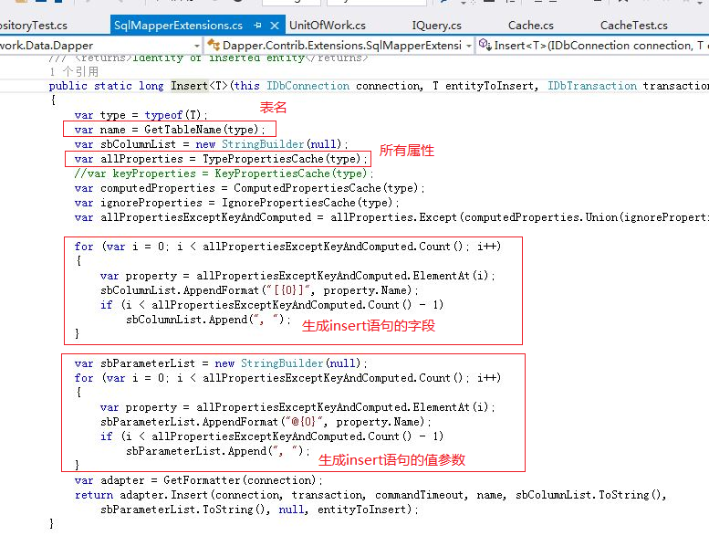

接上文 [项目架构开发：数据访问层之Logger](http://www.cnblogs.com/lanxiaoke/p/6502689.html)

本章我们继续IRepository开发，这个仓储与领域模式里边的仓储有区别，更像一个工具类，也就是有些园友说的“伪仓储”，

这个仓储只实现单表的CURD与Query，都是通过主键ID或拉姆达表达式进行操作的，返回的都是单表的实体或实体集合，

多表的在IQuery接口中再讲；虽然如此，但是如果与**“活动记录”**开发模式搭配的话，会非常合适，可以减少开发的时间

及出错几率，更符合开发人员的类型调用习惯

IRepository.cs
~~~csharp
 public interface IRepository<T> where T : class
 {
     void Add(T entity);
     void AddBatch(IEnumerable<T> entitys);
     void Update(T entity);
     void Delete(T entity);
     void Delete(string Id);
     void Delete(int Id);
     void Delete(Guid Id);
     T Get(string Id);
     T Get(Guid Id);
     T Get(int Id);
     T Get(T entity);
     T Get(Expression<Func<T, bool>> func);
     IEnumerable<T> GetAll();
     IEnumerable<T> GetList(Expression<Func<T, bool>> where = null, Expression<Func<T, bool>> order = null);
     Tuple<int, IEnumerable<T>> GetPage(Page page, Expression<Func<T, bool>> where = null, Expression<Func<T, bool>> order = null);
     long Count(Expression<Func<T, bool>> where = null);
 }
~~~
## 仓储的实现

这里我们只实现dapper的适配，EF有时间再搞吧

dapper大家应该都比较熟悉吧，不懂的朋友可以在园中搜索一下啊，很多案例

DapperRepository.cs
~~~csharp

using Dapper.Contrib.Extensions;
using LjrFramework.Common;
using LjrFramework.Interface;
using System;
using System.Collections.Generic;
using System.Data;
using System.Linq;
using System.Linq.Expressions;

namespace LjrFramework.Data.Dapper
{
 public class DapperRepository<T> : IRepository<T> where T : class
 {
     protected IDbConnection Conn { get; private set; }

     public DapperRepository()
     {
         Conn = DbConnectionFactory.CreateDbConnection();
     }

     public void SetDbConnection(IDbConnection conn)
     {
         Conn = conn;
     }

     public void Add(T entity)
     {
         Conn.Insert<T>(entity);
     }

     public void AddBatch(IEnumerable<T> entitys)
     {
         foreach (T entity in entitys)
         {
             Add(entity);
         }
     }

     public void Update(T entity)
     {
         Conn.Update(entity);
     }

     public void Delete(T entity)
     {
         Conn.Delete(entity);
     }

     public void Delete(string Id)
     {
         var entity = Get(Id);
         if (entity == null) return;

         Delete(entity);
     }

     public void Delete(int Id)
     {
         var entity = Get(Id);
         if (entity == null) return;

         Delete(entity);
     }
     public void Delete(Guid Id)
     {
         var entity = Get(Id);
         if (entity == null) return;

         Delete(entity);
     }

     public T Get(T entity)
     {
         return Conn.Get<T>(entity);
     }

     public T Get(Guid Id)
     {
         return Conn.Get<T>(Id);
     }

     public T Get(string Id)
     {
         return Conn.Get<T>(Id);
     }

     public T Get(int Id)
     {
         return Conn.Get<T>(Id);
     }

     public T Get(Expression<Func<T, bool>> func)
     {
         var linqToWhere = new LinqToWhere<T>();
         linqToWhere.Parse(func);
         
         return Conn.GetByFunc<T>(linqToWhere.Where, linqToWhere.KeyValuePairs);
     }

     public IEnumerable<T> GetAll()
     {
         return Conn.GetAll<T>();
     }

     public IEnumerable<T> GetList(Expression<Func<T, bool>> where = null, Expression<Func<T, bool>> order = null)
     {
         where = where.And(order);

         var linqToWhere = new LinqToWhere<T>();
         linqToWhere.Parse(where);

         return Conn.GetListByFunc<T>(linqToWhere.Where, linqToWhere.KeyValuePairs);
     }

     public Tuple<int, IEnumerable<T>> GetPage(Page page, Expression<Func<T, bool>> where = null, Expression<Func<T, bool>> order = null)
     {
         where = where.And(order);

         var linqToWhere = new LinqToWhere<T>();
         linqToWhere.Parse(where);

         var multi = Conn.GetPage<T>(page.PageIndex, page.PageSize, linqToWhere.Order, linqToWhere.Where, linqToWhere.KeyValuePairs);
         var count = multi.Read<int>().Single();
         var results = multi.Read<T>();

         return new Tuple<int, IEnumerable<T>>(count, results);
     }

     public long Count(Expression<Func<T, bool>> where = null)
     {
         var linqToWhere = new LinqToWhere<T>();
         linqToWhere.Parse(where);

         return Conn.Count<T>(linqToWhere.Where, linqToWhere.KeyValuePairs);
     }
 }
}
~~~
注意第一行**using Dapper.Contrib.Extensions;**，Conn的所有方法都是在命名空间（Dapper.Contrib.Extensions）下的扩展方法

我们看看其中的Insert实现方式，为什么直接传递T就可以，而不用写sql语句

可以看到，dapper后台是遍历实体的属性，最后也是拼凑成符合格式的sql语句；

这一点也可以自己扩展，有很大的便利性，所以他写在Extensions中

DbConnectionFactory.cs 也很简单，是dapper支持多数据库的工厂类
~~~csharp
public class DbConnectionFactory
 {
     private static readonly string connectionString;
     private static readonly string databaseType;

     static DbConnectionFactory()
     {
         var collection = ConfigurationManager.ConnectionStrings["connectionString"];
         connectionString = collection.ConnectionString;
         databaseType = collection.ProviderName.ToLower();
     }

     public static IDbConnection CreateDbConnection()
     {
         IDbConnection connection = null;
         switch (databaseType)
         {
             case "system.data.sqlclient":
                 connection = new System.Data.SqlClient.SqlConnection(connectionString);
                 break;
             case "mysql":
                 //connection = new MySql.Data.MySqlClient.MySqlConnection(connectionString);
                 break;
             case "oracle":
                 //connection = new Oracle.DataAccess.Client.OracleConnection(connectionString);
                 //connection = new System.Data.OracleClient.OracleConnection(connectionString);
                 break;
             case "db2":
                 connection = new System.Data.OleDb.OleDbConnection(connectionString);
                 break;
             default:
                 connection = new System.Data.SqlClient.SqlConnection(connectionString);
                 break;
         }
         return connection;
     }
 } 

~~~

自此，dapper适配的仓储就完成了

我们在测试项目中看看效果，这里我们不在继续在基础设施里添加仓储了，用另一种方式：IOC

项目引用Autofac，用依赖出入来初始化IRepository<T>接口

## 测试仓储功能

~~~csharp
[TestClass]
 public class DapperRepositoryTest
 {
     private IRepository<LoginUser> repository;

     public DapperRepositoryTest()
     {
         var builder = new ContainerBuilder();
         builder.RegisterType<DapperRepository<LoginUser>>().As<IRepository<LoginUser>>();

         var container = builder.Build();
         repository = container.Resolve<IRepository<LoginUser>>();
     }

     [TestMethod]
     public void Add()
     {
         var loginUser = new LoginUser()
         {
             Id = Guid.NewGuid(),
             LoginName = "lanxiaoke-" + Guid.NewGuid().ToString(),
             Password = "mima1987",
             IsEnabled = 1,
             CreateTime = DateTime.Now
         };

         repository.Add(loginUser);

         long count = repository.Count(t => t.LoginName == loginUser.LoginName);

         Assert.AreEqual(true, count == 1);
     }

     [TestMethod]
     public void Get()
     {
         var loginUser = new LoginUser()
         {
             Id = Guid.NewGuid(),
             LoginName = "lanxiaoke-" + Guid.NewGuid().ToString(),
             Password = "mima1987",
             IsEnabled = 1,
             CreateTime = DateTime.Now
         };
         repository.Add(loginUser);

         var tmp = repository.Get(loginUser.Id);
         Assert.AreEqual(loginUser.Id, tmp.Id);

         var tmp2 = repository.Get(w => w.Id == loginUser.Id && w.IsEnabled == loginUser.IsEnabled);
         Assert.AreEqual(loginUser.Id, tmp2.Id);
     }
     ...//限于篇幅，只写这么多了，大部分代码都差不多
 }
~~~
注意这句：**container.Resolve<IRepository<LoginUser>>(); **这句就是实现初始化IRepository<T>接口；

如何初始化呢？看上一句：**builder.RegisterType<DapperRepository<LoginUser>>().As<IRepository<LoginUser>>(); **直接注册DapperRepository就可以了

其实这里也可以用配置的方式初始化IRepository<T>，这样就可以避免DapperRepository<T>与业务层耦合了

测试项目，我们就暂且这么写吧。

我们来看看效果

下边都是这次测试生成的数据

自此 IRepository 就开发完成了

## 项目架构开发系列

*   [项目架构开发：数据访问层之Cache](http://www.cnblogs.com/lanxiaoke/p/6502210.html)
*   [项目架构开发：数据访问层之Logger](http://www.cnblogs.com/lanxiaoke/p/6502689.html)
*   [项目架构开发：数据访问层之Repository](http://www.cnblogs.com/lanxiaoke/p/6503022.html)
*   [项目架构开发：数据访问层之Query](http://www.cnblogs.com/lanxiaoke/p/6503333.html)
*   [项目架构开发：数据访问层之UnitOfWork](http://www.cnblogs.com/lanxiaoke/p/6504443.html)