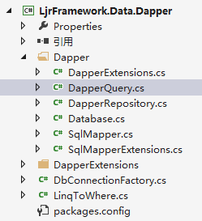
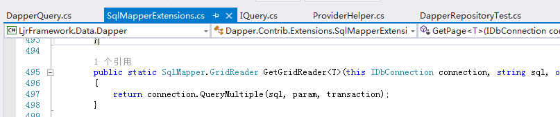
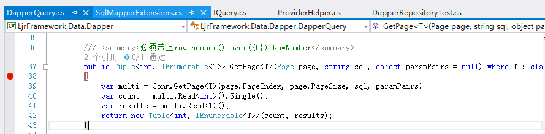
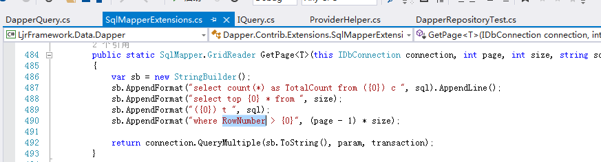
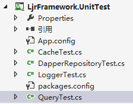
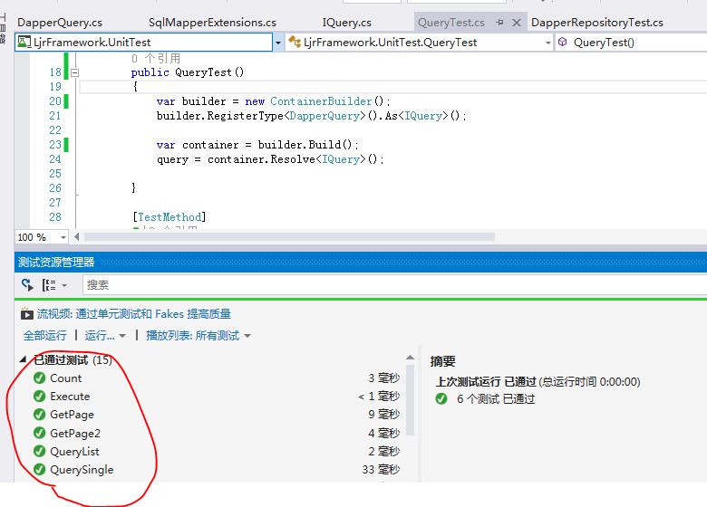

接上文 [项目架构开发：数据访问层之Repository](http://www.cnblogs.com/lanxiaoke/p/6503022.html)

上一章我们讲了IRepository接口，这张我们来讲IQuery

根据字面意思就可以知道，这次主要讲数据查询，上一章我们只针对单表做了查询的操作，多表联查并没有实现

其实对于任何一个项目来说，多表联查都是比较麻烦的地方，因为项目的“读”操作，特别是多表的“读”，至少占据所有“读”的一半以上

然而至今，据我所知还没有哪一款ORM工具可以灵活处理多表联查；想要不写sql语句，又想性能高，还想用强类型的ling查询方法；这对于多表查询来说比较难

鉴于此，也别做那些别扭的映射了（像NH），而如果用lingtosql我觉得还不如直接写sql来的好；

是开发人员不可能不懂sql，那对多表查询这一块，干脆独立一个Query类出来，专门处理这种事

好了这只是我的处理方式，我们来看看

IQuery.cs
~~~csharp
    public interface IQuery
    {
        T QuerySingle<T>(string sql, object paramPairs) where T : class;
        IEnumerable<T> QueryList<T>(string sql, object paramPairs) where T : class;

        /// 
必须带上row_number() over({0}) RowNumber

        Tuple<int, IEnumerable<T>> GetPage<T>(Page page, string sql, dynamic paramPairs = null) where T : class;
        
        Tuple<int, IEnumerable<T>> GetPage<T>(string sql, object paramPairs = null) where T : class;
        int Execute(string sql, dynamic paramPairs = null);
        long Count(string sql, dynamic paramPairs = null);
    }
~~~
上方法名就可以知道，写sql，然后返回自定义的T或IEnumerable<T>

这里避免了用泛型类，因为某个实体大多数情况下可能也只是需要，上边其中其中的1、2个而已

这里有一个Execute方法，其实不应该放在这的，但是也懒得写另外一个类了，先放着吧

## Query的实现

DapperQuery.cs
~~~csharp
using Dapper;
using Dapper.Contrib.Extensions;
using LjrFramework.Common;
using LjrFramework.Interface;
using System;
using System.Collections.Generic;
using System.Data;
using System.Linq;

namespace LjrFramework.Data.Dapper
{
    public class DapperQuery : IQuery
    {
        protected IDbConnection Conn { get; private set; }

        public DapperQuery()
        {
            Conn = DbConnectionFactory.CreateDbConnection();
        }

        public void SetDbConnection(IDbConnection conn)
        {
            Conn = conn;
        }

        public T QuerySingle<T>(string sql, object paramPairs) where T : class
        {
            return Conn.Query<T>(sql, paramPairs).SingleOrDefault();
        }

        public IEnumerable<T> QueryList<T>(string sql, object paramPairs) where T : class
        {
            return Conn.Query<T>(sql, paramPairs);
        }

        /// 
自动分页，必须带上row_number() over({0}) RowNumber

        public Tuple<int, IEnumerable<T>> GetPage<T>(Page page, string sql, object paramPairs = null) where T : class
        {
            var multi = Conn.GetPage<T>(page.PageIndex, page.PageSize, sql, paramPairs);
            var count = multi.Read<int>().Single();
            var results = multi.Read<T>();
            return new Tuple<int, IEnumerable<T>>(count, results);
        }
        // 需自己实现分页语句
        public Tuple<int, IEnumerable<T>> GetPage<T>(string sql, object paramPairs = null) where T : class
        {
            var multi = Conn.GetGridReader<T>(sql, paramPairs);
            var count = multi.Read<int>().Single();
            var results = multi.Read<T>();
            return new Tuple<int, IEnumerable<T>>(count, results);
        }

        public int Execute(string sql, object paramPairs = null)
        {
            return Conn.Execute(sql, paramPairs);
        }

        public long Count(string sql, object paramPairs = null)
        {
            return Conn.Query<long>(sql, paramPairs).SingleOrDefault();
        }
    }
}
~~~
这个实现跟上一章差不多，都是直接调用Conn的扩展方法，

我们进去看看（public Tuple<int, IEnumerable<T>> GetPage<T>(string sql, object paramPairs = null) where T : class）的实现

可以看到dapper是已经支持sql语句的查询，并且返回多个记录（SqlMapper.GridReader）

每次分页都要去手动刷选 页数 与 记录开始行数的话比较麻烦

所有我做了一点小改动，武学用户写分页语句，直接查询就可以了，后台会自动生成分页语句的格式

不过要带上row\_number() over({0}) RowNumber；就是上边那个有注释的方法

他的实现如下

这样用户只需要准守一点约束，就会方便很多

这些都是在dapper的Extensions里实现的，用户需要自行修改，自己想要的自定义的功能

好了，Query有效代码写完了，我们看看运行效果

## Query测试

~~~csharp
using Autofac;
using Company.Project.PO;
using LjrFramework.Data.Dapper;
using LjrFramework.Common;
using LjrFramework.Infrastructure;
using LjrFramework.Interface;
using Microsoft.VisualStudio.TestTools.UnitTesting;
using System;
using LjrFramework.Data.UnitOfWork;

namespace LjrFramework.UnitTest
{
    [TestClass]
    public class QueryTest
    {
        private IQuery query;

        public QueryTest()
        {
            var builder = new ContainerBuilder();
            builder.RegisterType<DapperQuery>().As<IQuery>();

            var container = builder.Build();
            query = container.Resolve<IQuery>();

        }

        [TestMethod]
        public void QuerySingle()
        {
            var model = query.QuerySingle<LoginUser>("select * from LoginUser where Id = @Id", new { Id = "854B1FCA-F8D7-4B4B-AA5D-9075F1922721" });

            Assert.AreEqual(model.LoginName, "lanxiaoke-d318fd40-1b9d-42f8-a002-388b1228012d");
        }

        [TestMethod]
        public void QueryList()
        {
            var list = query.QueryList<LoginUser>("select * from LoginUser where LoginName like '%'+ @LoginName + '%'", new { LoginName = "lanxiaoke" });

            int index = 0;
            foreach (var user in list)
            {
                index++;
            }

            Assert.AreEqual(index > 0, true);
        }

        [TestMethod]
        public void GetPage()
        {
            var page = new Page()
            {
                PageIndex = 1,
                PageSize = 10
            };

            var results = query.GetPage<LoginUser>(page,
                @"select row_number() over(order by CreateTime) RowNumber,* from LoginUser where LoginName like '%'+ @LoginName + '%'", new { LoginName = "lanxiaoke" });

            var total = results.Item1;
            var list = results.Item2;

            int index = 0;
            foreach (var user in list)
            {
                index++;
            }

            Assert.AreEqual(index > 0, true);
        }

        [TestMethod]
        public void GetPage2()
        {
            var page = new Page()
            {
                PageIndex = 1,
                PageSize = 10
            };

            var results = query.GetPage<LoginUser>(
                @"select count(*) as TotalCount from LoginUser c where LoginName like '%'+ @LoginName + '%'
                  select row_number() over(order by CreateTime) RowNumber,* from LoginUser where LoginName like '%'+ @LoginName + '%'",
            new { LoginName = "lanxiaoke" });

            var total = results.Item1;
            var list = results.Item2;

            int index = 0;
            foreach (var user in list)
            {
                index++;
            }

            Assert.AreEqual(index > 0, true);
        }

        [TestMethod]
        public void Count()
        {
            var row = query.Count("select count(*) from LoginUser");

            Assert.AreEqual(row > 1, true);
        }

    }
}

~~~

自此，多表查询就讲完了

## 项目架构开发系列

*   [项目架构开发：数据访问层之Cache](http://www.cnblogs.com/lanxiaoke/p/6502210.html)
*   [项目架构开发：数据访问层之Logger](http://www.cnblogs.com/lanxiaoke/p/6502689.html)
*   [项目架构开发：数据访问层之Repository](http://www.cnblogs.com/lanxiaoke/p/6503022.html)
*   [项目架构开发：数据访问层之Query](http://www.cnblogs.com/lanxiaoke/p/6503333.html)
*   [项目架构开发：数据访问层之UnitOfWork](http://www.cnblogs.com/lanxiaoke/p/6504443.html)