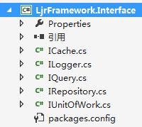
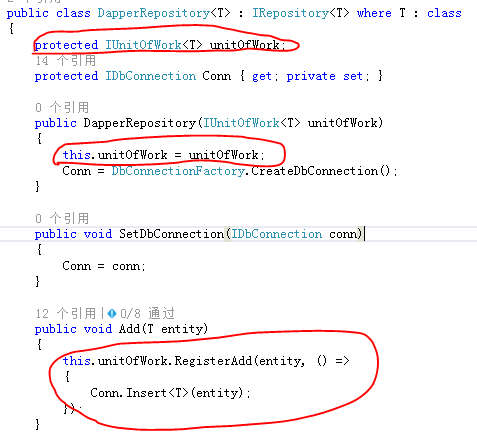
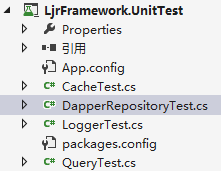
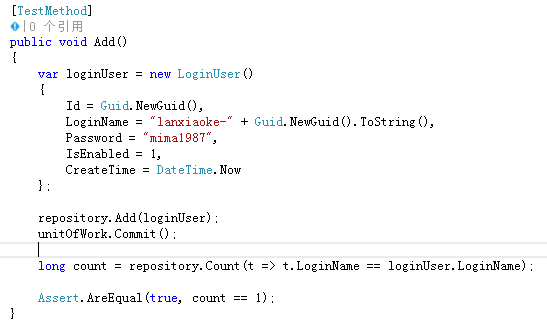
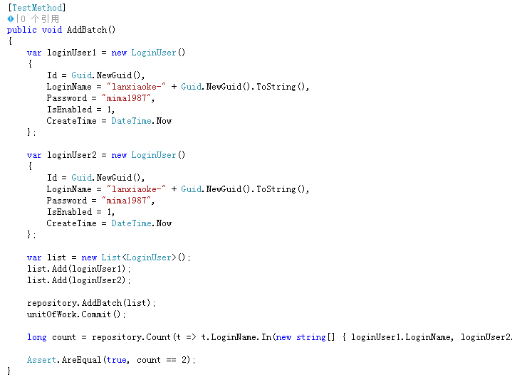
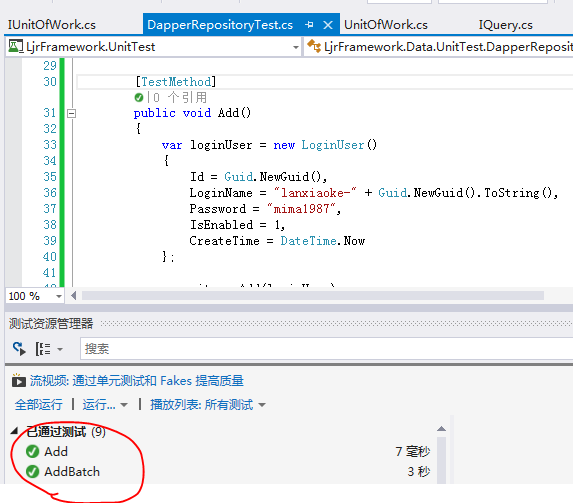
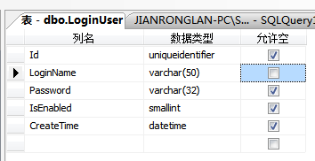
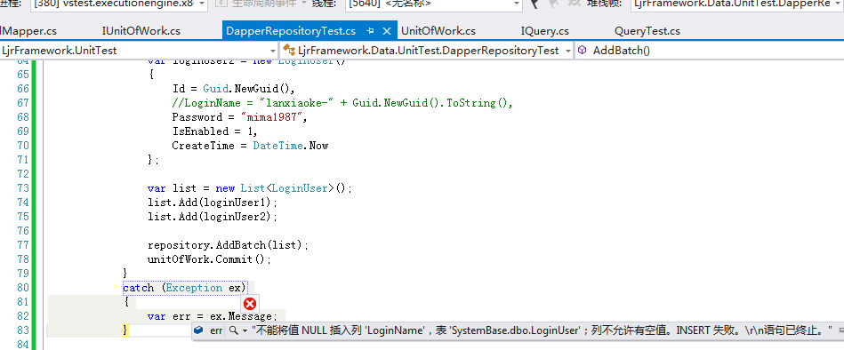
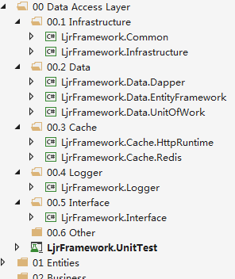

接上文 [项目架构开发：数据访问层之IQuery](http://www.cnblogs.com/lanxiaoke/p/6503333.html)

本章我们继续IUnitOfWork的开发，从之前的IRepository接口中就可以看出，我们并没有处理单元事务，

数据CUD每次都是立即执行的，这样有一些不好的地方，比如数据访问次数会增多，一笔数据的完整性无法保证

比如：批量新增2条记录，只有一条成功，这样的情况就应该Rollback；可能有人已经想到用数据库自带的事务保证完整性

虽然是可以，但是这样就不可避免地在业务层耦合SqlTransaction，我不想这种情况出现；

所以我们用windows自带的分布式事务TransactionScope来实现，TransactionScope可以实现多个数据库的事务锁，这点就比SqlTransaction强一些

当然我了解到分布式事务是不一般的复杂的，那些更好的处理方式我还没有掌握，所以先这么写吧，有这方面经验的朋友欢迎提建议

IUnitOfWork.cs
~~~csharp
 public interface IUnitOfWork<T> where T : class
 {
     void RegisterAdd(T entity, Action callback);
     void RegisterUpdate(T entity, Action callback);
     void RegisterDelete(T entity, Action callback);
     void Commit();
 }
~~~
注册新增操作：RegisterAdd

注册更新操作：RegisterUpdate

注册修改操作：RegisterDelete

提交数据：Commit

## 工作单元的实现
~~~csharp
public class UnitOfWork<T> : IUnitOfWork<T> where T : class
 {
     private Dictionary<T, Action> addEntities;
     private Dictionary<T, Action> updateEntities;
     private Dictionary<T, Action> deleteEntities;

     public UnitOfWork()
     {
         addEntities = new Dictionary<T, Action>();
         updateEntities = new Dictionary<T, Action>();
         deleteEntities = new Dictionary<T, Action>();
     }

     public void RegisterAdd(T entity, Action callback)
     {
         this.addEntities.Add(entity, callback);
     }

     public void RegisterUpdate(T entity, Action callback)
     {
         this.updateEntities.Add(entity, callback);
     }

     public void RegisterDelete(T entity, Action callback)
     {
         this.deleteEntities.Add(entity, callback);
     }

     public void Commit()
     {
         using (TransactionScope scope = new TransactionScope())
         {
             foreach (var entity in deleteEntities.Keys)
             {
                 this.deleteEntities[entity]();
             }

             foreach (var entity in updateEntities.Keys)
             {
                 this.updateEntities[entity]();
             }

             foreach (var entity in addEntities.Keys)
             {
                 this.addEntities[entity]();
             }

             scope.Complete();
         }
     }
 }
~~~
这里我们用了Action，这个是无返回值委托方法，如果大家需要返回值可以用Func

实现我们还是用DapperRepository，修改一下。在新增方法中注册数据持久化方法

好了，现在我们来看看测试结果

## 测试工作单元

还是用原来那个DapperRepositoryTest

我们修改一下实现过程：

单个新增

 

批量新增

运行结果

 我们把表结构改一下，名称改成不能为null

AddBatch也要修改，正常的执行结果一个是抛出异常
~~~csharp
     [TestMethod]
     public void AddBatch()
     {
         try
         {
             var loginUser1 = new LoginUser()
             {
                 Id = Guid.NewGuid(),
                 LoginName = "lanxiaoke-" + Guid.NewGuid().ToString(),
                 Password = "mima1987",
                 IsEnabled = 1,
                 CreateTime = DateTime.Now
             };

             var loginUser2 = new LoginUser()
             {
                 Id = Guid.NewGuid(),
                 //LoginName = "lanxiaoke-" + Guid.NewGuid().ToString(),
                 Password = "mima1987",
                 IsEnabled = 1,
                 CreateTime = DateTime.Now
             };

             var list = new List<LoginUser>();
             list.Add(loginUser1);
             list.Add(loginUser2);

             repository.AddBatch(list);
             unitOfWork.Commit();
         }
         catch (Exception ex)
         {
             var err = ex.Message;
         }

         //long count = repository.Count(t => t.LoginName.In(new string[] { loginUser1.LoginName, loginUser2.LoginName }));

         //Assert.AreEqual(true, count >0);
     }
~~~
运行看看

如期运行，到这里，工作单元就讲完了

## 完整项目架构

我们来看看完整的数据访问层架构

整个数据访问层就讲完了，虽然有些简陋，但是基本功能都有了

## 项目架构开发系列

*   [项目架构开发：数据访问层之Cache](http://www.cnblogs.com/lanxiaoke/p/6502210.html)
*   [项目架构开发：数据访问层之Logger](http://www.cnblogs.com/lanxiaoke/p/6502689.html%20)
*   [项目架构开发：数据访问层之Query](http://www.cnblogs.com/lanxiaoke/p/6503333.html)
*   [项目架构开发：数据访问层之Repository](http://www.cnblogs.com/lanxiaoke/p/6503022.html)
*   [项目架构开发：数据访问层之UnitOfWork](http://www.cnblogs.com/lanxiaoke/p/6504443.html)