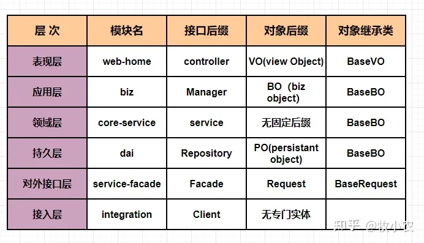

## 一、前言

> 最近公司一场有关于领域驱动设计的技术分享会，主要讲解了服务的划分，Restful API的设计，如何将抽象具有统一业务的范畴的Model，使其模块化，同时能够提炼组合多个模块，使得业务能够独立服务化，在软件开发中如何降低系统的复杂度是一个永恒的挑战，在之前都是通过一系列的设计模式或者范例来降低一些比较常见的复杂度，这些都是通过技术手段来解决技术问题，没有从根本上解决业务上的问题，但是在03年 Eric Evans 的《Domain Driven Design》 中，才是真正的从业务的角度出发，并且提供了一整套的针对纯业务开发的架构思路。为了更加深入理解，看了不少资料后，对DDD有了一点小小的个人心得，所以整理了一下，分享出来，希望能够对大家有帮助。  

## 二、什么是DDD

DDD 是 Eric Evans 在2003年出版的书名，同时也是这个架构设计方法名的起源。Eric Evans “领域驱动设计之父”，世界杰出软件建模专家。他创建的 “Domain Language” 公司，就是致力帮助公司机构创建与业务紧密相关的软件。

DDD 不是一套架构，而是一种架构思想，所以导致在代码层面缺乏了足够的约束，因此 DDD 在实际应用中上手门槛比较高，而且在绝大部分公司中实际应用中是没有应用到的，或者说只是应用到了 DDD 部分思想 比如： 建模的思想，对整个架构体系的思想是无法落地的，而且一些依然火热的ORM工具（Hibernate）助长了贫血模型的扩散，同样因为传统的基于数据库技术以及MVC的四成架构应用（UI、Business、Data Access、Database）依然能够为我们解决绝大部分的应用开发。

之前的服务架构 局限于单机 +LB 用MVC提供的Rest接口提供外部服务调用，或者用WebService 做RPC调用，到了2014年，SOA开始火热起来了，微服务开始如雨后春笋一样的开始冒头，怎么把一个应用或者项目合理化的进行拆分多个微服务，成为了各个技术负责人的思考的重点，而在DDD里面的 Bounded Context（限界上下文）中就为我们提供了一整套合理的架构思想。

但是 DDD 可以让我们思考 在我们的项目中哪些是可以被服务化拆分，哪些业务逻辑需要被聚合在一起，实现最小的开发和维护成本。

  

## 三、领域驱动设计-基本概念

**DDD 的全称为 Domain Driven Design**，即领域驱动设计，DDD不是架构，而是一种方法论（Methodology），微服务架构从一出来就没有很好的理论支撑如何合理的划分服务边界。

在我们早期常见的软件开发就是拿到产品需求后，先考虑数据库设计，根据数据库设计，建立对应的实体层、服务层等等，但是这种方式会将 分析、设计和业务需求脱节，而更多的是直接考虑应该如何实现，这就有点本末倒置了，而DDD 是从问题本身出发进行的设计方法。

**概念：** 系统设计应该是一种以领域为核心的设计和开发，设计应该通过维护一个深度反应领域概念的模型，以及提供可行的经过实践校验的大量模式来应对领域的复杂性。

DDD 更像小颗粒的迭代设计，最小单元是 `领域模型(Domain Model)`

### 什么是领域（Domain）？

什么是领域？比如我们经常使用的某宝、某东、属于网上电商领域，那么这些领域就会有对应的商品浏览、购物车、下单、扣减库存、供应商、付款等等核心环境。再比如我们想做一个聊天系统，那这个系统的核心业务就要确定，比如有 联系人、分组、朋友圈、视频、聊天记录等功能。

所以，我们可以得知，一个领域的本质上可以理解为一个问题域，只要是同一个领域的，那么他们 一定会有相同的问题域，因此只要我们确定了系统所属的领域，那这个系统的核心业务，也就是我们要解决的关键问题，问题的范围边界也就基本确定了。

### 什么是设计（Design）？

DDD 中的设计主要是指领域模型的设计，为什么说是领域模型的设计而不是架构设计或者其他的设计？因为DDD是一种基于模型驱动开发的软件开发思想，强调领域模型是这个系统的核心，领域模型也是整个系统的核心价值所在，每一个领域，都有对应的领域模型，因为领域模型能够很好的帮助我们解决复杂的业务问题。 领域模型绑定了领域和代码的是吸纳，确保了最终的代码实现就一定是解决了领域中的核心问题，

## 四、四色原型建模

**简单描述：** 某个人（Party）的角色（PartyRole）在某个地点（Place）的角色（PlaceRole）用某个东西（Thing）的角色（ThingRole）做了某件事情（MomentInterval）

**PartPlaceThing：**简称PPT，用淡绿色表示，常见的PPT有：部门、岗位、人员、地点、物品等。

**Description：**简称Des，用淡蓝色表示，主要用来对PPT进行描述，常见的Des有：部门类型、岗位层级、人员类型、地点区域、物品分类等。

**Role：**用淡黄色表示，主要表示PPT在某个场景下扮演的角色，常见的角色有：财务类部门、管理类岗位、请假者、销售点、产品等。

**MomentInterval：**简称MI，用淡红色表示，主要表示在一刻或一段时间内发生的一件事情，常见的MI有：部门移动、岗位移动、员工离职、产品销售等。

**MomentInteval：**简称MIDetail，用淡红色表示，主要表示MI的明细。

## 五、分层架构

  

  

分层架构是将软件模块按照水平切分的方式分成多个层

最基本的是分层架构是三层：**即表现层，领域层和数据持久层**

DDD中 四层架构：**表现层，应用层、领域层和基础层**

四层中的应用层是对三层架构中领域层进行进一步拆分。但是无论怎么分层，业务逻辑永远在领域层。

**三层架构：**

\- **表现层：** 负责向用户展示信息和接收用户的指令。需要负责处理展示逻辑，比如用户通过我们的系 统进行信用卡还款，系统会返回三个状态未申请，处理中，处理完成。表面层需要根据这个状态给 用户返回不同的页面，根据这三个不同的状态，向用户展示不同的中文说明。

\- **领域层：** 负责表达业务逻辑，是整个系统的核心层。比如信用卡还款服务。

\- **持久层：** 提供数据查询和存储服务，包括按照状态查询信用卡。

**四层架构：**

\- **表现层：** 同三层架构表现层。

\- **应用层：** 定义软件要完成的任务，不包含业务逻辑，而是协调，比如受理用户请求的任务。负责非 业务逻辑（批量删除、修改等）

\- **领域层：** 同三层架构领域层。

\- **基础层：** 为各层提供通用的技术能力。为领域层提供数据和文件存储。 -

**分层架构最重要的是每一层关注自己的职责**，持久层只负责提供查询、更新和存储数据的服务，和业务逻辑无关的，所以持久层提供按照还款状态查询信用卡的服务，这样做的好处增加复用性，后续领域层提供展示已还款的信用卡服务时能复用持久层的查询服务。

### 分层架构的好处

分层架构的目的是通过关注点分离来降低系统的复杂度，同时满足单一职责、高内聚、低耦合、提高可复用性和降低维护成本。

**单一职责：**每一层只负责一个职责，职责边界清晰，如持久层只负责数据查询和存储，领域层只负 责处理业务逻辑。

**高内聚：** 分层是把相同的职责放在同一个层中，所有业务逻辑内聚在领域层。这样做有什么好处呢？试想一下假如业务逻辑分散在每一层，修改功能需要去各层修改，测试业务逻辑需要测试所有层的代码，这样增加了整个软件的复杂度和测试难度。

**低耦合：** 依赖关系非常简单，上层只能依赖于下层，没有循环依赖。

**可复用：** 某项能力可以复用给多个业务流程。比如持久层提供按照还款状态查询信用卡的服务，既可以给申请信用卡做判断使用，也可以给展示未还款信用卡使用。

**易维护：** 面对变更容易修改。把所有对外接口都放在对外接口层，一旦外部依赖的接口被修改，只需要改这个层的代码即可。

以上这些既是分层的好处也是分层的原则，大家在分层时需要遵循以上原则，不恰当的分层会违背了分层架构的初衷。

### 分层架构的缺点

分层架构也有几个缺点

**开发成本高：** 因为多层分别承担各自的职责，增加功能需要在多个层增加代码，这样难免会增加开发成本。但是合理的能力抽象可以提高了复用性，又能降低开发成本。

**性能略低：** 业务流需要经过多层代码的处理，性能会有所消耗。

**可扩展性低：** 因为上下层之间存在耦合度，所有有些功能变化可能涉及到多层的修改。

## 六、领域模型(domain model)

领域模型是对领域内的概念类或现实世界中对象的可视化表示。又称概念模型、业务对象模型、领域对象模型、分析对象模型。

  

  

它专注于分析问题领域本身，发掘重要的业务领域概念，并建立业务领域概念之间的关系。

优点是系统层次结构清楚，各层之间单向依赖， Client -> (Business Facade) -> Business Logic -> Data Access Object 可见，领域对象几乎只做传输介质的用处，不会影响到层次的划分。

领域对象只是作为保存状态或者传递状态使用，它是没有生命的，只是数据没有行为的对象不是真正的对象。

## 七、贫血模型

贫血模型是指领域对象里只有 get 和 set 方法（一般是指POJO）,所有的业务逻辑是不包含在这里面的而是放在 Business Logic层。

在使用Spring的时候，通常就暗示着我们使用的是贫血模型，我们把Domain类用来单纯地储存数据，Spring管不着这些类的注入和管理，Spring关心的逻辑层（比如单例的被池化了的Business Logic层） 可以被设计成Singleton的Bean。

假设我们这里改变一下，就在Domain类中提供业务逻辑方法，那么我们在使用Spring构造这样的数据Bean的时候会遇到很多麻烦，比如 Bean之间的引用，可能引起大范围的Bean之间的潜逃构造器的调用。

## 八、充血模型

大多业务逻辑和持久化放在Domain Object 里面，Business Logic只是简单封装部分业务逻辑以及控制事务、权限等，这样层次结构就变成 Client -> (Business Facade) -> Business Logic -> Domain Object -> Data Access Object。

  

  

### 优点：

是面向对象，Business Logic 符合单一职责，不像在贫血模型里面那样包含所有的业务逻辑太过沉重。

### 缺点

如何划分业务逻辑，什么样的逻辑应该放在 Domain Object中，什么样的业务逻辑应该放在Business Logic中，其实是比较模糊的。

即使划分好了业务逻辑，由于分散在Business Logic和Domain Object层中，不能更好的划分模块开发。

熟悉业务逻辑的开发人员需要渗透到Domain Logic中去，而在Domain Logic又包含了持久化，对于开发者者这是十分混乱的。

如果Business Logic要控制事务并且为上层提供一个统一的服务调用入口点，它就必须把在Domain logic里实现的业务逻辑全部重新包装一遍，完全属于重复劳动。

使用RoR开发时，每一个领域模型对象都可以具备自己的基础业务方法，通常满足充血模型的开发，充血模型更适合复杂业务逻辑的设计开发。

充血模型的层次和模块的划分是一门学问，对开发人员要求也比较高，可以考虑定义这样的一些规则： （1） 事务控制不要放在领取模型的对象中实现，可以放在facade中完成。 （2） 领域模型对象中只保留该模型驱动的一般方法，对于业务特征明显的特异场景方法调用放在facade中完成。

## 九、传统的数据驱动开发模式

View、Service、Dao 这种三层模式，开发者会很自然的写出过程式代码，这种开发方式中的对象只是数据载体，而没有行为，是一种贫血对象模型，以数据为中心，以数据库ER图为设计驱动，分层架构在这种开发模式下可以认为是数据处理和实现的过程。

## 十、限界上下文(Bounded Context)

**限界上下文：定义了每个模型的应用范围**

一个业务领域可以划分成多个BC，它们之间通过Context Map进行集成。BC是一个显式的边界，领域模型Bianc便存在于这个边界之内。领域模型是关于某个特定业务员领域的软件模型，通常，领域模型通过对象模型来实现，这些对象同时包含了数据和行为，并且表达了准确的业务含义。

关于限界上下文，有一个很形象的类别，细胞和细胞膜的类比：

细胞之所以能存在，是因为细胞膜定义了什么在细胞内，什么在细胞外，而且确认了什么物质可以通过细胞膜

BC可以类比为细胞膜，大型系统由于其复杂性，对于一个对象如果采取统一建模方式，可能会产生不可预测的效果。例如书中提到的客户发票中的收费对象故障，其实类似问题也在很多地方可以看到。

## 十一、什么是 CQRS？

CQRS —— Command Query Responsibility Segreation（命令查询职责分离），故名思义是将 command 与 query 分离的一种模式。这种命令与查询的分离方式，可以更好地控制请求者的操作。查询操作不会造成数据的修改，因而它属于一种幂等操作，可以反复地发起，而不用担心会对系统造成影响。基于这种特性，我们还可以为其提供缓存，从而改进查询的性能。

query很好理解，就是我们经常使用到的查询。

那么 command 又是什么呢，我们可以看 CRUD，其实可以分为读（R）和写（CUD），大部分情况就是一个方法要么是执行一个Command完成一个动作，要么就是查询返回数据，比如我们回答问题的人不应该去修改问题。

只要充分理解了运用CQRS模式的意图，理解CQRS模式就变得容易了许多。下图是CQRS框架[AxonFramework](https://link.zhihu.com/?target=https%3A//axoniq.io/)官方文档给出的CQRS架构图。

  

## 十二、统一语言(Ubiquitous Language)

业务人员和我们使用一样的语言，我们的程序比如让业务尽量集中在领域里，比如在传统的数据驱动里，如果说 张三喜欢李四，我们一般会这么写

> UserService.Love(zhangsan, lisi)  

但是我们业务人员很奇怪谁Love谁？ 为什么要UserService?, 如果我们写成下面这样

> zhangsan.Love(lisi)  

如果我们用

> Company.hire(employee) 来替代 companyservice.hire(company,employee)  

这样我们就更容易让业务人员参与进来，而且代码可以更易于表示真实的业务场景。

  

  

以上是根据课堂笔记来记录的，如果有错误或者不懂的地方，欢迎大家在下面留言。

我是牧小农，怕什么真理无穷，进一步有进一步的欢喜！