# 继承、实现、依赖、关联、聚合、组合的联系与区别
 

继承、实现、依赖、关联、聚合、组合的联系与区别

分别介绍这几种关系：

**继承**

指的是一个类（称为子类、子接口）继承另外的一个类（称为父类、父接口）的功能，并可以增加它自己的新功能的能力，继承是类与类或者接口与接口之间最常见的关系；在Java中此类关系通过关键字extends明确标识，在设计时一般没有争议性； 

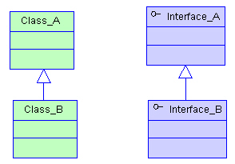

**实现**

指的是一个class类实现interface接口（可以是多个）的功能；实现是类与接口之间最常见的关系；在Java中此类关系通过关键字implements明确标识，在设计时一般没有争议性； 

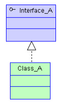

**依赖**

可以简单的理解，就是一个类A使用到了另一个类B，而这种使用关系是具有偶然性的、、临时性的、非常弱的，但是B类的变化会影响到A；比如某人要过河，需要借用一条船，此时人与船之间的关系就是依赖；表现在代码层面，为类B作为参数被类A在某个method方法中使用； 

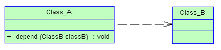

**关联**

他体现的是两个类、或者类与接口之间语义级别的一种强依赖关系，比如我和我的朋友；这种关系比依赖更强、不存在依赖关系的偶然性、关系也不是临时性的，一般是长期性的，而且双方的关系一般是平等的、关联可以是单向、双向的；表现在代码层面，为被关联类B以类属性的形式出现在关联类A中，也可能是关联类A引用了一个类型为被关联类B的全局变量； 

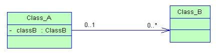

**聚合**

聚合是关联关系的一种特例，他体现的是整体与部分、拥有的关系，即has-a的关系，此时整体与部分之间是可分离的，他们可以具有各自的生命周期，部分可以属于多个整体对象，也可以为多个整体对象共享；比如计算机与CPU、公司与员工的关系等；表现在代码层面，和关联关系是一致的，只能从语义级别来区分； 

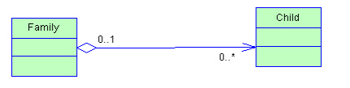

**组合**

组合也是关联关系的一种特例，他体现的是一种contains-a的关系，这种关系比聚合更强，也称为强聚合；他同样体现整体与部分间的关系，但此时整体与部分是不可分的，整体的生命周期结束也就意味着部分的生命周期结束；比如你和你的大脑；表现在代码层面，和关联关系是一致的，只能从语义级别来区分； 

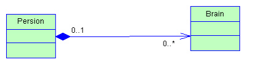

对于继承、实现这两种关系没多少疑问，他们体现的是一种类与类、或者类与接口间的纵向关系；其他的四者关系则体现的是类与类、或者类与接口间的引用、横向关系，是比较难区分的，有很多事物间的关系要想准备定位是很难的，前面也提到，这几种关系都是语义级别的，所以从代码层面并不能完全区分各种关系；

但总的来说，后几种关系所表现的强弱程度依次为：**组合>聚合>关联>依赖；**

聚合跟组合其实都属于关联 只不过它们是两种特殊的关联 因为本是同根生 所以它们之间难免会有相似之处 下面让我们一起来看一下它们之间有何不同

聚合与组合的概念相信不用我在此赘述大家就已经了解了 下面直接上例子

程老师的《大话》里举大那个大雁的例子很贴切 在此我就借用一下 大雁喜欢热闹害怕孤独 所以它们一直过着群居的生活 这样就有了雁群 每一只大雁都有自己的雁群 每个雁群都有好多大雁 大雁与雁群的这种关系就可以称之为聚合 另外每只大雁都有两只翅膀 大雁与雁翅的关系就叫做组合 有此可见 聚合的关系明显没有组合紧密 大雁不会因为它们的群主将雁群解散而无法生存 而雁翅就无法脱离大雁而单独生存——组合关系的类具有相同的生命周期

聚合关系图：

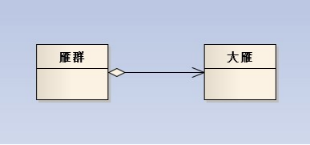

组合关系图：

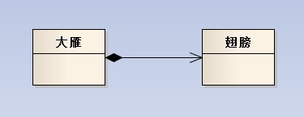

从从代码上看这两种关系的区别在于：

构造函数不同

雁群类：

~~~ csharp

public class GooseGroup 

    { 

public Goose goose; 

public GooseGroup(Goose goose) 

        { 

this.goose = goose; 

        } 

    } 

public class GooseGroup 

    { 

public Goose goose; 

public GooseGroup(Goose goose) 

        { 

this.goose = goose; 

        } 

    } 
~~~

大雁类：
~~~ csharp

public class Goose 

{ 

public Wings wings; 

public Goose() 

    { 

        wings=**new** Wings(); 

    } 

} 

public class Goose 

{ 

public Wings wings; 

public Goose() 

    { 

        wings=new Wings(); 

    } 

} 
~~~
聚合关系的类里含有另一个类作为参数 

雁群类（GooseGroup）的构造函数中要用到大雁（Goose）作为参数把值传进来 大雁类（Goose）可以脱离雁群类而独立存在  

组合关系的类里含有另一个类的实例化 

大雁类（Goose）在实例化之前 一定要先实例化翅膀类（Wings） 两个类紧密耦合在一起 它们有相同的生命周期 翅膀类（Wings）不可以脱离大雁类（Goose）而独立存在 

信息的封装性不同 

在聚合关系中，客户端可以同时了解雁群类和大雁类，因为他们都是独立的 

而在组合关系中，客户端只认识大雁类，根本就不知道翅膀类的存在，因为翅膀类被严密的封装在大雁类中。

\-\-\-\-\-\-\-\-\-\-\-\-\-\-\-\-\-\-\-\-\-\-\-\-\-\-\-\-\-\-\-\-\-\-\-\-\-\-\-\-\-\-\-\-\-\-\-\-\-\-\-\-\-\-\-\-\-\-\-\-\-\-\-\-\-\-\-\-\-\-\-\-\-\-\-\-\-\-\-\-\-\-\-\-\-\-\-\-\-\-\-\-\-\-\-\-\-\-\-\-\-\-\-

**UML-泛化、关联、聚合、组合、依赖**

**一、泛化关系（generalization）**

1.说明

表示类与类之间的继承关系，接口与接口之间的继承关系，或类对接口的实现关系。一般化的关系是从子类指向父类的，与继承或实现的方法相反。

2.例图

3.表现

父类 父类实例＝new 子类();

4.举例
~~~ csharp
class Animal{};

class Tigger : public Animal{};

class Dog : public Animal{};

Animal* pAnimal = new Dog;
~~~

**二、关联关系（association）**

1.说明

对于两个相对独立的对象，当一个对象的实例与另一个对象的一些特定实例存在固定的对应关系时，这两个对象之间为关联关系。

表示类与类之间的联接，有双向关联和单向关联，双向关联有两个箭头或者没有箭头，单向关联有一个箭头，表示关联的方向。

关联关系以实例变量的形式存在，在每一个关联的端点，还可以有一个基数(multiplicity),表明这一端点的类可以有几个实例。

2.例图

3.表现

双向关联在代码的表现为双方都拥有对方的一个指针，当然也可以是引用或者是值。

关联关系是使用实例变量来实现。

4.举例
~~~ csharp
//eg.1

//单向关联

class Person{};

class Friend

{

Person* mpPerson;

};

//eg.2

//双向关联

class A;

class B

{

A* pA;

};

class A

{

B* pB;

};

//eg.3

//自身关联

class C

{

C* pC;

};
~~~
**三、聚合关系（aggregation）**

1.说明：

关联关系的一种，是强的关联关系。聚合是整体和个体的关系。聚合关系也是通过实例变量实现的。例如汽车、发动机、轮胎，一个汽车对象由一个发动机对象，四个轮胎对象组成。

当类之间有整体-部分关系的时候，我们就可以使用组合或者聚合。

2.例图

3.表现

与关联关系一样，聚合关系也是通过实例变量来实现这样关系的。关联关系和聚合关系来语法上是没办法区分的，从语义上才能更好的区分两者的区别。

4.举例
~~~ csharp
class CPU{};

class Memory{};

class Computer

{

CPU* mpCPU;

Memory* mpMemory;

};
~~~
**四、组合关系（合成关系）（composition）**

1.说明：

合成关系也是关联关系的一种，是比聚合关系更强的关系。合成关系是不能共享的。例如人有四肢、头等。

表示类之间整体和部分的关系，组合关系中部分和整体具有统一的生存期。一旦整体对象不存在，部分对象也将不存在。部分对象与整体对象之间具有共生死的关系。

2.例图

3.表现

4.举例
~~~ csharp
//同聚合关系，不过说语义不同

class Leg{};

class Arm{};

class Person

{

Leg mLeg;

Arm mArm;

};
~~~
**五、依赖关系（Dependency）**

1.说明：

对于两个相对独立的对象，当一个对象负责构造另一个对象的实例，或者依赖另一个对象的服务时，这两个对象之间主要体现为依赖关系。

与关联关系不同的是，依赖关系是以参数变量的形式传入到依赖类中的，依赖是单向的，要避免双向依赖。一般来说，不应该存在双向依赖。

依赖是一种弱关联，只要一个类用到另一个类，但是和另一个类的关系不是太明显的时候（可以说是“uses”了那个类），就可以把这种关系看成是依赖。

2.例图

3.表现

依赖关系表现在局部变量，方法的参数，以及对静态方法的调用

4.举例
~~~ csharp
class Car{};

class House{};

class Person

{

void buy(Car& car){}

void buy(House* pHouse){}

};
~~~
**六、关系之间的区别**

1.聚合与组合

（1）聚合与组合都是一种结合关系，只是额外具有整体-部分的意涵。

（2）部件的生命周期不同

聚合关系中，整件不会拥有部件的生命周期，所以整件删除时，部件不会被删除。再者，多个整件可以共享同一个部件。 

组合关系中，整件拥有部件的生命周期，所以整件删除时，部件一定会跟着删除。而且，多个整件不可以同时间共享同一个部件。

（3）聚合关系是“has-a”关系，组合关系是“contains-a”关系。

2.关联和聚合

（1）表现在代码层面，和关联关系是一致的，只能从语义级别来区分。

（2）关联和聚合的区别主要在语义上，关联的两个对象之间一般是平等的，例如你是我的朋友，聚合则一般不是平等的。

（3）关联是一种结构化的关系，指一种对象和另一种对象有联系。

（4）关联和聚合是视问题域而定的，例如在关心汽车的领域里，轮胎是一定要组合在汽车类中的，因为它离开了汽车就没有意义了。但是在卖轮胎的店铺业务里，就算轮胎离开了汽车，它也是有意义的，这就可以用聚合了。

3.关联和依赖

（1）关联关系中，体现的是两个类、或者类与接口之间语义级别的一种强依赖关系，比如我和我的朋友；这种关系比依赖更强、不存在依赖关系的偶然性、关系也不是临时性的，一般是长期性的，而且双方的关系一般是平等的。

（2）依赖关系中，可以简单的理解，就是一个类A使用到了另一个类B，而这种使用关系是具有偶然性的、临时性的、非常弱的，但是B类的变化会影响到A。

4.综合比较

这几种关系都是语义级别的，所以从代码层面并不能完全区分各种关系；但总的来说，后几种关系所表现的强弱程度依次为：

**组合>聚合>关联>依赖；**

\-\-\-\-\-\-\-\-\-\-\-\-\-\-\-\-\-\-\-\-\-\-\-\-\-\-\-\-\-\-\-\-\-\-\-\-\-\-\-\-\-\-\-\-\-\-\-\-\-\-\-\-\-\-\-\-\-\-\-\-\-\-\-\-\-\-\-\-\-\-\-\-\-\-\-\-\-\-\-\-\-\-\-\-\-\-\-\-\-\-\-\-\-\-\-\-\-\-\-\-\-\-\-\-\-\-\-\-\-\-\-\-\-\-\-\-\-\-\-\-\-\-\-\-\-\-\-\-\-\-\-\-\-\-\-\-\-\-\-\-\-\-\-

**UML 线条 箭头**

**关系**

后面的例子将针对某个具体目的来独立地展示各种关系。虽然语法无误，但这些例子可进一步精炼，在它们的有效范围内包括更多的语义。

**依赖（Dependency）**

实体之间一个“使用”关系暗示一个实体的规范发生变化后，可能影响依赖于它的其他实例（**图D**）。 更具体地说，它可转换为对不在实例作用域内的一个类或对象的任何类型的引用。其中包括一个局部变量，对通过方法调用而获得的一个对象的引用（如下例所 示），或者对一个类的静态方法的引用（同时不存在那个类的一个实例）。也可利用“依赖”来表示包和包之间的关系。由于包中含有类，所以你可根据那些包中的 各个类之间的关系，表示出包和包的关系。

图D

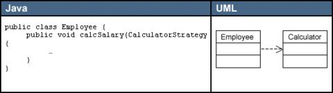

**关联（Association）**

实体之间的一个结构化关系表明对象是相互连接的。箭头是可选的，它用于指定导航能力。如果没有箭头，暗示是一种双向的导航能力。在Java中，关联（**图E**） 转换为一个实例作用域的变量，就像图E的“Java”区域所展示的代码那样。可为一个关联附加其他修饰符。多重性（Multiplicity）修饰符暗示 着实例之间的关系。在示范代码中，Employee可以有0个或更多的TimeCard对象。但是，每个TimeCard只从属于单独一个 Employee。

图E

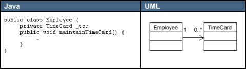

**聚合（Aggregation）**

聚合（**图F**）是关联的一种形式，代表两个类之间的整体/局部关系。聚合暗示着整体在概念上处于比局部更高的一个级别，而关联暗示两个类在概念上位于相同的级别。聚合也转换成Java中的一个实例作用域变量。

关联和聚合的区别纯粹是概念上的，而且严格反映在语义上。聚合还暗示着实例图中不存在回路。换言之，只能是一种单向关系。

图F

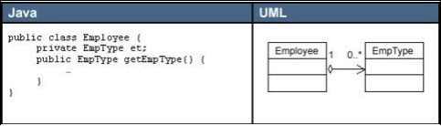

**合成（Composition）**

合成 （**图G**） 是聚合的一种特殊形式，暗示“局部”在“整体”内部的生存期职责。合成也是非共享的。所以，虽然局部不一定要随整体的销毁而被销毁，但整体要么负责保持局 部的存活状态，要么负责将其销毁。局部不可与其他整体共享。但是，整体可将所有权转交给另一个对象，后者随即将承担生存期职责。

Employee和TimeCard的关系或许更适合表示成“合成”，而不是表示成“关联”。

图G

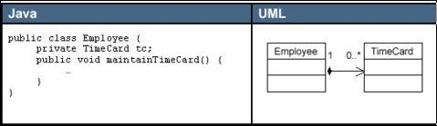

**泛化（Generalization）**

泛化（**图H**）表示一个更泛化的元素和一个更具体的元素之间的关系。泛化是用于对继承进行建模的UML元素。在Java中，用*extends*关键字来直接表示这种关系。

图H

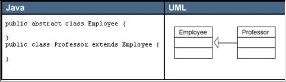

**实现（Realization）**

实例（**图I**）关系指定两个实体之间的一个合同。换言之，一个实体定义一个合同，而另一个实体保证履行该合同。对Java应用程序进行建模时，实现关系可直接用*implements*关键字来表示。

图I

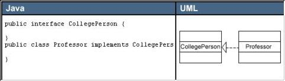

\-\-\-\-\-\-\-\-\-\-\-\-\-\-\-\-\-\-\-\-\-\-\-\-\-\-\-\-\-\-\-\-\-\-\-\-\-\-\-\-\-\-\-\-\-\-\-\-\-\-\-\-\-\-\-\-\-\-\-\-\-\-\-\-\-\-\-\-\-\-\-\-\-\-\-\-\-\-\-\-\-\-\-\-\-\-\-\-\-\-\-\-\-\-\-\-\-\-\-\-\-\-\-\-\-\-\-\-\-\-\-\-\-\-\-\-\-\-\-\-\-\-\-\-\-\-\-\-\-\-\-\-\-\-\-\-\-\-\-\-\-\-\-

UML类图关系主要有关联，依赖，泛化，实现等，那么它们的表示方法你是否熟悉，本文就像大家介绍一下UML类图关系的表示方法。

AD：

本节和大家一起学习一下UML类图关系的表示方法，主要包括关联，聚合，泛化，实现，依赖等内容，希望通过本节的学习大家对UML类图关系的表示方法有一定的掌握。下面是具体介绍。

UML基础

**1：UML类间关系的种类**

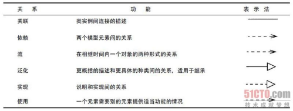

**2：关联**

UML类图关系中关联描述了系统中对象或实例之间的离散连接，关联带有系统中各个对象之间关系的信息。

2.1关联表示法

2.2聚集与组合

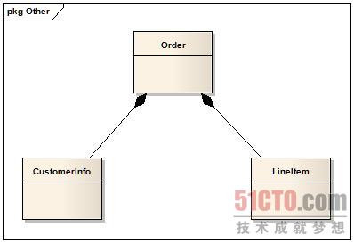

**3：泛化，继承【Generalization】**

UML类图关系中泛化关系是类元的一般描述和具体描述之间的关系，具体描述建立在一般描述的基础之上，并对其进行了扩展。

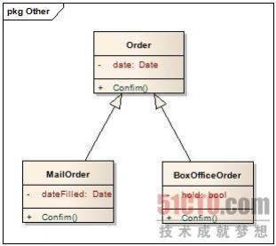

**4：实现【realization】**

UML类图关系中实现关系将一种模型元素（如类）与另一种模型元素（如接口）连接起来，其中接口只是行为的说明而不是结构或者实现。

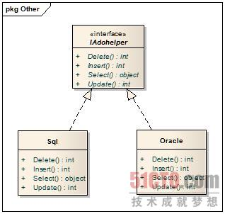

**5：依赖【Dependence】**

UML类图关系中依赖表示两个或多个模型元素之间语义上的关系。它只将模型元素本身连接起来而不需要用一组实例来表达它的意思。它表示了这样一种情形，提供者的某些变化会要求或指示依赖关系中客户的变化。

5.1依赖的种类

访问：允许一个包访问另一个包【access】

绑定：为模板参数赋值以生成一个新的模型元素【bind】

调用：声明一个类调用其他类的方法【call】

导出：声明一个实例可以从另一个实例中到处【derive】

友元：允许一个元素访问另一个元素而不论被访问元素的可见性【friend】

引入：允许一个包访问另一个包的内容并未被访问包的组成部分添加别名【import】

实例化：关于一个类的方法生成了另一个类的实例的生命【instantate】

参数：一个操作和他参数之间的关系【parameter】

实现：说明和其实之间的映射关系【realize】

精化：声明具有两个不同层次上元素的映射关系【refine】

发送：信号发送者和信号接受者之间的关系【send】

跟踪：声明不同模型中元素之间的连接，没有映射精确【trace】

使用：声明使用一个模型元素需要已存在的另一个模型元素，这样才能正确实现使用者的功能（调用，实例化，参数，发送）【use】

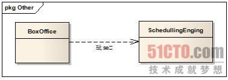

**6：约束**

UML类图关系中约束可以用来表示各种非局部的关系，如关联路径上的限制。约束尤其可以用来表述存在特性（存在X则C条件成立）和通用特性（对于Y中的所有y，条件D必须成立）。

**7：实例**

实例是有身份标识的运行实体，即它可以与其他运行实体相区分。它在任何时刻都有一个值，随着对实例进行操作值也会被改变。

\-\-\-\-\-\-\-\-\-\-\-\-\-\-\-\-\-\-\-\-\-\-\-\-\-\-\-\-\-\-\-\-\-\-\-\-\-\-\-\-\-\-\-\-\-\-\-\-\-\-\-\-\-\-\-\-\-\-\-\-\-\-\-\-\-\-\-\-\-\-\-\-\-\-\-\-\-\-\-\-\-\-\-\-\-\-\-\-\-\-\-\-\-\-\-\-\-\-\-\-\-\-\-\-\-\-\-\-\-\-\-\-\-\-\-\-\-\-\-\-\-\-\-\-\-\-\-\-\-\-\-\-\-\-\-\-\-\-\-\-\-\-\-

类与类之间存在以下关系: 

(1)泛化(Generalization) 

(2)关联(Association) 

(3)依赖(Dependency) 

(4)聚合(Aggregation) 

UML图与应用代码例子: 

1.泛化(Generalization) 

\[泛化\] 

表示类与类之间的继承关系，接口与接口之间的继承关系，或类对接口的实现关系。一般化的关系是从子类指向父类的，与继承或实现的方法相反。 

\[具体表现\] 

父类 父类实例＝new 子类() 

\[UML图\](图1.1) 

图1.1 Animal类与Tiger类,Dog类的泛化关系 

\[代码表现\] 
~~~ csharp
class Animal{}   

class Tiger extends Animal{}   

public class Test   

{   

    public void test()   

     {   

         Animal a=new Tiger();   

     }   

}  
~~~
2.依赖(Dependency) 

\[依赖\] 

对于两个相对独立的对象，当一个对象负责构造另一个对象的实例，或者依赖另一个对象的服务时，这两个对象之间主要体现为依赖关系。 

\[具体表现\] 

依赖关系表现在局部变量，方法的参数，以及对静态方法的调用 

\[现实例子\] 

比如说你要去拧螺丝，你是不是要借助(也就是依赖)螺丝刀(Screwdriver)来帮助你完成拧螺丝(screw)的工作 

\[UML表现\](图1.2) 

图1.2 Person类与Screwdriver类的依赖关系 

\[代码表现\] 
~~~ csharp
public class Person{   

    /\*\* 拧螺丝 */  

    public void screw(Screwdriver screwdriver){   

         screwdriver.screw();   

     }   

}  
~~~
3.关联(Association) 

\[关联\] 

对于两个相对独立的对象，当一个对象的实例与另一个对象的一些特定实例存在固定的对应关系时，这两个对象之间为关联关系。 

\[具体表现\] 

关联关系是使用实例变量来实现 

\[现实例子\] 

比如客户和订单，每个订单对应特定的客户，每个客户对应一些特定的订单；再例如公司和员工，每个公司对应一些特定的员工，每个员工对应一特定的公司 

\[UML图\] (图1.3) 

图1.3 公司和员工的关联关系 

\[代码表现\] 
~~~ csharp
public class Company{   

    private Employee employee;   

    public Employee getEmployee(){   

        return employee;   

     }   

    public void setEmployee(Employee employee){   

        this.employee=employee;   

     }   

    //公司运作   

    public void run(){   

         employee.startWorking();   

     }   

}  
~~~
(4)聚合（Aggregation） 

\[聚合\] 

当对象A被加入到对象B中，成为对象B的组成部分时，对象B和对象A之间为聚集关系。聚合是关联关系的一种，是较强的关联关系，强调的是整体与部分之间的关系。 

\[具体表现\] 

与关联关系一样，聚合关系也是通过实例变量来实现这样关系的。关联关系和聚合关系来语法上是没办法区分的，从语义上才能更好的区分两者的区别。 

\[关联与聚合的区别\] 

(1)关联关系所涉及的两个对象是处在同一个层次上的。比如人和自行车就是一种关联关系，而不是聚合关系，因为人不是由自行车组成的。 

聚合关系涉及的两个对象处于不平等的层次上，一个代表整体，一个代表部分。比如电脑和它的显示器、键盘、主板以及内存就是聚集关系，因为主板是电脑的组成部分。 

(2)对于具有聚集关系（尤其是强聚集关系）的两个对象，整体对象会制约它的组成对象的生命周期。部分类的对象不能单独存在，它的生命周期依赖于整体类的 对象的生命周期，当整体消失，部分也就随之消失。比如张三的电脑被偷了，那么电脑的所有组件也不存在了，除非张三事先把一些电脑的组件（比如硬盘和内存） 拆了下来。 

\[UML图\](图1.4) 

图1.3 电脑和组件的聚合关系 

\[代码表现\] 
~~~ csharp
public class Computer{   

    private CPU cpu;   

    public CPU getCPU(){   

        return cpu;   

     }   

    public void setCPU(CPU cpu){   

        this.cpu=cpu;   

     }   

    //开启电脑   

    public void start(){   

        //cpu运作   

         cpu.run();   

     }   

}
~~~
\-\-\-\-\-\-\-\-\-\-\-\-\-\-\-\-\-\-\-\-\-\-\-\-\-\-\-\-\-\-\-\-\-\-\-\-\-\-\-\-\-\-\-\-\-\-\-\-\-\-\-\-\-\-\-\-\-\-\-\-\-\-\-\-\-\-\-\-\-\-\-\-\-\-\-\-\-\-\-\-\-\-\-\-\-\-\-\-\-\-\-\-\-\-\-\-\-\-\-\-\-\-\-\-\-\-\-\-\-\-\-\-\-\-\-\-\-\-\-\-\-\-\-\-\-\-\-\-\-\-\-\-\-\-\-\-\-\-\-\-\-\-\-

**类图及类图中的关系**

1.类图和对象图 

    类图(Class Diagram)是显示出类、接口以及他们之间的静态结构与关系的图。其中最基本的单元是类或接口。

    类图不但可以表示类(或者接口)之间的关系，也可以表示对象之间的关系。下面是一个典型的类图：

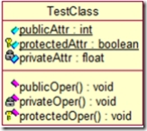

    类图一般分为几个部分：类名、属性、方法。下面分别讲解。

    (1)类名

    上面的Car就是类名，如果类名是正体字，则说明该类是一个具体的类，如果类名是斜体字，则说明类是一个抽象类abstract。

    (2)属性列表

    属性可以是public、protected、private。public前面的图标是菱形，protected对应的是菱形加钥匙，private对应的是菱形加锁。当然，这只是一种表现方式。我是用的是Rational Rose，如果用的是别的软件，还可能使用+、-、#表示：+代表public、-代表private、#代表protected。

    (3)方法列表

    方法可以是public、protected、private。public前面的图标是菱形，protected对应的是菱形加钥匙，private对应的是菱形加锁。当然，这只是一种表现方式。我是用的是Rational Rose，如果用的是别的软件，还可能使用+、-、#表示：+代表public、-代表private、#代表protected。

    对于静态属性，属性名会加上一条下划线。如上图所示。

    此外，类图既能表示类之间的关系，还能表示对象之间的关系。二者的区别是：对象图中对象名下面会加上一条下划线。

2.类图中的关系

    (1)Generalization：泛化、一般化

    Generalization表示的是类与类之间的继承关系、接口与接口之间的继承关系、类与接口之间的实现关系。如果体现到Java语言中，那就是反应extends和implements关键字。其典型类图如下所示：

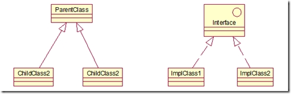

    (2)Association：关联关系

    关联关系描述的是类与类之间的连接，他表示一个类知道另一个类的属性和方法。关联关系可以是单向的或者双向的。在Java语言中，单向的关联关系是通过以实例变量的方式持有被关联对象的引用来实现的。一般来说是不建议使用双向的关联关系的。下面举例介绍单向的关联关系。

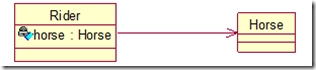

    上面的类图表现的是骑手和马之间的关系。Rider中有一个实例变量类型是Horse。

    每个连接都会有两个端点，上面的Rider和Horse就是端点，且每个端点都可以有(optional)一个基数(multiplicity)，表示这个类可以有几个实例。这个类似于数据库中的1：n、m：n这些关系。我们可以给上面的例子加上基数：

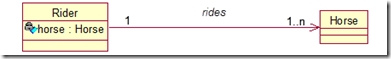

    上面表示的是骑手与马之间的1对n关系。

    (3)Aggregation：聚合关系

    聚合关系是关联关系的一部分，是非常强的关联关系。聚合关系表现的更多的是整体与部分的关系。例如汽车和车门、发动机之间的关系。如图所示：

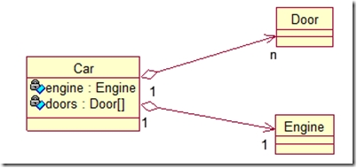

    与关联关系一样，聚合关系也是通过实例变量实现的。单纯从语法的角度基本上无法判断出关联关系和聚合关系。

(4)Composition:组合关系

   组合关系同样也是关联关系中的一种，这种关系是比聚合关系更加强的关系。我们前面提到，聚合关系表现的是整体与部分之间的关系，组合关系是在聚合关系的基础上，表示不可分割的整体与部分之间的关系。也就是说表示整体的对象需要负责表示部分的对象的生命周期。

   “代表整体的对象负责保持代表部分的对象的存活，在一些情况下负责将代表部分的对象湮灭掉。代表整体的对象某些时候可以将代表部分的对象传递给另外一个对象，并由它负责代表部分的对象的生命周期。换言之，代表部分的对象同一时刻只能与一个对象构成组合关系。并且由后者排他的负责其生命周期。”——《Java与模式》

   我们以人和手臂的关系举例，组合关系的类图如下：

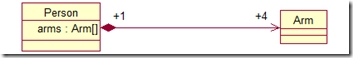

   (5)Dependency：依赖关系

   依赖关系表示一个类依赖于另一个类的定义。依赖关系是单方向的。人吃苹果，那么人依赖苹果。类图如下：

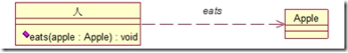

   一般来说，被依赖的对象往往是以局部变量、方法参数的形式存在于来对象中，与关联关系不同，它不会以成员变量的形式存在于以来对象中。这一点值得注意。另外，每一个依赖都有一个名称。上面这个依赖关系的名称就是eats。

   以上就是类图和常见的类图之间的关系。