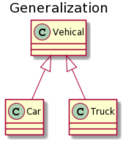

# 设计模式中的六种关系：依赖、关联、聚合、组合、实现、继承
以下类图使用 **[PlantUML](https://www.planttext.com/)** 绘制，更多语法及使用请参考: http://plantuml.com/ 。

面向对象设计模式中，类与类之间主要有6种关系，他们分别是：继承、实现、组合、聚合、关联、依赖。他们的耦合度依次减弱。

### ¶ 泛化关系 (Generalization)

用来描述继承关系，在 Java 中使用 extends 关键字。



```
@startuml

title Generalization

class Vehical
class Car
class Truck

Vehical <|-- Car
Vehical <|-- Truck

@enduml
```

### ¶ 实现关系 (Realization)

用来实现一个接口，在 Java 中使用 implement 关键字。


```
@startuml

title Realization

interface MoveBehavior
class Fly
class Run

MoveBehavior <|.. Fly
MoveBehavior <|.. Run

@enduml
```

### ¶ 组合关系 (Composition)

和聚合不同，组合中整体和部分是强依赖的，整体不存在了部分也不存在了。比如公司和部门，公司没了部门就不存在了。但是公司和员工就属于聚合关系了，因为公司没了员工还在。


```
@startuml

title Composition

class Company
class DepartmentA
class DepartmentB

Company *-- DepartmentA
Company *-- DepartmentB

@enduml
```

### ¶ 聚合关系 (Aggregation)

表示整体由部分组成，但是整体和部分不是强依赖的，整体不存在了部分还是会存在。


```
@startuml

title Aggregation

class Computer
class Keyboard
class Mouse
class Screen

Computer o-- Keyboard
Computer o-- Mouse
Computer o-- Screen

@enduml
```

### ¶ 关联关系 (Association)

表示不同类对象之间有关联，这是一种静态关系，与运行过程的状态无关，在最开始就可以确定；体现的是两个类、或者类与接口之间语义级别的一种强依赖关系。一般是长期性的，而且双方的关系一般是平等的。

代码层面体现形式为：

*   类B以类属性的形式出现在关联类A中。

也可以用 1 对 1、多对 1、多对多这种关联关系来表示。比如学生和学校就是一种关联关系，一个学校可以有很多学生，但是一个学生只属于一个学校，因此这是一种多对一的关系，在运行开始之前就可以确定。


```
@startuml

title Association

class School
class Student

School "1" - "n" Student

@enduml
```

### ¶ 依赖关系 (Dependency)

和关联关系不同的是，依赖关系是在运行过程中起作用的，可以简单的理解，就是一个类A使用到了另一个类B，而这种使用关系是具有偶然性的、临时性的、非常弱的。

A 类和 B 类是依赖关系主要有三种形式:

*   A 类是 B 类中的(某中方法的)局部变量；
*   A 类是 B 类方法当中的一个参数；
*   A 类向 B 类发送消息，从而影响 B 类发生变化；


```
@startuml

title Dependency

class Vihicle {
    move(MoveBehavior)
}

interface MoveBehavior {
    move()
}

note "MoveBehavior.move()" as N

Vihicle ..> MoveBehavior

Vihicle .. N

@enduml
```

### 组合和聚合的区别

组合和聚合的区别不是在形式上，而是在本质上

> **组合关系**(Composition)：如果A由B组成，表现为A包含有B的全局对象，并且B对象在A创建的时刻创建。

> **聚合关系**（Aggregation）体现的是A对象可以包含B对象，但B对象不是A对象的组成部分。具体表现为，如果A由B聚合成，表现为A包含有B的全局对象，但是B对象可以不在A创建的时刻创建。

比如在 A 类中引用 B 类的一个引用 b，当 A 类消亡时，b 这个引用所指对象也同时消亡（没有任何一个引用指向它，成了垃圾对象），这种情况叫**组合**，反之 b 所指的对象还会有另外的引用它，这种情况叫**聚合**。

以 Person、Hand、Compute 为例：

*   人和手是组合关系：手是人出生的时候就有了，当人死亡后人的手也复存在了。
*   人和电脑是聚合关系：其生命周期和人没用直接关系。

```java
public class Person {
    private Hand hand; // 组合
    private Computer computer; // 聚合

    public Person(Computer computer) {
        this.hand = new Hand(); // 构造时创建，一般来说 Person 对象回收时，hand对象同时回收
    }
		
		public void setComputer(Computer computer) {
				this.computer = computer; // 外部传入
		}

}
```

### 关联和依赖的区别

**关联**：体现的是两个类、或者类与接口之间语义级别的一种强依赖关系。一般是长期性的，而且双方的关系一般是平等的（这也可以作为和组合、聚合的区别点）。

*   类B以类属性的形式出现在关联类A中。

**依赖**：类A使用到了另一个类B，而这种使用关系是具有偶然性的、临时性的、非常弱的。

*   A 类是 B 类中的(某中方法的)局部变量；
*   A 类是 B 类方法当中的一个参数；
*   A 类向 B 类发送消息，从而影响 B 类发生变化；

**关联**：老公和老婆。

**依赖**：人和工具（我用锤子修了一下桌子，我和锤子之间就是一种依赖）。