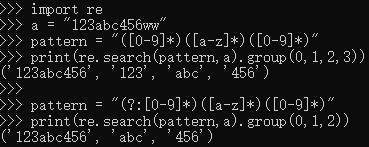
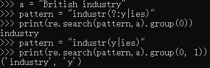

# 学习正则表达式时,这几个(pattern),(?:pattern),(?=pattern),(?!pattern)不明白
* (pattern)匹配pattern并捕获该匹配的子表达式.可以使用 $0...$9属性从结果"匹配"集合中检索捕获的匹配.若要匹配括号字符(),请使用""或者""或者"".
* (?:pattern)匹配pattern但不捕获该匹配的子表达式,即它是一个非捕获匹配,不存储供以后使用的匹配.这对于用"或"字符(|)组合模式部件的情况很有用.
  例如,与"industry|industries"相比,"industr(?:y| ies)"是一个更加经济的表达式.
* (?=pattern)执行正向预测先行搜索的子表达式,该表达式匹配处于匹配 pattern 的字符串的起始点的字符串.它是一个非捕获匹配,即不能捕获供以后使用的匹配.
  例如,"Windows (?=95| 98| NT| 2000)"与"Windows 2000"中的"Windows"匹配,但不与"Windows 3.1"中的"Windows"匹配.
        预测先行不占用字符,即发生匹配后,下一匹配的搜索紧随上一匹配之后,而不是在组成预测先行的字符后.
* (?!pattern)执行反向预测先行搜索的子表达式,该表达式匹配不处于匹配 pattern 的字符串的起始点的搜索字符串.它是一个非捕获匹配,即不能捕获供以后使用的匹配.
  例如,"Windows (?!95| 98| NT| 2000)"与"Windows 3.1"中的"Windows"匹配,但不与"Windows 2000"中的"Windows"匹配.
        预测先行不占用字符,即发生匹配后,下一匹配的搜索紧随上一匹配之后,而不是在组成预测先行的字符后.

# 正则表达式中(?:pattern)、(?!pattern)、(?＜=pattern)和(?＜!pattern)
## (?:pattern)

  ()表示捕获分组，()会把每个分组里的匹配的值保存起来，从左向右，以分组的左括号为标志，第一个出现的分组的组号为1，第二个为2，以此类推

  (?:)表示非捕获分组，和捕获分组唯一的区别在于，非捕获分组匹配的值不会保存起来

```python
import re
a = "123abc456ww"
pattern = "([0-9]*)([a-z]*)([0-9]*)"
print(re.search(pattern,a).group(0,1,2,3))

pattern = "(?:[0-9]*)([a-z]*)([0-9]*)"
print(re.search(pattern,a).group(0,1,2))
```



  可以看到 (?:\[0-9\]*) 匹配的第一个 \[0-9\]* 没有保存下来，即没有保存匹配到的“123”，而(\[0-9\]\*)则保存了下来。

  python中group(0)返回匹配到的整体

  (?:pattern)在使用 “或” 字符 (|) 来组合一个模式的各个部分是很有用。例如，‘industr(?:y|ies)’ 就是一个比 ‘industry|industries’ 更简略的表达式。因为我们单独存储下 “y” 或者 “ies” 没有什么意义

```python
a = "British industry"
pattern = "industr(?:y|ies)"
print(re.search(pattern,a).group(0))
# group(1)会报错，因为没有保存捕获到的“y”
pattern = "industr(y|ies)"
print(re.search(pattern,a).group(0, 1))
```



## (?=pattern)

  正向肯定预查（look ahead positive assert），匹配pattern前面的位置。这是一个非获取匹配，也就是说，该匹配不需要获取供以后使用。

  简单说，以 xxx(?=pattern)为例，就是捕获以pattern结尾的内容xxx

  例如，“Windows(?=95|98|NT|2000)“能匹配"Windows2000"中的"Windows”，但不能匹配"Windows3.1"中的"Windows”。预查不消耗字符，也就是说，在一个匹配发生后，在最后一次匹配之后立即开始下一次匹配的搜索，而不是从包含预查的字符之后开始。

## (?!pattern)

  正向否定预查(negative assert)，在任何不匹配pattern的字符串开始处匹配查找字符串。这是一个非获取匹配，也就是说，该匹配不需要获取供以后使用。

  简单说，以 xxx(?!pattern)为例，就是捕获不以pattern结尾的内容xxx

  例如"Windows(?!95|98|NT|2000)“能匹配"Windows3.1"中的"Windows”，但不能匹配"Windows2000"中的"Windows"。预查不消耗字符，也就是说，在一个匹配发生后，在最后一次匹配之后立即开始下一次匹配的搜索，而不是从包含预查的字符之后开始。

## (?<=pattern)

  反向(look behind)肯定预查，与正向肯定预查类似，只是方向相反。

  简单说，以(?<=pattern)xxx为例，就是捕获以pattern开头的内容xxx。

  例如，"(?<=95|98|NT|2000)Windows"能匹配"2000Windows"中的"Windows"，但不能匹配"3.1Windows"中的"Windows"。

## (?<！pattern)

  简单说，以(?<!pattern)xxx为例，就是捕获不以pattern开头的内容xxx。

  反向否定预查，与正向否定预查类似，只是方向相反。例如"(?<!95|98|NT|2000)Windows"能匹配"3.1Windows"中的"Windows"，但不能匹配"2000Windows"中的"Windows"。

## 参考资料

https://deerchao.net/tutorials/regex/regex.htm

https://www.runoob.com/regexp/regexp-metachar.html

https://blog.csdn.net/lxcnn/article/details/4304651

https://blog.csdn.net/shashagcsdn/article/details/80017678