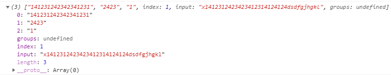
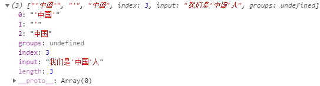
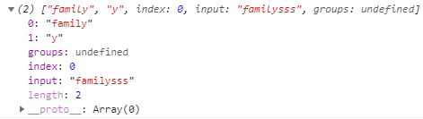
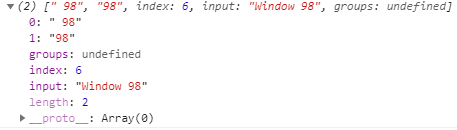
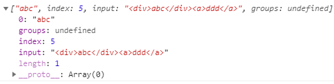

# 正则表达式基础用法及字符大全
# 一、正则表达式

正则表达式(regular expression)描述了一种字符串匹配的模式（pattern），可以用来检查一个串是否含有某种子串、将匹配的子串替换或者从某个串中取出符合某个条件的子串等。

# 二、正则表达式的作用

1.正则表达式可以从字符串中 查找 需要的数据  
2.正则表达式可以从字符串中 获取 需要的数据  
3.正则表达式可以从字符串中 替换 需要的数据

正则表达式通常被用来检索、替换那些符合某个模式(规则)的文本。

# 三、正则表达式中的两个方法

### test() : 返回一个boolean值，代表是否匹配

### exec() : 返回一个数组，数组中存放的是正则匹配的元素

exec()返回一个数组，数组中索引为0的元素 是整个正则表达式匹配的内容

索引大于0 的数据代表的是正则表达式中子表达式(分组)匹配的内容

```
index :代表匹配的元素的索引位置
groups:用来获取命名捕获分组匹配的数据
input :原始字符串式中 子表达式(分组)匹配的内容

```

# 四、JS中定义一个正则表达式

## 1\. 字面量定义

/…/ 以 / 开头，/ 结尾，中间的内容为正则表达式

```
let regex = /[abc]/

```

## 2\. new RegExp对象

```
let regex = new RegExp("[abc]")

```

上述的代码可以将一个字符串转成正则表达式

```
let regex = new RegExp(/[abc]/)

```

# 五、组成（符号）

## 1.正则表达式是由特殊的字符组成的

**\[ \]：中括号中可以写多个任意字符，代表只匹配一个字符**

```
[abc]:代表可以匹配a,b,c三个字符中的任意一个字符
[a-z]:匹配小写字母中的任意一个
[A-Z]:匹配大写字母中的任意一个
[A-Za-z]:匹配所有的字母
[0-9]:匹配任意一个数字

```

**\[^\] :如果中括号中以开头，代表非**

```
 [^0-9]:匹配非数字中的任意一个字符 
 [^a-z]:匹配非小写字母中的任意一个字符

```

```
\d :匹配任意一个数字，等价于[0-9]
\D :等价于[^0-9]
\w :匹配字母、数字和下划线中的任意一个字符串，等价于[A-Za-z]
\W :等价于[^a-zA-Z0-9_]
\s :匹配一个空白字符(空格和Tab制表符产生的空白)
\S :匹配任意一个非空白字符
.  :匹配除换行符之外的任意一个字符
\. :匹配一个点

```

```
X{n}  :匹配n个X
X{n, }:匹配至少n个X
X{n,m}:匹配n到m个X

```

代码示例（JavaScript）：  
判断一个字符串中，是否包含身份证号

```
let regex = /[1-9]\d{5}(\d{4})\d{7}(\d|[Xx])/;
let regex1 = new RegExp("abc");
var s = `x1412312423423412314124124dsdfgjhgkl`
console.log(regex.exec(s))

```

结果展示：  


## 2.贪婪式表达式

X* : 匹配0到多个，等价于X{0, }  
X+ : 至少匹配一个，等价于X{1, }  
X? : 匹配最多一个，等价于X{0,1}

## 3.非贪婪式表达式

X*? : 匹配0到多个  
X+? : 至少匹配一个  
X?? : 匹配最多一个

## 4.限定符

^ : 如果出现在正则的第一个位置，则代表以…开头  
$ : 如果出现在正则的尾部，代表以…结尾

## 5.选择符

**| : 或**

## 6.分组及引用

### 分组：

**(…) : 小括号，组从左到右进行查询**

### 引用：

**\\num : 引用第num组的匹配的内容，num从1开始**  
代码示例（JavaScript）：

```
let regex = /(["'])(.+)\1/;
let regex1 = new RegExp("abc");
var s = `我们是'中国'人`;
console.log(regex.exec(s))

```

结果展示：  


## 7.命名捕获组

**(?\\d+) 将\\d+匹配的内容赋值给key，可以通过exec().groups来进行获取**

## 8.? : 非捕获组匹配

family ==> families  
famil(?:y|ies) 此时的小括号不能算作分组

代码如下（示例）：

```
regex = /famil(y|ies)/
var s11 = "familysss";
console.log(regex.exec(s11))

```

结果展示：  


## 9.断言

**正向确定断言 ?=  
正向否定断言 ?!  
反向确定断言 ?<=  
反向否定断言 ?<!**  
代码示例1：

```
let version = "Window 98"
regex = /(?<=Window)\s+(\w+)/
console.log(regex.exec(version))

```

结果展示：  
  
代码示例2：

```
regex = /(?<=<(?:\w+)>).*?(?=<\/(?:\w+)>)/g
let str1 = "<div>abc</div><a>ddd</a>"
console.log(regex.exec(str1))

```

结果展示：  
