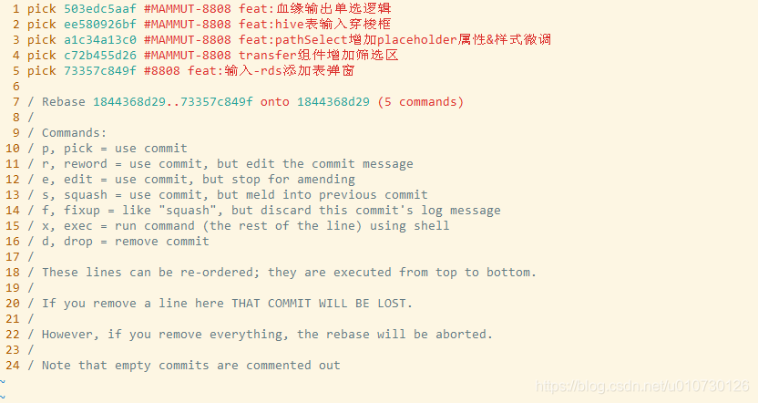

当我们在本地仓库开发时，暂存区可能有多次提交等待推送(git push)到远程，而我们目前只做完了其中某些需求，此时我们想要将做完的需求涉及的提交推送到远程，git push和git rebase -i就可以做到：

默认情况下，git push会推送暂存区所有提交（也即HEAD及其之前的提交），使用下面的命令可以改变此默认行为：
~~~bash
$ git push <remotename> <commit SHA>:<remotebranchname>
<remotename> 远程仓库名，默认为origin
<commit SHA> 提交的唯一码
<remotebranchname> 远程分支名
~~~
上面的命令会将暂存区内`<commit SHA>`代表的提交以及其之前尚未推送到远程的提交一起提交到远程。

**git push某个特定提交**
如果想要通过上面推送某一个特定的提交，需要保证这个提交之前没有其他的提交了，如果不是，我们可以通过git rebase -i改变提交的位置，使其之前没有其他提交：

`$ git rebase -i`
此命令会将暂存区的提交列出来供我们操作：
`git rebase -i`结果图

如果我们只想要将a1c34a13c0推送到远端，我们首先可以将其所在行移动到首行（vi下，光标定位到当前行，输入命令:m 0即可），然后保存退出（vi下，输入命令:x即可），然后按照上面的步骤进行：

`$ git push origin a1c34a13c0_after_rebase:develop`
这样我们就git push了某个特定提交。

rebase后相应提交的唯一码会变，a1c34a13c0_after_rebase表示经过rebase后的`<commit SHA>`。

**git push某些特定提交**
和git push某个特定提交类似，也是利用git rebase -i将需要推送到远程的多个提交移动到前面，然后找到自己想要推送的提交节点，利用上面的步骤，将其及其之前的提交推送到远程。