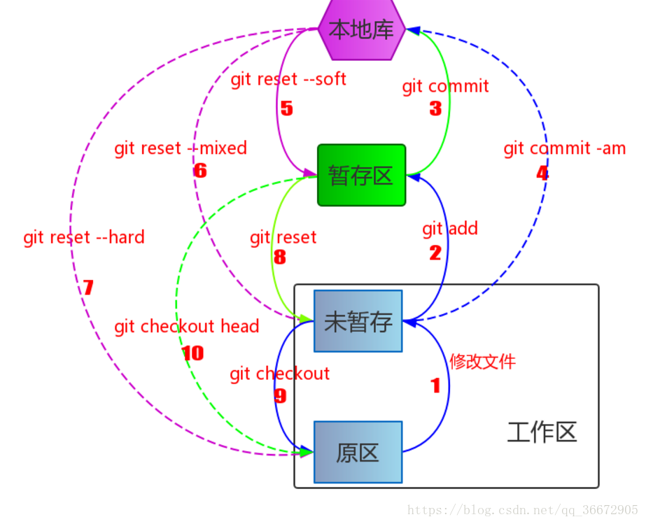
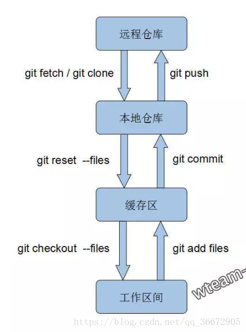
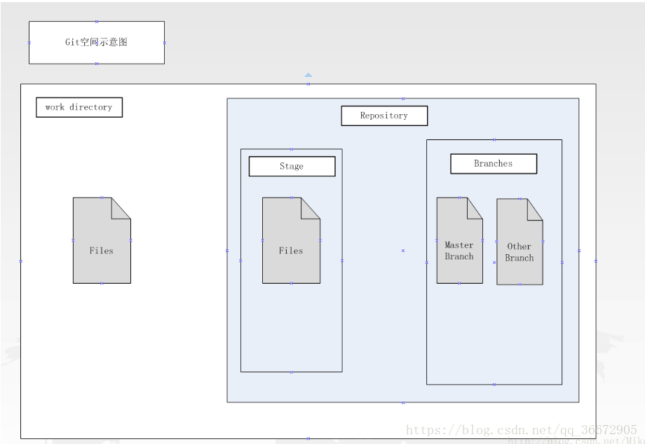
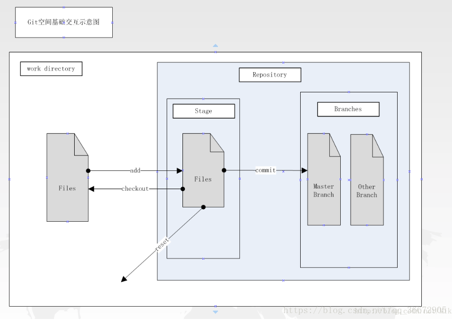
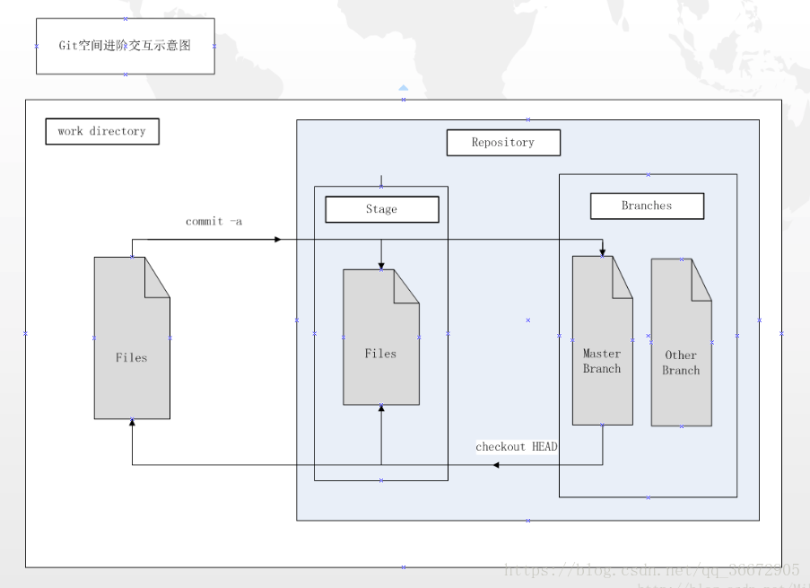
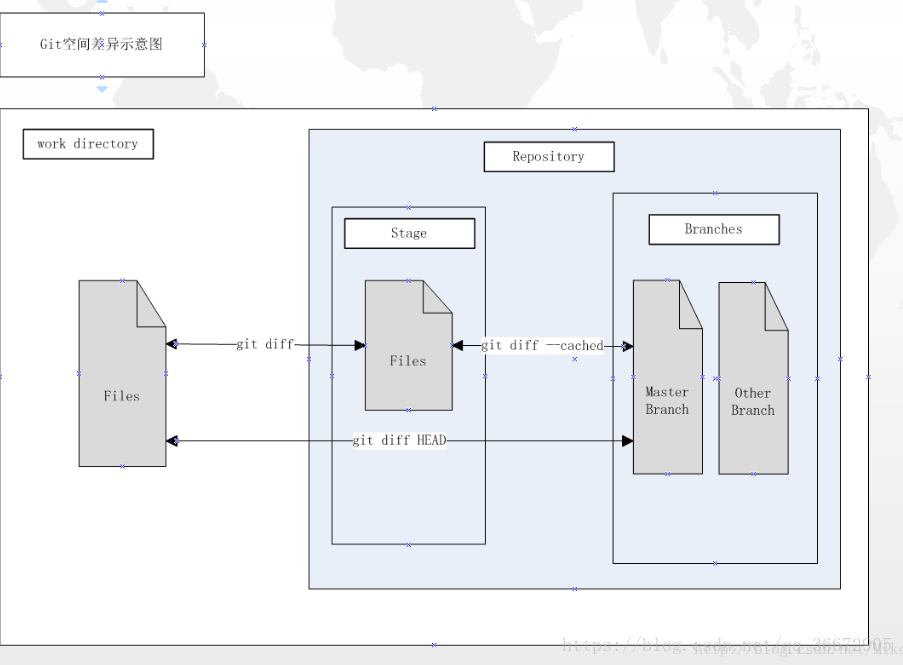

# git各区域的作用以及各区域之间的联系

Git的区域分为 工作区、暂存区、本地仓库区

#### 工作区（work directory）：一般就是我们项目的根目录。

#### 本地仓库（repository）：我们在为项目添加本地库之后，会在工作区生成一个如下图所示的隐藏目录“.git”，.git目录即为当前工作区的本地版本库

#### 暂存区（stage）：版本库中设立一个暂存区（Stage or Index），作为用来直接跟工作区的文件进行交互，工作区文件的提交或者回滚首选都是通过暂存区，而版本库中除了暂存区之外，文件的提交的最终存储位置是分支（Branch），在创建版本库的时候默认都会有一个主分支（Master）。

#### 

#### 

*   git add files：把当前工作文件拷贝到暂存区域。
*   git commit：在暂存区域生成文件快照并提交到本地仓库。
*   git reset – files：用来撤销最后一次 git add files；
*   git reset 撤销所有暂存区域文件；
*   git checkout – files：把文件从暂存区域覆盖到工作目录，用来丢弃本地修改。

#### 其中，reset操作是将暂存区内选中的目标文件从暂存区中丢弃，不影响其他任何区域的文件，等同于一个自刷新的动作；

相关命令

*   git commit -a 等同于连续执行 git add 与 git commit，即先把文件从工作目录复制到暂存区，然后再从暂存区复制到仓库中；
*   git checkout HEAD – files 的过程刚好相反，将工作区和暂存区都同步至当前分支内的状态；也就是最后一次commit的状态；
*   撤销操作主要有如下几种
*   git commit   \--amend        撤销上一次提交  并讲暂存区文件重新提交
*   git checkout \-- <file\> 拉取暂存区文件 并将其替换成工作区文件
*   git reset HEAD  \-- <file\> 拉取最近一次提交到版本库的文件到暂存区  改操作不影响工作区

相关命令

*   git diff：查看尚未暂存的文件更新了哪些部分；即当前状态下工作区和暂存区之间的差异。
*   git diff –cached：查看已暂存文件和上次提交时的快照之间的差异；即当前状态下暂存区和分支内的差异。
*   git diff HEAD：查看未暂存文件与最新提交文件快照的区别；即当前状态下工作区和分支内的差异。

**注意：此图解主要针对已跟踪状态文件而言，对于新增文件，有些操作会有问题。**

**1.** **修改本地已被跟踪文件，文件进入未暂存区域。**

**2.** **未暂存区域转到暂存区域**

*   **git add** *files*

**3.** **暂存区提交到本地仓库**

*   **git commit -m**

**4.** **直接从未暂存区提交到本地仓库**

*   **git commit -am**
*   经测试，对已跟踪的文件可以正确执行，而对于未跟踪文件（即新增文件）则会出错

**5.** **本地库回退到暂存区**

*   **git reset –soft** *hash**值*
*   **git reset –soft** *origin/master*
*   一般回退到暂存区的文件作排查用，不要直接修改，不然会同时出现在暂存区和未暂存区（其实即使修改了也木有太大关系）

**6.** **本地库回退到未暂存区**

*   **git reset –mixed** *hash**值*
*   **git reset –mixed** *origin/master*
*   一般回退到未暂存状态就是为了进一步的修改

**7.** **本地库回退到文件初始状态（即此版本的）**

*   **git reset –hard** *hash**值*
*   注意这里，通常先执行一次fetch，保证本地版本是origin的最新版本，然后再回退。（最厉害的是，这么操作不会有冲突，直接让文件变成和origin保持一致）
    *   **git fetch origin**
    *   **git reset –hard** *origin/master*
    *   特别注意：这么操作会使你对文件的修改全部消失，还原成最初状态。
*   (针对上一条情况衍生讲解)通常在推送到origin时，先要pull，然后再推送，一般是修改提交了的文件和pull下来的同一个文件产生冲突（所以建议修改代码前，一定先要pull）
    *   **git pull**
    *   **git push** *origin master*

**8.** **暂存区回退到未暂存区**

*   **git reset –** *files*
*   **git rest**
    *   撤销所有暂存区的文件

**9.** **未暂存区回退到文件初始状态**

*   **git checkout –** *files*

**10.** **暂存区回退到文件初始状态**

*   **git checkout head –** *files*