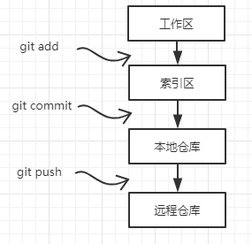
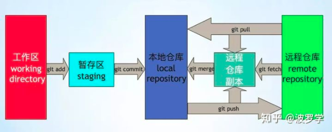
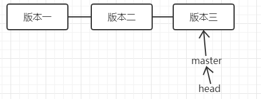
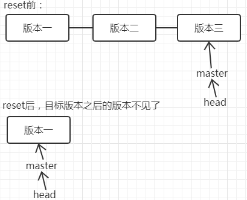
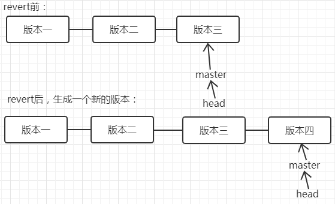
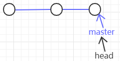
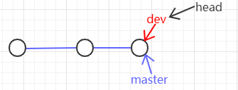
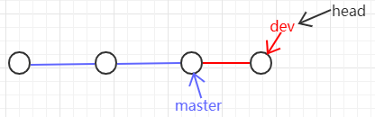

# 一文弄懂git的工作区、索引区、本地仓库、远程仓库以及add、commit、push三个操作
git中文件所在位置有四个：工作区、索引区、本地仓库、远程仓库。
处于四个位置中的文件所处的状态分别为untracked、unmodified、modified、staged。
通过三个操作可以把文件进行状态转移：git add 把工作区文件添加到索引区；git commit 把索引区文件添加到本地仓库；git push 把本地仓库文件添加到远程仓库。

为了方便记忆，自己想了一个不确定是否恰当的类比：如果类比我们平时的一个文档编辑活动。文件在工作区时，我们可以类比成我们准备好了一段要存储的内容；在索引区时，可以类比为我们在某个位置新建了一个word文档，往里输入了我们刚刚准备的内容，但是没有保存相当于这个时候git才知道这个文件的存在；文件在本地仓库时，相当于ctrl +s 把文件保存到了文件系统中；在远程仓库，就相当于我们把本地文件存储到了云盘。

以下内容引用了很多大佬的文章，因为本地整理的太早了，出处记录不详，后续慢慢补充参考信息。

**工作区(working directory)，** 简言之就是你工作的区域。对于git而言，就是的本地工作目录。工作区的内容会包含提交到暂存区和版本库(当前提交点)的内容，同时也包含自己的修改内容。

**暂存区(stage area,** 又称为索引区index)，是git中一个非常重要的概念。是我们把修改提交版本库前的一个过渡阶段。查看GIT自带帮助手册的时候，通常以index来表示暂存区。在工作目录下有一个.git的目录，里面有个index文件，存储着关于暂存区的内容。git add命令将工作区内容添加到暂存区。

**本地仓库(local repository)，** 版本控制系统的仓库，存在于本地。当执行git commit命令后，会将暂存区内容提交到仓库之中。在工作区下面有.git的目录，这个目录下的内容不属于工作区，里面便是仓库的数据信息，暂存区相关内容也在其中。这里也可以使用merge或rebase将远程仓库副本合并到本地仓库。图中的只有merge，注意这里也可以使用rebase。

**远程版本库(remote repository)，** 与本地仓库概念基本一致，不同之处在于一个存在远程，可用于远程协作，一个却是存在于本地。通过push/pull可实现本地与远程的交互；

**远程仓库副本,** 本地的一个分支，可以理解为存在于本地的远程仓库缓存。如需更新，可通过git fetch/pull命令获取远程仓库内容。

一、本地各区域之间的操作

1-1 工作区与本地缓存区

1、撤销对工作区的修改 (即在文件已经修改、但尚未add之前撤销对文件的修改）：git checkout

使用方法：

git checkout 文件名  
撤销对工作区修改；这个命令是以最新的存储时间节点（add和commit）为参照，覆盖工作区对应文件file；这个命令改变的是工作区

2、将本地距离上次commit之后的修改从工作区添加到缓存区 ： git add

使用方法：

git add 文件名   :  添加单个文件  
git add .  ：  将修改操作的文件和未跟踪新添加的文件添加到git系统的暂存区，注意不包括删除   
git add \-u ：将已跟踪文件中的修改和删除的文件添加到暂存区，不包括新增加的文件，注意这些被删除的文件被加入到暂存区再被提交并推送到服务器的版本库之后这个文件就会从git系统中消失了。 
git add \-A: 表示将所有的已跟踪的文件的修改与删除和新增的未跟踪的文件都添加到暂存区。

3、撤销向缓存区的add ： git reset

使用方法：

git reset HEAD 文件名 :
清空add命令向暂存区提交的关于file文件的修改；这个命令将修改重新放回到工作区，仅改变暂存区，并不改变工作区，这意味着在无任何其他操作的情况下，工作区中的实际文件同该命令运行之前无任何变化
git reset HEAD : 如果后面什么都不跟的话 就是上一次add 里面的全部撤销了

2-1 本地缓存区与本地仓库

1、将本地缓存区中的修改提交到本地仓库 ： git commit

使用方法：

git commit -m "提交说明"  ：  将add到缓存区的全部修改提交到本次仓库

**注意：**  
使用 git log 命令可以查看全部commit历史信息。  
commit命令会记录一条log，生成当前分支上的一个log节点（即一个版本），commit的一个个版本形成分支的生命线。 

二、本地各版本之间的操作

2-1 版本向后推进

git add
git commit \-m "info"

2-2 版本回退  ： git reset

修改头指针指向之前的版本，目标版本之后的版本都不再存储。

 使用方法：

git log : 查找要回退到的目标版本号
git reset \--hard 目标版本号 : 回退到目标版本

**适用场景：** 如果想恢复到之前某个提交的版本，且那个版本之后提交的版本我们都不要了，就可以用这种方法。

**注意：** 此时如果git push 到远程会报错，因为当前本地版本比远程版本要低，使用git push -f 可以强制推上去（当然前提得远程允许推，公司的代码库一般会有限制）

2-3 撤销提交 ： git revert

撤销某次提交，和reset不同的是之前commit的历史都还保存在版本库中。

 比如，我们commit了三个版本（版本一、版本二、 版本三），突然发现版本二不行（如：有bug），想要撤销版本二的提交，但又不想撤销版本三的提交，就可以用 git revert 命令来逆向操作版本二，生成新的版本四，这个版本四里会保留版本三的东西，但撤销了版本二的东西。

使用方法：

git log 查看要反做的目标版本号
git revert \-n 目标版本号  撤销目标版本号所做的修改
git commit \-m "message"   commit此次反做操作

**适用场景：** 如果我们想撤销之前的某一版本，但是又想保留该目标版本后面的版本，记录下这整个版本变动流程，就可以用这种方法。

三、本地各分支之间的操作

3-1 默认master分支

一个分支就是一条时间线，默认有一条时间线master，其中有个指针master，这个master指针是指向提交的，每次提交，master指针都会向后移一位，这样不断去提交，master分支就会越来越长。还有个HEAD指针，这个指针指向当前所在分支的的指针。

 3-2 分支创建

若创建新分支，如dev分支，git会新建一个dev指针，与master指针功能一样。先是指向和master同样的位置，当checkout切换到dev分支时候，HEAD指针就指向了dev指针了，当在dev分支下提交，dev指针向后移动。

 

 使用方法：

git branch branch\_name : 基于当前commit创建一个新的分支
git branch : 查看全部分支

3-3 分支切换

即移动head指针，指向目标分支指针：git checkout branch\_a。注意只有分支干净的时候才能提交，要是分支干净共有两种方法，要么把修改commit提交，要么把修改暂存

使用方法：

commit方法：

git add .  
git commit \-m "message" git checkout branch\_b

或，stash暂存

; "复制代码")

git add .
git stash
git checkout branch\_b

在branch\_b做完操作又想回到branch\_a的时候

git checkout branch\_a
git stash pop 

; "复制代码")

**git stash 具体使用见后**

****注意：**** 在切换分支之前一定要commit 或 stash 当前分支上的修改，否则在当前分支上做的操作会直接带到目标分支，当在目标分支上执行commit操作的时候这些修改就被提交到目标分支，容易造成代码混乱。

git commit会把修改提交，体现在分支的时间线上。如果还不想提交（过多没有阶段性成果的提交会使得分支时间线不清晰） git stash是把修改暂存，不会体现在时间线上，重新回到分支后，pop之前暂存的内容，可以继续修改

**git stash使用**

; "复制代码")

git stash : 将未提交的修改保存至堆栈中

git stash save "stash message info" ： 为此次stash添加说明信息，便于以后查看

git stash list ： 查看stash栈中的内容

git stash pop : 将stash中的内容弹出，并应用到当前分支对应的工作目录上，该命令将堆栈中最近保存的内容删除（出栈操作）

git stash apply stash名称 : 将指定id的内容应用到当前分支的工作目录，内容不会删除，可以在多个分支上重复进行操作

git stash drop stash名称 ：从堆栈中移除某个指定的stash

git stash clear ： 清除堆栈中的所有 内容

git stash show ： 查看堆栈中最新保存的stash和当前目录的差异。

git stash branch ： 从最新的stash创建分支。
应用场景：当储藏了部分工作，暂时不去理会，继续在当前分支进行开发，后续想将stash中的内容恢复到当前工作目录时，如果是针对同一个文件的修改（即便不是同行数据），那么可能会发生冲突，恢复失败，这里通过创建新的分支来解决。可以用于解决stash中的内容和当前目录的内容发生冲突的情景。

; "复制代码")

3-4 合并分支

分支合并，操作很简单，若将dev分支内容合到master上，就是将master的指针指向dev指针指向的位置即可。

*   git merge --no-ff branch\_name 将branch\_name分支合并到当前分支。

git merge：默认情况下，Git执行"快进式合并"（fast-farward merge），会直接将Master分支指向Develop分支。 使用--no-ff参数后，会执行正常合并，在Master分支上生成一个新节点。为了保证版本演进的清晰，建议采用这种方法。

*   git rebase

解决冲突

删除分支

删除分支就是将指向分支的指针（如dev）删除掉

**使用方法：**

git checkout branch\_a 切换到其他分支
git branch \-d branch\_b 删除分支

四、本地与远程之间的操作

4-1 向远端

*   git push 将本地仓库推送到远端仓库

git add
git commit
git pull 
解决冲突
git push

4-2 向本地

; "复制代码")

git fetch : 使用远程仓库中的内容更新远程仓库副本。此时并未合并到本地仓库，即本地仓库的代码没有被修改，知识拉取了远程commit数据。

git merge : 实现远程仓库与本地仓库的合并

git pull  :下拉远程分支并与本地分支合并（使用远程仓库的内容更新远程仓库副本以及本地仓库）。根据配置的不同，相当于git fetch \+ git merge 或 git fetch + git rebase。

git clone   :   本地没有 repository 时，将远程 repository 整个下载过来。

; "复制代码")