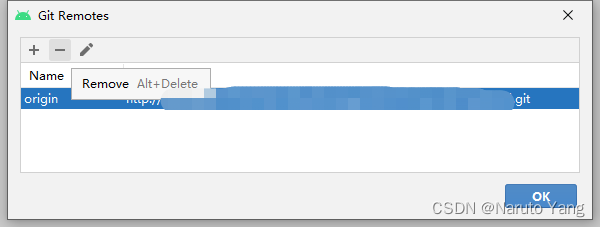

# 从本地git仓库恢复代码到远程仓库

## 起因
前段时间，公司机房空调坏了，代码仓库服务器烧了，所有代码一夜之间灰飞烟灭……幸好我本地代码仓库是完整的，问题不大。然而，我看到有部分同事想用本地最新代码以初始版本上传，要知道我们本地可是有完整仓库，历史提交记录可都在呢，你这重新以初始版本上传，那不就丢了原来那些记录了嘛，于是我立即出手制止。沟通一番原来他不知道可以用本地仓库恢复历史记录，同时我自己恢复仓库时也走了点弯路，于是我觉得有必要写点东西，一来帮助同样不知道如何用本地仓库恢复远程仓库的人，二来也是记录一下，怕自己后来又走弯路。
## 步骤
首先，确保你的账号密码能登录git，在浏览器打开git，输入账号密码，能登录成功就行。
然后，在工程目录里右键打开“git Bash”,

如果账号已修改，需修改本地git配置，在gitBash里输入“$ git config user.email xxx.@xx.com” ，其中xxx.@xx.com是你的邮箱。
接下来解除旧仓库与工程的关联，可以用git命令行“$ git remote rm origin”，
也可以在代码编辑软件里解除，以Android Studio 为例：

点击“Remove”，然后点击“ok”按钮。
接下来就是最重要的一步：创建仓库并将本地仓库上传。
先复制你的git url 

在后面拼接你的工程名+“.git”，接下来就按下图依次输入三条命令即可

最后要说一点，git提交记录是恢复了，但是分支恢复程度取决于你本地分支的完整度，即，如果旧仓库除主分支之外有10个分支，本地仓库只拉取了5个分支，那么用本地恢复除主分支外就只有5个分支了。