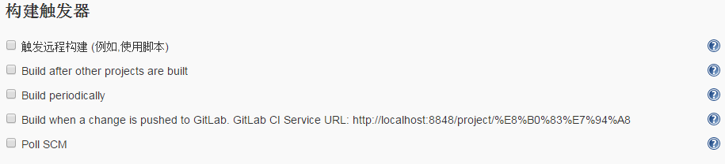
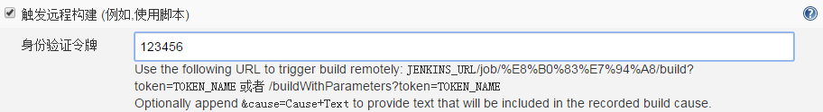
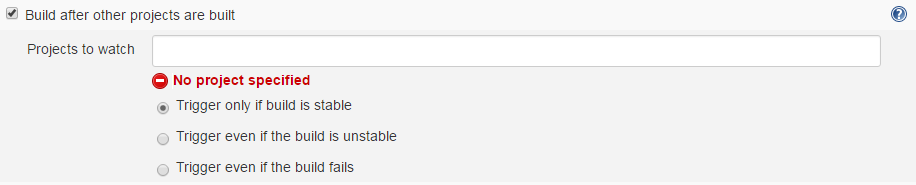
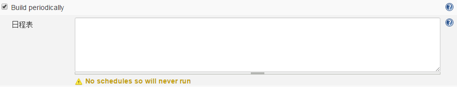
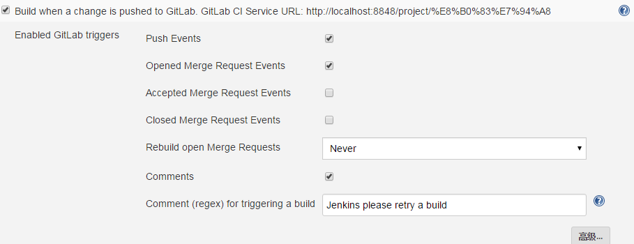
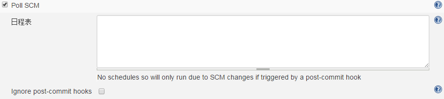

​

转自：[Jenkins 构建触发器操作详解 - 习久性成 - 博客园](https://www.cnblogs.com/hls-code/p/15481897.html "Jenkins 构建触发器操作详解 - 习久性成 - 博客园")

# 前言

​

# 触发远程构建

【https://www.cnblogs.com/Rocky\_/p/8297260.html】

例如，使用脚本：通过一个网址的访问来触发构建，这样就不需要登录jenkins系统也能触发构建了。

​

 示例地址：

http://localhost:8848/job/FlashRegistration/build??token=口令&cause=书写构建原因

http://localhost:8848/job//buildWithParameters?token=123456&cause=书写构建原因

# Build after other projects are built

在其他项目触发的时候触发；里面有分为三种情况，也就是其他项目构建成功、失败、或者不稳定的时候触发项目。

​

# Build periodically

隔一段时间build一次，不管版本库代码是否发生变化，比如说填好日程表，每天晚上12:00构建一次，通常不会采用此种方式。

​

# Build when a change is pushed to GitLab

如果装了GitLab Plugin插件就会出现，不详解了主要用于Jenkins与GitLab相结合来在提交代码到GitLab后，触发构建。 

​

# Poll SCM

按照设定的时间规则，先比较一次源代码是否发生变更，如果发生变更，那么就按设定的时间规则（例如：每天晚上12:00）build。否则，不进行build，通常采用这种方式。

​

日程表：

日程表参数解释如下：

第一个参数代表的是分钟 minute，取值 0~59；

第二个参数代表的是小时 hour，取值 0~23；

第三个参数代表的是天 day，取值 1~31；

第四个参数代表的是月 month，取值 1~12；

最后一个参数代表的是星期 week，取值 0~7，0 和 7 都是表示星期天。

示例：

每10分钟构建一次：H/10 \* \* \* \* 或\*/10 \* \* \* \*
每天8点构建一次：0 8 \* \* \*
每天8点~17点，两小时构建一次：0 8-17/2 \* \* \*
周一到周五，8点~17点，两小时构建一次：0 8-17/2 \* \* 1-5
1-6月中每月1号、30号各构建一次：H H 1,30 1-6 \*

​