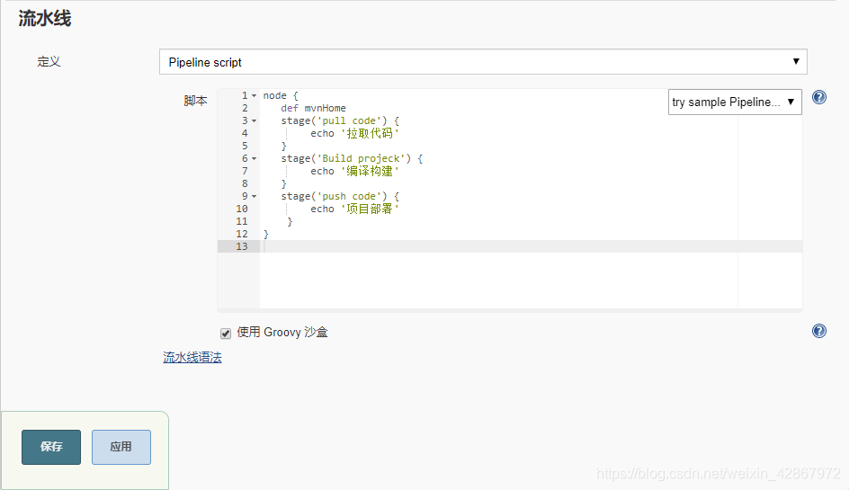

转自：[Jenkins项目常用三种构建类型风格详解\_ぃ小小宇宙的博客-CSDN博客\_jenkins项目类型](https://blog.csdn.net/weixin_42867972/article/details/105579391 "Jenkins项目常用三种构建类型风格详解_ぃ小小宇宙的博客-CSDN博客_jenkins项目类型")

### Jenkins构建的项目类型介绍

jenkins 的安装配置请参考：[《jenkins war包安装部署，tomcat+JDK+maven》](https://blog.csdn.net/weixin_42867972/article/details/105560965 "《jenkins war包安装部署，tomcat+JDK+maven》")

Jenkins中自动构建项目的类型有很多，常用的有以下三种：

自由风格软件项目（ FreeStyle Project）  
Maven 项目（Maven Project）  
流水线项目（ Pipeline Project）  
  
每种类型的构建其实都可以完成一样的构建过程与结果，只是在操作方式、灵活度等方面有所区别，在实际开发中可以根据自己的需求和习惯来选择。（**PS：** **个人推荐使用流水线类型，因为灵活度非常高**）

实验用的是简单的 maven 打包的项目，需要的小伙伴可以到我的GitHub拉取：[GIthub实验构建项目](https://github.com/arosendeng/rosen-jenkins "GIthub实验构建项目")。项目构建会部署到远程 Tomcat 的服务器上


## 先配置 Tomcat 服务器：

1、wget 安装tomcat9的版本 ：

```
wget http://mirrors.hust.edu.cn/apache/tomcat/tomcat-9/v9.0.34/bin/apache-tomcat-9.0.34.tar.gz
tar -xf apache-tomcat-9.0.34.tar.gz && mv apache-tomcat-9.0.34 /usr/local/tomcat
chmod +710 /usr/local/tomcat/bin/*.sh
```

2、用户配置，设置登录的用户密码都是： **tomcat**

```
[root@jenkins conf]# vim /usr/local/tomcat/conf/tomcat-users.xml
    .....
         <role rolename="tomcat"/>
         <role rolename="role1"/>
         <role rolename="manager-script"/>
         <role rolename="manager-gui"/>
         <role rolename="manager-status"/>
         <role rolename="admin-gui"/>
         <role rolename="admin-script"/>
        <user username="tomcat" password="tomcat" roles="tomcat,manager-script,manager-gui,manager-status,admin-gui,admin-script"/>
</tomcat-users>

为了配的用户能登录到，还需要对一下进行修改
[root@enkins META-INF]# vim /usr/local/tomcat/webapps/manager/META-INF/context.xml
        <!--
  <Valve className="org.apache.catalina.valves.RemoteAddrValve"
         allow="127\.\d+\.\d+\.\d+|::1|0:0:0:0:0:0:0:1" />
        -->
停止tomcat并重新启动即可
```

3、通过远程的 Tomcat 地址登录即可：http://loschost:8080/manager/html


> 项目构建环境需要安装插件：Deploy to container(部署到远程Tomcat插件) 和 Maven Integration(maven项目类型)、Pipeline(流水线项目类型)

## 项目类型一、自由风格项目构建

项目构建流程：拉取代码->编译->打包->部署

1、创建新的自由风格的项目，配置拉取的地址


2、编译打包

构建->添加构建步骤->Executor Shell

```
echo "start：编译和打包"
mvn clean package
echo "end：编译和打包"
```

构建->构建后操作->Deploy war/ear to a container （前面一定要安装Deploy to container插件）  
构建->构建后操作->Deploy war/ear to a container -> Containers 选择对应的tomcat版本，这里用的是 **Tomcat 9.x Remote**  
没有凭证可以先添加凭证，凭证就是远程Tomcat登录的账号密码：http://loschost:8080/manager/html


3、构建测试：

  
打包完成后到Tomcat Web应用程序管理者点击打开：http://loschost:8080/manager/html  
  
  
如果显示此页面则表示部署成功

## 项目类型二、Maven 项目

1、创建项目，配置项目

创建项目时候选择 “构建一个 mvaen 项目”，拉取代码和远程部署的过程和自由风格项目一样，只是"构建"部分不同（前面需要安装 Maven Integration 插件）

```
Root POM：pom.xml	对应GitHub上面的xml文件名
Goals and options：clean package
```

  
配置完成构建出来的结果和自由风格的一样

## 项目类型三、Pipeline 流水线项目（Pipeline Script 或 Pipeline Script from SCM）

Pipeline Script 1、简介

```
stages ：代表整个流水线的所有执行阶段。通常stages只有1个，里面包含多个stage
stage ：代表流水线中的某个阶段，可能出现n个。一般分为拉取代码，编译构建，部署等阶段。
steps：代表一个阶段内需要执行的逻辑。steps里面是shell脚本，git拉取代码，ssh远程发布等任意内
容。
```

```
1 ）概念
Pipeline，简单来说，就是一套运行在 Jenkins 上的工作流框架，将原来独立运行于单个或者多个节点
的任务连接起来，实现单个任务难以完成的复杂流程编排和可视化的工作。

2）使用 Pipeline 有以下好处（来自翻译自官方文档）：
代码：Pipeline以代码的形式实现，通常被检入源代码控制，使团队能够编辑，审查和迭代其传送流
程。 持久：无论是计划内的还是计划外的服务器重启，Pipeline都是可恢复的。 可停止：Pipeline可接
收交互式输入，以确定是否继续执行Pipeline。 多功能：Pipeline支持现实世界中复杂的持续交付要
求。它支持fork/join、循环执行，并行执行任务的功能。 可扩展：Pipeline插件支持其DSL的自定义扩
展 ，以及与其他插件集成的多个选项。

3）如何创建和使用 Jenkins Pipeline
Pipeline  支持两种语法：Declarative(声明式)和 Scripted Pipeline(脚本式)语法
Pipeline  也有两种创建方法：可以直接在 Jenkins 的 Web UI 界面中输入脚本；也可以通过创建一
个 Jenkinsfile 脚本文件放入项目源码库中
```

2、创建新的自由风格项目（两个代码类型二选一即可）

代码类型一：流水线 -> 选择HelloWorld模板


```
pipeline {
   agent any

   stages {
      stage('pull code') {
         steps {
            echo '拉取代码'
         }
      }
        stage('Build projeck') {
         steps {
            echo '编译构建'
         }
      }
        stage('push code') {
         steps {
            echo '项目部署'
         }
      }
   }
}

stages ：代表整个流水线的所有执行阶段。通常stages只有1个，里面包含多个stage
stage ：代表流水线中的某个阶段，可能出现n个。一般分为拉取代码，编译构建，部署等阶段。
steps：代表一个阶段内需要执行的逻辑。steps里面是shell脚本，git拉取代码，ssh远程发布等任意内容。
```

编写一个简单声明式 Pipeline：

代码类型二：流水线 -> 选择Scripted Pipeline

```
node {
   def mvnHome
   stage('pull code') {
        echo '拉取代码'
   }
   stage('Build projeck') {
        echo '编译构建'
   }
   stage('push code') {
        echo '项目部署'        
    }   
}

Node ：节点，一个 Node 就是一个 Jenkins 节点，Master 或者 Agent，是执行 Step 的具体运行
环境，Jenkins的Master-Slave架构的时候用到。
Stage ：阶段，一个 Pipeline 可以划分为若干个 Stage，每个 Stage 代表一组操作，比如：
Build、Test、Deploy，Stage 是一个逻辑分组的概念。
Step ：步骤，Step 是最基本的操作单元，可以是打印一句话，也可以是构建一个 Docker 镜像，
由各类 Jenkins 插件提供，比如命令：sh ‘make’，就相当于我们平时 shell 终端中执行 make 命令
一样。
```

编写一个简单的脚本式 Pipeline：  
  
构建测试观察效果：  


构建得出的结果都一样

3、配置一个完整的 pipeline 脚本（这里用的是：代码类型一，声明式脚本）

在对应项目下 “流水线语法” 可以编写完成的 pipeline 脚本  
  
通过生成器生成对应的 pipeline 脚本代码  
  
代码拉取选择：checkout：Check out from version control  
构建选择：sh：Shell Script  
推送发布选择：deploy：Deploy war/ear to a container

```
pipeline {
   agent any

   stages {
      stage('pull code') {
         steps {
            checkout([$class: 'GitSCM', branches: [[name: '*/master']], doGenerateSubmoduleConfigurations: false, extensions: [], submoduleCfg: [], userRemoteConfigs: [[credentialsId: 'a20e4f7f-6d66-4055-9cbc-115cc9827664', url: 'https://github.com/arosendeng/rosen-jenkins.git']]])
         }
      }
        stage('Build projeck') {
         steps {
            sh label: '', script: 'mvn clean package'
         }
      }
        stage('push code') {
         steps {
            deploy adapters: [tomcat9(credentialsId: 'b1ca6678-8339-43bb-a0da-c3935c509dc2', path: '', url: 'http://192.168.66.102:8080/')], contextPath: null, war: 'target/*.war'
         }
      }
   }
}
```

构建测试，发现可以构建成功

Pipeline Script from SCM

刚才都是直接在 Jenkins 的 UI 界面编写 Pipeline 代码，这样不方便脚本维护，建议把 Pipeline 脚本放在项目中（一起进行版本控制）

1、在项目根目录建立 Jenkinsfile 文件，把内容复制到该文件中

文件放到项目的：src 目录下，命名 Jenkinsfile  
  
把 Jenkinsfile 上传到 GitHab

2、引用文件

注意路径：Jenkinsfile 在 src下，路径为 **src/Jenkinsfile**  
  
以上的简单实验操作为了对上述三种常用的构建方式多熟悉！！！以上的知识点学习都是来自 **”黑马程序员“**