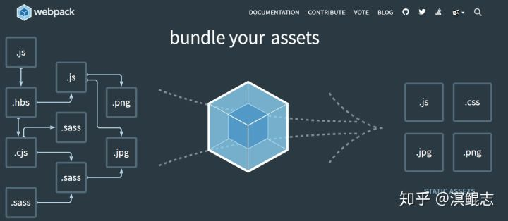

​

转自：[自动化构建、自动化部署发布一览 - 知乎](https://zhuanlan.zhihu.com/p/103611151 "自动化构建、自动化部署发布一览 - 知乎")

在软件系统开发的过程中，一个项目工程通常会包含很多的代码文件、配置文件、第三方文件、图片、样式文件等等，是如何将这些文件有效的组装起来最终形成一个可以流畅使用的应用程序的呢？答案是借助构建工具或策略。就好像一场大型音乐会上总指挥将不同的管弦乐有效的协调起来，完成一场精彩绝伦的演出。而如果在构建的过程中依赖人手工进行编译，工作起来会很繁琐，于是就有了自动化构建、自动化发布、部署的想法和探索，通过使用程序自动化的完成系列操作，将大大提升工作效率。

​

我们日常接触到的通常有前端和后端的开发项目，前端使用框架又通常有jQuery、vue、react等，后端又有C\\C++、Java、Python、Go、node等不同编程语言的不同框架项目，每种开发框架使用的构建工具会有一定的区别，但在做自动化构建的思路上有一定的相通性，这里找几款工具来说一下自动化构建、发布的过程、思路和原则。

**一、Make\Cmake**

如果在Linux系统上使用过开源项目的同学可能了解过make、makefile，首先系统已安装了gcc或g++等C环境编译器，我们通常下载完开源源代码并执行make,程序就自动的按照makefile中约定的规则将.c或.cpp的文件编译成可执行的程序文件，通常执行make install 将编译好的程序、配置文件放置到指定的目录下完成程序的部署安装。当然这里说的是编译别人已经写的程序，如果是自己从头到尾的开发C、C++项目，则需要自己来编写makefile文件，makefile就是一系列的规则约束，将不同的程序文件链接起来，就好像一个演出，每个演员有自己的剧本和台词，还有一个负责将不同演员衔接好并按照既定的剧情推进的连接人----导演。Cmake可以理解为Make的升级版，不需要编写复杂的makefile文件，而是通过Cmakelist来自动生成makefile，不过Cmakelist也是一种编译的规则约束，相对makefile更简约一些。

​

**二、Ant\Maven**

在构建Java类的项目时，通常采用的有Ant、Maven和Gradle。当然也可以手工写脚本借助javac编译或通过IDE等相对原始的构建方式，不过追本溯源Ant、Maven和Gradle也都是基于原始的构建原则进行封装，从而提供更友好、更有效率的构建流程。Ant是通过l编写build.xm构建规则进行程序的编译打包，有点类似makefile。Maven和Gradle都采用包依赖的方式进行管理，Maven的POM.xml用groupId、artifactId、version组成的Coordination（坐标）唯一标识一个依赖，Gradle的思路和Maven类似但做法上不同，它包含build.gradle和settings.gradle两个文件。Maven和Gradle有仓库的概念，用于存放项目依赖的第三方库，这样在制作war包时不用把所有依赖的第三方文件都放到里面，而是实际程序启动时根据环境的设置找对应的依赖文件，不过Ant制作的war包是提前把依赖的文件都放进去。

​

**三、Grunt、Gulp、Webpack**

前端的构建工具常见的有Grunt、Gulp、Webpack三种，gulp是一个自动化构建工具，是Grunt的升级版，主要用来设定程序自动处理静态资源的工作，也即是对前端项目资源进行打包，通常有些项目文件很大，使用Gulp压缩之后文件的体积就变的很小而功能不减。Webpack侧重于前端模块的打包，最初Webpack本身就是为前端JS代码打包而设计的，后来被扩展到其他资源的打包处理。Webpack是通过loader（加载器）和plugins（插件）对资源进行处理的。Gulp是对整个前端资源进行整合、归置，至于文件之间的调用关系是不做具体的管理，而Webpack是通过解析文件之间的引用关系进行资源的管理。

​

**四、Jenkins**

Jenkins是一个集构建、发布、部署为一体的综合性工具，DevOps中常提到CI/CD（自动化构建、部署），但它本身是不提供构建、发布和部署的功能，而是可以在其上安装插件的方式与其他构建、发布、部署工具形成连动，它更像是一个集成能力特别强的调度、协调工具，借助于它的这种特性，现在通常的做法是用户提交代码到版本仓库（GitHub、GitLab），Jenkins定期从仓库中获取最新代码并调用打包工具进行项目构建，构建成功后将程序包写入到docker镜像推送到镜像服务器，进而通知应用服务器拉取镜像文件启动应用。当然中间的流程根据实际的情况有所不同，比如构建war包部署到tomcat服务器中，亦或者Android 应用构建apk包发布到应用商店，供下载验证。

​

限于篇幅的原因，没有对各类构建工具进行更详细的说明和操作展示，自动化构建、发布部署的产品也不止这些，GitLab的runner也能实现类似的功能效果，本文的这些将会在后续分别进行深入更细致的介绍。本文更希望透过工具本身了解工具设计的思路和原则，并尽可能的将这些思路用在我们的产品研发以及处理问题上。

文中提到的这些工具都是被广泛使用、经得住使用考验的好产品，首先它们都是立**足于解决实际工作中迫切的问题**，其次**操作使用较友好**，另外设计的**产品通用性较强**，不是陷于某一类具体的问题，而是从更广泛的角度抽取出本质性的解决方案。再者具有**较好的兼容性**，特别是Jenkins，能够与主流开发过程很好的契合，很好的打通、解决了一连串构建、发布、部署的壁垒，它的设计理念不是什么都由我自己来做，而是提供对接的方式将成熟好用的产品嵌合进来，形成一个更强大的“航空母舰”平台。就好像苹果公司生产的iPhone，手机的零件都不苹果自己生产，而是集众人之所长充分发挥其特性，以更流畅、更顺滑的方式将所有内容串联起来，做成一直被别人模仿的引领性产品。这对我们的产品开发、设计甚至做事的方式都是很好的启示。

​