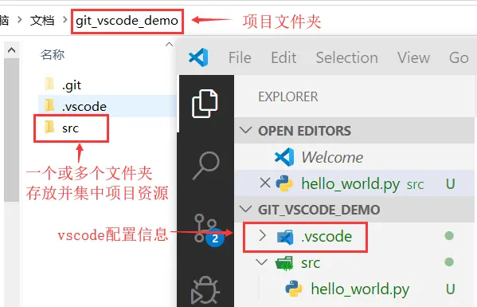
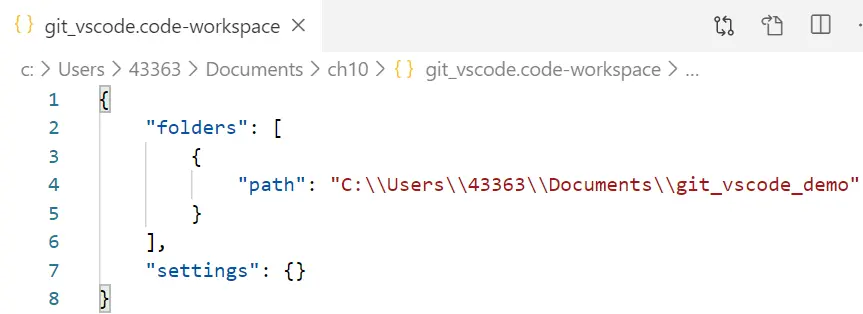
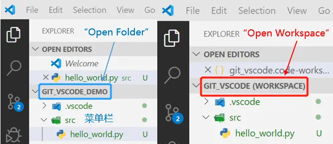

# VS Code中的文件夹(Folder)与工作区(Workspace)
&nbsp;&nbsp;&nbsp;&nbsp;&nbsp;&nbsp;在VS Code的“**文件**”菜单中，**“打开文件夹（Open Folder）”**是指开打项目文件夹的根目录。一个项目文件夹(Project Folder)包含一个或多个文件夹与项目相关的文件夹，以及与该项目相关的VS Code配置(放在.vscode文件夹中)。

&nbsp;&nbsp;&nbsp;&nbsp;&nbsp;&nbsp;在“**文件**”菜单中，还有一个选项：**“打开工作空间（Open Workspace）”，**这个选项和“打开文件夹”有什么区别？什么时候应该使用文件夹？什么时候应该使用工作空间呢？

&nbsp;&nbsp;&nbsp;&nbsp;&nbsp;&nbsp;在VS Code中，工作空间(workspace)具体指后缀为\*.code-workspace的文件，它是一个[JSON with Comments](https://links.jianshu.com/go?to=https%3A%2F%2Fcode.visualstudio.com%2Fdocs%2Flanguages%2Fjson%23_json-with-comments)格式的文件，里面包含了所有与该工作空间相关联的文件夹，以及相关的VS Code配置信息，如下所示。

\*.code-workspace文件

双击\*.code-workspace文件，启动VSCode打开工作空间与启动VSCode后，用“打开文件夹”方式打开项目文件夹的区别是，前者的文件夹名后面有一个工作空间(workspace)的后缀

“Open Folder” vs "Open Workspace"

\[**什么时候用工作区？**\] 有且仅有需要同时在多个项目上工作的时候，才需要创建工作区，这时候，工作区里面有多个项目文件夹的根目录(root)，即：[Multi-root Workspaces](https://links.jianshu.com/go?to=https%3A%2F%2Fcode.visualstudio.com%2Fdocs%2Feditor%2Fmulti-root-workspaces%23_opening-workspace-files)

\[**什么时候用文件夹？**\]在一个项目上工作，使用文件夹，就够了。针对该项目设置完VS Code后，VS Code会自动在项目文件夹的根目录中创建一个.vscode文件夹存储VS Code配置(settings.json文件)

  
  
作者：LabVIEW\_Python  
链接：https://www.jianshu.com/p/cf45d95ada26  
来源：简书  
著作权归作者所有。商业转载请联系作者获得授权，非商业转载请注明出处。