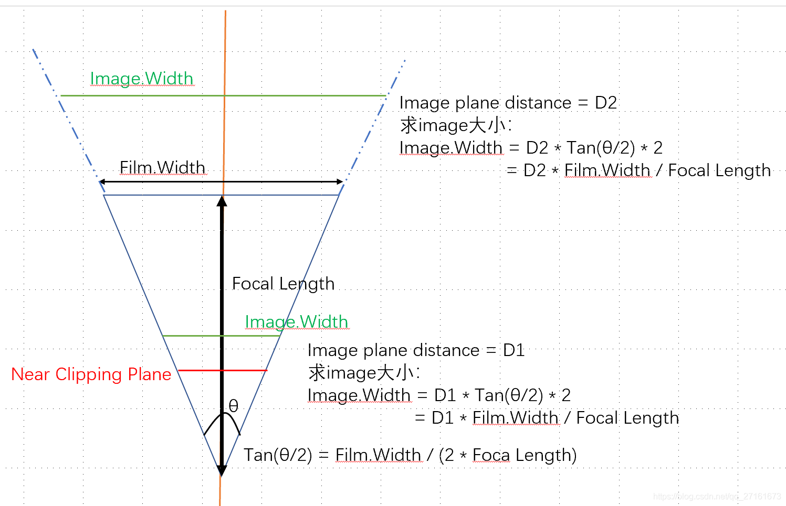

转自：[图形流水线中坐标变换详解：模型矩阵、视角矩阵、投影矩阵\_sherlockreal的博客-CSDN博客\_视角矩阵](https://blog.csdn.net/qq_27161673/article/details/103436678 "图形流水线中坐标变换详解：模型矩阵、视角矩阵、投影矩阵_sherlockreal的博客-CSDN博客_视角矩阵")

 图形流水线中坐标变换详解：模型矩阵、视角矩阵、投影矩阵

> 本文重点介绍图形流水线中出现的各种坐标系，以及实现在这些坐标系之间转换的数学知识。希望能方便大家更加深入了解图形学基础，更好的学习图形学。如果文章中有错误也请大家积极指正。文章的主要参考来源有：
1.[Scratchapixel 2.0：Rendering an Image of a 3D Scene: an Overview](https://www.scratchapixel.com/lessons/3d-basic-rendering/rendering-3d-scene-overview)
2.[Scratchapixel 2.0：Computing the Pixel Coordinates of a 3D Point](https://www.scratchapixel.com/lessons/3d-basic-rendering/3d-viewing-pinhole-camera)
3.[深入探索透视投影变换](https://blog.csdn.net/popy007/article/details/1797121)

# 图形流水线中坐标变换过程

# 模型矩阵：模型局部坐标系和世界坐标系之间的桥梁

## 1.模型局部坐标系存在的意义

简单用一句话来说：方便建模人员。如果把“经纬度和高程”比作世界坐标系，那么“北京市海淀区学院路37号”就是模型局部坐标系下的一个坐标，而这个模型局部坐标系可以是“北京市”，也可以是“北京市海淀区”，甚至可以是“北京市海淀区学院路”。我们在CG中展现的各种各样物体是很多建模人员努力的结果，我们无法规定一个统一的坐标系，让所有物体都在这个坐标系上建模(一方面是考虑到单位精度，二是在模型局部坐标系下能更方便的描述模型的具体位置)。因此一般模型默认都是在模型坐标系下。

## 2.根据模型局部坐标系中点求其在世界坐标系中的坐标(Model\_to\_Wrold) or 根据世界坐标系的点求其在模型坐标系中的坐标(Wrold\_to\_Model)

那么如何从模型坐标系变换到世界坐标系呢，我们先给出一些默认参数，以及一些矩阵知识：

*   CG中世界坐标系三个基底分别为e1(1,0,0), e2(0,1,0), e3(0,0,1)，坐标系原点为O (0,0,0)
*   坐标系的矩阵表示法(行主序，以世界坐标系为例)：  
    
*   不同坐标系下坐标点相互转换满足：  
    P1 \* M1 = P2 \* M2  
    其中 M1为坐标系1的矩阵表示，P1为点P在坐标系1下的坐标表示；M2为坐标系2的矩阵表示，P2为点P在坐标系2下的坐标表示

根据上述，我们就可以求得模型局部点在世界坐标系下的表示。  
假设世界坐标系矩阵表示为Mworld  
模型坐标系矩阵表示为Mmodel  
模型上点在世界坐标系下的表示为Pworld  
模型上点在模型坐标系下的表示为Pmodel  
则有：  
**Pworld \* MworldCoord = Pmodel \* MmodelCoord**  
**Pworld = Pmodel \* MmodelCoord \* M-1worldCoord**  
由世界坐标系的特点知：MworldCoord = I(单位矩阵)  
所以：**Pworld = Pmodel \* MmodelCoord**  
反之，我们也可以从世界坐标反求得模型坐标  
**Pmodel = Pworld \* M-1modelCoord**

接下来我们来确定模型坐标系的矩阵表示：  
假设模型坐标系为下图所示的右上角坐标系，其**基底在世界坐标系的表示**分别为e1 (0.71, 0.61, -0.32), e2(-0.39, 0.74, 0.53), e3(0.57, -0.25, 0.77)，**原点在世界坐标系下的表示**为 O (0.52, 1.25, -2.53)  
  
则：  

## 3.结论：模型矩阵等于模型局部坐标系的矩阵表示法

**总结上述推论：  
因为图形流水线中模型矩阵的作用是将模型局部坐标变换为世界坐标系下的坐标  
所以图形流水线中的ModelMatrix = MmodelCoord。  
即模型矩阵就是模型局部坐标系的矩阵表示法。**

# 视角矩阵：世界坐标系和视角坐标系(摄像机坐标系)直接的桥梁

视角坐标系可以看做是一个模型坐标系。转换方法与世界坐标系转模型坐标系方法相同。

## 1.视角坐标系如何构成

视角也被称为相机。我们在设定相机时，在必须设定的参数中，有三个参数与视角坐标系构成相关

*   LookAt : 相机看向的地方, 用一个向量表示
*   Up : 相机的“头顶”，用一个向量表示
*   Posiiton : 相机放置的地方

  
那么如何确定相机坐标系的基底呢?请看下图  
  
通过三步叉乘求得相机坐标系的基底：

*   Z = cameraPosition - LookAtPostion
*   X = up.Cross(Z)
*   Y = Z.Cross(X)

知道了相机坐标系基底，知道了相机的位置。根据**模型局部坐标系和世界坐标系之间的转换**我们可以很容易的推导出相机坐标系的矩阵表示法：  

## 2.Camera\_to\_Wrold / World\_to\_Camera

同理根据模型局部坐标系和世界坐标系的相互转换规则，我们可以列出下面的式子：

*   **Pview \* MviewCoord = Pworld \* MworldCoord**
*   **Pview = Pworld \* MworldCoord \* M-1viewCoord**  
    **\= Pworld \* M-1viewCoord**
*   **Pworld = Pview \* MviewCoord**

## 3.结论：视角矩阵就是视角局部坐标系的矩阵表示法的逆矩阵

**因为图形流水线中视角矩阵的作用是将世界坐标系坐标转换为视角坐标系的坐标。  
所以图形流水线中的ViewMatrix = M-1viewCoord。  
即视角矩阵就是视角局部坐标系的矩阵表示法的逆矩阵。**

# 投影矩阵：3D to “2D”

## 1.CG中3D to "2D"原理：小孔成像

  
上图很好的描述了小孔成像的原理。画布(film)记录了经过物体反射/折射等，并顺利 通过光圈(aperture)的光线的颜色。  
**小孔成像中与成像结果相关的因素：**

*   **光圈(aperture)与小孔成像的关系**  
    当光圈变大时，能够“打到”film的光束更多。但这也意味着，在film上同一个点上，可能有多个光线同时击中。或者反过来说，从观察体上某点P发射出的光线，可能落在film的多个点上。  
      
    这样导致的结果就是，光圈越大，成像会越模糊；光圈越小，成像越锋利。  
      
    理想情况应该是光圈小到只允许一跟光线通过。但是在现实生活中这无法实现：首先是无法生产出这样的光圈，其次是光具有波粒二象性。
    
*   **景深与小孔成像的关系**  
    景深规定了一个最近和最远距离，只有在这个距离范围内的物体才会锋利显示，在景深外的物体成像会模糊。而小孔成像的景深是无限的，所以只要光圈足够小，小孔成像的结果总是锋利的。
    
*   **焦距(focal length)与小孔成像的关系**  
    焦距在小孔成像中可以定义为光圈到film的距离。焦距对小孔成像的影响主要体现在焦距变化引起视角的变化：焦距越小，视角越大；焦距越大，视角越小。  
    
    
*   **画布大小(film size)与小孔成像的关系**  
    画布大小也是通过影响视角大小来影响成像效果：画布越大，视角越大；画布越小，视角越小。
    

## 2.CG中模拟小孔成像与现实小孔成像的区别

*   CG中光圈可以设置为只允许单根光线通过；CG中没有光线用射线代替，不存在波粒二象性问题。且因为小孔成像景深是无限的。因此CG中Camera成像的结果一定是“锋利”的。
*   CG中为了大致模拟景深效果，会设置一个前后裁剪面(near / far clipping plane)，在前后裁剪面之间的观察体才能显示，在外部的观察体全部不显示。
*   现实生活中film都在光圈的后面，因为要提供一个黑盒的环境，让感光材质只接受通过光圈的光线。而CG中允许将film设置到光圈前，且这样更方便成像(因为设置在光圈后的成像是上下颠倒的)。
*   CG中eye即代表小孔成像中那个光圈，CG中视角由小孔成像中焦距和画布大小确定。

## 3.区分image plane distance 和 near clipping plane distance 和 focal length

*   focal length 和 film size 都是小孔成像中的说法。在小孔成员原理中我们知道，两者都可以改变视角的大小，以水平方向上视角为例，它们的关系为：  
    
    
*   image plane可以放在相机Z负方向上的任何地方。它是作为CG中接收图像的平面。image的大小是由视角和它与eye的距离来确定的。  
    
    
*   前裁剪面，单纯设定前可视范围  
    
    
*   这三个变量的定义在本质上是完全不相关的。不过在CG中，**一般默认将image plane设置到near clipping plane处**。
    

## 4.投影矩阵推导

  
以该图为例进行推导：

1.  求image Plane大小：  
    
2.  求P的对应点P’  
    
3.  将P’点变换到NDC坐标系中  
      
    上图中求解a/b的方程列错了 应该是  
    \-(aN + b) = -N -(aF + b) = F 不过最终得到的a/b结果是正确的。请大家验证。  
      
    

# 窗口变换：渲染到输出对象上

从规则化设备坐标变换到窗口上，需要考虑窗口的大小，以及窗口坐标原点的位置。以渲染为图像为例，图像的原点在左上角。  
  
Ppixel.x = \[ PNDC.x \* Screen.Width \]  
Ppixel.x = \[ ( 1.0 - PNDC.y ) \* Screen.Height \]

## 1.Resolution Gate and Film Gate Ratio

*   Film Gate Ratio是指film的宽高比
*   Resolution Gate Ratio是指窗口(Screen or Window)的宽高比

## 2.Resolution Gate and Film Gate Ratio don’t match

当Resolution Gate Ratio 与 Film Gate Ratio比例不一样时，选择哪个比例作为输出会产生不一样结果。因此一般3D建模软件在渲染时，都会让用户选定按哪种比例进行渲染。  

*   **Fill**:用Resolution Gate Ratio的比例来渲染整个图像  
    如果FGR > RGR: X方向需要乘上一个Scale; XScale = RGR / FGR ;  
    如果FGR < RGR:Y方向上乘上一个Scale: YScale = FGR / RGR ;
*   **Overscan**：用Film Gate Ratio的比例来渲染整个图像  
    如果FGR > RGR: X方向需要乘上一个Scale; XScale = FGR / RGR ;  
    如果FGR < RGR:Y方向上乘上一个Scale: YScale = RGR / FGR ;

