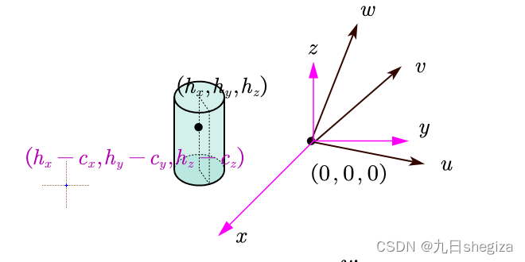

假设现在世界空间里的3个坐标轴为,局部空间中使用的三个坐标轴为u,v,w，则假设局部空间的旋转矩阵为O 2 W,即经过此矩阵变换，能在保持相对空间中的x,y,z相互垂直的情况下，将其旋转至和世界空间u,v,w朝向完全重合.用矩阵运算表示即为：

我们先来关注下第一个式子，将其展开，即为  

看到这个应该就能立马得到第一列即为   ，故  

同理，我们运用第二三个式子则可以推断出 的最终形式：

则它的逆矩阵 ,也可轻松获得，因为 是正交矩阵，故其逆矩阵就等于它的转置，即 

这个矩阵的含义为已知世界空间中的坐标，则右乘W2O就可得到局部空间中的坐标，如：

上述式子根据正交性得到.所以可以看到世界坐标下的u经变换得到了它的局部坐标

现在一旦我们掌握了上述内容就可以轻松推导出视角矩阵，即view矩阵，view矩阵即把世界坐标的点转换到视角空间，眼的坐标为(c~x~,c~y~,c~z~)

  
世界坐标系下的圆柱中心为( h~x~ , h~y~ , h~z~ ) ，

我们不妨把这个过程拆开想一下，先把眼移动到原点的位置，则因为圆柱和眼的相对位置不变，故其也应跟眼睛应用同样的变换

那么接下来显然只需旋转u,v,w轴，使其与x,y,z重合，即应用W2O旋转矩阵，同理，圆柱因为与眼睛的相对关系不变所以也跟着旋转，用图像表示这一过程：  

用矩阵形式表述上面的转换过程则为：  
