# 坐标系的变换矩阵推导

## 1.平移变换

  假设存在点(x,y,z)，将x移动a，y移动b，z移动c，到新的点(x′,y′,z′)，则：

  
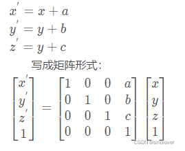

  中间4x4的矩阵叫**变换矩阵**。可见，如果要平移坐标，要将坐标维度增加1，变成**齐次坐标**（齐次坐标（homogeneous coordinates）就是将一个原本是n维的向量用一个n+1维向量来表示，常用于投影几何）。

  在计算机图形学中，为了实现平移、旋转、缩放等图像操作，需要用到齐次坐标。

**例1**：世界坐标系word相对相机坐标系cam的x、y、z分别平移了10，20，30，求次变换齐次矩阵。

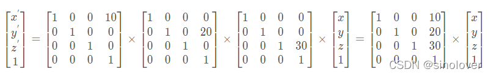

三个分量矩阵位置可以交换，因为是独立变量，互不影响。  
所以，平移齐次矩阵为：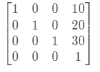

旋转变换有两种，一种是向量在当前坐标系内的旋转，一种是坐标系的旋转。

## 2\. 坐标系旋转变换：由固定坐标系旋转到另一个坐标系。

  旋转变换有两种，一种是向量在当前坐标系内的旋转，一种是坐标系的旋转。这里推导**坐标系旋转矩阵**。

### （1） 绕X轴旋转（逆时针）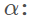：

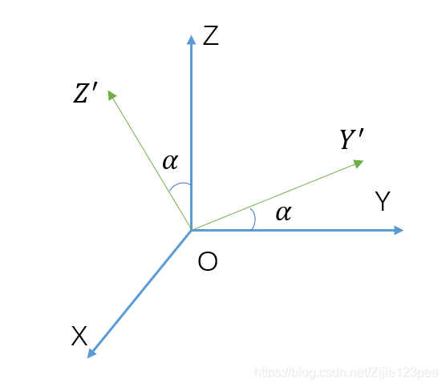  
方程为：

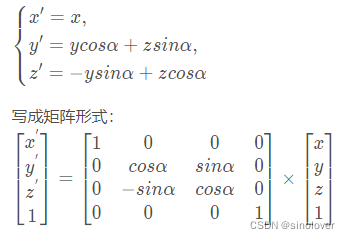

### （2） 绕Y轴旋转（逆时针）β ：

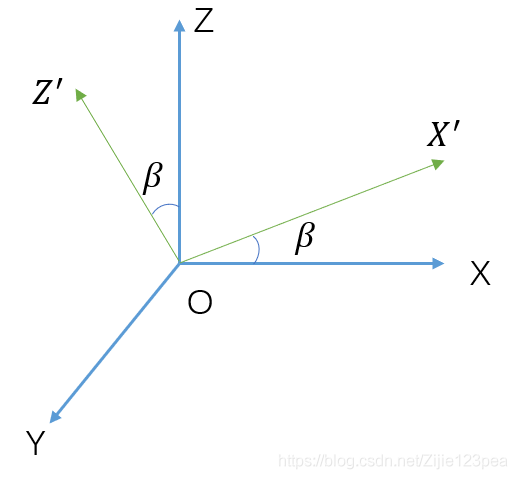  
方程为：

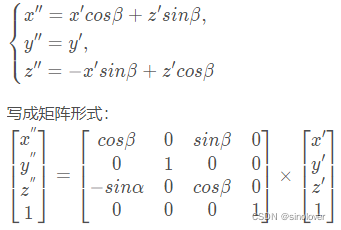

### （3）绕Z轴旋转（逆时针）γ：

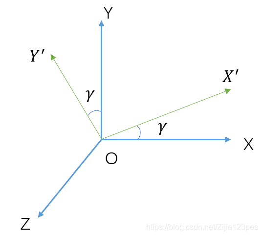  
方程为：

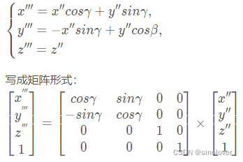

所以，坐标轴分别依次绕x，y，z轴旋转α \\alphaα,β \\betaβ,γ \\gammaγ的变换矩阵（前后用左乘来连接）：

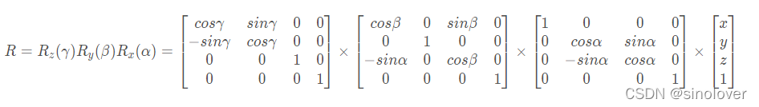