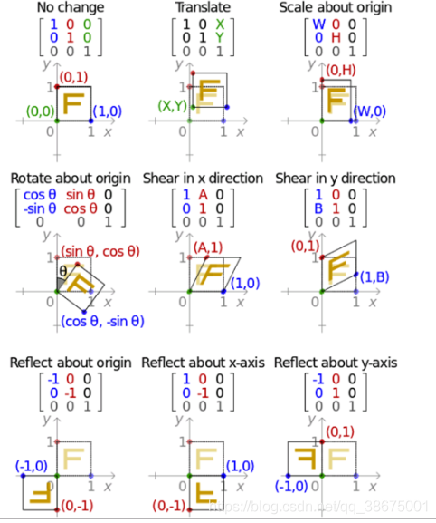
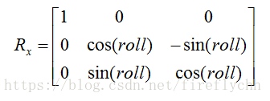
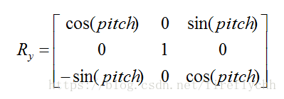
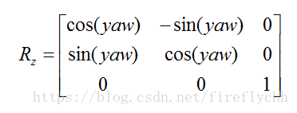
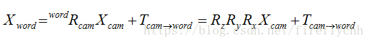

## 矩阵与坐标系

下图展示了矩阵和二维坐标系的关系，二维坐标系可以看成图像，把这种关系应用到图像变换，就得到图像处理的方式变换，应用到三维空间坐标中，就得到三维空间坐标系变换关系。

 

## 仿射变换

仿射变换主要包括**平移变换、旋转变换、缩放变换（也叫尺度变换）、倾斜变换（也叫错切变换、剪切变换、偏移变换）、翻转变换**。有六个自由度。

仿射变换保持二维图形的“平直性”和“平行性”，但是角度会改变。

“平直性”：变换后直线还是直线、圆弧还是圆弧。

“平行性”：平行线还是平行线，直线上点的位置顺序不变。  
常说的刚性变换：指的是由平移变换和旋转变换组成。  
相似变换：平移加旋转加缩放。  
**数学本质：在几何学里，矩阵表示了坐标系的映射关系，坐标系映射关系的本质又是矩阵乘法。**  
貌似图像变换只用到六个参数，为什么后面一行多了0，0，1？因为图像变换的本质是矩阵相乘，有矩阵乘法规则决定要3\*3矩阵，这在数学上叫做增广矩阵或齐次变换矩阵。 
 
**图像平移矩阵变换关系：**  
  

**图像旋转矩阵变换关系：**

**图像缩放矩阵变换关系：**

**图像错切矩阵变换关系：**

## 三维空间变换关系

三维空间坐标变换的本质是三个旋转矩阵相乘加上一个平移向量。  
旋转矩阵按如下方式定义:

**沿X方向的旋转矩阵：**  
  

**沿Y方向的旋转矩阵：**  
  

**沿Z方向的旋转矩阵：**  

对于相机坐标系到世界坐标系下的坐标变换方程如下：
  

当然还有四元数的方法表示空间坐标的位姿关系，那是另一回事。