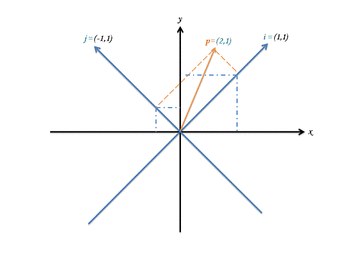
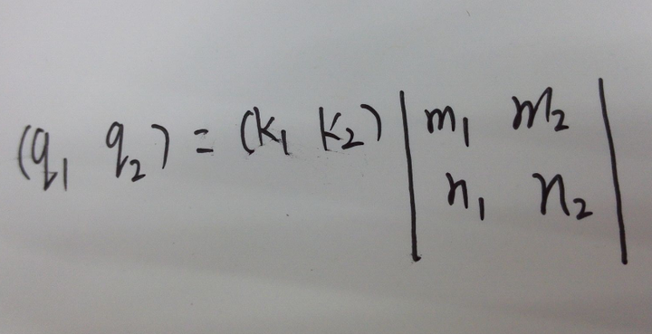
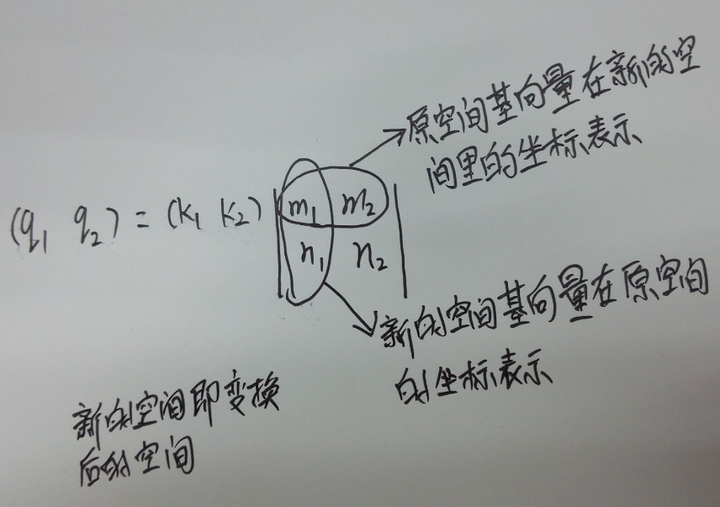
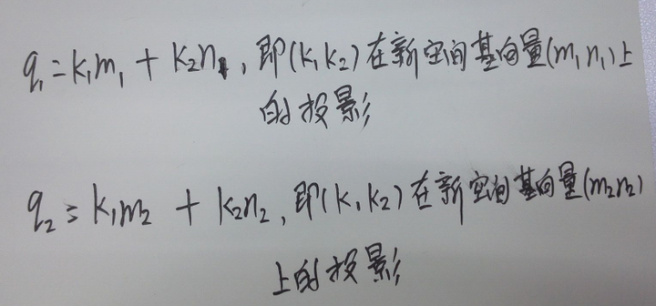

转自：[矩阵变换坐标系 深入理解 - 知乎](https://zhuanlan.zhihu.com/p/23130870 "矩阵变换坐标系 深入理解 - 知乎")

网址链接：[从坐标系图中理解“空间变换”](https://link.zhihu.com/?target=http%3A//www.cnblogs.com/lookof/p/3512358.html "从坐标系图中理解“空间变换”")

[小谈矩阵和坐标变换](https://link.zhihu.com/?target=http%3A//www.360doc.com/content/15/0720/17/6973384_486236702.shtml "小谈矩阵和坐标变换")

矩阵坐标系变化理解

让我们从一个实际的例子入手：下图是一个用两维的笛卡尔坐标系表示的二维空间。

其中，黑色坐标系 x-y代表一个二维空间；蓝色坐标系 i-j代表另外一个二维空间。已知蓝色坐标系轴在黑色坐标系下对应的值是i=(1,1), j=(-1,1)，又知橙色向量 p 处在 i-j 空间中，其坐标值为(2,1)。现在的问题是，这个 p 被转换到黑色坐标系 x-y 空间下它的坐标值是什么？

解决这个问题一个最关键也最直接的想法是“向量分解与再合成”。

p 可以被分解到 i 和 j 两个方向，得到 p= 2i+j；同时 i 又可以分解到 x 和 y 两个方向，得到 i = x + y，另外 j 也可以分解得到 j = -x + y。于是，我们全部展开，就得到 p(i-j) = 2i + j = 2(x + y) + (-x + y) = x + 3y = p(x-y) 。

因此点 p 在 x-y 空间下的坐标值为(1,3)。

  
这种方法可以用来讨论更一般的情况。假设p点在 i-j 坐标系下为(k~1~,k~2~)，在 x-y 坐标系下为(q~1~,q~2~)。同样地有基向量 i 对应在 x-y 空间中为(m~1~,m~2~)；j 对应在 x-y 空间中为(n~1~,n~2~)。

于是我们有以下推导，

i = m~1~x + m~2~y，j = n~1~x + n~2~y

于是，

p(i-j) = k~1~i + k~2~j

= k1(m~1~x + m~2~y) + k2(n~1~x + n~2~y)

= (k~1~m~1~ + k~2~n~1~)x + (k~1~m~2~ + k~2~n~2~)y

于是，

p(i-j) = (k~1~m~1~ + k~2~n~1~, k~1~m~2~ + k~2~n~2~)

= (q~1~, q~2~)

= p(x-y)

得到，

q~1~ = k~1~m~1~ + k~2~n~1~

q~2~ = k~1~m~2~ + k~2~n~2~

变换成矩阵形式:

其中(k~1~,k~2~)是 i-j 空间下的坐标值，而(q~1~,q~2~)是 x-y 空间下的坐标值。中间的矩阵就是用来做转换的矩阵。从中我们可以发现，如果竖着来观察，向量(m~1~,m~2~)就是基向量 i 在 x-y 空间下的坐标值，而向量(n~1~,n~2~)则是基向量 j 在 x-y 空间下的坐标值。这个矩阵，实际上就是由空间 i-j 下的基向量在空间 x-y 下的坐标值构成的。

1 矩阵的行序和列序（也称行优先或列优先）仅仅是指矩阵的存储方式，即我们如果用一个4*4数组m存储矩阵，如果m[0][0]-m[0][3]连续存储了矩阵的第一行，那么就是行优先，反之就是列优先。无论是行优先还是列优先，它们代表的数学意义是相同的。  
2 如果矩阵是行序，那么它的第一列（m[0][0],m[1][0],m[2][0]）就代表X变换，第二列就是Y变换，第三列就是Z变换。  
我们来看看为什么：  
刚才提到矩阵把线性空间中的一个点给变换到另一个点，不妨称变换前的点为P1(x~1~,y~1~,z~1~)，变换后的点为P2(x~2~,y~2~,z~2~）：  
那么根据线代中的矩阵乘法，P~1~ * M = P~2~展开就成了：  
m~00~,m~01~,m~02~  
(x~1~,y~1~,z~1~) * m~10~,m~11~,m~12~ = x~1~*m00+y~1~*m~10~+z~1~*m~20~+ x~1~*m~01~*  
m~20~,m~21~, m~22~ y~1~*m~11~+z~1~*m~21~,x~1~*m~02~+y~1~*m~12~+z~1~*m~22~

所以：  
x~2~ = x~1~*m[0][0] + y~1~*m[1][0] + z~1~*m[2][0];  
y~2~ = x~1~*m[0][1] + y~1~*m[1][1] + z~1~*m[2][1];  
z~2~ = x~1~*m[0][2] + y~1~*m[1][2] + z~1~*m[2][2];  
看出什么了吗？  
如果把一个行序矩阵（接下来讨论的都是行序矩阵，就省略行序二字了）的每一列分别用X,Y,Z三个矢量来表示，那么M就表示为：XYZ三根轴。  
现在，矩阵M看起来是不是很像一个坐标系？而P1到P2的变换就是P1分别与X,Y,Z的点积！  
也就是矩阵M是把P1从老坐标系变换到新坐标系，而矩阵的三列（三根轴）就分别代表了新坐标系的三根轴在老坐标系中的坐标！  
而点积的几何意义其实就是求取投影！所以坐标变换的几何本质（刚才已经讨论过其代数本质），就是把一个点分别投影到三根轴上去而已！  
再仔细想一想，P1在XYZ三根轴上的投影，不正是它在新坐标系下的坐标吗？这样一来，坐标变换是不是就太容易理解了呢？

综上理解得出:

