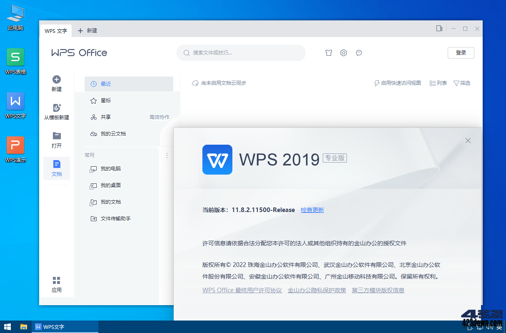

2022-11-10    分类：[Office](https://www.423down.com/office-work)、[办公软件](https://www.423down.com/work)    [评论：365](https://www.423down.com/8890.html#comments)   

WPS Office 2019专业版(金山WPS企业版)WPS2019为你打造新一代办公环境,可以轻松快速访问各类办公服务.WPS2019专业版是一款国产免费办公软件,全面涵盖了文字处理,电子表格,演示文稿,PDF文档.提供强大插件平台支持,免费提供海量在线存储空间及文档模板,兼容所有微软Office格式,支持所有平台跨设备云同步.

**新版变化**

2022年11月10号 WPS Office (11.8.2.11813) 新增功能列表  
\====================================  
改进功能列表  
\------------  
WPS表格  
1 优化图表坐标轴日期识别逻辑

WPS演示  
1 新增放映工具栏支持折叠&展开  
2 新增剥离效果切页动画  
3 新建幻灯片面板增加 “从文字大纲导入” & “重选幻灯片” 功能入口  
4 完善演示组件API能力

WPS公共  
1 底层接口添加websocket请求方法，兼容chrome内核94版本以上的浏览器  
2 优化现有文本框基础交互体验  
3 优化首页启动速率  
4 QT版本升级到5.12.12  
5 zlib和minzip升级到1.2.12版本  
6 删除跟福昕相关的二进制库以及相关代码,避免法务风险  
7 openssl升级到1.1.1p  
8 备份保存流程优化，提升备份保存性能和稳定性  
9 完成专业版公网多账号功能的适配

**版本区别**

\# WPS个人版/WPS专业版/专业增强版有什么区别？

1) 授权方面：个人版供个人免费使用，不可商业用途；专业版则可以  
2) 功能方面：个人版无开发工具（VBA环境、宏功能）专业增强版最全  
3) 体验方面：个人版（即免费基础版）有广告；专业版/专业增强版则无  
专业增强版功能最完整，相比专业版内置完整VBA组件，VBA宏功能更全！

\# WPS政府专用版跟WPS Office专业版有什么区别？

\- 政府版内置序列号，无需激活，企业定制授权长期有效！  
\- 政府版安装包具备专业增强版组件和政府OEM信息标识

**特点描述**

1\. 官方WPS2019专业版NSIS打包，调用安装配置文件内置终身授权序列号！  
﹂序列号提取自博湖县政府专用版 TJ3GN-9NTGQ-GLF7C-YEN8X-TJWML  
2\. 去广告、去我的电脑WPS云盘、支持账号和WPS云同步  
﹂去界面左侧：日历、WPS便签、会议、统计表单 (广告）  
﹂去应用中心：分享协作功能网页入口（会议、统计表单）  
3\. 安装过程会自动移除WPS升级服务和WPS联网验证文件

\# 安装配置文件描述（划线的默认没启用）  
﹂Setup.exe //官方安装包可读取oem配置  
﹂oem.ini  //针对企业定制的安装配置文件

\[Product\]
FileRoaming/DefaultRoamingMode=auto

\[support\]
EnablePdf2WordV2=true
EnableProcessonMind=true
EnableProcessonFlow=true
Update=false ;取消检测升级
Support2016SN=true ;启用序列号
WPSPlusVersion=true ;安装插件版本
NseVisible=false ;安装VB组件工具
~#EnableCloudDocs=false ;不显示WPS云文档
#EnableAccount=false ;不显示账户登陆中心~
IntranetDrive=true ;不显示我的电脑WPS云盘
EnterpriseDocpermission=true ;启用企业版文档权限
EnablePlainWatermarkInfo=false ;输出打印无水印信息
DisableWPSPdfDeskTopShortcut=true ;不创建桌面PDF快捷方式
FileDialogDefWpsCloud=false ;保存对话框可以自定义WPS云文档
OnlineWithoutCloudDoc=false ;不显示广告（日历、WPS便签、会议、统计表单）

\[Setup\]
SendInstallSource=1 ;检测安装包 
Silent=0 ;0带界面标准安装，1无界面静默安装 
Sn=TJ3GN-9NTGQ-GLF7C-YEN8X-TJWML ;终身授权序列号 
SourceDir=oeminfo ;源目录支持读取企业OEM配置文件安装

**下载地址**

***

WPS Office 2019 专业增强版 11.8.2.11813 特别版（去广告/无升级/免激活/永久授权）  
WPS Office 2016 专业增强版 v10.8.2.7119 特别版（无广告/无升级/免激活/永久授权）

[https://www.123pan.com/s/A6cA-DlHJh](https://www.423down.com/go.php?url=aHR0cHM6Ly93d3cuMTIzcGFuLmNvbS9zL0E2Y0EtRGxISmg=)

[https://423down.lanzouo.com/b0f2ql3be](https://www.423down.com/go.php?url=aHR0cHM6Ly80MjNkb3duLmxhbnpvdW8uY29tL2IwZjJxbDNiZQ==)

[https://pan.baidu.com/s/1C6CsBrinrD9SDffjP9H2vg](https://www.423down.com/go.php?url=aHR0cHM6Ly9wYW4uYmFpZHUuY29tL3MvMUM2Q3NCcmluckQ5U0RmZmpQOUgydmc=)

***

WPS Office 2019 专业版 11.8.2.11813 官方版 (2022/10/31)（已含开发工具和VBA）  
[https://wps-cn-ep.ks3-cn-beijing.ksyun.com/wps/download/ep/WPS2019/WPSPro\_11.8.2.11813.exe](https://www.423down.com/go.php?url=aHR0cHM6Ly93cHMtY24tZXAua3MzLWNuLWJlaWppbmcua3N5dW4uY29tL3dwcy9kb3dubG9hZC9lcC9XUFMyMDE5L1dQU1Byb18xMS44LjIuMTE4MTMuZXhl)

WPS Office 2019 专业版 11.8.2.11019 官方版 (2021/11/24)（支持WinXP的最终版)  
[https://wps-cn-ep.ks3-cn-beijing.ksyun.com/wps/download/ep/WPS2019/WPSPro\_11.8.2.11019.exe](https://www.423down.com/go.php?url=aHR0cHM6Ly93cHMtY24tZXAua3MzLWNuLWJlaWppbmcua3N5dW4uY29tL3dwcy9kb3dubG9hZC9lcC9XUFMyMDE5L1dQU1Byb18xMS44LjIuMTEwMTkuZXhl)

WPS Office 2016 专业版 v10.8.2.7119 官方版 (2019/08/29)（这是2016版的最终版）  
[https://423down.lanzouo.com/ilSvas3vzyb](https://www.423down.com/go.php?url=aHR0cHM6Ly80MjNkb3duLmxhbnpvdW8uY29tL2lsU3ZhczN2enli)

WPS Office 开发工具VBA组件官方静默安装包 (2020/01/21)（适用2016和2019版本）  
[https://423down.lanzouo.com/iEFITgpsrxe](https://www.423down.com/go.php?url=aHR0cHM6Ly80MjNkb3duLmxhbnpvdW8uY29tL2lFRklUZ3Bzcnhl)

WPS官方安装包 | WPS集成序列号版 | WPS政府版的无人值守通用静默安装参数：/S

WPSOffice2019专业版终身授权序列号（这是目前最新政府版序列号，授权长期有效）  
TJ3GN-9NTGQ-GLF7C-YEN8X-TJWML，694BF-YUDBG-EAR69-BPRGB-ATQXH

WPSOffice2016专业版终身授权序列号（这是以前企业版内部序列号，授权仍然有效）  
THUV2-32HH7-6NMHN-PTX7Y-QQCTH