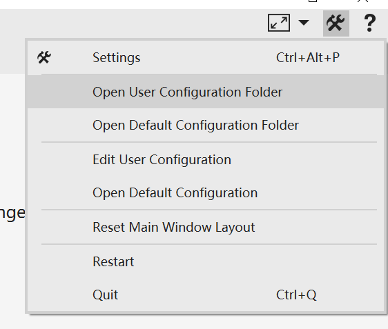
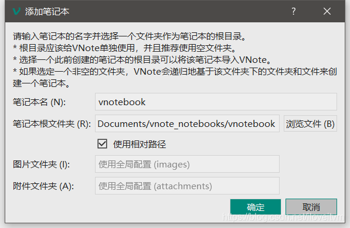

# Configuration[](https://vnote.readthedocs.io/zh_CN/latest/docs/en_us/docs/Users/Configuration.html#configuration "永久链接至标题")

There are three main configurations for VNote.

*   Default configuration;This is the application’s default configuration. You should not change any of these files, since they will be overwritten on version update. To custom configuration, you could copy files to the **user configuration** folder and change them.
*   User configuration;This is the user’s configuration which will overrides the default configuration.
*   Session configuration;This is configuration about session, such as notebook list, geometry state of the main window, and so on. It is the `session.json` file locating in the *user configuration* folder. To modify this file, you need to first close VNote since VNote will write to this file on close.



## Components of Configuration[](https://vnote.readthedocs.io/zh_CN/latest/docs/en_us/docs/Users/Configuration.html#components-of-configuration "永久链接至标题")

There are several folders and files under the configuration folder:

.
├── dicts (dictionaries for spellcheck)
├── docs (docs used by VNote to provide help)
├── syntax-highlighting (syntax highlighting files for text editor from Kate)
├── themes (themes of VNote)
├── web (resources used for read mode)
└── vnotex.json (configuration file)

For the `vnotex.json` file, please refer to the one in the default configuration folder, which contains comments about each field.

## Make VNote Portable[](https://vnote.readthedocs.io/zh_CN/latest/docs/en_us/docs/Users/Configuration.html#make-vnote-portable "永久链接至标题")

Users may want to bundle the configuration files alongside with the executable file. Follow these steps to migrate the configuration folders:
<font color=red>
1.  Close VNote first;
2.  Copy the default configuration folder `VNote` to the same folder as the executable file (such as `vnote.exe`) and rename it to `vnotex_files`;
3.  Copy the user configuration folder `VNote` to the same folder as the executable file and rename it to `user_files`;
</font>


# VNote 简介

[VNote -官方文档](https://tamlok.gitee.io/vnote/zh_cn/)

一个更懂程序员和Markdown的笔记！

目前作者在尽全力开发 `VNoteX` & `VNote3.0`

截至 2021.2.25 还没发布 release 版本，最新beta版本：[v3.0.0-beta.7](https://github.com/vnotex/vnote/tree/v3.0.0-beta.7)

注意：3.x 和 之前版本不互相兼容，3.x 可以 导入 2.x，反之不行

建议使用 [v2.10](https://github.com/vnotex/vnote/tree/v2.10)

# VNote 2.10 公共目录配置

`VNote` 将读取并存储配置文件到操作系统的公共目录中以存储应用程序数据。

由于博主使用的是 Windows客户端，以下路径仅适用于 Windows，其他OS自行斟酌。

## ~\\AppData\\Roaming\\vnote

```bash
.
│  flash_page.md  # 空白文件
│  session.ini    # 运行渲染配置文件，含“笔记本”结构
│  vnote.ini      # 配置文件，可放到 VNote.exe 目录
│  vnote.log      # 运行日志，供开发者参考
│
├─resources
│      common.css
│
├─snippets
│      current_date
│      font-red
│      snippet.json  # 片段配置文件，其他是片段名称
│
├─styles
│  └─codeblock_styles
├─templates  # 模版
└─themes     # 主题文件夹
    ├─v_detorte
    ├─v_moonlight
    ├─v_native
    ├─v_next
    ├─v_pure
    └─v_simple
```

### session.ini

结论：  
**【notebooks】** 相对重要，其他的均为 操作记录，可有可无

***

#### \[global\]

字段相对固定，无关痛痒

```ini
[global]
current_notebook=9
last_start_time=2021-02-25T12:30:47
last_user_track_date=2021-02-25
explorer_current_entry=0
navibox_current_index=0
image_browse_path= *** 
```

#### \[notebooks\]

```ini
1\name=VNote使用方法
1\path=AllNotes/test
2\name=通用or经验总结
2\path=**vnote_notebooks/编程语言
```

格式：  
`size=xx` (仅一行)

`[index]\name=[笔记本名]`  
`[index]\path=[笔记本根目录路径]`

路径分类：

*   相对路径（少）
*   绝对路径（主要）

记录了 笔记本 的 位置和名字，用于在 VNote 中识别您的笔记本

#### \[geometry\]

不理解

#### \[history\]

`size=100`

`[index]\file=[文件路径].md`  
`[index]\date=2020-04-24`  
`[index]\pinned=true`  
`[index]\is_folder=false`

#### \[last\_opened\_files\]

```ini
size=2
1\file=xxx.md
1\mode=0
1\active=false
1\header_index=0
1\cursor_block_number=-1
1\cursor_position_in_block=-1
2\file=xxx.md
2\mode=0
2\active=true
2\header_index=13
2\cursor_block_number=38
2\cursor_position_in_block=28
```

#### \[explorer\_starred\]

```ini
1\directory=G:/gitbooks/IoT-security-papers
1\image_folder=
size=1
```

### vnote.ini

设置项，可与 `VNote.exe` 在同级目录

#### \[global\]

```java
version=2.10
allow_user_track=true
theme=v_pure  // 主题
editor_style=
css_style=
code_block_css_style=v_next/v_next_codeblock
split_file_list=false
minimize_to_system_tray=1
tools_dock_checked=true
search_dock_checked=true
windows_opengl=0
confirm_reload_folder=false
keyboard_layout=
enable_backup_file=true
enable_auto_save=false
image_folder=images
attachment_folder=attachments
external_image_folder=_v_images
panel_view_state=2
menu_bar_checked=true
enable_mathjax=true
enable_code_block_line_number=true
editor_line_number=3
enable_image_caption=true
current_render_background_color=System
current_background_color=System
quick_access=
tool_bar_checked=true
search_options=5, 2, 7, 0, 0, 
find_regular_expression=false
sync_note_list_to_current_tab=true
enable_flowchart=true
enable_mermaid=true
find_whole_word_only=false
find_case_sensitive=true
find_incremental_search=false
single_click_close_previous_tab=false
heading_sequence_type=2
color_column=0
enable_image_constraint=true
enable_preview_image_constraint=true
```

#### \[shortcuts\]

```java
QuickAccess=Ctrl+Alt+I
FindPrevious=Shift+F3
CaptainMode=Ctrl+E
NewSubfolder=Ctrl+Alt+S
NextMatch=Ctrl+8
SaveNote=Ctrl+S
FlashPage=Ctrl+Alt+L
PreviousMatch=Ctrl+9
LastClosedFile=Ctrl+Shift+T
EditReadNote=Ctrl+T
Find=Ctrl+F
ActivateNextTab=Ctrl+Tab
OpenViaDefaultProgram=F12
PastePlainText=Ctrl+Shift+V
NewNote=Ctrl+Alt+N
UniversalEntry=Ctrl+G
FullScreen=F11
ActivatePreviousTab=Ctrl+Shift+Tab
CloseNote=
AdvancedFind=Ctrl+Alt+F
FindNext=F3
```

#### \[captain\_mode\_shortcuts\]

```java
ActivateTab7=7
FocusEditArea=Y
MoveTabSplitRight=Shift+L
ActivateTab5=5
ParseAndPaste=P
ExpandMode=E
ActivateTab8=8
ActivatePreviousTab=K
DiscardAndRead=Q
FlushLogFile=";"
ActivateTab2=2
ExpandLivePreview=U
ActivateTab1=1
ActivateSplitRight=L
NavigationMode=W
ToolBar=Shift+#
CurrentNoteInfo=N
LivePreview=I
OpenedFileList=F
MaximizeSplit=Shift+|
CloseNote=X
ShortcutsHelp=Shift+?
ToolsDock=T
VerticalSplit=V
ActivateNextTab=J
DistributeSplits="="
AlternateTab=0
RemoveSplit=R
ActivateTab6=6
MoveTabSplitLeft=Shift+H
ApplySnippet=S
ActivateTab9=9
ActivateTab4=4
Export=O
SearchDock=C
MagicWord=M
AttachmentList=A
ActivateTab3=3
ActivateSplitLeft=H
LocateCurrentFile=D
```

#### \[web\]

```java
mathjax_javascript=https://cdnjs.cloudflare.com/ajax/libs/mathjax/3.0.1/es5/tex-mml-chtml.js
enable_code_block_copy_button=true
```

#### \[export\]

```java
wkhtmltopdf=**\\wkhtmltopdf.exe
wkhtmltopdfArgs=
```

## ~\\AppData\\Local\\VNote

`VNote` 调用的 `QtWebEngine` 的缓存，无需关心

```bash
.
├─cache
│  └─QtWebEngine
│      └─Default
│          └─Cache
│
└─QtWebEngine
    └─Default
        │  Cookies
        │  Cookies-journal
        │  Visited Links
        │
        ├─GPUCache
        │
        └─Local Storage
```

# VNote程序所在目录

如果您希望将这些配置文件与 `VNote` 可执行文件一起放置，则可以在包含 `VNote` 可执行文件的目录中复制或创建 `vnote.ini` 文件。

`VNote` 将首先尝试从可执行文件所在的位置读取 `vnote.ini`。

但请注意，`VNote` 会将笔记本的路径存储在配置文件中，因此如果将 `VNote` 复制到另一台计算机，**它可能会读取错误的路径并报错。**

# 笔记管理

`VNote` 采用 **notebooks-folders-notes** 层次结构进行笔记管理

*   **notebook** 对应于文件系统中的目录，称为 `Notebook Root Folder`
*   笔记本的 **Folders** 对应于 `Notebook Root Folder` 中的目录
*   文件夹中的 **Notes** 对应于该目录中的文件

## 笔记本（notebook）

*   **Notebook** 是在 `VNote` 中独立，不言自明的**容器**
*   一个笔记本是文件系统中的一个 `Notebook Root Folder`
    *   包含该笔记本的所有笔记和配置文件

### 创建笔记本

您可以通过指定以下字段来创建新笔记本：  


*   **笔记本名称**  
    VNote中笔记本的名称。它仅用于在VNote中识别您的笔记本。它**不会**写入笔记本的配置。
*   **笔记本根文件夹**  
    在系统中选择一个空目录以保存此笔记本的所有内容。该被选的目录会假设在VNote的控制之下。
    *   如果是 空文件夹，则创建 空的 笔记本
    *   如果是 `Notebook Root Folder`，则导入
    *   如果非空，则递归创建笔记本
*   **图像文件夹**  
    这是用于存储笔记的本地图像的文件夹的名称。VNote使用给定文件夹（具有相同父文件夹）来存储这些笔记的图像。
*   **附件文件夹**  
    这是用于存储备注附件文件的文件夹的名称。

### 迁移和导入笔记本

一个 **笔记本** 是文件系统中的一个独立目录，因此您只需复制或同步 `Notebook Root Folder` 即可迁移笔记本。

您可以在创建笔记本时通过选择它的 `Notebook Root Folder` 将现有笔记本导入到 `VNote`。`VNote` 将尝试读取配置文件以还原笔记本。

结合这些操作，您可以在允许第三方服务（如Dropbox和OneDrive）同步的目录中创建笔记本，然后在另一台计算机中，您可以将该目录作为笔记本导入`VNote`。这样，您可以使用`VNote`编辑和管理您的笔记，这些笔记将由其他受信任的服务在家中和工作中同步。

### 笔记本相关文件

#### \_vnote.json

笔记本的配置

```json
{
    "attachment_folder": "_v_attachments",   // 附件文件夹
    "created_time": "2020-01-30T07:23:17Z",  // 创建笔记本的时间
    "files": [
    ],
    "image_folder": "",                      // 图像文件夹
    "recycle_bin_folder": "_v_recycle_bin",  // 回收站
    "sub_directories": [                     // 子目录
        {
            "name": "test_folder"
        },
        {
            "name": "test_folder2"
        },
        {
            "name": "使用技巧(here)"
        }
    ],
    "tags": [  // 该笔记本所用的标签
        "test",
        "papers"
    ],
    "version": "1"
}

```

#### \_v\_recycle\_bin

整个笔记本的 回收站文件夹

```bash
.
└─20200130
        test11.md
```

按日期创建文件夹，里边存放 该日期 被删除的 文件

## 文件夹(folder)

笔记本中的文件夹层次结构与 `Notebook Root Folder` 中的目录相同。理论上您可以创建无限多的文件夹层级。

```bash
.
│  _vnote.json
│
├─test_folder  #文件夹
├─test_folder2 #文件夹
├─_v_recycle_bin
│  └─20200130
│          test11.md
│
└─使用技巧(here)  #文件夹
```

```bash
├─test_folder2
│  │  01-机器学习开篇.md
│  │  test21.md
│  │  _vnote.json
│  │  权威指南笔记.md
│  │
│  ├─images
│  │      1.png
│  │
│  └─_v_attachments
│      └─20200130182352710_19524
```

### \_vnote.json

```bash
{
    "created_time": "2020-01-30T08:59:31Z",  # 创建时间
    "files": [ # 文件夹中 笔记详情
        {
            "attachment_folder": "",
            "attachments": [
            ],
            "created_time": "2020-01-30T08:59:59Z",
            "modified_time": "2020-07-26T16:36:05Z",
            "name": "test21.md",
            "tags": [
            ]
        },
        # ...
    ],
    "sub_directories": [  # 子目录
    ],
    "version": "1"
}
```

## 笔记(note)

您可以通过菜单中的 `File(文件)` 选项里的 `New Notes From Files(从文件创建笔记)` 操作将外部文件作为笔记导入到 `VNote` 中。`VNote` 将所选文件作为笔记 **复制** 到当前文件夹中。

### \*md

理论上，`VNote` 中的笔记可以使用任何后缀。带后缀`.md`的笔记将被视为Markdown文件。

### \*.vswp

交换文件，内容如下：

```
vnote_backup_file_826537664 [文件绝对路径].md
[文件内容]
```

# 使用技巧

## 同步笔记

`Notebook Root Folder` 是一个独立的 笔记本容器，内部结构完整，将其作为同步文件夹即可。但需要注意以下潜在bug：

*   `*vswp` 使用了 绝对路径，在其他终端可能会存在问题
*   默认的名称，中途修改后，不会同步修改，可在创建笔记本时 手动指定为 所需要的
    *   图片：`_v_images`
    *   附件：`_v_attachments`
*   在另一台终端，使用 `VNote` 时需要先导入 `Notebook Root Folder` 再使用
    *   此操作实质是 写入 `session.ini` 文件，该文件无需同步
    *   根据自己需要，**Notebook** 尽可能少，若 **Notebook** 较多 ，可以使用 **Folder** 结构优化 笔记结构。