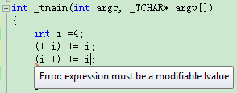

# 自增、自减运算符的前缀和后缀形式区别
原文链接：http://blog.xieyc.com/prefix-and-suffix-forms-of-the-increment-and-decrement-operators/

  

2013年10月23日，参加航天九院772所的面试，其实是笔试+面试，试卷中有这么一道题目：

|   |   |
| --- | --- |
| 12 | `int` ` a = 4;``(++a) += i;` |

求a的数值，正确答案是10。

如果你认为这道题重点只是考察运算符优先级，可能很容易得到正确的答案。

但是，考虑过为什么下面的代码无法编译么？

自己在笔试时，考虑到了关于表达式作为赋值运算符左值的问题，但是自己确实又对重载“++”操作符的实现机制和函数原型不很了解，就误认为“a++”和"++a"这两种写法都不能作为赋值运算符左值，从而以为这道题出错了，或者故意考察这一点，就直接写了个“无法编译”……

我回来后问了两个小伙伴，他们都能得到“(++a)  +=  a;”的正确结果即 a = (a+1)+(a+1)，但是无法解释为什么“(a++) += a;”无法编译，而且居然一致认为“++a”是“先执行自增后返回值，因此表达式是自增后的值”，而“a++”则是“先返回自增前的值，在这一条语句执行完之后a才自增”！

上述关于前自增运算符的认识基本是对的，但是关于后自增运算符的认识却大大的错了！在此鄙视一下这两个小伙伴，难道你们的C语言是体育老师教的么？居然会认为一个自增运算符能先执行一部分，在整条语句句执行后再执行另一部分……（哪种语言有这功能？）

今天上午花时间研究了一下这方面的内容，才恍然大悟，对自增/自减运算符的两种形式又加深了不少理解。不敢独享，特总结成文如下，也顺便纠正一下小伙伴们的错误认识@shasha，哼。

.

### 一、自增、自减运算符前缀和后缀形式的区别

我们都知道C/C++中大名鼎鼎的自增运算符（++操作符）具有两种形式：前置操作和后置操作。

从运算符的实现上来看，a++与++a的差别如下：

（1）前递增运算a++，在执行过程中，先将对象进行递增修改，而后返回该对象的引用。

（2）后递增运算++a，在运算符重载函数中采用值返回的方式编写，重载函数的内部创建一个用于临时存储原有对象值的对象，在执行完对a的自增后，函数返回该临时对象的值。

简单地讲，就是：

前自增操作生成左值，在给操作数加1后返回改变后的操作数值；而后自增操作生成右值，给操作数加1但返回未改变的操作数原值。

附左值与右值的概念：

左值：可以出现在赋值操作左边的值。非const左值可读可写。

右值：可用于赋值操作的右边但不能用于左边的值。右值只能读不能写。

因此，左值可以出现在赋值操作右端，但右值不可以出现在赋值操作左端，将后自增操作置于赋值操作左端将会出现编译错误。

现在来分析为什么"(a++) += a;"无法编译的问题：对于“ (a++) += a; ”，先运算(a++)，但(a++)返回的不是引用，而是原有a值的一个拷贝，而此时的拷贝不再是一个变量，还是一个常量，故不能当作左值继续参与运算。

同理，这也可以解释如下的几个表达式是否能够编译：

(1) ++++a;

(2) a++++;

(3) ++a++;

我们知道：自增运算符++是结合方向是自右自左（VC++6.0），所以++++a也写成++(++a)，显然是正确的。而a++++写作(a++)++显然是错误的，这会导致发生编译错误：

> error C2105: '++' needs l-value.

至于++a++，依据结合性，写作++(a++)，也是错误的，但是需要注意的是，(++a)++却是正确的写法。

.

### 二、关于++运算符的重载

很久以前（八十年代），没有办法区分++和--操作符的前缀与后缀调用。这个问题遭到程序员的报怨，于是C++语言得到了扩展，允许重载increment 和 decrement操作符的两种形式。

然而有一个句法上的问题，重载函数间的区别决定于它们的参数类型上的差异，但是不论是increment或decrement的前缀还是后缀都只有一个参数。为了解决这个语言问题，C++规定后缀形式有一个int类型参数，当函数被调用时，编译器传递一个0做为int参数的值给该函数：
~~~cpp
        class 
         UPInt { 
        // "unlimited precision int"
       
 
        public
        :
       
 
        UPInt& operator++(); 
        // ++ 前缀
       
 
        const 
         UPInt operator++(
        int
        ); 
        // ++ 后缀
       
 
        UPInt& operator--(); 
        // -- 前缀
       
 
        const 
         UPInt operator--(
        int
        ); 
        // -- 后缀
       
 
        UPInt& operator+=(
        int
        ); 
        // += 操作符，UPInts 与 ints 相运算
       
 
        ...
       
 
        };
       

          
       
 
        UPInt i;
       

          
       
 
        ++i; 
        // 调用 i.operator++();
       
 
        i++; 
        // 调用 i.operator++(0);
       
 
        --i; 
        // 调用 i.operator--();
       
 
        i--; 
        // 调用 i.operator--(0);
       
~~~
这个规范有一些古怪，不过你会习惯的。而尤其要注意的是这些操作符前缀与后缀形式返回值类型是不同的。前缀形式返回一个引用，后缀形式返回一个const类型。下面我们将讨论++操作符的前缀与后缀形式，这些说明也同样使用与--操作符。

但是从你开始做C程序员那天开始，你就应该记住increment的前缀形式有时叫做“增加然后取回”，后缀形式叫做“取回然后增加”。这两句话非常重要，因为它们是increment前缀与后缀的形式上的规范。
~~~cpp
        // prefix: increment and then fetch
       
 
        UPInt& UPInt::operator++()
       
 
        {
       
 
        *
        this 
         += 1; 
        // 增加
       
 
        return 
         *
        this
        ; 
        // 取回值
       
 
        }
       

          
       
 
        // postfix form: fetch the origin and increment
       
 
        const 
         UPInt UPInt::operator++(
        int
        )
       
 
        {
       
 
        UPInt oldValue = *
        this
        ; 
        // 取回值
       
 
        ++(*
        this
        ); 
        // 增加
       
 
        return 
         oldValue; 
        // 返回被取回的值
       
 
        }
~~~
后缀操作符函数没有使用它的参数。它的参数只是用来区分前缀与后缀函数调用。如果你没有在函数里使用参数，许多编译器会显示警告信息，很令人讨厌。为了避免这些警告信息，一种经常使用的方法时省略掉你不想使用的参数名称；如上所示。

很明显一个后缀increment必须返回一个对象（它返回的是增加前的值），但是为什么是const对象呢？假设不是const对象，下面的代码就是正确的：
~~~cpp
 
        UPInt i;
       
 
        i++++; 
        // 两次increment后缀运算
~~~

这是完全可实现的，但是应该尽力避免的！为什么呢？因为上面的代码实际上可改写为下面的形式：

`i.operator++(0).operator++(0);`

很明显，第一个调用的operator++函数返回的对象调用了第二个operator++函数。

有两个理由导致我们应该厌恶上述这种做法。

第一是使用两次后缀increment所产生的结果与调用者期望的不一致。

如上所示，第二次调用operator++改变的值是第一次调用返回对象的值，而不是原始对象的值。因此如果表达式 i++++ 是合法的，i 将仅仅增加了一次。这与人的直觉相违背，使人迷惑。

第二个原因是与语言内置类型行为不一致。当设计一个类遇到问题时，一个好的准则是使该类的行为与int类型一致。

而前面的例子已经显示，int类型不允许连续进行两次后缀increment，因此你也必须禁止你自己写的类有这样的行为。最容易的方法当然就是让后缀increment 返回const对象。编译器执行"i++++"时将会发现从第一个operator++函数返回的const对象又调用operator++函数，然而这个函数是一个non－const成员函数，所以const对象不能调用这个函数。如果你原来想过让一个函数返回const对象没有任何意义，现在你就知道有时还是有用的，后缀increment和decrement就是例子。（更多的例子参见Effective C++ 条款21。）

另外，如果你重载了++运算符，还需要思考一下关于维护的问题：

让我们再观察一下后缀与前缀increment 操作符。它们除了返回值不同外，所完成的功能是一样的，即值加一。简而言之，它们被认为功能一样。那么你如何确保后缀increment和前缀increment的行为一致呢？当不同的程序员去维护和升级代码时，有什么能保证它们不会产生差异？除非你遵守上述代码里的原则，这才能得到确保。这个原则就是：后缀increment和decrement应该根据它们的前缀形式来实现（而不使用额外的形式例如 *this += 1;）。

此时，你仅仅需要维护前缀版本，因为后缀形式自动与前缀形式的行为一致。

.

### 三、关于前缀与后缀形式的效率差别

如果你很关心效率问题，那么当你看到后缀 increment函数时, 你可能觉得有些问题。这个函数必须建立一个临时对象以做为它的返回值，例如上面的实现代码建立了一个显示的临时对象（oldValue），这个临时对象必须被构造并在最后被析构。而前缀increment函数没有这样的临时对象。

由此得出一个令人惊讶的结论：除非必须要保存操作数原来的值，调用者应该尽量使用前缀increment，少用后缀increment。

.

### 四、一个有趣的问题：为什么是C++而不是++C？

《C++ Primer》中的习题5.16提到了一个有趣的问题：

> 你认为为什么C++不叫做++C？

根据博客园上[这篇文章](http://www.cnblogs.com/maxwellp/archive/2012/02/11/2346844.html)的分析：

> C++之名是Rick Mascitti在1983年夏天定名的（参见The C++ Programming Language（Special Edition）1.4节），C说明它本质上是从C语言演化而来的，“++”是C语言的自增操作符。C++语言是C语言的超集，是在C语言基础上进行的扩展（引入了new、delete等C语言中没有的操作符，增加了面向对象程序设计的直接支持，等等），是先有C语言，再进行++。根据自增操作符前、后置形式的差别，C++表示对C语言进行扩展之后，还可以使用C语言的内容；而写成++C则表示无法再使用C的原始值了，也就是说C++不能向下兼容C了，这与实际情况不符。 

也算是一个全新的视角了……

.

### 参考文献：

\[1\] 博客园：[C++为什么不叫++C？——浅谈前自增与后自增的区别](http://www.cnblogs.com/maxwellp/archive/2012/02/11/2346844.html)

\[2\] CSDN：[More Effective C++：自增和自减](http://blog.csdn.net/dinkyshmily/article/details/9409393)

\[3\] 博客园：[C++自增运算符的探索](http://www.cnblogs.com/chenyuming507950417/archive/2012/04/19/2456966.html)

  

  

  

## [C++自增运算符的探索](http://www.cnblogs.com/chenyuming507950417/archive/2012/04/19/2456966.html)

http://www.cnblogs.com/chenyuming507950417/archive/2012/04/19/2456966.html  

~~~cpp
istream_iterator<int> in_iter(cin);//read ints from cin
istream_iterator<int> eof;//istream "end" iterator
//read until end of file,storing what read in vec
while(in_iter != eof)
{
    //increament advances the stream to the nest value
    //dereferent reads next value from the istream
    vec.push_back(*in_iter++);
}
~~~

      对于*in_iter++，我们知道++的优先级高于*，所以相当于写成*（in\_iter++），意思是对istream\_iterator对象做自增运算使该迭代器在流中向前移动。然而，使用后自增运算的表达式，其结果是迭代器原来的值。自增的效果是使迭代器在流中移动到下一个值，但返回值指向前一个值的迭代器。对该迭代器进行解引用获取该值。

      为了完全理解这段话，需要深刻了解自增运算符。

自增运算符分为前增运算符++a与后增运算符a++，先看下面代码：  
~~~cpp
#include <iostream>
using namespace std;

int main()
{
    int a=5;
    int b=++++a;
    cout<<"b= "<<b<<"\t"<<"a= "<<a<<endl;

    return 0;
}
~~~
运行结果：

b= 7    a= 7
~~~cpp
#include <iostream>
using namespace std;

int main()
{
    int a=5;
    int b=(a++)++;
    cout<<"b= "<<b<<"\t"<<"a= "<<a<<endl;

    return 0;
}
~~~
运行结果：

发生编译错误：error C2105: '++' needs l-value

      我们知道：自增运算符++是结合方向是自右自左（VC++6.0），所以++++a也在写成++(++)a。根据++结合性，a++++肯定是错误的。至于(a++)++和++a++是否会发生错误，分析a++与++a后自会知道。

**a++与++a的差别：**

    （1）在运算过程中，先将对象进行递增修改，而后返回该对象（其实就是对象的引用）的叫前递增运算**++a**。在运算符重载函数中采用返回对象引用的方式编写。

    （2）在运算过程中，先返回原有对象的值，而后进行对象递增运算的叫后递增运算**a++**。在运算符重载函数中采用值返回的方式编写，重载函数的内部实现必须创建一个用于临时存储原有对象值的对象，函数返回的时候就是返回该临时对象。

    现在来分析下上面提出的问题：对于 (a++)++，先运算(a++)，但(a++)返回的不是引用，而是原有a值的一个拷贝，而此时的拷贝不再是一个变量，还是一个常量，故不能当作左值继续参加括号外部的++运算。至于++a++，即++(a++)，同样不能编译通过，原因是同样的道理。

**自增运算符++的重载：**

在编写运算符重载函数的时候该如何区分前递增运算符重载函数与后递增运算符重载函数呢？方法就是：在后递增运算符重载函数的参数中多加一个int标识，标记为后递增运算符重载函数。

~~~cpp
#include <iostream>
using namespace std; class Test
{ public:
    Test(int a=0)
    {
        Test::a=a;
    }
    friend Test& operator++(Test&);
    friend const Test operator++(Test&,int); public: int a;
};

Test& operator++(Test& val)//前递增
{
    val.a++; return val;
}

**const** Test operator++(Test& val,int)//后递增，int在这里只起到区分作用，没有实际意义
{
    Test temp(val);//这里会调用拷贝构造函数进行对象的复制工作
    val.a++; return temp;
} int main()
{
    Test test(5); ++++test;
    cout<<"test.a= "<<test.a<<endl;
    cout<<"后递增情况下临时存储对象的值状态："<<(test++).a<<endl;
    cout<<"test.a= "<<test.a<<endl;

    Test test1(5);
    (test1++)++;
    cout<<"test1.a= "<<test1.a<<endl;
    cout<<"前递增情况下临时存储对象的值状态："<<(++test1).a<<endl;

 cout<<"test1.a= "<<test1.a<<endl; return 0;
}

~~~
运行结果：

test.a= 7

后递增情况下临时存储对象的值状态：7

test.a= 8

test1.a= 6

前递增情况下临时存储对象的值状态：7

test1.a= 7

　　上面代码是非成员格式，在《C++编程惯用法—高级程序员常用方法和技巧》中讲到**对所有的一元操作符建议重载操作符函数为成员函数**。

~~~cpp
#include <iostream>
using namespace std; class Test
{ public:
    Test(int a=0)
    {
        Test::a=a;
    }
    Test& operator++();
    **const** Test operator++(int); public: int a;
};

Test& Test::operator++()//前递增
{ this->a++; return *this;
}

**const** Test Test::operator++(int)//后递增，int在这里只起到区分作用，没有实际意义
{
    Test temp(*this);//这里会调用拷贝构造函数进行对象的复制工作
    this->a++; return temp;
} int main()
{
    Test test(5); ++++test;
    cout<<"test.a= "<<test.a<<endl;
    cout<<"后递增情况下临时存储对象的值状态："<<(test++).a<<endl;
    cout<<"test.a= "<<test.a<<endl;

    Test test1(5);
    (test1++)++;
    cout<<"test1.a= "<<test1.a<<endl;
    cout<<"前递增情况下临时存储对象的值状态："<<(++test1).a<<endl;
    cout<<"test1.a= "<<test1.a<<endl; return 0;
}

~~~
运行结果：

test.a= 7

后递增情况下临时存储对象的值状态：7

test.a= 8

test1.a= 6

前递增情况下临时存储对象的值状态：7

test1.a= 7

       在这里注意一点：为什么(test1++)++能编译通过，而上面提到的(a++)++却不能编译通过，这是因为进行(test1++)后，假设临时变量为temp，则temp=test1（原来的test1值），然后进行temp++，其实是进行的是temp.a++，而temp成员a是一个变量，所以可以进行自增运算。

　　这里注意，红色标志的const是我后面加上去的，但加上去了，我上面的运行结果就会出错了，因为temp为const对象了，后面自然不能自增++了，而且我认为应该加const，避免(test1++)++这样出现。

　　最后再想下，

　　Test& operator++();

　　**const** Test operator++(int);  
　　为什么一个返回引用，一个要返回const。  

参考：

（1）《30天掌握C++精髓》

（2）[http://www.cnblogs.com/hazir/archive/2012/04/16/2451933.html#2356352](http://www.cnblogs.com/hazir/archive/2012/04/16/2451933.html#2356352)

（3）《more effective c++》 4.2 Item M6：自增(increment)、自减(decrement)操作符前缀形式与后缀形式的区别