# VTK和ITK中的坐标系统
当我们在处理医学图像和应用时，一个问题就是坐标系统之间的不同。在图像应用中通常有三个坐标系，分别是世界坐标系，解剖坐标系和图像坐标系。

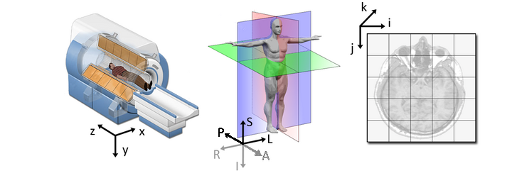

每种坐标系目的不同，呈现数据的方式也不一样。  
解剖坐标系由三个平面组成，从侧面看为矢状面，从正面看为冠状面，从上往下看为横截面。当人体结构被看作图像时，其左边和右边刚好反过来，但其前后和上下保持不变。在解剖位置，使用xyz坐标系，X轴从前到后，y轴从左到右，z轴从上到下，并且适用于右手法则。下面的图像有助于帮助理解。  
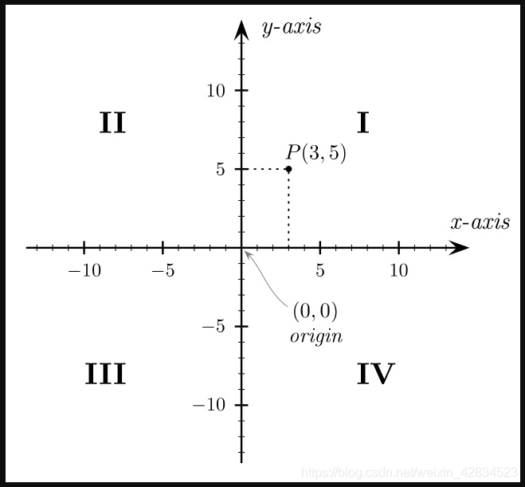

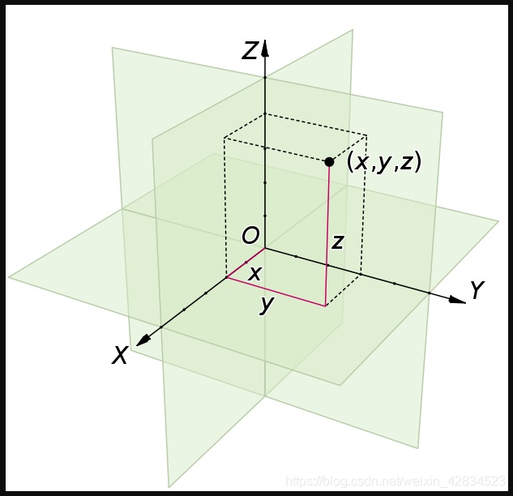
三维笛卡尔坐标系统，提供了三个物理空间维度-深度、宽度和高度。  
点的x,y和z坐标可以表示到yz平面，xz平面，xy平面的距离。xy,yz和xz平面将三维空间分成8个部分，类似二维平面分成4部分。尽管对xy平面已经建立了4个象限的约定，但是在三维空间中只使用了第一象限，它包含的点的x,y,z坐标都为正。  

## 世界坐标系

世界坐标系通常就是笛卡尔坐标系，其中放置了模型（例如MRI扫描仪或患者）。每个模型都有自己的坐标系，但是只有一个世界坐标系来定义每个模型的位置和方向。

## 解剖坐标系

对于医学成像技术而言，最重要的树模型坐标系时解剖坐标系（也称患者坐标系）。该空间由三个平面组成，用于描述人类的标准解剖位置。  
轴向平面平行于地面并且从脚（底部）到头（顶部）分开  
冠状面垂直于地面并从后（背部）向前（前部）分开  
矢状面从右向左分开。  
从这些平面可以看出所有轴的符号都为正。  
解剖坐标系是一个连续的三维空间，其中已对图像进行了采样。 在神经成像中，通常相对于要扫描其大脑的人来定义此空间。 因此，沿着前后，下上和左右的解剖轴定义3D基础。  
但是，不同的医疗应用程序对此3D基础使用不同的定义。 最常见的是以下基础：  
LPS（Left,Posterior,Superior左，前，上）被用于DICOM图像在ITK中  
LPS={从右到左}{从前到后}{从下到上}  
RAS（Right,Anterior,Superior右，后，上）类似于LPS但前两个轴翻转，用于3D Slicer  
RAS={从左到右}{从后到前}{从下到上}  
这两个基础都同样有用和合乎逻辑。 仅仅需要知道图像所基于的基础。

## 图像坐标系统

图像坐标系描述了如何获取有关解剖结构的图像。 医学扫描仪会创建规则的矩形点和单元格阵列，这些点和单元格从左上角开始。 i轴向右增加，j轴向底部增加，k轴向后增加。  
如来每个体素（i,j,k）的密度值被存储之外，解剖坐标系的原点和间隔也被存储。  
原点表示在解剖坐标系中的第一个像素（0，0，0）.eg(100mm,50mm,-25,)  
图像间隔表示每个轴体素间的距离，eg(1.5mm,0.5mm,0.5,)

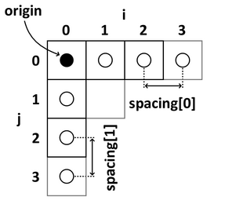
使用原点和间隔，体素在解剖坐标系中相应的位置就可以计算出来。

## 图像转换

从图像空间向量（i，j,k）到解剖空间向量x是一个仿射变换，是由线性变换A和平移变换t组成  

转换矩阵A是一个3x3矩阵，携带所有空间方向和轴缩放的信息。t是一个3x1的向量，包含第一个体素几何位置的信息。  
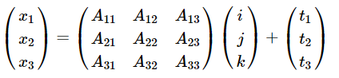
最后一个等式表明线性变换是通过矩阵乘法，平移是通过矩阵加法实现的。为了通过矩阵来表示转换和平移，必须使用一个增强矩阵。矩阵A要求在底部增加额外一行0，右边额外增加一列，平移向量。右下角为‘1’  
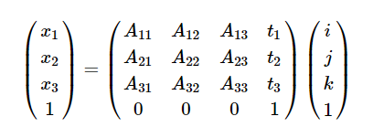取决于使用的解剖空间（LPS OR RAS），这个4x4矩阵被称为IJKtoLPS或IJKtoRAS矩阵。

## 2D计算IJtoLS矩阵

下列图像展示了解剖空间（LPS）在左边和相应的图像坐标在右边  
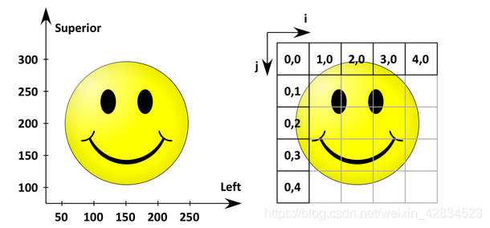
原点（在解剖空间第一个像素的坐标）是（50mm,300mm）,两个像素之间的间隔是（50mm,50mm）.  
在2D例子中A是一个2X2矩阵t是一个2X1向量。因此线性变换等式为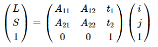  
通过将IJtoLS矩阵与右侧的向量相乘，将获得以下乘积：  
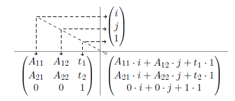
等式和矩阵相乘看出总共有6个未知参数（A11,A12,A21,A22,t1,t2）.  
但是，有关原点和间距的知识允许图像和解剖空间之间具有以下关系：  
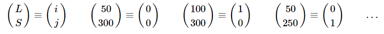
因此有如下6个方程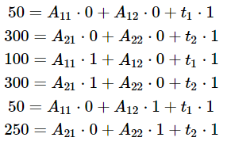
根据上面提到的t包含关于第一个像素几何坐标的信息。因此IJtoLS矩阵为  
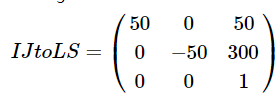
再R（A）S基中有如下示意图  
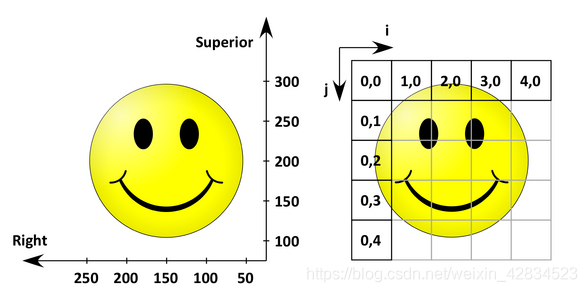 
IJtoRS矩阵为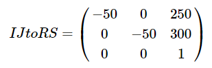
这个矩阵和IJtoLS矩阵很相似，但有2个不同  
由于原点的不同t改变了  
有轴翻转了，所以IJtoRS矩阵的第一列要加负号。

版权声明：本文为博主原创文章，遵循 [CC 4.0 BY-SA](https://creativecommons.org/licenses/by-sa/4.0/) 版权协议，转载请附上原文出处链接和本声明。

本文链接：[https://blog.csdn.net/weixin\_42834523/article/details/105980301](https://blog.csdn.net/weixin_42834523/article/details/105980301)