# 带你逛西雅图活电脑博物馆（二）
## 微型电脑和游戏机

回到1970年代中期，Intel推出了他们的第二款8-bit处理器：Intel 8080开创了微型电脑这一崭新的行业，基于8080及仿制品Zilog Z80的电脑产品，一直持续到2000年左右，任天堂掌机Gameboy Color的时代。

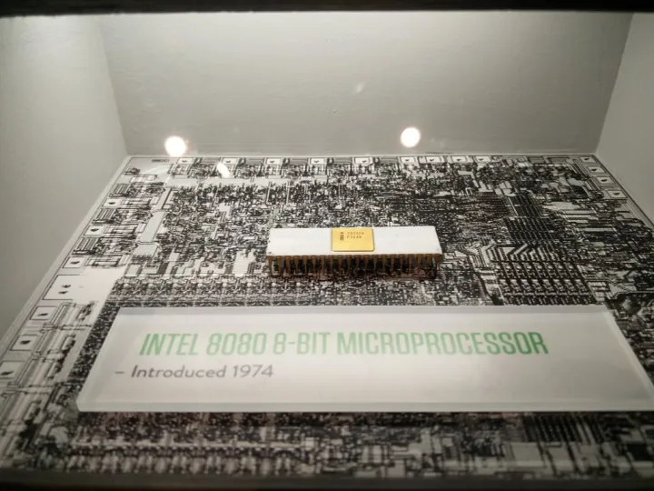

MITS Altair 8800是第一款在商业上取得成功的个人电脑，而微软的最初的BASIC解释器也是为Altair 8800开发的。当时个人电脑的主要用户还是电脑发烧友和买不起小型机的企业及科研单位，大多数的电脑都仅仅包含CPU和内存，通常需要连接串口终端进行操作，下图中右侧的IMSAI 8080是Altair 8800的主要仿制品和竞争者。  

**IMSAI 8080（1975）**  
处理器：Intel 8080/2Mhz  
内存：256字节~64KB

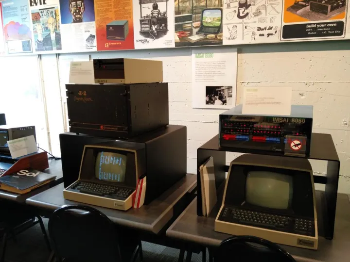

旁边的一台Cromemco Z-2则是基于Z80处理器的微型电脑，芝加哥商业交易所（Chicago Mercantile Exchange）曾经使用过60台Cromemco Z-2进行交易处理，直到1992年才被更新的IBM PS/2电脑取代。

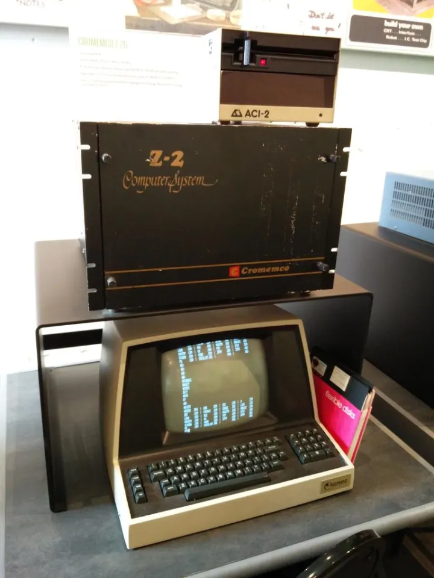

**Cromemco Z-2D（1977）**  
处理器：Zilog Z80/2Mhz~4Mhz  
内存：最多64KB

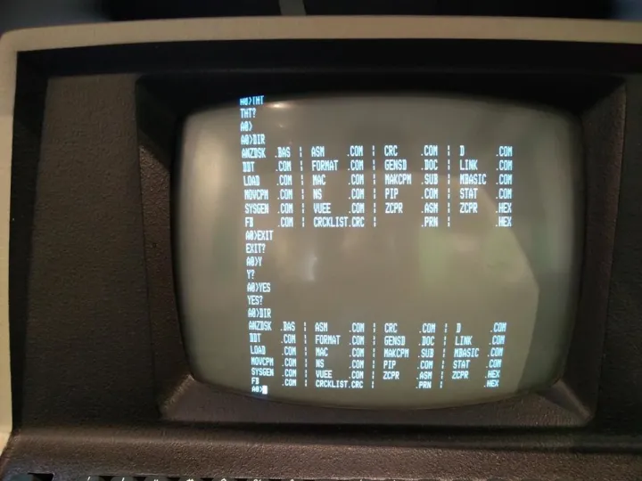

上图是Cromemco Z-2D的屏幕截图，操作系统应该是Cromemco CDOS

  

下面这台Sol-20电脑是由著名的“家酿电脑俱乐部”会长Lee Felsenstein于1976年设计的，略晚于Apple I，不过由于Sol-20和上面的IMSAI、Cromemco电脑采用同样的S-100总线，让这台早期的家用电脑具有非常强大的扩展性。直到2015年的电影《史蒂夫·乔布斯》中，仍然能看到沃兹和乔布斯为Apple II扩展槽数量的争执。  

**Sol-20（1976）**  
处理器：Zilog Z80/2Mhz  
内存：1KB，可扩展到64KB

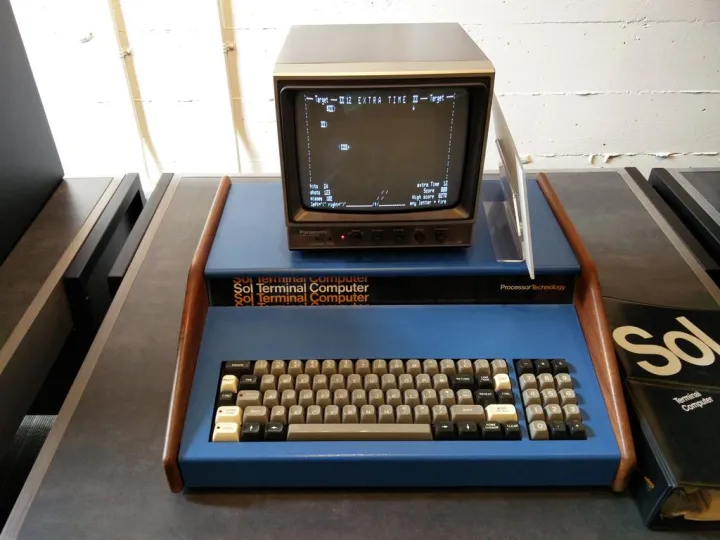

Sol-20旁边的这台木制外壳的电脑则是NorthStar Horizon，是当时最强大的8位个人电脑之一，具有4Mhz的Z80A处理器，以及12个S100扩展槽，使其内存最高可以扩展到448KB。

**NorthStar Horizon（1977）**  
处理器：Zilog Z80/2Mhz  
内存：16KB，可扩展到448KB（8位处理器寻址空间只有64KB，访问更多内存需要额外的编程技巧）

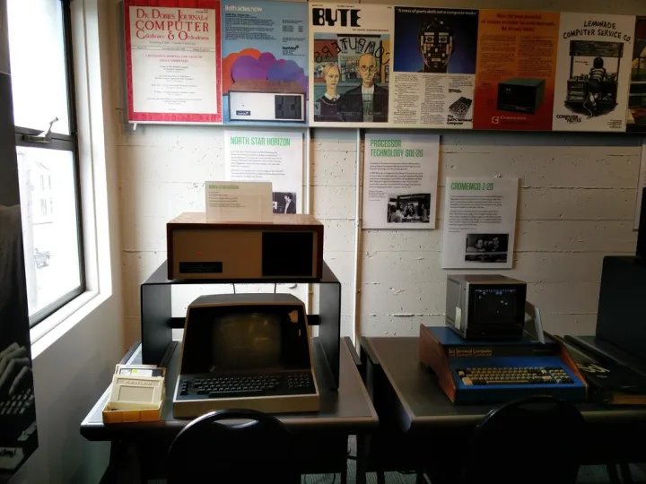

1977年Pertec收购了生产Altair的MITS，推出了这套完整的商用电脑系统，在Altair的基础上捆绑了硬盘控制器和驱动器，以及微软开发的BASIC语言，称之为Pertec/MITS 300。  

**Pertec/MITS 300**  
处理器：Intel 8080A/2Mhz  
内存：64KB  
硬盘：14英寸硬盘，10MB  
软驱：8英寸软驱，1.2MB

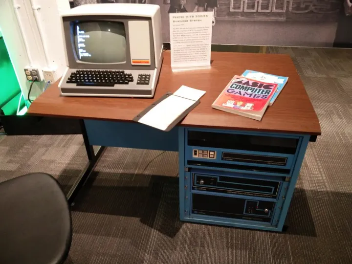

Heathkit H19终端，1980年产品

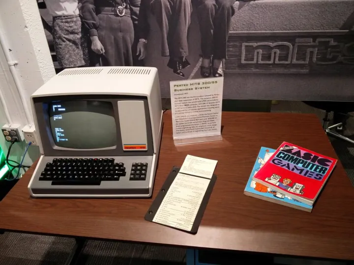

介绍BASIC语言游戏编程的书，对于曾经在学习机上玩过BASIC语言的读者一定不会陌生。

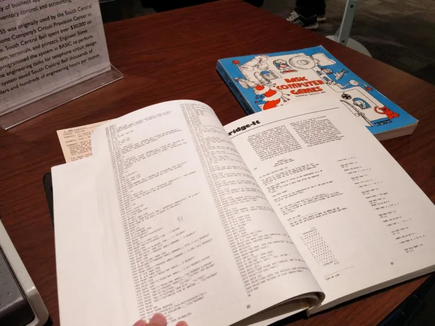

**家用游戏主机（Game Console）的诞生**

实际上，家用游戏机市场的起源，甚至要比家用电脑还要早一些，在1977年几款著名的家用电脑诞生之前，使用微型电脑的群体仍然局限于企业、科研机构和电脑发烧友，而Atari的Pong则充当了电脑类产品进入家庭的排头兵。1975年圣诞节假期，Pong在大型连锁百货店Sears上架，非技术背景的普通人第一次有机会感受到电脑科技的魅力，也让每年的圣诞季成为游戏集中上市的时机。

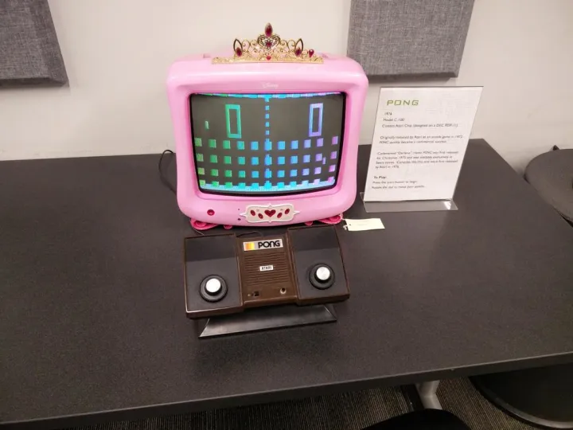

1977年可以被看作是家用电脑市场的元年，得益于廉价的MOS 6502处理器，在这一年中，来自不同厂家的三款家用电脑和一款游戏机，奠定了整个8-bit家用电脑市场基础。

1977年6月，苹果的Apple II先声夺人，成为第一款进入市场的8-bit家用电脑，发售时4KB内存的低配版本为$1,298（相当于2015年的$5000），而高配版本则是$2,638，算起来当年买一部Apple II比今天买一部垃圾桶Mac Pro还要贵。不过Apple II是1977年唯一支持彩色显示的家用电脑，所以也称得上是物有所值。

**Apple II**  
处理器：MOS 6502/1Mhz  
内存：4KB，出厂最高配置48KB，主板支持64KB  
磁带：音频盒式磁带  
软驱：5.25寸120KB

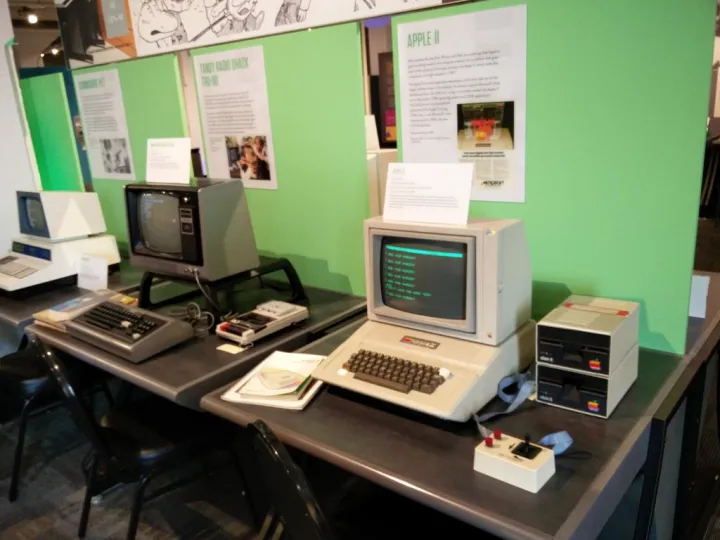

Tandy TRS-80是Tandy的第一款电脑，发布时间比Apple II晚了接近两个月，说起Tandy这个品牌可能今天的读者会感到比较陌生，但说到Radio Shark的话，身在美国的读者相信多数都有光顾。RadioShark是当时Tandy旗下的零售品牌，而“TRS”就是Tandy/RadioShark的缩写。与同时代的竞争者Apple II和Commodore PET不同，TRS-80使用的是与Intel 8080兼容的Zilog Z80处理器，所以在当时商用软件和操作系统的选择更丰富一些。而它的另外一个卖点则是更加便宜的价格， 单主机$399（相当于今天的$1558），主机+显示器+磁带机$599（相当于今天的$2339）的价格让更多家庭可以承受。

**Tandy TRS-80**  
处理器：Zilog Z80/2Mhz  
内存：4KB，最高48KB  
磁带：音频盒式磁带  

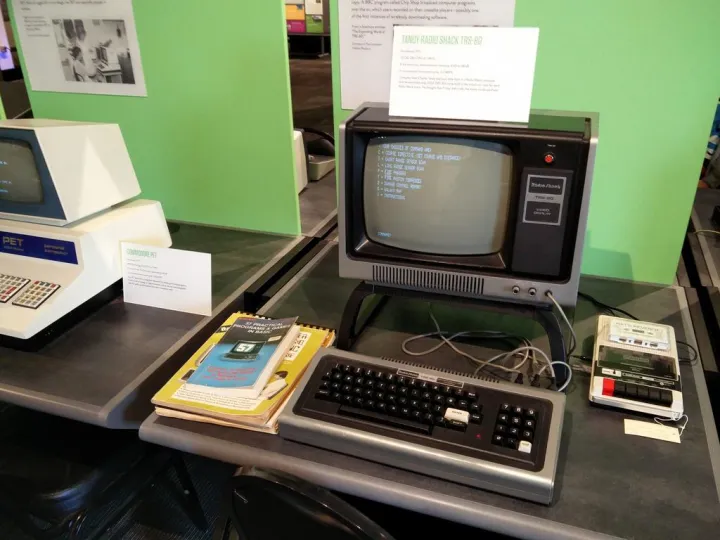

1977年10月，Commodore也推出了他们的个人电脑产品Commodore PET（Personal Electronic Transactor - 个人电子处理器），Commodore的外形看起来与今天的台式电脑更加接近，内置了磁带驱动器，并且最早使用“巧克力键盘（chiclet keyboard）”的家用电脑。当时的售价为$795，略高于TRS-80。

**Commodore PET**  
处理器：MOS 6502/1Mhz  
内存：4KB，最高支持96KB  
磁带：音频盒式磁带  

  

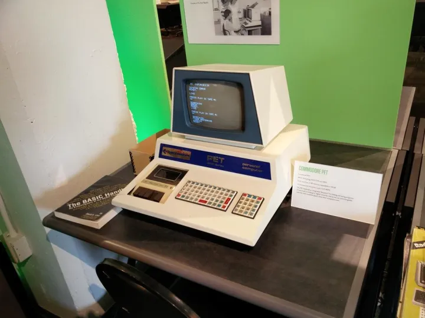

廉价的MOS 6502处理器不仅推动了家用电脑的普及，也创造了第一款可更换卡带的家用游戏主机，Atari 2600使用廉价版本的MOS 6507处理器（只支持8KB扩展内存，并集成了IO处理芯片MOS 6532）并成为了对后来游戏产业影响最为深远的游戏之一。

**Atari 2600**  
处理器：MOS 6507/1.19Mhz  
内存：4KB  
卡带：只读ROM卡带，4KB~32KB（Bank switching - 内存库切换）

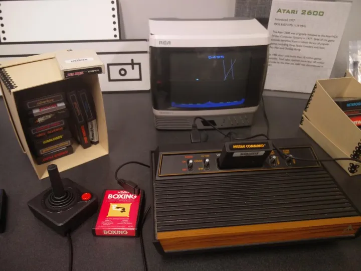

Exidy Sorcerer（巫师）是当时最大的街机游戏开发商Exidy的个人电脑产品，1978年推出的Sorcerer希望能够实现更加容易操作、兼容性和扩展性也都更好的个人电脑产品，Sorcerer采用了和TRS-80相同的Z80处理器，并具备了可以连接普通显示器和电视机的复合视频接口（TRS-80和PET都需要专用显示器），标准的Centronics并口和RS-232串口，可以像游戏机一样插卡即用的“ROM-PAC”卡槽，连接磁带机的音频接口，甚至包括了可以连接S-100扩展箱的50针接口。  

**Exidy Sorcerer**  
处理器：Zilog Z80/2Mhz  
内存：4KB，最高48KB  
外设：盒式磁带、Centronics并口、RS-232串口、ROM-PAC卡带，外置S100总线  

  

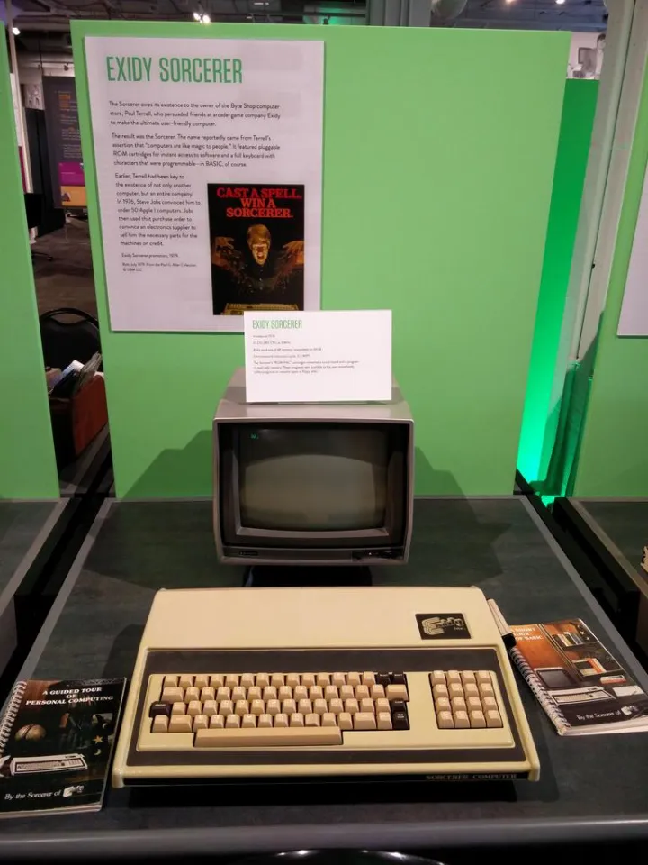

1979年，在游戏主机领域大获成功的Atari推出了他们的8-bit电脑产品——Atari 800/400，按今天的观点，这可以算得上是最早的可以称为Gaming Computer（游戏电脑）的家用电脑。Atari 400/800具有与今天的USB总线类似、支持即插即用的SIO串行总线，并且具备由三颗芯片构成的强大芯片组，分别是

ANTIC - Alphanumeric Television Interface Controller 字符电视接口控制器  
CTIA/GTIA - Color/Graphic Television Interface Adaptor 彩色/图形电视接口适配器  
POKEY - Pot Keyboard Integrated Circuit 电位器（potentiometer）键盘集成电路  

在Atari 400/800系统中，ANTIC负责生成游戏的背景图像，而CTIA负责生成游戏角色（“精灵”），POKEY负责声音和I/O处理。由于使用了独立的“显卡”芯片处理图像显示，Atari 400/800实现了在当时非常强悍的128色显示（使用GTIA显示芯片甚至能达到256色），而其三芯片的架构也启发了后来Commodore Amiga的开发。

**Atari 400**  
处理器：MOS 6502B/1.79Mhz  
内存：10KB ROM + 4KB(Atari 400)/8KB(Atari 800) RAM  
存储：盒式磁带，5.25寸软盘，只读卡带  
图像：384电视线，128/256色  
声音：四路振荡器（oscillators）或两路数字调幅（digital AM）

  

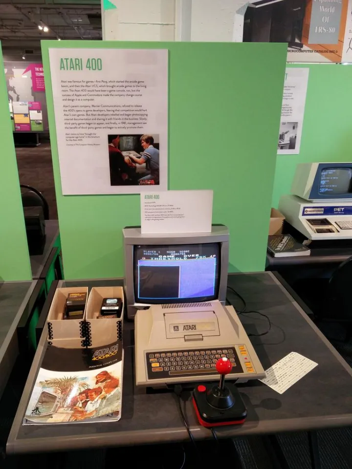

时间进入到1980年，8位电脑市场日渐壮大，市场上出现了第一款百万销量的电脑——Commodore VIC-20，VIC-20设计为一款更加便宜（$299.95）、适合家用的8-bit电脑，它使用了与Commodore PET兼容的CBM字符集，与Atari 2600兼容的手柄接口，MOS VIC（Video Interface Chip 视频接口芯片）以及更便宜的CBM-488串口（IEEE-488的廉价版本）。

在VIC-20发布的第二年，Commodore推出了一款售价仅为$99的的Modem卡带：VICModem，这是第一款低于$100并出达到百万销量的Modem产品，其捆绑的CompuServe远程计算机服务可以看作是今天ISP的原型。  

值得一提的是，VIC-20是Commodore第一款进入日本市场的电脑产品，其日文版本VIC-1001由Yash Terakura（寺仓康晴）所带领的研发团队开发，其上市的时间甚至比北美版本还要早一点。而后来的成为任天堂社长的岩田聪，也曾经以实习生的身份参与过VIC-1001的开发：[前辈兼同事追忆岩田聪和他的处女作游戏](https://link.zhihu.com/?target=http%3A//games.sina.com.cn/y/n/2015-10-13/fxirmqc5073722.shtml)。

**Commodore VIC-20**  
处理器：MOS 6502/1Mhz  
内存：20KB ROM + 5KB RAM  
存储：盒式磁带，ROM卡带  
通信：卡带式Modem  
图像：VIC 176x184，8色  
声音：三路方波，一路噪音，单声道  

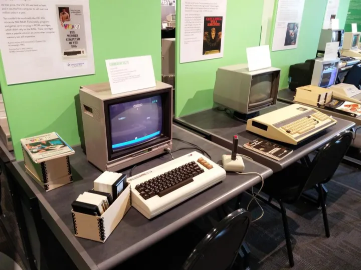

70年代末到80年代初的这段时间，经历了Apple II、TRS-80、Commodore PET三剑客的启蒙，和Atari 400/800、Commodore VIC-20强大的游戏功能的普及，是个人电脑的观念在这一段时间深入人心，而电脑行业也正酝酿着新的变化。下一期带[你逛西雅图活电脑博物馆（三）](https://zhuanlan.zhihu.com/p/21803962)将介绍80年代之后的个人电脑发展史。
