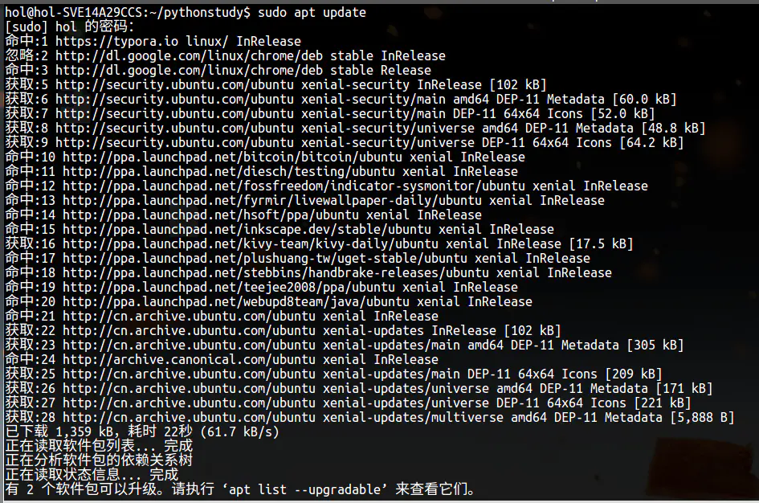
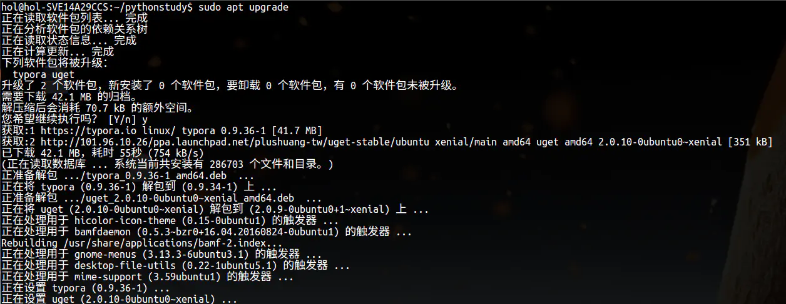
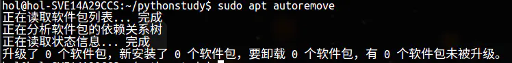
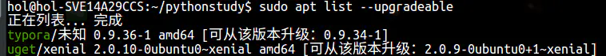
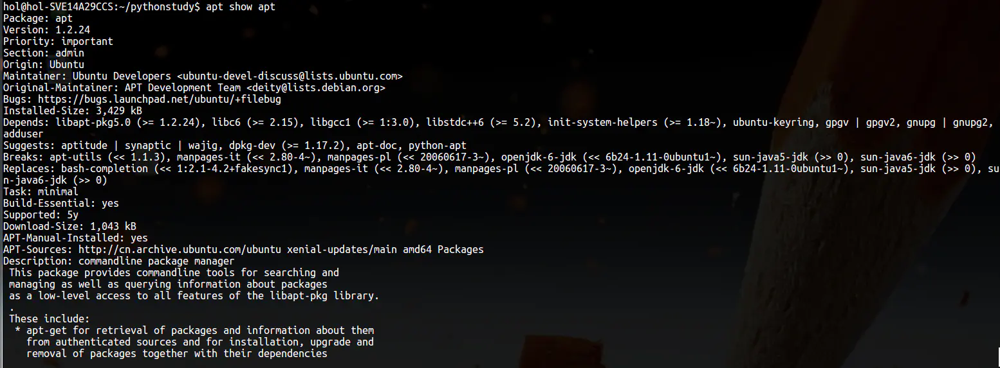

# apt命令详解
apt命令可以说是Ubuntu系统下最为重要的命令，安装、更新、卸载软件，升级系统内核都离不开apt命令。

# 一、apt的简介

apt的全称是Advanced Packaging Tool是Linux系统下的一款安装包管理工具。  
最初的时候，如果要在Linux系统中安装软件，就需要自行编译各类软件，缺乏一个统一管理软件包的工具。此后当Debian系统的时候，同时发布了dpkg管理工具。后来为了更加快捷、方便的安装各类软件，**dpkg的前端工具APT**也出现了。在Ubuntu16.04系统中，apt命令功能又得到了强化，使其更加方便快捷。

# 二、apt命令介绍

## （一）apt update

更新软件源中的所有软件列表。因为更新数据库等操作需要管理员的权限，所以在apt命令前要加上sudo命令取得权限。

 apt update命令执行效果

运行apt update命令会返回三种状态：一是命中，一是获取，一是忽略。  
**命中**表示连接上网站，包的信息没有改变。  
**获取**表示有更新并且下载。  
**忽略**表示无更新或更新无关紧要无需更新。  
在命令显示的最后，会提示你有多少软件包可以升级，你可以根据自身的需求立即或稍后进行升级。

## （二）apt upgrade

执行完update命令后，就可以使用apt upgrade来升级软件包了。执行命令后系统会提示有几个软件需要升级。在得到你的同意后，系统即开始自动下载安装软件包。

apt upgrade执行效果

## （三）apt install <软件包名>

安装指定软件。此命令需管理员权限。如果你对名字并不十分清楚，你可以输入软件名的一部分，系统会给出名字相近的软件包名的提示。在老版本中安装程序需要使用`sudo apt-get install <软件包名>`，现在新版本中已建议直接使用apt替代apt-get命令。  
`sudo apt install -f`  
使用此命令可修复依赖关系，假如有软件因依赖关系不满足而无法安装，就可以运行此命令自动修复安装程序包所依赖的包。特别是在使用dpkg命令安装deb软件包时出现依赖问题常需要此命令来修复。

## （四）apt remove /purge <软件包名>和apt autoremove
这三者都是用来卸载指定软，区别如下：
- apt remove <软件包名>：会删除软件包而保留软件的配置文件
- apt autoremove：用来自动清理不再使用的依赖和库文件。
- apt purge <软件包名>： 会同时清除软件包和软件的配置文件

 apt autoremove执行效果

## （五）apt list

**apt list --upgradeable**：显示可升级的软件包。

**apt list --upgradeable** apt list upgrade执行效果

**apt list --installed**：显示已安装的软件包。

## （六）apt show <软件包名>

显示软件包具体信息。例如：版本号，安装大小，依赖关系，bug报告等等。

apt show命令执行效果