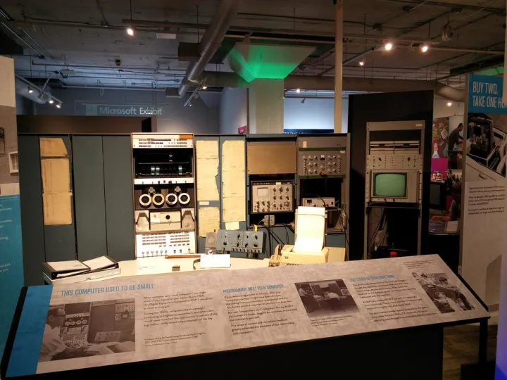
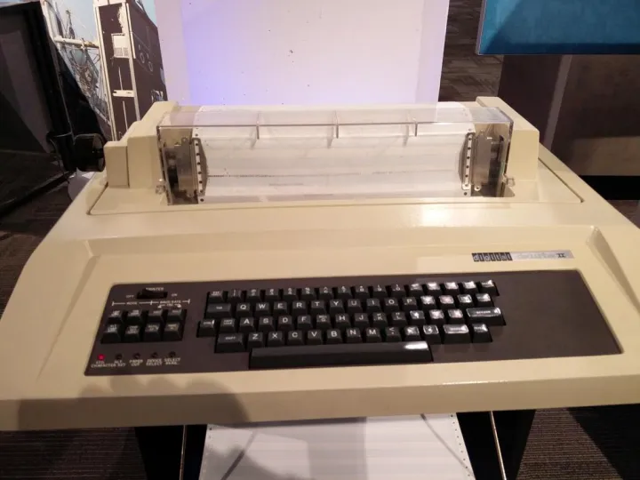
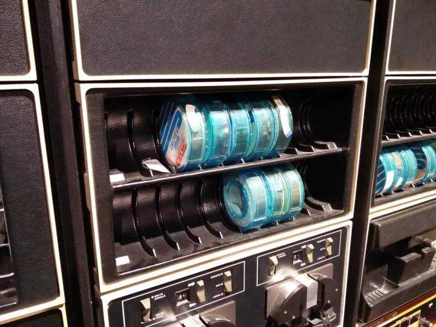
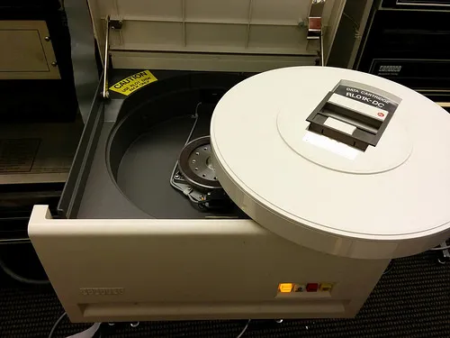
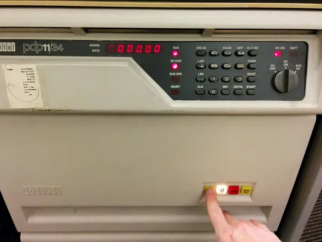
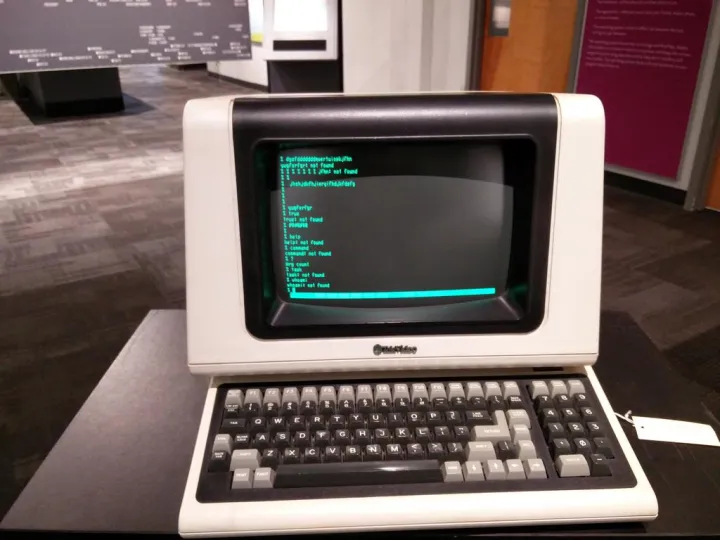

操作类Unix系统的时候，如果你见过真正的小型机，很多概念就容易理解的多。

微型电脑就是一部缩小了的小型机

微型电脑就是一部缩小了的小型机

微型电脑就是一部缩小了的小型机

重要的事情说三遍

知道为什么控制台是tty吗？因为在类Unix里，键盘显示器，都是虚拟的teletypewriter，真正的teletypewriter长这样

为什么解压缩往往会用到tar -zxvf？这个 tar 命令究竟是什么？实物版的 tar 长这样，所以叫Tape Archive

为什么硬盘要mount/umount，硬盘都是固定在电脑里的，mount管什么用？这货叫DEC Pack，就是数据库图标里的那个圆柱，要让这圆柱（硬盘）工作起来，先得把它放进硬盘驱动器，这个驱动器就叫/dev/hda（也可能是 hdb)，看一共有几个Hard Drive）。

然后按下Load钮，磁盘才会转起来，然后才能mount到系统上。BTW，驱动器上面这个满是按钮的盒子，在Unix里就叫/dev/cpu，对，不是微型电脑里那个芯片才叫CPU

那个screen命令，其实本来设计给这货用的，这“傻”终端机没法支持多窗口，所以就需要依靠服务器端的多个进程来模拟多窗口。

想看更多小型机的故事，请移步

[带你逛西雅图活电脑博物馆（一） - 古董电脑室 - 知乎专栏](https://zhuanlan.zhihu.com/p/21767308)