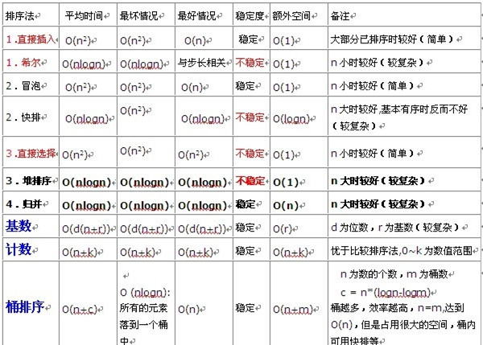

# 排序总结

## 速记
- 插入希（折半插入）：插入，希尔
- 选择堆：选择，从堆上选
- 冒泡快：交换，快速，因为冒泡就是最快的 三者之间
- 基数
- 归并

其中除选择堆，两个都是不稳定的，其他的，基本排序方式是稳定，另一个是不稳定
## 重点
1. 基本排序都是稳定的，除了选择排序
2. 基本排序都是n* n的，除了归并排序

| 算法 |   平均时间   | 最好时间 | 最坏时间 | 额外空间 | 稳定性 |
| ---- | ----------- | ------- | ------- | ------- | ----- |
| 插入 | n2          | n       | n2      | 1       | 稳定   |
| 希尔 | n1.3(不确定) | n       | n2      | 1       | 不稳定 |
| 冒泡 | n2          | n       | n2      | 1       | 稳定   |
| 快排 | nlogn       | nlogn   | n2      | logn至n | 不稳定 |
| 选择 | n2          | n2      | n2      | 1       | 不稳定 |
| 堆   | nlogn       | nlogn   | nlogn   | 1       | 不稳定 |
| 归并 | nlogn       | nlogn   | nlogn   | n       | 稳定   |
| 基数 | n*k | n*k   | n*k     | n+k     | 稳定     |       |
| 计数 |             |         |         |         | 稳定   |

## 排序方法的记忆技巧

数据分为前后两部分：前，已经排好序的。后，待排序的。
- 插入排序：后区按顺序取数据，在有序区中比较大小，并插入正确位置
- 选择排序：无序区比较，选择最小最大，按顺序放到前区
- 交换排序：无序区，依次选择两个数据比较大小，按照要求的顺序交换（或者无序交换）位置

1. 插入排序 前动，后不动
> 无序区依序取，在有序区比较，并插入
- 直接插入
- 希尔插入 分段
- 折半插入

3. 交换排序 前不动，后动 左右自比较，交换
-  冒泡（直接交换） 左右比较
- 快速 分段，一面比自己大，一面小

5. 选择排序 
> 无序区比较，选择最大、最小，依次放入前驱
- 直接选择
- 堆排序

7. 归并
8. 基数