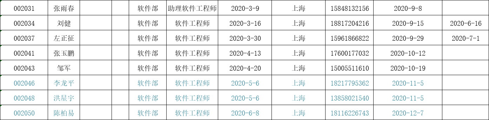

## 年度总结 STAR
1. 定位像，机架定位误差超过0.5处理
> 通知硬件，要求达到设计规范要求
作为硬件层，应该做到
弥补已知缺陷
防范未知风险  希望能够形成满足医疗行业特性的编码规范，但是感觉经验还是太少，很难成文，但会列入计划
例如，对定位像的cut，正常是获取到的每张图像，其移床距离肯定大于

2. 尽职尽责，不留死角
> 1.打印机不工作，重新安装驱动无效
2.编码折行，造成打印浪费纸张
3.右侧边框丢失
4.右侧列打印不完整
5.一页打印不完整，造成浪费

3. 对所有工作尽心尽力
> 库管在孙治国 打印机不工作，IT不在，等待，产品等待入库
因做过打印机套打开发，并了解针式打印机的基本维护，故而主动请缨，迎难而上

4. 接到测试部门潘经理电话时正值中午午餐时间，陪孩子在外午餐，于是联系其他同事，经沟通，其他同事也不方便。在妥善安排好孩子后，即刻赶往公司进行处理，保证了后续工作的顺利进行

俗语说，养兵千日用兵一时，一个好的员工，既要有能打仗，能打胜仗的能力，也要有能打遭遇仗的精神

5. 猎豹行动，加班加点，累到头晕情况下，稍作休息，继续奋战

## 纳米维景
纳米维景(上海)医疗科技有限公司
上海市浦东新区周浦镇芙蓉花路500弄1号楼502室（电梯出门右拐）
上海市浦东新区周浦镇广丹路222弄2号楼7楼
33759052 纳米电话
三思微 成都 负责探测器传输板程序

学校无线网账号及密码：账号：G140601015；密码：G140601015

易瑞张总
17600381448
Chenggong.zhang@palwex.com
15953597600

李总，维景的老板，我认识，就是北京曾经最好的常州菜御景天的老板 参考：https://mp.weixin.qq.com/s/TUeSp3iWgxIKsFx2PnCAxA

北京
总机 : +86-10 62452865
市场 : +86-10 62489512
公司 : office@nanovision.com.cn
市场 : marketing@nanovision.com.cn
地址 : 北京市海淀区北清路68号院用友软件园西区1号楼一层1-06
## 泰坦
办公地址：上海市浦东新区毕升路299弄15号A栋

仓储地址：上海市浦东新区万芳路651号4号楼

电话： 021-50278860 

传真： 021-33932866

邮箱： qiu1111@sh-titan.com
## 3i
3I
会议室视频连接手册
1.说明连接端口是几
2.连接步骤
3.win10 win11操作步骤
选择不稳

## 专利
1.胶片打印可以拼版
2.后期fov裁剪，偏心，范围

## 成绩
两个月转正【正常6个月转正】
第一年优秀新人，第二年年度优秀员工；季度优秀员工若干
入职第一年年末给予15%涨薪【极少部分员工获得涨薪】
公司第一位人才引进落户

## 转正

参与解决了多个通讯问题，为每次正常发版提供支持
实现了床，ctbox, panel，Gantry inf的硬件设备模拟，可与模拟mrs共同组成完整的开发调试环境，减少对CT测试设备的依赖，降低与测试组的设备竞争，能够提高全组的开发效率。
接手打印部分，目前已经初步实现了缩略图的时候规则图形的任意拼版。将深入学习医学图像视觉处理知识，扎根医疗系统，力争在该领域内有所建树，与公司共同成长。

模拟并实现CAN卡设备驱动的所有调用接口，
使用优先级队列实现CAN帧的仲裁
通过模拟常见设备异常，配合系统调试

1.广泛了解itk vtk vmtk dcmtk fo-dicom clearcanvas 技术特点，应用范围，选型特点
2.研读多篇文章论文了解dicom打印机及printscp工作原理，开发路径
3.交接代码跟vt10对接测试，发现接口标准不一致，功能需求不一致，运行崩溃，内存访问越界，访问vt10导入的数据格式不兼容等各类问题，急需解决
4.交接界面跟vt10界面存在明显不同，需要重新明确需求
5.

1)完成经理根据项目计划所分配的任务；
2)协助同事分析解决工作中遇到的问题；
3)发挥自身在软硬件的经验，做好开发过程中的软硬件结合问题 ；
4)具备优秀的团队协作精神、敬业精神

1)做好系统及子系统的设计、编码、测试、维护等工作；
2)根据项目要求做好需求分析、完成设计文档的编写； 
3)完成公司经理根据项目计划所分配的任务； 
4)分析解决产品中发现的问题； 
5)发挥自身在软硬件的经验，做好开发过程中的软硬件结合问题 
6)具备优秀的团队协作精神、敬业精神

1.每一个库增加一个版本查询功能
2. mrstool重建参数跟mcs对应表
3.发包会议以后开扩大会议
4.库更新跟张强确认，每次出图像质量报告给出当前算法库版本 详细到小版本

重建起止位置 层厚 算法等
重建错误消息

## 回忆录
3.1 初步培训 罗菊
1.我们产品是仿的西门子，需要看西门子、明峰的操作手册
2.跟张玉鹏一起解决通信问题
3.打印部分到临床的时候需要
4.陆雪娟 有说明书，坐我旁边
5.机架 Gantry、球管 射线源、

北京：负责
曹红光：奕瑞董事长
李运祥：CEO 主攻算法，北京公司法人

张有为：软件部经理
沈阳：高压发生器。沈阳的CT第三方检测比较厉害
无锡：负责生产X射线管（球管）
成都：负责生产（量产）2020年7月投产，一万平方场地

上海 2019年9月28成立
工厂：1楼硬件研发、产线（负责小批生产） 7楼软件研发及管理部门
学校；项目共享，学校提供场地，提供2个学生（影像、临床专业）负责专利项目申请

查婷婷：人事、行政
罗   菊：90年
刘   建：2020032413500 湖南人20200316入职
丁海宁：202007入职 配合北京做工作站前端算法
邱嘉华：留学背景，负责工作站后算法
张海勇：20210323入职 1985.11 2008年毕业于河南理工大学计算机科学与技术 2008-2012 2012 2018 2018 2021
赵行宇 1990年

陈柏易：202004入职 负责MCS  四川人
张玉鹏：202004入职 通讯（CAN-床CTBoxPanel、TCP->MRS）。河南南阳人，在武汉长大  199102
李龙平：202005入职 负责PAD（微软Surface pad），使用无线连接（路由：nano-ct）武汉人 
陈国维：硬件，做的床，从别处挖来专门做床的
刘艳  ：工艺部经理，从西门子挖来，在西门子专门做培训，做了十年
狄小涛：202102入职 江苏南通  做过HIS/RIS、CT系统 88年 联影->大骋医疗-> 纳米维景->奥朋医疗
候柯柯：202102入职 安徽 1995
陆雪娟：负责文档

左正征：20200330入职 已离职
邹  军：20200420入职 负责DICOM打印 2020年3月18日离职

工号                   姓名                                                                                入职日期                                           电话                  计划转正日期               实际转正日期

2021.03.02 劳兴丽 培训
一、制度
1. 考勤：9：00-12:00 13:00-18：00 中午休息一个小时。周末双休，钉钉上考勤，9:05前算正常打卡 9:05-9:30算迟到 9:30以后算旷工
    每个月5次漏打卡机会，超过5次算旷工
2. 加班：每天超过2小时算加班，加班时间可以调休，调休下一年1月31号清零。22点后可以打车，最高打车金额：工作日75元，周末150元
   周末加班，需提前提交加班申请，并在加班结束后提交加班日报
3. 假期：年假有效期到次年3月31号清零。<10年 5天 10-20年10天  >20年15天（法定）。试用期不享受年假
4. 请假：钉钉提前三天请假。<3天，部门负责人审批；>3天总经理审批
5. 工资：每月10号，节假日顺延
    保密：工资保密。
6. 试用期：合同6个月，一般3-4个月（最多5个月）可以转正。合同期限三年，三年后续签则合同期限为五年
二、钉钉：
       采购
       用印申请
       补卡申请：每月最多5次。
       出差
       外出
       加班：钉钉会自动扣除2个小时候，开始算加班
       请假：优先扣除调休
       转正：钉钉上填写转正申请以及个人工作总结
       报销：填写报销单【到人事部门要模板】；自己车辆：1.8元每公里；公交地铁：实报实销
       病假：发60%工资
       商业险：报90%（包括医疗和意外：门诊加住院）2000以内直接APP申请报销；>2000需邮寄发票到保险公司进行报销
       奖励：内推、优秀员工、专利、软著等等。目前，奖励部分以报销方式走，自己准备发票
       物品领购：>1000元
       绩效：按季度考核，试用期不参与考核，转正后正式考核。从2021.1.1号开始执行，以2个月工资作为考核基数
       转正后：业绩管理合同
       专利：授权通过发50%  发明5000 应用3000 实用1500 软著2000
2023.补充
1.周一到周五加班不调休，超过20：00提供25元餐费，随工资发放
2.晚上超过22点后可以报销打车费。60元（好像）
2023.3.31 医疗保险培训
1.年度从 到
2.起付线
3.收据上的自负1部分，报销90%
一、定位像

## 邹军打印工作流程
1.DICOM的操作是通过VTK实现的
2.DICOM的读取通过ITK实现
流程：
1.C#传递DICOM文件所在目录给dll
2.
DLL生成待打印jpg文件，放到C#指定目录

## 辐射考试
422000679肺科医院体检编号
γ射线波长0.01pm  10pm
X射线波长10皮米～10纳米
紫外线波长10纳米～0.38微
可见光波长0.38微米～0.76微
红外线波长0.76微米～1毫米
微波1毫米~1米
超短波1米 10米
短波  10米 100米
中波 100 1000
长波 1000  3000
无线电波波长0.1毫米～3000米，
绿 495–570 nm 黄 570–590 nm 橙 590–620 nm 红 620–750 nm

电焊弧光，不属于电离辐射。
电焊弧光，属于非电离辐射。

焊接中焊工常受到的辐射危害，主要有强光、红外线、紫外线等。
焊接中的电子束产生的X射线，会影响焊工的身体健康

以向右斜的箭头表示β-衰变，向左斜的箭头表示β+衰变或轨道电子俘获(图2)；以向左斜的双线箭头表示α衰变（图3);以竖直的箭头表示从子核较高的激发态到较低的激发态或子核基态的γ跃迁。

劳姐，实在不好意思哈，又要麻烦你为我的事情单独跑一趟。主要是下个月要准备临床了，到时候我要住场，我基本上从头跟到尾，后面结束了，我还要跟小计量，我的档案又有问题，怕后面没时间处理了，真的不好意思，感谢，有机会请你吃饭

