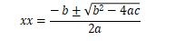
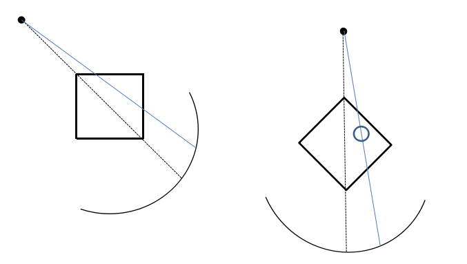
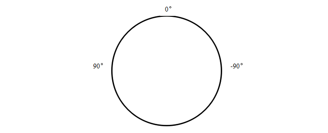

 **由重建图ROI计算投影位置算法设计说明**

**修改履历**

|   |   |          |     |            |
| ---- | ---- | ----------- | ------ | ------------- |
| 序号 | 版本 | 修改内容概述 | 编制   | 日期          |
| 1    | 1.0  | 新版发布     | 李翠芬 | 2021年8月19日 |

# 1 **引言**

## 1.1 **目的**

本文档描述了复眼24产品中根据重建图上根据ROI的位置以及射线源的角度计算ROI在投影图上的位置。

## 1.2 **读者对象**

静态CT算法开发人员，软件开发人员，测试人员。

## 1.3 **文档范围**

描述算法设计方法。

## 1.4 **术语定义**

|       |       |
| -------- | -------- |
| **术语** | **定义** |
|          |          |
|          |          |
|          |          |

# 2 **文档依据**

无。

# 3 **算法说明**

**算法输入：**ROI中心位置相对于ISO的坐标，重建图像的像素尺寸，射线源的角度α，射线源距旋转中线的距离SOD，射线源距离探测器中心的z向距离Zoffset，探测器环的半径R。

**算法输出：**投影图上的坐标点。

**算法过程：**

1) ROI中心相对于ISO的像素坐标点(X,Y,Z)，重建图像的像素尺寸为pixelsize，令x=X * pixelsize, y=Y * pixelsize, z=Z * pixelsize，则ROI的位置坐标为(x,y,z)；

2) 设射线源当前角度为α，如果角度坐标定义为图2所示，计算ROI旋转后的坐标点：

x'= xcosα+ysinα  
y'= -xsinα+ycosα

3) 射线源距旋转中心的距离为SOD，射线源距离探测器中心的z向距离为Zoffset，探测器环的半径为R，焦点位置(-SOD, 0, -Zoffset)

k = y'/(x'+SOD)

d = k * SOD

解方程yy=k * xx+d 及xx * xx +yy * yy = R * R的解；

a = 1+k * k

b = 2 * k * d

c = d * d-R * R

yy = k * xx+d

4) 计算出两组xx和yy后，判断yy>0那组为解；

zz = (z+Zoffset)/y * yy-Zoffset

5) 投影像素尺寸为detpixelsize，投影图矩阵大小为M * N，N为层数;

xx = xx/detpixelsize+M/2

zz = N/2 - zz/detpixelsize

对应到投影图上的坐标为(xx,zz)。

图1 算法示意图

图2 射线源角度
