# 整机
## 构成
Gantry（机架）、球管、射线源、高压柜、电源柜
## 启动顺序
1. 开空调
2. 开总开关
3. 依次开12563489分开关
4. 电源柜门上的开关（带灯的）
5. 高压柜开关（白色）

# 拓扑结构
0310_150127 CTBox
150339 IFBox_Bd_V1.0  4Layers 1.6mm板
一体化射线源继承了高压变频器、灯丝电源、X射线管、热转换器（不知道从哪里来的）

# Gantry

机械硬限位（两条黑线之间）：214.38度
红外软限位（两条红线之间）：205.27度
红外零限位（黄色跟最近的红色之间）：2.43度
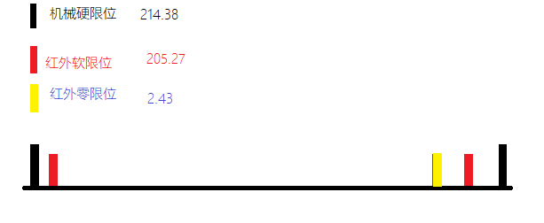
## CTBox
WorkMode 的状态
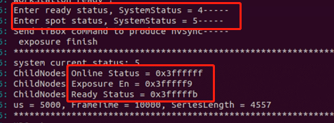
ChildNodes Online Status：硬件在线状态，哪些在线（哪些设备当前有效）；
ChildNodes Exposure  En：判断ready使能位，需要判哪些节点曝光时需要ready使能；(由MRSServer m_pControl->SetExposureMode下发)
ChildNodes Ready Status：实际有哪些节点ready了。

ifbox tubeInff mtCtrl 都有status寄存器，每个位的信息也都一样，区别如下：
ifbox 收到prep 后就会突发ready  。
tubeIntf 检测到射线源M15 ready 后 才会 突发ready
mtctrl 检测到 运动匀速了 才会突发ready

最后ctbox 会汇总 所有板卡的ready， 都ready 了才 下发曝光指令

三个寄存器

## 报错
Msg err status tube 19:11
11 母线电压超限
41 手动终止 门没关好

## ip地址
78.86.65.16： ctBox可 ping

78.86.65.17： ifbox可 ping
78.86.65.19： pdu板卡 可 ping
78.86.65.21 mtCtrl 可ping

78.86.65.41-46 tubeIntf可ping

78.86.65.26  

imgTrans 不可 ping

因为数据倒着传，所以第一块板子，需要跳线，并且是最后传的一块数据

单网卡：
Vlan10  78.86.66.64_71 
Vlan20  78.86.67.72_79
               79是最后一块传输板
16网口、双网卡：
78.86.66.200 - 78.86.81.200 都可以ping         

# 探测器(与付工邮件沟通)
## 物理尺寸(实际尺寸)
0. 老火办公室测量
> 宽79.72  75.54
> 高42.66（ 2023-07-25测量：42.37，这个应该是准的：0.2645 * 160 = 42.32_ 反向计算0.2648125 * 288 = 76.266）
1. 探测的成像区域尺寸
  a.图纸尺寸 76.6 * 42.03
  b.实测探测器板，两块芯片的边缘距离是76.54mm
    0.265 * 288 = 76.32 + 0.13 * 2 = 76.58    （0.13探测器边缘，两个边缘碰起来的距离0.13 * 2=0.26正好是像素间的距离
    0.265 * 160 = 42.4
  c.逻辑尺寸 0.165  *  288 = 47.52mm(MCS设置的探测器宽度就是该值)    0.165 * 160 = 26.4mm
2. 探测器的物理像素尺寸应该是0.265mm，最好跟张超也确认一下；
3. 以下几个距离（请参考附图1）：
  a. 十字激光点0 到 Guantry边缘的距离： 339mm
  b. 十字激光点0 到 探测器底板边缘的距离：339mm+14.7mm = 353.7
  c. 十字激光点0 到 第一块荧光板边缘的距离：392-40（检出板Z向尺寸为80mm）=352mm
  d. 十字激光点0 到 两块荧光板拼接缝的距离 ：392mm
## ISO尺寸(程序中用到的尺寸)
1. 像素大小：0.165mm (0.265  *  SOD/SID)
2. 像素数量：160 * 144 * 2（z轴2个探测器拼接）
3. 探测器宽度：288 * 0.165=47.52mm
> 历史上使用过47.23(0.164) 探测器宽度最早值，之后改为47.52（0.165）
4. 扫描脉冲时间：36源：5ms 108源：0.1ms
3. 以下几个距离：
  a. 十字激光点0 到 第二块荧光板外边缘的距离：364
  b. 十字激光点0 到 两块荧光板拼接缝的距离 ：340mm
## MCS设置值
  a.探测器宽度     47.52 = 288  *  0.165
  b.轴扫进床距离 42.24    = 256  *  0.165 = 42.24
  c.轴扫床速        40
  d.螺旋扫偏移   47.54 
SFOV=3072* 0.165=506.88
Columns=506.88/(0.165*4 Binnning)=768
PixelSpcacing=506.88/768=0.66
## MRSServer用到的几个变量
SOD  Distance Source to Detector (0018,1110) 1139.2 //来自MRSServer代码，写死的
SOP  Distance Source to Patient  (0018,1111) 708 //来自MRSServer代码，写死的
SID   Source ISO Distance 源到探测器距离(mm)  
SOD Source O   Distance 源到原点距离(mm) 
1. Sid垂直1143.7 斜到探测器1148 //来自丁海宁
2. Sod 约708.95 // 来自丁海宁
3. offsetZ = 100; //探测器Z向偏心(mm)【球管射线铅垂线到物理探测器中心距离(也就是两个探测器的拼接缝处)】

探测器 像素 顺序
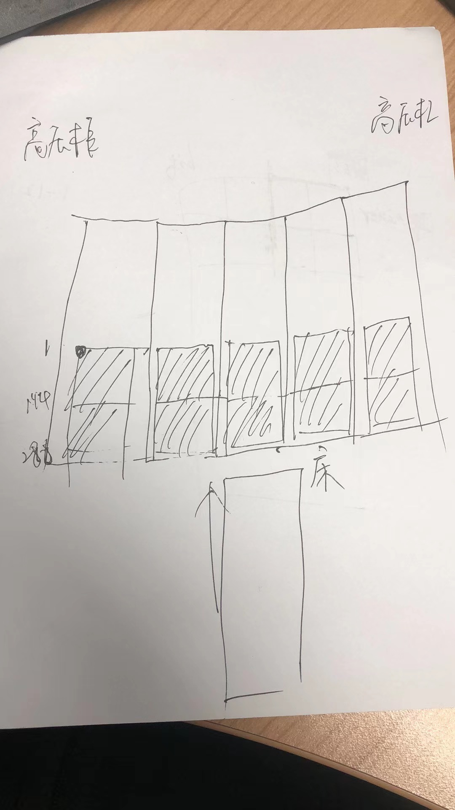

## 探测器数据抓包
对探测器上传的数据进行抓包
> gvcp
a038 : 01 00 00 02 开始曝光
          01 00 00 00 停止曝光
a038这个地址值请参考《E:\steven\工作交接_田亮\MRS可从底层获得的状态信息》

工艺要求：我们ZM4的探测器到工装的间隙应该是在＜0.5mm
实际：探测器到工装之间的，设计间隙是1.35mm
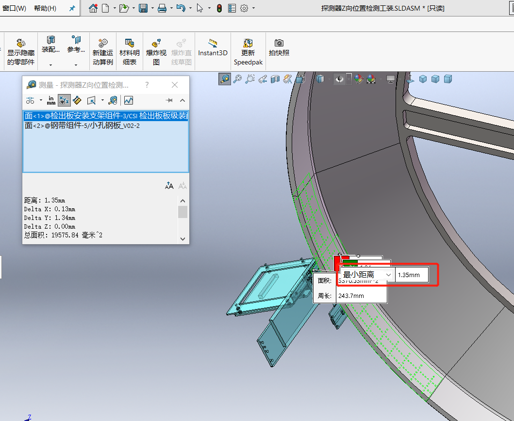
# 球管
## 灯丝
LF：Large Focus/Filament
SF：Small Focus/Filament
hs：High Spot?
ls： Low Spot ?

## monoblock
MONOBLOCKS® – 一体化 X 射线源
斯派曼 Monoblocks® 是一体化 X 射线源，在简单、经济有效的组装中包含高压电源、灯丝电源、控制电路和集成 X 射线管。Monoblocks® 用于各种医疗和工业 X 射线分析应用，既可以固定，又可以旋转，并提供杰出的稳定性和性能，紧凑、重量轻、易于安装。

Monoblock® 是斯派曼高压电子公司注册的商标。
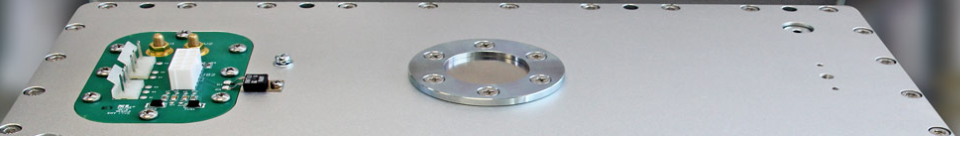

逆变单元尺寸： 390mm * 286mm * 354.5mm   
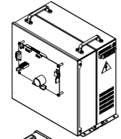

一体化高压油箱 
最大热容量 900 千焦（1200KHU)； 
最大持续散热量300W(在有外界空气循环流动条加下）； 
X 射线焦点中心误差：+/- 1.6 mm。射线焦点位置如图 
高压油箱单元尺寸：330mm * 152mm * 229.8mm   
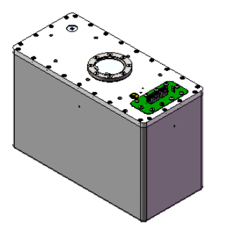
## 电压电流
球管电场：电压 310v  频率35khz
阴极灯丝：电压 220v  频率20khz 
旋转马达：电压 220v
管电压：阳极、阴极之间加的高压电场电压
管电流：阳极、阴极之间加高压电场电压后，产生的电流
X射线能量与管电压成指数关系

# 床

Bug：2063 探测器后置，前罩壳太厚，导致病床大量行程浪费，扫描距离仅仅1024mm
2063 探测器后置，前罩壳太厚，导致病床大量行程浪费，扫描距离仅仅1024mm

分析依据：

1. 水平床板可以在机架孔径移动的垂直高度是：720mm- 985mm
2. 头托有效长度是260mm
3. SW限位要离开前端电气限位至少5mm的安全距离
4.  200mm/s 水平速度，150mm/s^2 的加速度，我们减速距离是133mm
5. TOPO 项扫描，发生在水平匀速段

因此根据上诉要求，我们计算我们200mm/s的定位像实际上能达到的扫描长度：

985mm软件垂直床位最高点：
 1135 （床板在FOV的有效距离）+260（头托有效距离）  -133（减速距离） = 1262 mm （垂直在SW最高点有效扫描距离）

720 mm 软件垂直床位最低点（在机架内腔）：
1135 （床板在FOV的有效距离）+260（头托有效距离）  -133（减速距离） - 336（垂直从985 到 720，水平偏移距离 ）：=926mm （垂直在SW机架内部最低点有效扫描距离）
 
考虑到曝光很少发生在最高点和最低点，因此折中来看，在200mm/s的速度下，我们理论上的扫描范围是1024mm

经验教训：

我们病床离机架的扫描中心太远，达到827mm，浪费了大量的床面板行程，这里面有两个因素导致：
1. 前罩壳太厚，球管在机架前端安装，探测器在机架后面安装，是导致前罩壳太厚的根本原因
2. 病床安装距离太远：

还望24源商业版和36源项目中关于机架设计和病床设计必须好好考虑扫描行程因素，床面板不可能伸出去太长，太长对病床机械设计带来很大的挑战。

历史记录    
2022-04-24 19:02:55, 由 胡智勇 创建。
2022-04-24 19:03:09, 由 胡智勇 编辑。 
2022-04-24 19:11:09, 由 胡智勇 编辑。 
2022-04-24 19:15:41, 由 胡智勇 编辑。 

# Control Box

## 
can帧格式详解

527525,接收,35710.5222,00000042 H,标准帧,数据帧,8,27 C8 00 2A D2 00 00 00 ,
527526,接收,35710.5474,00000023 H,标准帧,数据帧,8,40 27 C8 00 2A D2 00 00 ,
524347,接收,36995.4316,0000006E H,标准帧,数据帧,8,01 00 00 00 00 E0 1F 80 ,
527524,接收,35710.4772,0000020A H,标准帧,数据帧,8,20 00 05 00 05 00 00 00 ,
524351,接收,36997.3654,0000020A H,标准帧,数据帧,8,29 00 00 00 00 00 00 00 ,
524348,接收,36995.4551,0000022B H,标准帧,数据帧,8,30 0C 20 47 2A D3 22 CC ,
524349,接收,36996.4550,0000022B H,标准帧,数据帧,8,31 00 00 00 00 07 00 00 ,
524346,接收,36993.4536,0000022B H,标准帧,数据帧,8,32 00 00 00 0B ED 1E E6 ,

527522,接收,35709.3705,0000022B H,标准帧,数据帧,8,32 00 00 00 0B ED 0E 94 ,
527523,接收,35710.4390,0000020A H,标准帧,数据帧,8,20 00 05 00 05 00 00 00 ,

操作面板           00000 0000 0100   000 
机架控制板    021  00000 0000 0100   001

  
ControlBOX    06E  00000 0000 1101   110   01
MCS固定主控板 20A  00000 0100 0001   010   29 20
床运动控制板  22B  00000 0100 0101   011   30 31 32

01 按键装

30 床当前位置
32 当前床的速度

30 回心跳 3个30 回 一个 29 3s
32 回box按键使能 10个32 回一个 20

# CAN总线的拓扑
按照之前的方案，CAN总线的拓扑如下图中的CAN1, 由于ctbox有控制第二路CAN的功能需求，当时为了协议控制简便，开发CAN2接口用于实现控制盒、病床和panel的控制。此三个子部件由上海同事负责研发，当时设定的机制是每10ms突发一次状态，三个节点平均3m/s一条CAN报文，甚至更快。ctbox由于性能有限，处理如此多的报文可能稳定性不太好，故造成CAN总线不稳定，导致某些CAN模块异常。
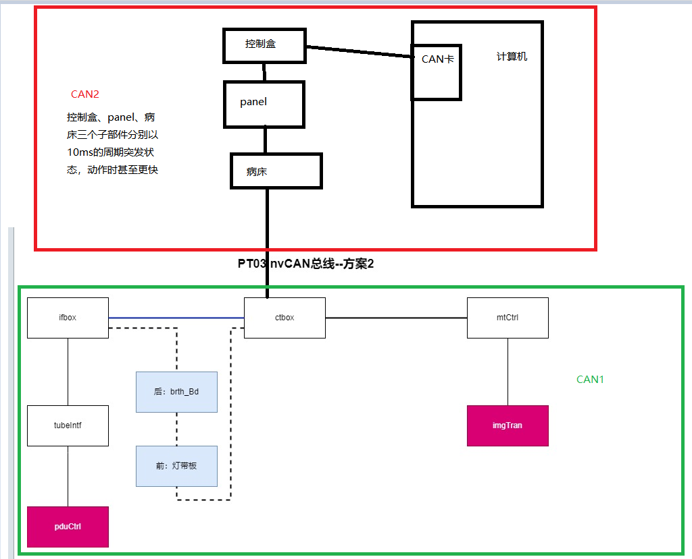

# MRSTool
自由扫描 trigger设为 continue

SeriesNumber 
480+24  504
1080+24 1104

激光灯 到 探测器 距离（需要移动）364mm

一个模组是由一个传输板，四个处理板，四个检出板（探测器）组成
S ZM8周六安装完毕，周日测试部门加班进行矫正测试，发现缺少库文件，矫正工作停滞。

Mcs加team viewer
Mrs 加tftpd-hpa  北京自动启动
        exfat-utils  ethtool
        vnc改窗口分辨率
        关闭时间同步
        
# 电源柜
总电源  nvst-PDU 三个绿色指示灯亮
空气开关|功能|备注|
QS 无反应
Qs1 pdu psControl板子 E3 E2灯亮 图1
Qs2 |交换机
Qs3 |机架上PCB板子电源|传输板、采集板|
Qs4 |床板电
Qs5 |电机
Qs9|Qs9 控制探测器（也就是重启探测器），是所有的16个模组|QS9 关掉后探测器模组都没电了，机架上模组风扇有电，tubeinf没电，一体射线源没电|

Servo moto interface f

Qs1全部断电
 Fluoro 前缀 氟，荧光

# 打印
结构，缩略图内图尺寸，并存储该内图，供调整缩略图用

一级，增加一个正在加载的初始图片

拖拽，带编号，
释放，调用接口一，带源编号，目的编号

函数一，检测拖拽缩略图内图的编号

函数二，检测鼠标是否在缩略图内图有效区域内，上下左右各让出两个像素

接口一，根据两个编号，重新排序，并刷新所有缩略图，从编号所在页开始

接口二，根据编号，返回当前缩略图内图所有属性

接口三，设置以上所有属性
关闭rtd的散射矫正，同时结束
所有的stopscan尽量使用normal，
250 fov进行测试
进床
1459
1475.22

出床
1443.66
1452.02

 Vitual Control Box
# 模拟床
移好床后，检验床高，床码，有问题则停止床高床码的移动，并设置错误位且上报

2增加界面床错误信息的显示

1开双端队列
2取num使用trylock成功后
  保存num 为old ，返回num
不成功返回0
3取数据lock，成功后
  Num-=old
  准备数据 返数据
不成功阻塞

4发命令lock，成功后
 解析命令，准备数据 num++
不成功阻塞
 
或者，超时锁，超时后，返回0

Go使用定时器，按下标志位置一，松开置零，定时器中不断合成指令及更新相关状态，使用 trylock

其他板卡，一律trylock
定位像提速任务相关模块如下
1.mcs端，下参参数需调整，拼图尺寸有调整
2.mrs端，根据算法要求做相应调整
3.图像算法

# 系统裁剪
清除分区
创建分区 c d 400 e 7000 f 剩余
Vnc安装有问题，华硕有弹出对话框
缺mysql
4.6.1

锁屏win d
Ctrl alt del
五次 shift
小团注的计量统计
网络安全二十四项
Dosereport 持久化
Rtd改为 540 view
专利申请
截屏

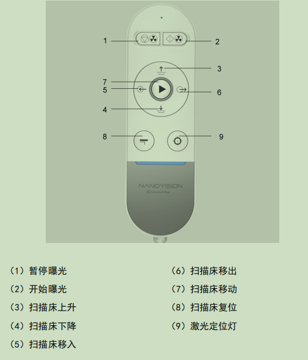

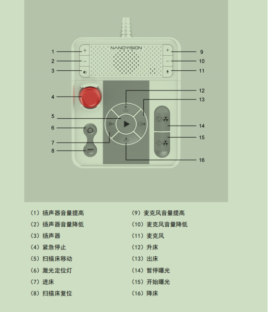

# 限速器
波太结构图_20220425154628

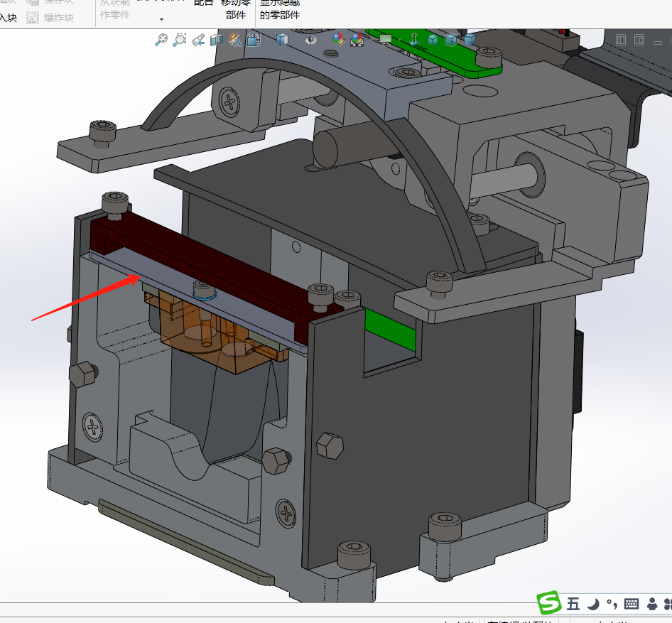

限速器开口调整
