静态CT原理介绍-崔志立-总工-2022.03.18
\\10.0.0.11\share_File\【公共文件】\培训资料\新员工培训资料
一、历史
1. 伦琴发现X射线，并发现投影图
2. Radon提出图像重建数学方法
3. Cormack发现X射线在人体不同部位的衰减不同，并得出相关计算公式
4. Hounsfield设计第一台颅脑CT机

二、数学基础
1. 直接矩阵求解法：解方程
2. 总和法（反投影法）：FBP
   a. 各个元素的值未知，初始化为0（我个人的解释，与图片不同，图片中a是真实值）
   b. 行求和，将每行的和，加到每行的每个元素上
   c. 列求和，将每列的和，加到每列的每个元素上
   d. 升求和，将每升的和，加到每升的每个元素上
   e. 降求和，将每降的和，加到每降的每个元素上
   f. 第一张图：总和法最后的结果
      第二张图：将结果减去 模也叫基数（就是b 或者 c求出来的单次求和值，整个矩阵的和：10）
      第三张图：减去整个矩阵和后的值
   g, 因为重复加了4-1 = 3次(第一次是在0上面加，相当于初始化了)，所以除以3
   
检验（使用质数）：
~~~mermaid
graph LR
  oo[3 5 7 11]
  o0[0 0 0 0]--行 8 18-->o1[8 8 18 18]--列 10 16-->o2[18 24 28 34]
  o2--升 3 12 11-->o3[21 36 40 45]--降 5 14 7-->o4[35 41 47 59]
  o4--总和 8+18=10+16=26-->o5[9 15 21 33]
  o5--除以3-->o6[3 5 7 11]
~~~
   
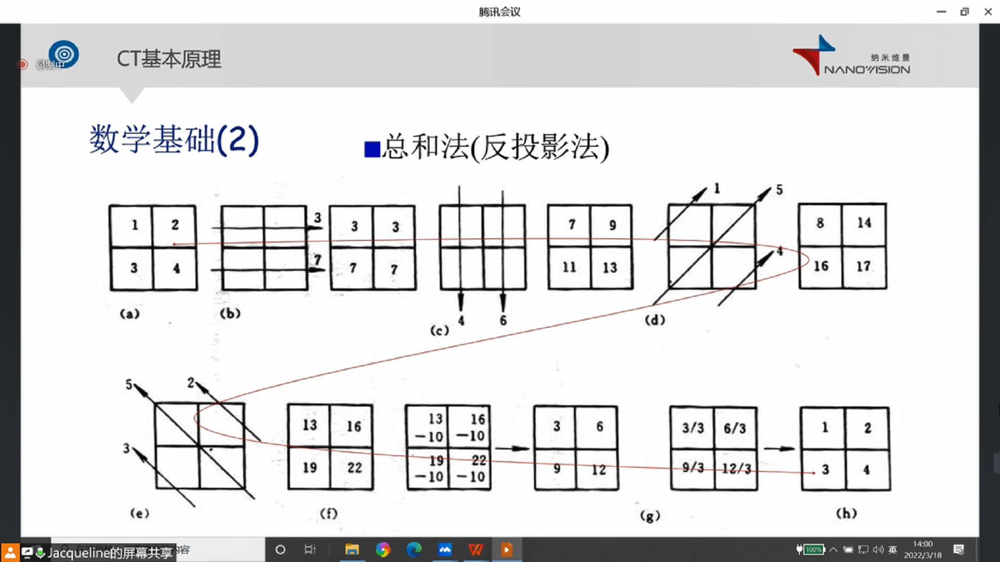
3. 逐次近似法（迭代法）:IVR
   1. 求出行和：3，7；列和4，6；以及总和：10
   2. 每个元素初始化为平均值10/4 = 2.5，并求行求和为5，5
   3. 按照行矫正误差(3-5)/2 = -1 /2 = -0.5  (7-5)/2 =  2/2 = 1，    调整后得到 1.5 1.5 3.5 3.5，并求出列和5，5
   4. 按照列矫正误差(4-5)/2 = -1 /2 = -0.5  (6-5)/2 =  1/2 = -0.5，调整后得到 1.0 2.0 3.0 4.0
   5. 得到最后的结果 1 2 3 4
   
   
检验（使用质数）：
~~~mermaid
graph LR
  oo[3 5 7 11]--行和-->oh[8 18]
  oo--总和-->os[26]
  oo--列和-->ol3[10 16]
  os--平均值 26/4=6.5-->o1[6.5 6.5 6.5 6.5]--行和-->oh1[13 13]

  oh--第一行矫正 8-13=-5/2=-2.5-->oz[-2.5 -2.5 2.5 2.5]
  oh1--第二行矫正 18-13=5/2=2.5-->oz
  
  oz==矩阵求和 6.5-2.5=4==>os1[4 4 9 9]--列和-->ol2[13 13]
  o1==矩阵求和 6.5+2.5=9==>os1
  
  ol3--第一列矫正 10-13=-3/2=-1.5-->oz2[-1.5 1.5 -1.5 1.5]
  ol2--第二列矫正 16-13= 3/2= 1.5-->oz2
  
  oz2==矩阵求和 4-1.5=2.5 4+1.5=5.5==>os3[2.5 5.5 7.5 11.5]--约等于-->ol4[3 5 7 11]
  os1==矩阵求和 9-1.5=7.5 9+1.5=10.5==>os3
  
~~~
 
最终值
2.5   5.5
7.5 10.5
跟原始值存在差异，因此，该方法被称为逐次**近似**法

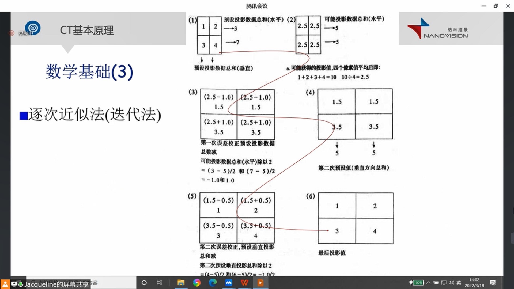
4. AI重建

三、CT值
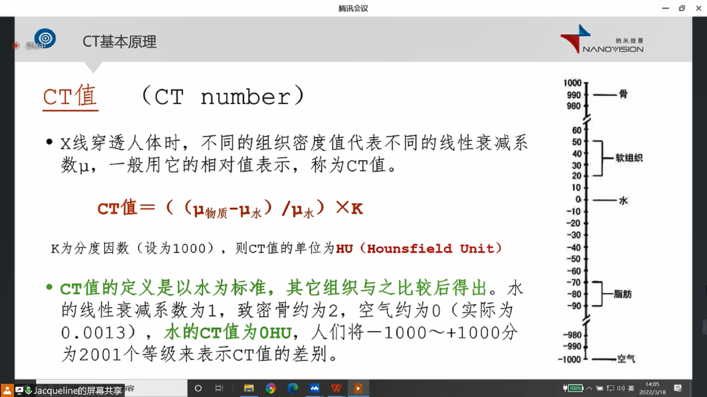

三、每代CT原理
总结：
第一代：点线 射线是一根线
第二代：射线 射线是一个窄扇形
第三代：扇线 射线是一个宽射线
第四代：旋转 射线源旋转替代平移
第五代：线转 射线模拟旋转
第六代：不转 
整个发展过程，射线、探测器的宽度原来越宽。
1. 第一代
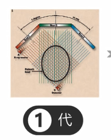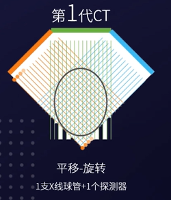
特点：射线是笔直的（极窄的扇形，近似一条直线，或者逻辑上定义为一个像素的线）
一个像素（逻辑上）的射线源，一个像素宽度的探测器。
图中每一条线，代表一次曝光，每一个**平移扫描**结束后，旋转一个角度
**目标**：实现成像
2. 第二代
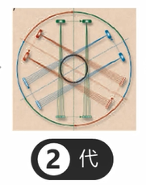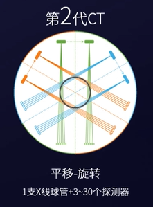
特点：射线是扇形的（较窄的扇形，覆盖面积比较小，但可以降低一代一次**平移扫描**中的曝光次数）
窄的扇形的射线源，多个像素宽度的探测器
图中每一条射线，代表一次曝光，每一个**平移扫描**结束后，旋转一个角度
**目标**：降低了一次平移扫描中的曝光次数，提高扫描速度
3. 第三代
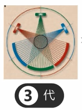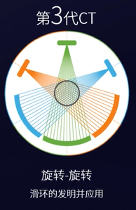
特点：射线是扇形的（宽的扇形，覆盖面积比较大，一次曝光，就是一次平移扫描）
**目标**：一次曝光，就是一次平移扫描，再次提高扫描速度
代内发展：射线管旋转速度越来越高
**目标**：使用滑环，有极高的旋转速度，时间分辨率上可以基本满足心脏等运动器官的造影

4. 第四代
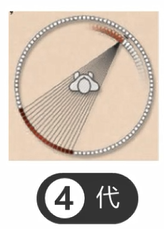 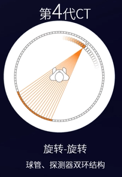
特点：探测器是整环的
因为没有明显提升，因此没有推广开来

5. 第五代
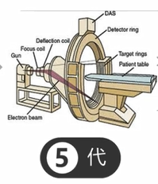 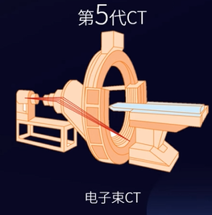

特点：通过磁场偏转电子束，轰击环形靶盘，实现旋转的射线

6. 第六代
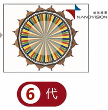

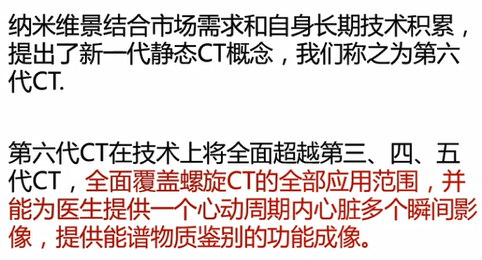

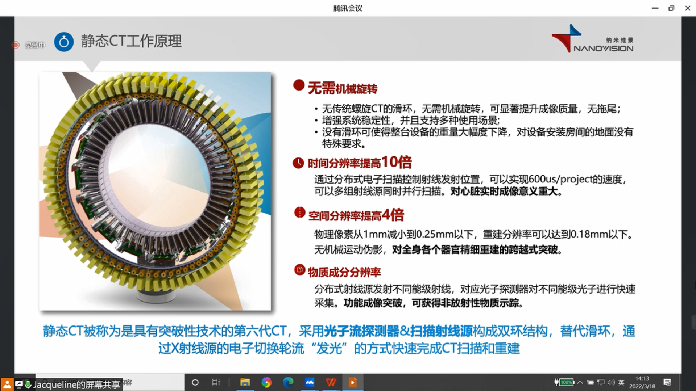
