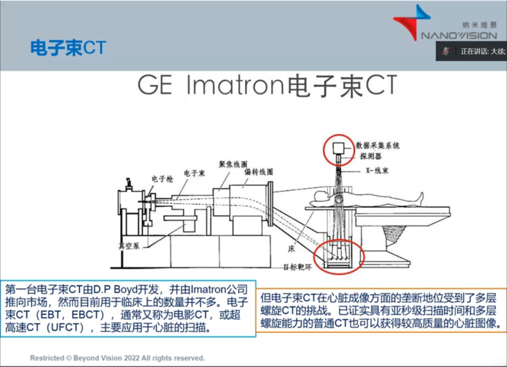
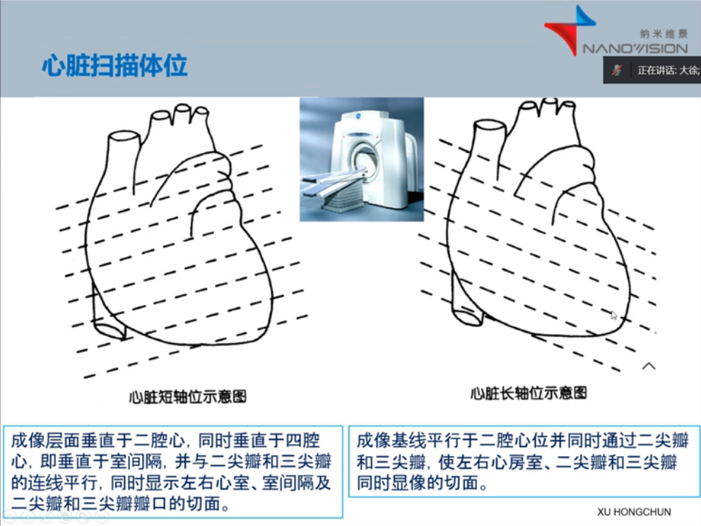
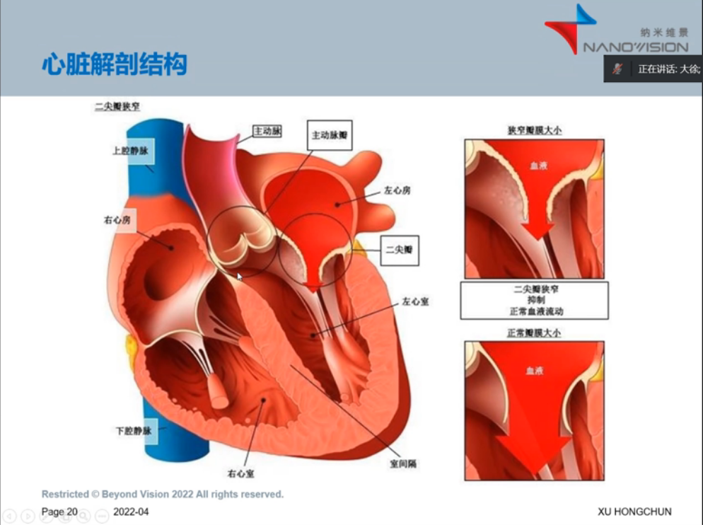

问题：
1.为什么探测器、球管环，度数相加大于360？存在相互遮挡？
2.MSCT是什么
> MSCT（MultiSliecs helieal CT） 同单层螺旋 CT (SingleSlice helieal CT,SSCT ) 相比较, 两者在设计原理和构造上不同 [1]  ： 除了Z 轴上设有多排探测器结构以外, 还有多个数据采集通道, 图像重建所采用的计算方法也不同, 主要在扫描架、探测 器、数据采集系统 ( data acquisiton system,DAS） [2]  、图像重建系统及计算机系统等有较大的改进

EBCT是第五代CT，没有大规模应用。

