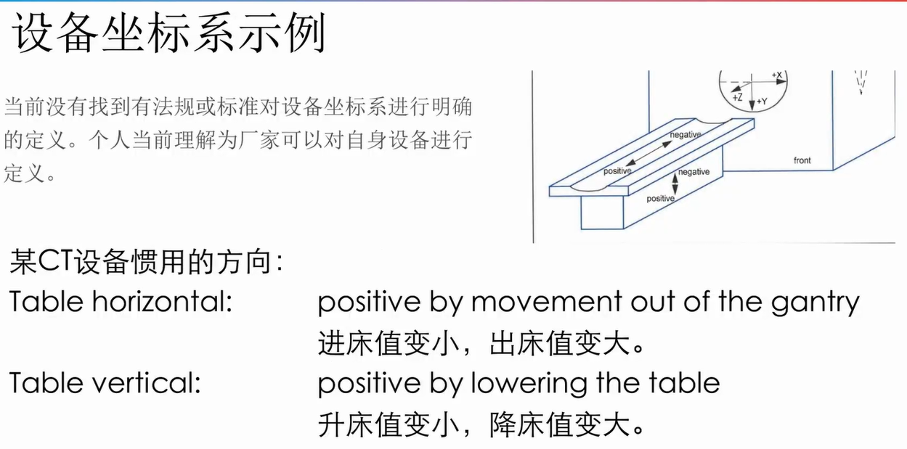
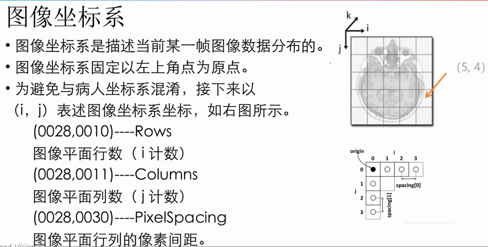

## 设备坐标系
1. 一般的设备坐标系的坐标原点位于Gantry的孔径中心。实际情况取决于厂家定义
2. 一般的设备坐标系不参与图像操作过程，仅作为参考（在影像链中，与设备坐标系无关）
3. 一般的设备坐标系与病人坐标系之间的关系，取决于病人的摆位）
4. 相关的DicomTag（0020，1041） SliceLocation（这个Tag是基于设备坐标系的）
5. 

## 病人坐标系
病人坐标系是以病人为基准，对图像空间位置进行描述的坐标系
Dicom使用病人坐标系对图像空间位置、方向进行描述
**结合CT来看，使用病人坐标系能够排除在扫描过程中不同病人摆位、进出床方向等操作的影响，从实际的病人解剖数据角度描述相对位置**
Dicom标准中，病人坐标系正方向的定义
Raif ：伊芙
Right Anterior Inferior/Foot
Sagittal Plane：矢状位
Coronal Plane：冠状位
Transverse  Plane：轴状位

## 图像坐标系
图像坐标系是描述当前某一帧图像数据的分布
图像坐标系固定以左上角为原点
为避免与病人坐标系混淆，接下来以(i,j)表述图像坐标系坐标

