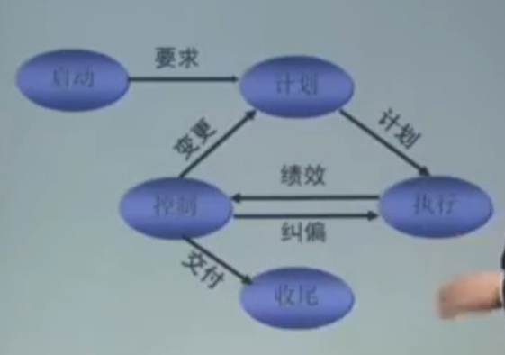
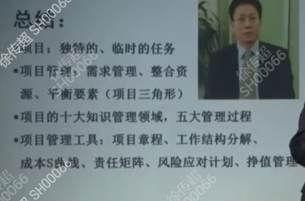

讲师：常耀俊 联想集团
## 什么是项目
1. 独特性
2. 临时性：明确的开始、结束时间
3. 渐进、明细：对项目认知是渐进明细的

项目、运作区别
1. 项目是阶段性；运作是重复性
2. 从零到成品；保证一个成品正常
3. 一个运作中可以提出一个项目，并同过项目将该运作提升到另一个运作
4. 项目是明确的、发展变化的；运作是动态的，维持不变的

## 项目管理的标准和原理
项目管理的三个维度
1. 知识、技能、工具和及时应用于项目活动

第一、需求管理 （计划、顾问、持续检测）
1. 已明确的需求
2. 未明确的需求
3. 不断变化的需求

第二、整合资源（7M）
1. 人力
2. 材料
3. 机械
4. 资金
5. 信息
6. 可续技术及市场

第三、平衡要素
1. 进度
2. 成本
3. 质量
4. （项目的目标）范围

第四、项目管理过程
1. 启动过程
2. 计划过程
3. 执行过程
4. 控制过程
5. 结束过程
 
 

## 项目管理过程和工具

项目启动
1. 项目论证（可研）
    技术可行性
    经济可行性
    
2. 项目章程
    项目背景
    项目目标
    PM任命
    协同部门
3. 范围计划
    目标描述
4. a
总结：

